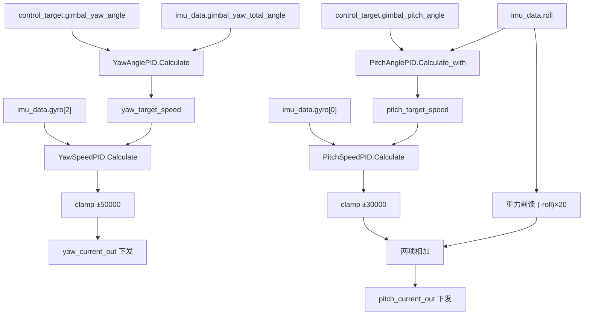
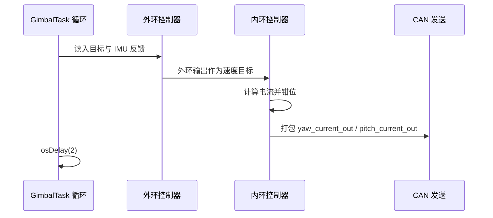

# 本项目串级实例

云台板有两处闭环：`GimbalTask` 负责偏航与俯仰的两级串级，`FireTask` 负责摩擦轮、拨弹盘与两轮转速差。两处都在任务函数内就地创建控制器，共享任务周期，参数写死在创建语句里。

两处的结构并不对称。云台是标准串级，外环输出直接作为内环目标，还额外叠了随角度变化的重力前馈；火控是四个单环，其中差值环的被控量是两个转速的和，属于交叉耦合补偿。同名的 `Kp`、`maxOutput` 在两处含义不同，量纲从 rpm 跨到度每秒。

串级结构的通用设计原则是「外环慢、内环快」：内环带宽通常取外环的三到五倍，外环输出才近似等于内环的设定值，整定时也因此可以先把内环固定、只调外环。代价集中在两处：外环一旦限幅或饱和，内环就失去目标来源，抗饱和逻辑必须同时管住外环的积分；两环共用同一个 $dt$ 时，实际调度周期一变，两环的等效增益会按同一比例一起漂移。这两点在任何串级实现里都成立，与具体平台无关。

本文按源码顺序展开两处实例，逐条给出反馈量、量纲与实际调度周期，再把八个控制器汇总成一张总表，最后指出两处声明周期与实际调度周期都不一致。

> 源码索引

| 路径 | 作用 |
| --- | --- |
| `Task/Src/GimbalTask.cpp` | 两轴串级、限幅与前馈 |
| `Task/Src/FireTask.cpp` | 摩擦轮、拨弹盘与差值 PID |
| `PID/Src/speed_pid.cpp` | 7 参数构造函数硬编码 `maxIntegral` |
| `PID/PidBase.h` | 两个计算入口 |

## 两处闭环共用同一套就地实例化写法

串级实例由四部分组成：

| 部分 | 职责 | 云台落点 | 火控落点 |
| --- | --- | --- | --- |
| 外环 | 把位置误差转成速度目标 | 角度环 | 无 |
| 内环 | 把速度误差转成电流 | 速度环 | 电机速度环 |
| 前馈 | 不经过误差直接补一项 | 重力前馈 | 基础前馈 |
| 限幅 | 限制目标与输出 | 角度限幅、电流钳位 | 输出由控制器钳位 |

火控侧没有外环，四个控制器都是单环。差值 PID 的输入是两轮转速之和，目标是 0，属于交叉耦合补偿。两处的控制器都是任务函数内的局部对象，不存在跨任务共享；参数写在创建语句里，运行期只被 `GimbalTask.cpp` 改过一次。

## 云台两轴的数据流与积分入口差异

偏航与俯仰使用相同的两级结构，区别在反馈量与积分入口：

| 轴 | 外环反馈 | 内环反馈 | 外环计算入口 |
| --- | --- | --- | --- |
| 偏航 | `imu_data.gimbal_yaw_total_angle` | `imu_data.gyro[2]` | `Calculate` |
| 俯仰 | `imu_data.roll` | `imu_data.gyro[0]` | `Calculate_with` |

俯仰外环用 `Calculate_with`，积分无条件累加；偏航外环用 `Calculate`，积分有条件累加。同一条串级路径上，外侧控制器选用不同版本，语义差别在《积分饱和与抗饱和策略》与《PidBase 实现逐行》里展开。

## 重力前馈为什么加在钳位之后

前馈项不参与误差反馈，直接叠加到输出。云台俯仰的重力力矩随角度变化，纯反馈需要等到角度偏差出现才输出补偿，前馈把它提前加入：

$$ u_{pitch} = clamp(u_{PID}, -30000, 30000) + (-roll) \times 20 $$

`roll` 单位为度，系数 20 使前馈在 ±30 度范围内产生 ±600 的输出增量。该增量加在钳位之后，因此总输出可以略微越过 30000。系数 20 的来源没有注释，属经验取值，待实测确认。

火控侧的前馈是常量 `feed_forward_left = 1000 * 0.5f` 与 `feed_forward_right = -1000 * 0.5f`（`FireTask.cpp`），不随状态变化，用于抵消摩擦轮的静态负载。两处前馈的共同点是都在 PID 之外叠加，都不受控制器的 `maxOutput` 约束。

## 火控的差值补偿取的是转速之和

两轮转速之和被低通滤波后送入 `diffPID`：

$$ d_k = 0.2 \, d + 0.8 \, d_{k-1} $$

$d = motor\_1.rotor\_speed + motor\_2.rotor\_speed$（`FireTask.cpp`），滤波器系数写在 `FireTask.cpp` 里。左轮目标 +5500、右轮目标 -5500，两轮转速大小相等时 $d \approx 0$。`diffPID` 的目标固定为 0，输出的符号表示哪一侧偏慢：

$$ u_{left} = ff_{left} + PID_{left}(5500, \omega_1) + u_{diff} $$
$$ u_{right} = ff_{right} + PID_{right}(-5500, \omega_2) - u_{diff} $$

$u_{diff}$ 在两侧反号注入，把转速差往零推。注意被控量是转速之和而不是转速差：两轮一正一负，和为零对应两轮转速大小相等。取和而不是取差，使这个环同时对两轮的共同分量不敏感、只对不对称分量敏感。

## GimbalTask 的创建与调用

| 内容 |
| --- |
| `AnglePID YawAnglePID(60.0f, 0.000f, 0.3f, 200000.0f, 180.0f)` |
| `SpeedPID YawSpeedPID(20.0f, 0.0f, 0.000f, 1000000.0f, 20000.0f)` |
| `AnglePID PitchAnglePID(1.0f, 0.1f, 0.01f, 10000.0f, 5000.0f)` |
| `PitchAnglePID.maxIntegral = 1000`，覆盖构造参数 5000 |
| `SpeedPID PitchSpeedPID(40.0f, 0.0f, 0.0f, 30000.0f, 20000.0f)` |
| `float dt = 0.001f` |
| `pitch_angle_limit_max = 30.0f`、`pitch_angle_limit_min = -20.0f` |
| `roll` 越出 `[-20, 30]` 时 `PitchAnglePID.integral = 0` |
| 偏航外环 `Calculate` |
| 偏航内环 `Calculate` |
| `clamp(yaw_current, -50000, 50000)` |
| 俯仰外环 `Calculate_with` |
| 俯仰内环 `Calculate` |
| `clamp(±30000)` 后加重力前馈 |
| `osDelay(2)` |

角度限幅注释与数值不一致：源码里的注释写 +20 度，实际 `30.0f`；源码里的注释写 -10 度，实际 `-20.0f`。以代码为准。

俯仰外环的 `maxIntegral` 被改成 1000 之后，与 `maxOutput = 10000` 的比值为 10%。构造语句里写的 5000 只在 构造语句范围内的两条语句内有效，运行期看不到它。

## FireTask 的创建与调用

| 内容 |
| --- |
| 基础前馈 `±500` |
| `motor_LEFT_PID(20, 0.11, 0.09, 8000, -8000, 250, -250)` |
| `motor_RIGHT_PID(20, 0.11, 0.09, 8000, -8000, 250, -250)` |
| `motor_SUPPLY_PID(25, 0.01, 0.0, 30000, -30000, 2500, -2500)` |
| `diffPID(15, 0.5, 0.05, 300, -300, 150, -150)` |
| 按 `friction_ready` 与 `feeder_ready` 分支调用 |
| `diffPID.Calculate(0.0f, filtered_diff, 0.01f)` |
| 前馈与差值输出叠加到左右轮 |
| 拨弹盘按 `torque_current > 6000` 换向 |
| `osDelay(1)` |

## 九个控制器的参数与量纲总表

| 控制器 | `Kp / Ki / Kd / maxOutput / maxIntegral` | 反馈量 | 量纲 | 声明 `dt` | 实际周期 | 源码 |
| --- | --- | --- | --- | --- | --- | --- |
| `YawAnglePID` | 60 / 0 / 0.3 / 200000 / 180 | `gimbal_yaw_total_angle` | 度 | 0.001 | 2 ms | `GimbalTask.cpp` |
| `YawSpeedPID` | 20 / 0 / 0 / 1000000 / 20000 | `gyro[2]` | 度/秒 | 0.001 | 2 ms |—|
| `PitchAnglePID` | 1 / 0.1 / 0.01 / 10000 / 1000 | `roll` | 度 | 0.001 | 2 ms |—|
| `PitchSpeedPID` | 40 / 0 / 0 / 30000 / 20000 | `gyro[0]` | 度/秒 | 0.001 | 2 ms |—|
| `motor_LEFT_PID` | 20 / 0.11 / 0.09 / 8000 / 1000 | `motor_1.rotor_speed` | rpm | 0.01 | 1 ms | `FireTask.cpp` |
| `motor_RIGHT_PID` | 20 / 0.11 / 0.09 / 8000 / 1000 | `motor_2.rotor_speed` | rpm | 0.01 | 1 ms |—|
| `motor_SUPPLY_PID` | 25 / 0.01 / 0 / 30000 / 1000 | `motor_6.rotor_speed` | rpm | 0.01 | 1 ms |—|
| `diffPID` | 15 / 0.5 / 0.05 / 300 / 1000 | `filtered_diff` | rpm | 0.01 | 1 ms |—|
| `TempPID` | 1600 / 0.2 / 0 / 4500 / 4400 | `temp`（IMU 温度） | ℃ | 0.001 | 1 ms | `temp_pid.cpp`、`ImuTask.cpp` |

FireTask 的四个控制器都用 7 参数构造函数，`maxIntegral` 在构造函数里被硬编码为 1000（`PID/Src/speed_pid.cpp`），与传入的 `max_out` 无关。云台两个速度环用 5 参数构造函数，`maxIntegral` 取第五个实参 20000。

总表覆盖云台两轴四级、火控四路与 IMU 温控一路，共九个控制器。`TempPID` 是 `PID/Src/temp_pid.cpp` 的文件内静态实例，入口是 C 接口 `temp_pid_calculate`，由 `ImuTask` 每轮调用（`Task/Src/ImuTask.cpp`），其 `DWT_Delay_ms(1)` 写在 `ImuTask.cpp` 里。`05-易错点与调试.md` 的限幅清单与本表覆盖同一组九个控制器。

## 两处周期偏差

云台声明 1 ms，实际 `osDelay(2)`；火控声明 10 ms，实际 `osDelay(1)`。两处的偏差方向相反：云台的实际周期是声明值的 2 倍，火控的实际周期是声明值的 1/10。对积分项与微分项的影响方向相反，定量推导见 `05-易错点与调试.md`。

## 实例相关的易错点

| # | 易错点 | 表现 | 位置 |
| --- | --- | --- | --- |
| 1 | 把 `maxIntegral = 1000` 当成角度环的输出预算 | 它是积分项上限，输出上限仍是 10000 | `GimbalTask.cpp` |
| 2 | 忽略 `Calculate_with` 与 `Calculate` 的差别 | 俯仰外环无条件积分，偏航外环条件积分 |—|
| 3 | 前馈加在钳位之后 | 总输出可越过 `maxOutput` |—|
| 4 | 按注释理解角度限幅 | 注释 +20 / -10 与数值 30 / -20 不符 |—|
| 5 | 认为 FireTask 的 `maxIntegral` 来自实参 | 7 参数构造函数把它固定成 1000 | `speed_pid.cpp` |
| 6 | 差值 PID 的输入当成转速差 | 它取的是两轮转速之和，目标 0 对应大小相等方向相反 | `FireTask.cpp` |
| 7 | 忽略滤波器对差值 PID 的相位延迟 | 一阶低通 0.2/0.8 引入滞后 |—|

## 小结

### 核心概念

- 云台两轴都是角度外环加速度内环，外环输出直接作为内环目标。
- 偏航外环用条件积分，俯仰外环用无条件积分。
- 俯仰 `PitchAnglePID.maxIntegral` 在创建后被改成 1000。
- 俯仰输出在钳位后叠加重力前馈 `(-roll) × 20`。
- FireTask 用基础前馈加差值 PID 补偿两轮转速差，差值取自转速之和。
- 九个控制器的量纲覆盖度、度每秒、rpm 与摄氏度四类。
- 两处声明周期与实际调度周期都不一致。

### 设计权衡

| 权衡点 | 本工程的选择 | 收益与代价 |
| --- | --- | --- |
| 控制器就地创建 | 任务函数栈上实例化 | 无全局状态；每次重启归零，参数无法在线改 |
| 外环输出直接作内环目标 | 不做单位换算 | 结构短；量纲错误只能靠增益掩盖 |
| 重力前馈加在钳位后 | `GimbalTask.cpp` | 前馈不被内环限幅吃掉；总输出可越过 `maxOutput` |
| `maxIntegral` 外部覆盖 | 写 1000 | 抑制俯仰积分超调；与构造参数失去联系 |
| 差值用转速之和 | `FireTask.cpp` | 对两轮对称偏差敏感；不对两轮各自扰动解耦 |

## 练习

### 基础题

1. 写出云台偏航侧从目标角度到 `yaw_current_out` 的完整数据流。
2. 计算 `roll = 30` 度时重力前馈的数值，并说明它与 `PitchSpeedPID` 限幅的关系。
3. 说明 FireTask 中 `diffPID` 的目标为何取 0。

### 挑战题

4. 把 `PitchAnglePID.maxIntegral` 改回 5000，推导对俯仰阶跃响应超调的影响。
5. 把两处 `dt` 改成实际调度周期，列出积分项与微分项各自的变化方向与倍数。
6. 设计一版带积分分离的拨弹盘控制，替换 `torque_current > 6000` 的阈值换向。

## 附：本页引用的固件路径

| 路径 | 用途 |
| --- | --- |
| `/home/wyx/rm/2026SentriOmeniGimbal/2026OmniSentryGimbal/Task/Src/GimbalTask.cpp` | 两轴串级、限幅与前馈 |
| `/home/wyx/rm/2026SentriOmeniGimbal/2026OmniSentryGimbal/Task/Src/FireTask.cpp` | 摩擦轮、拨弹盘与差值 PID |
| `/home/wyx/rm/2026SentriOmeniGimbal/2026OmniSentryGimbal/PID/Src/speed_pid.cpp` | 7 参数构造函数硬编码 `maxIntegral` |
| `/home/wyx/rm/2026SentriOmeniGimbal/2026OmniSentryGimbal/PID/PidBase.h` | 两个计算入口 |
| `/home/wyx/rm/2026SentriOmeniGimbal/2026OmniSentryGimbal/PID/Src/temp_pid.cpp` | `TempPID` 静态实例与 C 接口 |
| `/home/wyx/rm/2026SentriOmeniGimbal/2026OmniSentryGimbal/Task/Src/ImuTask.cpp` | 温控调用与循环延时 |
