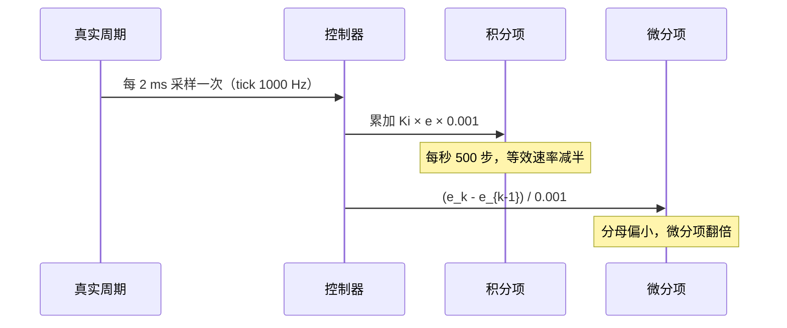
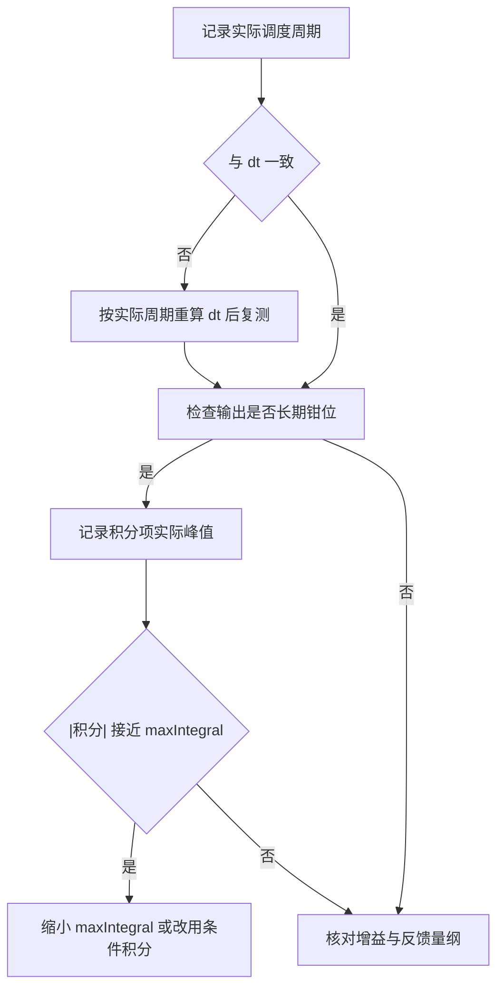

# 易错点与调试

本工程串级回路的多数问题不在算法本身，而在参数与周期的实际值同声明值不符。`dt` 写错一个数量级，积分项与微分项会朝相反方向偏移；`maxIntegral` 与 `maxOutput` 的量级不匹配，限幅就失去意义。

这两类问题都不会触发编译警告。`dt` 是常量，限幅是成员，两者在语法上完全合法。发现它们只能靠定量推导加实际测量：先把调度周期测出来，再按比值换算等效增益，最后核对每个限幅的实际意义。

本文先做定量推导，给出七个控制器的等效参数与九个控制器的限幅占比，再给出从周期到积分的排查路径与可用观测点，最后汇总八项易错点。周期基准里 `osDelay` 的实参到毫秒的换算取决于 `configTICK_RATE_HZ`，本工程该值为 1000（`Core/Inc/FreeRTOSConfig.h:64`），实参即毫秒数。

> 源码索引

| 路径 | 作用 |
| --- | --- |
| `Task/Src/GimbalTask.cpp` | 声明 `dt`、限幅清积分、调试变量 |
| `Task/Src/FireTask.cpp` | 声明 `dt` 与实际 `osDelay` |
| `PID/PidBase.h` | 积分累加条件、微分除法与 `Clear` |
| `PID/Src/speed_pid.cpp` | 7 参数构造函数硬编码 `maxIntegral` |
| `PID/Src/temp_pid.cpp` | 积分上限 4400 与输出上限 4500 |

## 三类误差来源

| 类别 | 例子 | 检测手段 |
| --- | --- | --- |
| 时间基 | `dt` 与实际调度周期不符 | 计时探针、周期计数 |
| 幅值基 | 积分限幅与输出限幅量级错配 | 记录积分与输出的实际峰值 |
| 状态基 | `maxIntegral` 被外部覆盖、`Clear` 语义不全 | 搜索成员名的全部写入点 |

三类都表现为阶跃超调、低频振荡或恢复缓慢，单看波形难以区分。先测周期，再看限幅，最后核对状态改写点。这个顺序的依据是周期误差会同时改变积分与微分的等效增益，是其它判断的前提。

## dt 不一致如何缩放积分与微分

设真实采样周期为 $\Delta t_a$，调用时传入的 `dt` 为 $\Delta t_d$。观察时长 $T$ 内的步数为 $N = T / \Delta t_a$。

积分项按传入的 $\Delta t_d$ 累加：

$$ I_N = \sum_{k=1}^{N} K_i e_k \Delta t_d $$

误差恒定时把 $N$ 代入：

$$ I_N = K_i e T \frac{\Delta t_d}{\Delta t_a} $$

连续积分的正确值是 $K_i e T$，因此等效积分增益被缩放 $\Delta t_d / \Delta t_a$ 倍。

微分项除以传入的 $\Delta t_d$：

$$ \dot{e}_{计算} = \frac{e_k - e_{k-1}}{\Delta t_d} = \dot{e}_{真实} \frac{\Delta t_a}{\Delta t_d} $$

等效微分增益被缩放 $\Delta t_a / \Delta t_d$ 倍。两个缩放系数互为倒数：

| 情形 | $\Delta t_d / \Delta t_a$ | 积分项 | $\Delta t_a / \Delta t_d$ | 微分项 |
| --- | --- | --- | --- | --- |
| 声明小于实际（云台） | 0.5 | 偏小一半 | 2 | 偏大一倍 |
| 声明大于实际（火控） | 10 | 偏大十倍 | 0.1 | 偏小九成 |
| 一致 | 1 | 正确 | 1 | 正确 |

积分偏大与微分偏小会同时推动系统走向过冲与振荡：积分补偿过度，阻尼不足。积分偏小与微分偏大方向相反，表现为响应迟滞，同时陀螺仪噪声被微分项放大。以上是按公式推导的结论，具体到本工程的幅值需实测确认。

## 限幅量级错配

`maxOutput` 限制三项之和，`maxIntegral` 限制积分项本身。若 `maxIntegral` 接近或超过 `maxOutput`，积分单独就能顶满输出，条件积分判据又只看比例与微分项（`PID/PidBase.h:44`），积分会继续累加，等误差换号后需要更长时间退出。

`Calculate` 的积分钳位写在累加条件内部（`:46`）：一旦进入饱和分支，本次不会修正越界的积分。`Calculate_with` 每次调用都钳位（`:76`），行为不同。同一个限幅数值在两个入口下的实际约束力并不相同。

## maxIntegral 被外部覆盖

`PitchAnglePID` 的构造参数是 5000，创建后立即被写成 1000（`Task/Src/GimbalTask.cpp:32`）。由于成员是 public，这类覆盖不会报错，也不会出现在构造函数调用处。核对参数时需要在文件内搜索成员名。

覆盖的后果是俯仰角度环的积分上限从输出的 50% 降到 10%。这一改动通常是为抑制超调，但它让构造语句里的数值失去意义，阅读时需要同时看两行。

## Clear 的语义

`PidBase::Clear` 只清 `integral` 与 `prevError`（`PID/PidBase.h:23-26`）。`prevTarget` 保留旧值。清零 `prevError` 会让下一次调用的微分项变成 $e / dt$，误差不为零时形成尖峰。`GimbalTask` 在角度超限时直接写 `integral = 0`（`:47`），连 `prevError` 都不清，效果介于两者之间：积分被清零，微分状态仍然连续。

## 七个控制器的等效参数

| 控制器 | 声明 `dt` | 实际周期 | 积分缩放 | 微分缩放 | 等效 $K_i$ | 等效 $K_d$ |
| --- | --- | --- | --- | --- | --- | --- |
| `YawAnglePID` | 0.001 | 2 ms | 0.5 | 2 | 0 | 0.6 |
| `PitchAnglePID` | 0.001 | 2 ms | 0.5 | 2 | 0.05 | 0.02 |
| `motor_LEFT_PID` | 0.01 | 1 ms | 10 | 0.1 | 1.1 | 0.009 |
| `motor_RIGHT_PID` | 0.01 | 1 ms | 10 | 0.1 | 1.1 | 0.009 |
| `motor_SUPPLY_PID` | 0.01 | 1 ms | 10 | 0.1 | 0.1 | 0 |
| `diffPID` | 0.01 | 1 ms | 10 | 0.1 | 5.0 | 0.005 |
| `TempPID` | 0.001 | 1 ms | 1 | 1 | 0.2 | 0 |

实际周期取 `GimbalTask.cpp:100` 的 `osDelay(2)`、`FireTask.cpp:70` 的 `osDelay(1)` 与 `ImuTask.cpp:111` 的 `DWT_Delay_ms(1)`。`osDelay` 的实参是 tick 数，本工程 `configTICK_RATE_HZ` 为 1000（`Core/Inc/FreeRTOSConfig.h:64`），每 tick 恰为 1 ms，上表的实际周期因此成立；若该配置被改动，2 ms 与 1 ms 需按新频率重算。

本表覆盖四路火控、两轴角度外环与 IMU 温控环，共七个控制器；`YawSpeedPID` 与 `PitchSpeedPID` 的 $K_i$ 与 $K_d$ 都是 0，两个缩放对它们没有影响，因此未单列。`YawAnglePID` 的 $K_i$ 也是 0，只有微分项受影响。火控四个控制器（`motor_LEFT_PID`、`motor_RIGHT_PID`、`motor_SUPPLY_PID`、`diffPID`）的声明周期是实际周期的 10 倍，积分被放大十倍，与云台方向相反；`TempPID` 声明 0.001、实际约 1 ms，两个缩放都为 1。

## 限幅量级清单

| 控制器 | `maxOutput` | `maxIntegral` | 积分占比 |
| --- | --- | --- | --- |
| `YawAnglePID` | 200000 | 180 | 0.09% |
| `YawSpeedPID` | 1000000 | 20000 | 2% |
| `PitchAnglePID` | 10000 | 1000 | 10% |
| `PitchSpeedPID` | 30000 | 20000 | 67% |
| `TempPID` | 4500 | 4400 | 98% |
| `motor_LEFT_PID` | 8000 | 1000 | 12.5% |
| `motor_RIGHT_PID` | 8000 | 1000 | 12.5% |
| `motor_SUPPLY_PID` | 30000 | 1000 | 3.3% |
| `diffPID` | 300 | 1000 | 333% |

`diffPID` 的 `maxIntegral` 超过 `maxOutput` 三倍，积分项单独就能把输出压到限幅之外；`YawAnglePID` 的积分上限只有输出的 0.09%（约 1/1100），积分几乎不起作用。两类都偏离常规设计，但都有各自的解释：差值环的输出预算本来就小，偏航外环则主要靠微分项工作。

清单覆盖与 `04-本项目串级实例` 的总表相同的九个控制器：云台两轴四级、火控四路与 IMU 温控一路。

## 排查路径

## 可用的观测点

| 观测点 | 位置 | 说明 |
| --- | --- | --- |
| `cheak` | `GimbalTask.cpp:22`、`:90` | 保存 `PitchAnglePID.integral`，全工程没有其它读取点 |
| `yaw_current_out` | `:19`、`:79` | 偏航电流，钳位后的值 |
| `pitch_current_out` | `:20`、`:98` | 俯仰电流，含重力前馈 |
| `control_output_motor_1/2/3` | `FireTask.cpp:15-17` | 摩擦轮与拨弹盘输出 |

`cheak` 只有写入点，没有读取点，符号可能被链接器回收；调试时需要在别处引用它或直接改成输出到调试通道。另外三个变量都在下发前写值，读到的就是最终下发量，可以直接与限幅对照。

## 易错点

| # | 易错点 | 表现 | 位置 |
| --- | --- | --- | --- |
| 1 | 两环 `dt` 按声明值理解 | 实际调度周期是声明值的两倍或十分之一 | `GimbalTask.cpp:37`、`:100`；`FireTask.cpp:70` |
| 2 | 把 `dt` 只影响积分 | 微分项按同一偏差的反比缩放 | `PidBase.h:38` |
| 3 | 忽略 `maxIntegral` 与 `maxOutput` 的比值 | 积分占比从 0.09% 到 333% 不等 | 见限幅清单 |
| 4 | 认为 `Calculate` 会在饱和时钳积分 | 钳位在累加条件内部，饱和分支不执行 | `PidBase.h:44-47` |
| 5 | 外部覆盖 `maxIntegral` 后不再核对 | 构造参数 5000 被改成 1000 | `GimbalTask.cpp:32` |
| 6 | 把 `Clear()` 当成完全复位 | `prevTarget` 保留，`prevError` 归零产生微分尖峰 | `PidBase.h:23-26` |
| 7 | 认为 `cheak` 一定能被观测 | 只有写入点，可能被优化或回收 | `GimbalTask.cpp:22` |
| 8 | 把 `osDelay` 实参直接当毫秒数 | 需按 `configTICK_RATE_HZ` 换算，本工程为 1000 Hz | `Core/Inc/FreeRTOSConfig.h:64` |

## 小结

### 核心概念

- 积分项的缩放系数是 $\Delta t_d / \Delta t_a$，微分项是 $\Delta t_a / \Delta t_d$，两者互为倒数。
- 声明周期偏小则积分偏小、微分偏大；偏大则相反。
- 积分限幅应与输出限幅按比例协调，本工程从 0.09% 到 333% 都有。
- `Calculate` 的积分钳位只在未饱和分支执行，`Calculate_with` 每次执行。
- `Clear` 不清 `prevTarget`，且会制造微分尖峰。
- 排查顺序是先测周期，再看限幅，最后核对成员改写点。

### 设计权衡

| 权衡点 | 本工程的选择 | 收益与代价 |
| --- | --- | --- |
| `dt` 写成常量 | 任务里写死 | 调用简单；与实际调度周期脱节 |
| 限幅参数逐个硬编码 | 创建语句里写数值 | 一眼可见；缺少统一量级约束 |
| 成员 public | 允许外部覆盖 | 便于快速整定；改写点分散，容易被漏读 |
| 调试变量 `cheak` | 全局变量保存积分 | 无需打印接口；无读取点，可能被回收 |
| 直接写 `integral = 0` | 角度超限时清积分 | 响应快；绕过封装，微分状态不同步 |

## 练习

### 基础题

1. 推导积分项与微分项的缩放系数，说明二者为何互为倒数。
2. 用 `motor_LEFT_PID` 的 $K_i = 0.11$、$K_d = 0.09$ 计算声明 `dt = 0.01`、实际 1 ms 时的等效参数。
3. 列出 `YawAnglePID` 的积分占比，并说明它对本回路积分作用的影响。

### 挑战题

4. 用阶跃响应数据反推实际控制周期，给出计算步骤与需要的采样记录。
5. 把五个控制器的 `maxIntegral` 按 `maxOutput` 的统一比例重设，给出建议比例并说明理由。
6. 设计一个不依赖全局变量的积分观测方案，说明数据如何送到上位机且不阻塞控制任务。

## 附：本页引用的固件路径

| 路径 | 用途 |
| --- | --- |
| `/home/wyx/rm/2026SentriOmeniGimbal/2026OmniSentryGimbal/Task/Src/GimbalTask.cpp` | 声明 `dt`、限幅清积分、调试变量（`:22-100`） |
| `/home/wyx/rm/2026SentriOmeniGimbal/2026OmniSentryGimbal/Task/Src/FireTask.cpp` | 声明 `dt` 与实际 `osDelay`（`:47-70`） |
| `/home/wyx/rm/2026SentriOmeniGimbal/2026OmniSentryGimbal/PID/PidBase.h` | 积分累加条件、微分除法与 `Clear`（`:23-91`） |
| `/home/wyx/rm/2026SentriOmeniGimbal/2026OmniSentryGimbal/PID/Src/speed_pid.cpp` | 7 参数构造函数硬编码 `maxIntegral`（`:9-27`） |
| `/home/wyx/rm/2026SentriOmeniGimbal/2026OmniSentryGimbal/PID/Src/temp_pid.cpp` | 积分上限 4400 与输出上限 4500（`:20-24`、`:41`） |
| `/home/wyx/rm/2026SentriOmeniGimbal/2026OmniSentryGimbal/Task/Src/ImuTask.cpp` | 温控调用与 `DWT_Delay_ms(1)`（`:46`、`:111`） |
| `/home/wyx/rm/2026SentriOmeniGimbal/2026OmniSentryGimbal/Core/Inc/FreeRTOSConfig.h` | `configTICK_RATE_HZ` 为 1000（`:64`） |
