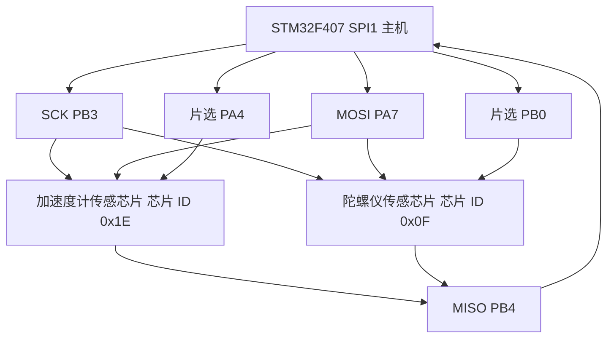
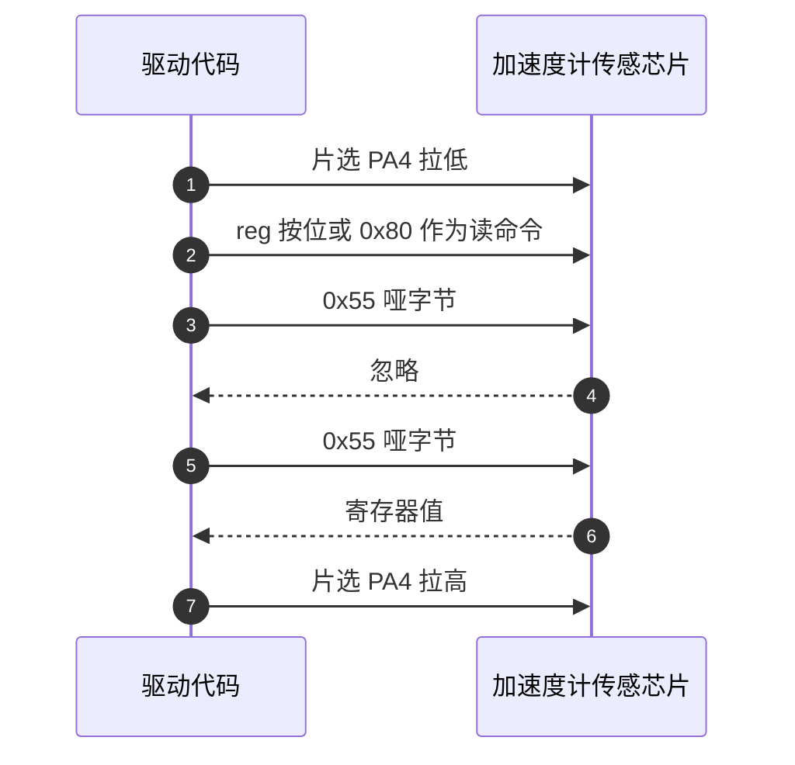

# IMU 选型与 SPI 接口

两块传感芯片共用时钟与数据线，各自拥有一条片选；调试时把两条片选接反，读取结果会对不上，最容易被误判成传感器坏片。这一页从这种接反现象讲起，说明为什么 BMI088 必须当成两个独立从设备处理，以及 SPI 侧哪些参数是固定的。

四旋翼、云台与平衡底盘的姿态解算都从惯性测量单元开始。工程上最常用的组合是六轴：三轴加速度计给出重力方向，用于确定 roll 与 pitch 的绝对参考；三轴陀螺仪给出角速度，积分得到短时角度变化。再往上加三轴磁力计构成九轴，本工程两块板都没有磁力计，算法只用六轴。

BMI088 是 Bosch 的六轴 IMU 封装，内部由两块独立的传感芯片组成，一块加速度计，一块陀螺仪。两块传感芯片共享 SPI 的时钟、主出从入、主入从出三根线，各自拥有一条片选线。这个结构决定了驱动侧所有通信函数都遵循同一套动作：先拉低对应片选，再收发字节，最后释放片选。

SPI 的物理层只有四条线，协议开销小、速率高，适合按寄存器地址反复访问。BMI088 同时支持 SPI 与 I2C，本工程使用 SPI。选择 SPI 的代价是占用四条引脚，收益是读取一次 8 字节数据的时间在微秒级，且可以在传输中直接拼接多寄存器。

> 源码索引

| 路径 | 作用 |
| --- | --- |
| `BMI088/Inc/BMI088.h` | 类定义与 C 接口 |
| `BMI088/Src/BMI088.cpp` | 实例、片选引脚、收发函数 |
| `Core/Src/spi.c` | SPI1 参数、引脚复用与 DMA 流 |
| `Core/Src/gpio.c` | 两条片选的模式与初始电平 |
| `Core/Src/main.c` | APB2 分频 |
| `Task/Src/ImuTask.cpp` | 唯一调用点 |

## 两块传感芯片是两个独立从设备

加速度计与陀螺仪在芯片内部有各自独立的寄存器映射。同名寄存器在两边的含义不同：

| 地址 | 加速度计侧 | 陀螺仪侧 |
| --- | --- | --- |
| `0x00` | CHIP_ID，固定读回 `0x1E` | CHIP_ID，固定读回 `0x0F` |
| `0x40` 附近 | ACC_CONF、ACC_RANGE | 无对应寄存器 |
| `0x0F` 附近 | 无对应寄存器 | GYRO_RANGE |
| `0x22` | 温度高字节 | 无对应寄存器 |

两块传感芯片对同一字节的响应不同，这是判断通信对象是否正确的依据。驱动里的 `accelReadReg()` 与 `gyroReadReg()` 走的是同一组 SPI 引脚，靠片选区分。



片选也叫 NSS（从设备选择），低电平有效。本工程把它交给软件控制，所以 `Core/Src/spi.c` 把 NSS 设为 `SPI_NSS_SOFT`，SPI 外设不会自动翻转任何一根片选线。

## SPI 模式 3 的选择依据

STM32 的 SPI 有四种模式，由时钟极性 CPOL 与时钟相位 CPHA 决定：CPOL 给出空闲时 SCK 的电平，CPHA 决定在第一个还是第二个边沿采样。BMI088 支持模式 0 与模式 3，本工程取模式 3：空闲时 SCK 为高，数据在第二个边沿采样，对应 `Core/Src/spi.c` 的 `SPI_POLARITY_HIGH` 与 `SPI_PHASE_2EDGE`。

选模式 3 而不是模式 0，实际效果相同，因为两种模式都在 SCK 的同一类边沿上采样数据稳定区。需要避免的是把 CPHA 配成第一边沿采样，那会整体错位一位。

数据宽度固定 8 位，高位在先。多字节寄存器都按低字节在前、高字节在后返回，拼装顺序在《数据读取与量纲换算》里逐字节说明。

## 时钟链把 84 MHz 分频成 1.3125 MHz

SPI1 挂在 APB2 总线上。系统时钟配置里 APB2 为 HCLK 二分频，HCLK 为 168 MHz，所以 APB2 为 84 MHz（`Core/Src/main.c`）。SPI1 的波特率预分频在 `Core/Src/spi.c` 取 `SPI_BAUDRATEPRESCALER_64`，于是

$$f_{\text{SCK}} = \frac{f_{\text{APB2}}}{64} = \frac{84\ \text{MHz}}{64} = 1.3125\ \text{MHz}$$

该数值与 `2026sentriomeni.ioc` 的 `SPI1.CalculateBaudRate=1.3125 MBits/s` 一致。BMI088 手册给出的 SPI 时钟上限为 10 MHz，1.3125 MHz 留有很大余量。一次读 8 字节需要 $8 \times 8 / 1.3125\ \text{MHz} \approx 48.8\ \mu\text{s}$；只有初始化路径有两次 150 µs 等待（`BMI088/BMI088config.h`），数据读取路径不含等待，单次读取仍在百微秒量级。



## 两条片选不能合并

把两条传感芯片接到同一个片选上会同时选中两个从设备，产生三个后果：

- 两块传感芯片的 MISO 都是推挽输出，同时选中时两根推挽输出直接争用同一根线，输出电平互相冲突，读回的值不确定。
- 同名寄存器含义重叠，例如 `0x00` 在两边分别是 `0x1E` 与 `0x0F`，无法判断返回值来自哪一块。
- 芯片 ID 校验失效，定位故障时失去了唯一可用的判据。

分开片选后，同一时刻只有一块传感芯片响应，另一块的 MISO 保持高阻。软复位、配置写入、数据读取也都可以独立进行。

读命令把寄存器地址的最高位置 1，最低位七位保留地址，见 `BMI088/Src/BMI088.cpp`。加速度计的单寄存器读在地址与数据之间需要一个哑字节，陀螺仪不需要。Linux 内核的 `bmi088-accel-spi.c` 在读函数里明确写了 `addr[1] = 0; /* Read requires a dummy byte transfer */`，把地址与哑字节一起发送后再读数据。驱动代码遵循了这一差异。

哑字节是一次不携带有效数据的占位传输，它给出芯片把寄存器值搬进输出寄存器的时钟周期。简化后的两种读命令如下：

```c
/* 简化自 BMI088/Src/BMI088.cpp 的读寄存器实现 */
#define BMI088_READ_BIT 0x80   /* 读命令：地址最高位置 1 */

/* 加速度计：地址 + 哑字节 + 数据 */
spi_cs_low(ACC_CS);
spi_tx(reg | BMI088_READ_BIT);
spi_tx_dummy();            /* 哑字节 */
val = spi_rx();
spi_cs_high(ACC_CS);

/* 陀螺仪：地址 + 数据，没有哑字节 */
spi_cs_low(GYRO_CS);
spi_tx(reg | BMI088_READ_BIT);
val = spi_rx();
spi_cs_high(GYRO_CS);
```

## 引脚分配与实例构造

| 信号 | 引脚 | 配置 | 源码位置 |
| --- | --- | --- | --- |
| SPI1_SCK | PB3 | 复用推挽，AF5 | `Core/Src/spi.c` |
| SPI1_MISO | PB4 | 复用推挽，AF5 | `Core/Src/spi.c` |
| SPI1_MOSI | PA7 | 复用推挽，AF5 | `Core/Src/spi.c` |
| 加速度计片选 | PA4 | 通用推挽输出 | `Core/Src/gpio.c` |
| 陀螺仪片选 | PB0 | 通用推挽输出 | `Core/Src/gpio.c` |

两条片选在上电时被置为高电平（`Core/Src/gpio.c`），保证 SPI 外设初始化期间没有传感芯片被选中。

实例在文件末尾构造，把两个片选引脚作为构造参数传入：

```cpp
/* BMI088/Src/BMI088.cpp */
static BMI088 bmi088_instance(&hspi1,
                              GPIOA, GPIO_PIN_4,
                              GPIOB, GPIO_PIN_0);
```

SPI1 的参数块（`Core/Src/spi.c`）固定了主模式、双线全双工、8 位、模式 3、软件 NSS、预分频 64 与高位在先：

```c
/* Core/Src/spi.c */
hspi1.Instance = SPI1;
hspi1.Init.Mode = SPI_MODE_MASTER;
hspi1.Init.Direction = SPI_DIRECTION_2LINES;
hspi1.Init.DataSize = SPI_DATASIZE_8BIT;
hspi1.Init.CLKPolarity = SPI_POLARITY_HIGH;
hspi1.Init.CLKPhase = SPI_PHASE_2EDGE;
hspi1.Init.NSS = SPI_NSS_SOFT;
hspi1.Init.BaudRatePrescaler = SPI_BAUDRATEPRESCALER_64;
hspi1.Init.FirstBit = SPI_FIRSTBIT_MSB;
```

## 通信函数里写死的外设

构造函数把 `hspi_` 保存为成员，但实际收发函数直接引用全局 `extern SPI_HandleTypeDef hspi1;`，没有使用该成员：

- `BMI088/Src/BMI088.cpp` 声明 `hspi1`。
- `BMI088_readandwrite_byte()` 调用 `HAL_SPI_TransmitReceive(&hspi1, ...)`。
- DMA 路径调用 `HAL_SPI_TransmitReceive_DMA(&hspi1, ...)`。

因此这个类在同一个工程里只能挂一路 SPI。若要迁移到别的 SPI 外设，需要把这两处换成 `hspi_`。

简化后的字节收发函数：

```c
/* 简化自 BMI088/Src/BMI088.cpp，外设句柄写死为全局 hspi1 */
extern SPI_HandleTypeDef hspi1;

uint8_t BMI088_readandwrite_byte(uint8_t tx) {          /* 非 DMA 路径 */
  uint8_t rx;
  HAL_SPI_TransmitReceive(&hspi1, &tx, &rx, 1, 100);
  return rx;
}
/* DMA 路径同样直接传 &hspi1，而不是构造时保存的成员 */
```

## 唯一调用点

`BMI088_Init()` 与 `BMI088_Read()` 由 C 接口导出（`BMI088/Src/BMI088.cpp`），在应用层只有 `Task/Src/ImuTask.cpp` 使用：初始化与数据读取都由它调用。云台板与底盘板的调用位置相同，逻辑一致。

## 接口层面的易错点

### 片选接反

PA4 与 PB0 交换后，写加速度计配置实际落到陀螺仪上，芯片 ID 校验会失败并返回 `BMI088_NO_SENSOR`。判断依据是读 `0x00` 的返回值：加速度计应为 `0x1E`，陀螺仪应为 `0x0F`。返回 `0x00` 或 `0xFF` 表示该片选没有选中任何传感芯片。

### 把 NSS 配成硬件模式

NSS 若设为硬件输入模式，SPI 在片选被拉低时会误判为从机被选中，主机模式失效。本工程固定用 `SPI_NSS_SOFT`，片选由 GPIO 翻转。

### 模式配错

BMI088 只支持模式 0 与模式 3。若 CPHA 配成第一边沿采样，读回的数据会整体错位一位。现象是芯片 ID 偶尔正确、偶尔错误，且随温度与走线变化。核对 `Core/Src/spi.c` 的两行为高电平空闲与第二边沿采样。

### 片选空闲电平

片选上电默认电平由 `Core/Src/gpio.c` 设置。若被改成低电平，两颗传感芯片在 SPI 初始化阶段就被选中，可能误进入某种命令序列。空闲态保持高电平。

### 时钟按总线频率估算

把 84 MHz 直接当 SCK 会得到比实际大 64 倍的结论。预分频寄存器写入的是分频系数，SCK 需要再除以 64，读回与实测时应以 1.3125 MHz 为基准。

## 小结

### 核心概念

- BMI088 内部是两块独立传感芯片，共享三条 SPI 信号线，各有一条片选。
- 读命令把地址最高位置 1，写命令最高位保持 0。加速度计的读操作在地址与数据之间需要一个哑字节。
- 本工程 SPI1 为模式 3、8 位、高位在先、预分频 64，SCK 为 1.3125 MHz。
- 片选由软件控制，上电置高，通信期间拉低。
- 收发函数直接引用全局 `hspi1`，类内成员 `hspi_` 未被使用。

### 设计权衡

| 决策 | 收益 | 代价 |
| --- | --- | --- |
| 选择 SPI 而非 I2C | 速率高，多字节读取时间在微秒级 | 占用四条引脚，需要软件片选 |
| 两条传感芯片分开片选 | 避免 MISO 冲突，可用芯片 ID 定位故障 | 多占用一条 GPIO |
| SCK 取 1.3125 MHz | 远低于 10 MHz 上限，长走线与温漂下更稳 | 单次 8 字节读取多花几十微秒 |
| 类内写死 `hspi1` | 代码短，不需要在每处传句柄 | 一个类只能服务一路 SPI，迁移要改两处 |
| 模式 3 而非模式 0 | 空闲电平明确，便于示波器判断起始边沿 | 与部分从设备不兼容，需按手册确认 |

## 练习

### 基础题

1. 写出 SPI1 的 CPOL、CPHA、数据宽度、位序与预分频，并说明对应 SPI 模式的编号。
2. 说明加速度计与陀螺仪各自的片选引脚与上电空闲电平。
3. 说明读命令中 `0x80` 的作用，以及写命令为什么不用置位。
4. 列出把两条传感芯片接到同一片选时会出现的至少两个问题。

### 挑战题

5. 已知 APB2 为 84 MHz，若把预分频改为 16，SCK 为多少。用该频率读取一次 8 字节数据需要多少微秒，并与 BMI088 手册的 10 MHz 上限比较。
6. 构造函数保存了 `hspi_` 却未使用。给出把 `BMI088_readandwrite_byte()` 改为使用 `hspi_` 的两种方式，并说明其中一种需要把静态成员函数改成普通成员函数的原因。
7. 假设实验室只有一位逻辑分析仪，通道接到 PB3、PA7、PB4、PA4。设计一次单寄存器读取的抓包流程，用来验证加速度计哑字节的存在。

## 附：本页引用的固件路径

| 路径 | 用途 |
| --- | --- |
| `BMI088/Inc/BMI088.h` | 类定义与 C 接口 |
| `BMI088/Src/BMI088.cpp` | 实例与片选引脚、读命令置位、写死的外设 |
| `Core/Src/spi.c` | SPI1 参数、引脚复用、DMA 流 |
| `Core/Src/gpio.c` | 片选输出电平与模式 |
| `Core/Src/main.c` | APB2 分频 |
| `2026sentriomeni.ioc` | 计算波特率 |
| `Task/Src/ImuTask.cpp` | 唯一调用点 |
| `底盘板 Core/Src/spi.c` | 底盘板 SPI1 参数一致 |

> 云台板与底盘板在上面这几个文件上内容一致，差异集中在灵敏度系数，见《寄存器与量程配置》。
