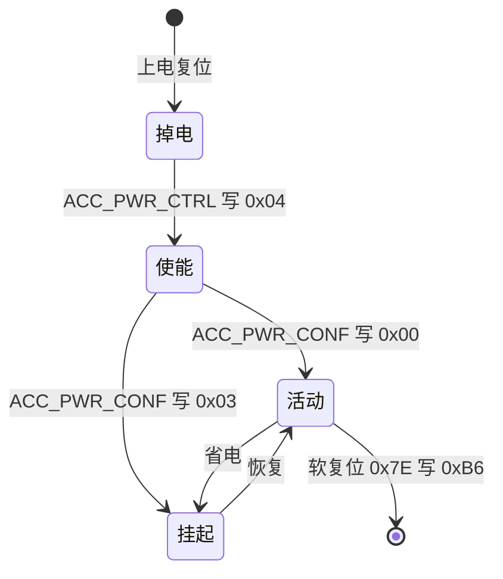
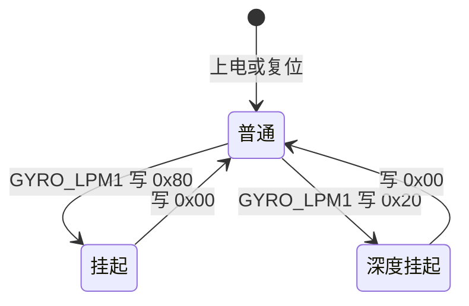
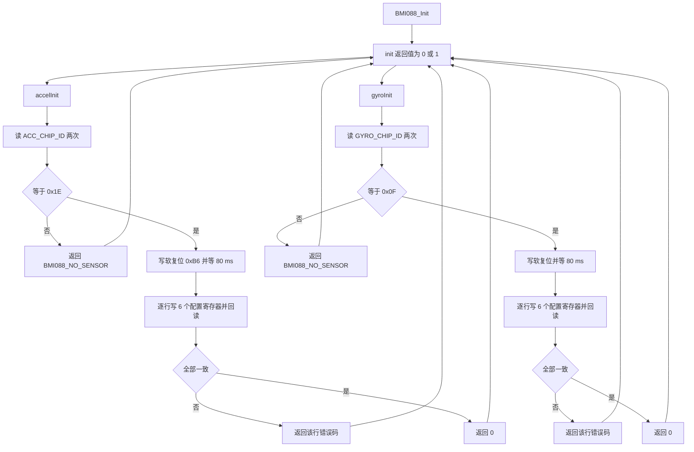

# 寄存器与量程配置

> 源码对象：`BMI088/BMI088config.h`、`BMI088/Src/BMI088.cpp` 的初始化段与配置表。
> 两张配置表分别是 6 行，每行的第三列是写回校验失败时应当返回的错误码。

IMU 上电后寄存器处于默认状态，驱动必须在读数之前把它配成工程需要的状态。加速度计默认处于挂起，陀螺仪默认是普通模式但深度挂起会关闭输出；ODR、量程、带宽与中断则决定数据产生的节奏与噪声带宽。

本工程把这四类配置写成两张静态数组，初始化时逐行写入并回读校验。配置的顺序有约束：电源使能必须早于工作模式，量程必须与换算用的灵敏度宏一致。

本文按两张表逐行说明每个寄存器值的构成，再给出灵敏度宏的数值与注释不一致之处，最后分析 `init()` 的返回值为什么只剩 0 或 1。

> 源码索引

| 路径 | 作用 |
| --- | --- |
| `BMI088/BMI088config.h` | 寄存器宏与灵敏度宏 |
| `BMI088/Src/BMI088.cpp` | 初始化流程与两张配置表 |
| `BMI088/Inc/BMI088.h` | 错误码枚举与子初始化声明 |
| `Task/Src/ImuTask.cpp` | 初始化调用点 |

## 上电后必须先确定的四类配置

需要确定的量有四类：

- 电源与工作模式：加速度计默认处于挂起，必须显式打开；陀螺仪默认是普通模式，但深度挂起会关闭输出。
- 输出数据率 ODR：决定芯片多久产生一组新数据。采样频率低于 ODR 会重复读到同一组值，高于 ODR 会读到未更新的值。
- 量程：决定每个 LSB 对应的物理量，同时决定饱和阈值。
- 带宽与中断：低通滤波的截止频率决定噪声带宽，数据就绪中断决定是否可以用中断驱动读数。

四类配置互不独立：带宽不能超过 ODR 的一半附近，量程与灵敏度宏必须成对，中断映射要配合引脚配置。

## 写回校验能发现什么

配置寄存器写入之后立即读回，与期望值比较。不一致说明该寄存器没有被写入，或通信链路有问题。这种方法能发现写没生效，发现不了写对了但器件行为不符预期。

```cpp
/* BMI088/Src/BMI088.cpp:67-76（加速度计，陀螺仪同构） */
for (write_reg_num = 0; write_reg_num < BMI088_WRITE_ACCEL_REG_NUM; write_reg_num++) {
    accelWriteReg(writeAccelConfig[write_reg_num][0],
                  writeAccelConfig[write_reg_num][1]);
    DWT_Delay_us(BMI088_COM_WAIT_SENSOR_TIME);
    res = accelReadReg(writeAccelConfig[write_reg_num][0]);
    DWT_Delay_us(BMI088_COM_WAIT_SENSOR_TIME);
    if (res != writeAccelConfig[write_reg_num][1]) {
        return writeAccelConfig[write_reg_num][2];
    }
}
```

每次写入与回读之间插入 150 微秒。这个值来自 `BMI088/BMI088config.h:207` 的 `BMI088_COM_WAIT_SENSOR_TIME`，比 SPI 传输本身耗时大两个数量级，作用是等待寄存器写入在芯片内部生效。

## 量化步长由满量程与位宽决定

设满量程为 $FS$，输出是 $N$ 位含符号位的二补码，幅值占 $N-1$ 位，则量化步长为

$$\Delta = \frac{FS}{2^{N-1}}$$

BMI088 的加速度计与陀螺仪输出都是 16 位，$2^{N-1} = 2^{15}$，所以下面代入 15 次幂。加速度计在 3g 量程下的步长为 $3/2^{15} = 9.155 \times 10^{-5}\ \text{g}$，陀螺仪在 2000 dps 量程下为 $2000/2^{15} = 0.061035\ \text{dps}$。量程每翻一倍，步长翻一倍，单位物理量对应的位数减少一位。量化噪声的功率与步长的平方成正比，因此小量程在静止测量中噪声更低；大量程抗饱和能力更强。两者只能取其一。

## ODR 与带宽的配合

ODR 是芯片内部产生新数据的频率，带宽是低通滤波的截止频率。两者独立配置，但存在约束：带宽不能超过 ODR 的一半附近，否则滤波无效。本工程陀螺仪取 ODR 1000 Hz、带宽 116 Hz，加速度计取 ODR 800 Hz、普通带宽模式。高 ODR 降低延迟，代价是更高的输出噪声；低带宽压低噪声，代价是引入相位滞后。

加速度计 ODR 800 Hz 低于陀螺仪的 1000 Hz，两者对任务 1 ms 周期的余量不同。ODR 低于任务采样率时同一组数据会被连续读到，这一点在《数据读取与量纲换算》与《易错点与调试》里各自展开。

## 加速度计的两级电源控制

加速度计有两级电源控制：`ACC_PWR_CTRL` 决定模拟前端是否使能，`ACC_PWR_CONF` 决定活动或挂起。



陀螺仪只有 `GYRO_LPM1` 一个模式寄存器：



## 加速度计配置表逐行

| 顺序 | 寄存器 | 地址 | 写入值 | 宏展开 | 错误码 |
| --- | --- | --- | --- | --- | --- |
| 1 | `ACC_PWR_CTRL` | `0x7D` | `0x04` | `ACC_ENABLE_ACC_ON` | `0x01` |
| 2 | `ACC_PWR_CONF` | `0x7C` | `0x00` | `ACC_PWR_ACTIVE_MODE` | `0x02` |
| 3 | `ACC_CONF` | `0x40` | `0xAB` | `MUST_Set \| ACC_NORMAL \| ACC_800_HZ` | `0x03` |
| 4 | `ACC_RANGE` | `0x41` | `0x00` | `ACC_RANGE_3G` | `0x05` |
| 5 | `INT1_IO_CTRL` | `0x53` | `0x08` | `INT1_IO_ENABLE \| GPIO_PP \| GPIO_LOW` | `0x06` |
| 6 | `INT_MAP_DATA` | `0x58` | `0x04` | `INT1_DRDY_INTERRUPT` | `0x07` |

表的定义在 `BMI088/Src/BMI088.cpp:319-327`，宏在 `BMI088/BMI088config.h`。逐行说明：

- 第 1、2 行把加速度计从复位后的挂起态切到活动态。顺序不能颠倒：模拟前端未使能时写 `ACC_PWR_CONF` 不产生效果。
- 第 3 行的 `0xAB` 是三个字段按位或：`0x80` 是手册要求固定为 1 的第 7 位，`0x20` 是普通滤波模式，`0x0B` 是 800 Hz ODR（`BMI088config.h:44-57`）。
- 第 4 行量程取 3G，寄存器值 `0x00`，对应最小量程与最细步长。
- 第 5 行把 INT1 配成推挽输出、低有效并打开。`INT1_IO_ENABLE` 为 `0x08`，推挽与低有效都是 `0x00`。
- 第 6 行把数据就绪信号映射到 INT1。中断使能位是 `0x04`。

## 陀螺仪配置表逐行

| 顺序 | 寄存器 | 地址 | 写入值 | 宏展开 | 错误码 |
| --- | --- | --- | --- | --- | --- |
| 1 | `GYRO_RANGE` | `0x0F` | `0x00` | `GYRO_2000` | `0x08` |
| 2 | `GYRO_BANDWIDTH` | `0x10` | `0x82` | `MUST_Set \| GYRO_1000_116_HZ` | `0x09` |
| 3 | `GYRO_LPM1` | `0x11` | `0x00` | `GYRO_NORMAL_MODE` | `0x0A` |
| 4 | `GYRO_CTRL` | `0x15` | `0x80` | `DRDY_ON` | `0x0B` |
| 5 | `INT3_INT4_IO_CONF` | `0x16` | `0x00` | `INT3_GPIO_PP \| INT3_GPIO_LOW` | `0x0C` |
| 6 | `INT3_INT4_IO_MAP` | `0x18` | `0x01` | `DRDY_IO_INT3` | `0x0D` |

表的定义在 `BMI088/Src/BMI088.cpp:330-338`。逐行说明：

- 第 1 行量程取 2000 dps，寄存器值 `0x00`。这是最大量程，配的是最粗步长。云台快速转动时角速度可能超过小量程，取大量程以避免饱和。
- 第 2 行的 `0x82` 是固定第 7 位 `0x80` 与 `0x02` 的或。`0x02` 对应 ODR 1000 Hz、带宽 116 Hz（`BMI088config.h:137-145`）。
- 第 3 行回到普通模式。
- 第 4 行打开数据就绪中断。
- 第 5 行把 INT3 配成推挽、低有效。
- 第 6 行把数据就绪信号映射到 INT3。

按手册，加速度计 INT1 与陀螺仪 INT3 都输出了数据就绪信号。驱动没有使用这两根中断线，读数由任务周期轮询触发。中断配置属于预留，是否接线待现场确认。

## 灵敏度宏的数值与注释不一致

| 量程 | 标称步长 | 文件宏值 | 源码位置 |
| --- | --- | --- | --- |
| 加速度计 3G | `9.155e-5 g` | `0.0008974358974` | `BMI088config.h:227` |
| 加速度计 6G | `1.831e-4 g` | `0.00179443359375` | `:228` |
| 加速度计 12G | `3.662e-4 g` | `0.0035888671875` | `:229` |
| 加速度计 24G | `7.324e-4 g` | `0.007177734375` | `:230` |
| 陀螺仪 2000 dps | `0.061035 dps` | `0.0010652644` | `:233` |
| 陀螺仪 1000 dps | `0.030518 dps` | `0.0005326322` | `:234` |
| 陀螺仪 500 dps | `0.015259 dps` | `0.0002663161` | `:235` |
| 陀螺仪 250 dps | `0.0076295 dps` | `0.0001331581` | `:236` |
| 陀螺仪 125 dps | `0.0038147 dps` | `0.0000665790` | `:237` |

两处单位与注释不一致，属于代码事实：

- 四个加速度计宏的数值都是标称步长乘 9.8 的结果，宏输出已经把 g 换成 m/s²；但只有 3G 行（`:227`）的注释写明了这一点，`:226` 的段注释仍写「单位：g per LSB」，6G/12G/24G（`:228-230`）只写「Ng / 32768」，三行注释都没有反映 ×9.8。
- 陀螺仪宏的注释写着 `°/s per LSB`，但 `0.0010652644` 恰好等于 `2000/32768` 再除以 `180/π`，实际单位是 rad/s。注释与数值至少有一处错，以数值为准时输出为 rad/s。

陀螺仪宏的单位问题直接牵连 `convertData()` 里额外乘的系数，见《数据读取与量纲换算》。

## init 的返回值为什么只剩 0 或 1

初始化把两次子初始化的结果按位或后返回：

```cpp
/* BMI088/Src/BMI088.cpp:28-38 */
uint8_t BMI088::init() {
    uint8_t error = 0;
    error |= accelInit();
    error |= gyroInit();
    return error;
}
```

`accelInit()` 与 `gyroInit()` 的返回类型是 `bool`（`BMI088/Inc/BMI088.h:59-60`），而函数体内返回的是枚举错误码。`BMI088_NO_SENSOR` 为 `0xFF`，转换成 bool 得到 `true`，再并入 `uint8_t` 得到 `0x01`。因此 `init()` 的返回值只能是 0 或 1，头文件里定义的错误码无法上传。

C 接口 `BMI088_Init()` 又把 `init()` 的返回值丢弃（`BMI088/Src/BMI088.cpp:347-349`），调用点 `Task/Src/ImuTask.cpp:35` 不接收任何状态。整条初始化失败路径在当前代码里是静默的，只能靠在线变量或调试器观察。



## 配置层面的易错点

### 量程寄存器与灵敏度宏不匹配

`ACC_RANGE` 写入 3G 后必须配套使用 `BMI088_ACCEL_3G_SEN`。若把量程改成 6G 却仍用小量程宏，读数只有真实值的一半；反过来的比例误差为 2 倍。两块板当前都只启用了 3G 与 2000 dps 两个宏（`BMI088config.h:213-224`），其余七个宏被注释掉：加速度计 6G/12G/24G 三行（`:215-217`），陀螺仪 1000/500/250/125 四行（`:221-224`）。

### 陀螺仪灵敏度注释误导

`BMI088config.h:232` 把单位写成 `°/s per LSB`。按数值反推是 rad/s。按注释把 `convertData()` 的输出当作角度制使用，会让积分得到的角度与实际相差约 57.3 倍。

### 忘记固定位

`ACC_CONF` 与 `GYRO_BANDWIDTH` 的第 7 位在手册里要求置 1。漏掉 `MUST_Set` 宏时，回读校验会发现不一致并返回错误码，但错误码已经被 `init()` 折叠，现象只是初始化返回 1。

### 把错误码当成可用的故障定位手段

头文件 `BMI088/Inc/BMI088.h:32-52` 定义了从 `0x01` 到 `0x0D` 的逐寄存器错误码，但 `init()` 的 bool 折叠使其无法到达调用方。当前要定位初始化失败，需要在 `accelInit()` 与 `gyroInit()` 内部下断点，而不是读 `BMI088_Init()` 的返回值。

### 配置中断却未接中断线

两张表都打开了数据就绪中断并映射到 INT1 与 INT3。如果硬件没有把这两根线接到 MCU 的外部中断引脚，中断配置不产生任何作用，读数仍然依赖轮询（`Task/Src/ImuTask.cpp:43`）。这一项是否接线按硬件原理图核对。

## 小结

### 核心概念

- 初始化由两张 6 行的静态表描述，每行是寄存器、值与错误码。写入后立即回读校验，不一致则该行失败。
- 量程决定量化步长。步长等于满量程除以 $2^{15}$，量程翻倍则分辨率减半。
- 加速度计需要两级电源控制，先使能模拟前端再切活动模式。陀螺仪只有 `GYRO_LPM1` 一个模式寄存器。
- 加速度计宏已经把 g 换算成 m/s²；陀螺仪宏的数值单位是 rad/s，与注释不符。
- `init()` 把两个 bool 子初始化结果按位或，枚举错误码全部折叠成 0 或 1，且返回值被调用方丢弃。

### 设计权衡

| 决策 | 收益 | 代价 |
| --- | --- | --- |
| 加速度计取 3G | 步长最小，静止测量噪声低 | 冲击或碰撞时容易饱和 |
| 陀螺仪取 2000 dps | 快速转动不饱和 | 步长最粗，低速小角速度信噪比下降 |
| 陀螺仪带宽取 116 Hz | 高于控制带宽，滞后可控 | 高于该值的振动进入积分 |
| 加速度计 ODR 800 Hz | 高于 1 kHz 任务的更新率有余量 | 比 1600 Hz 多约一档延迟 |
| 配置写回校验 | 能发现写失败 | 每寄存器多一次读与 150 微秒等待，初始化变慢 |
| 错误码用枚举定义 | 逐寄存器可定位 | 返回类型是 bool，实际不可用 |

## 练习

### 基础题

1. 写出加速度计 3G 量程下每 LSB 的标称步长，并与 `BMI088_ACCEL_3G_SEN` 比较倍数关系。
2. 说明 `ACC_CONF` 写入值 `0xAB` 的三个字段各是什么。
3. 说明陀螺仪为何取 2000 dps 而不是 250 dps。
4. 解释 `init()` 为什么无法返回 `0x01` 到 `0x0D` 的错误码。

### 挑战题

5. 把陀螺仪量程改为 1000 dps，列出需要同时改动的宏、配置表数值与换算式，并说明改完后静态噪声与饱和阈值各自的变化方向。
6. 给出一种修复错误码丢失的方案：改动 `init()`、`accelInit()`、`gyroInit()` 的返回类型，同时让 `ImuTask` 能读取状态。说明接口改动后对现有调用点的影响。
7. 已知加速度计 ODR 800 Hz 而任务周期 1 ms，推导连续两次读数中重复值的出现频率上限，并说明如何通过读取 `ACC_STATUS` 的 DRDY 位避免读到重复值。

## 附：本页引用的固件路径

| 路径 | 用途 |
| --- | --- |
| `/home/wyx/rm/2026SentriOmeniGimbal/2026OmniSentryGimbal/BMI088/BMI088config.h` | 寄存器宏（:6-198）、灵敏度（:226-237）、量程开关（:213-224） |
| `/home/wyx/rm/2026SentriOmeniGimbal/2026OmniSentryGimbal/BMI088/Src/BMI088.cpp` | `init`（:28-38）、加速度计初始化（:41-79）、陀螺仪初始化（:82-120）、配置表（:319-338） |
| `/home/wyx/rm/2026SentriOmeniGimbal/2026OmniSentryGimbal/BMI088/Inc/BMI088.h` | 错误码枚举（:32-52）、子初始化声明（:59-60） |
| `/home/wyx/rm/2026SentriOmeniGimbal/2026OmniSentryGimbal/Task/Src/ImuTask.cpp` | 初始化调用点（:35） |
| `/home/wyx/rm/2026SentriOmeniChassis/2026OmniSentryChassis/BMI088/BMI088config.h` | 底盘板寄存器宏一致 |
