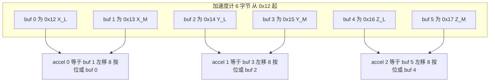
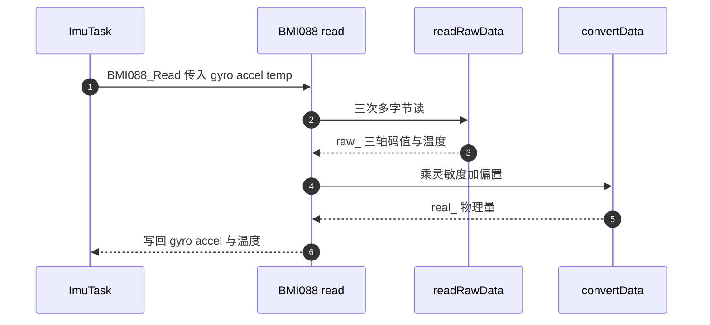

# 数据读取与量纲换算

> 源码对象：`BMI088/Src/BMI088.cpp` 的 `readRawData()`、`convertData()` 与 `read()`，以及 `BMI088/BMI088config.h` 的灵敏度宏。
> 两块板的换算系数不同，云台板陀螺仪乘 2.0，底盘板乘 1.19，差异单独列出。

传感器给的是整型码值，姿态解算要的是浮点物理量。这段换算由三步构成：把寄存器里的字节按顺序拼成二补码整数码值，码值乘以灵敏度得到工程单位下的物理量，温度再叠加一个零点偏移。

三步都按轴独立进行，没有轴向耦合。换算的输入是 `readRawData()` 得到的 `raw_` 结构，输出是 `convertData()` 填充的 `real_` 结构，最后 `read()` 把结果拷贝到调用方数组。

这里的每一处都有对应的字节级事实：拼接顺序、位宽、符号扩展门限、灵敏度单位。任一处写错都不会报错，只会让读数整体偏移或等比缩放。本文按这条链逐段展开，并用四组手算例子核对。

> 源码索引

| 路径 | 作用 |
| --- | --- |
| `BMI088/Src/BMI088.cpp` | 原始数据拼接与换算 |
| `BMI088/BMI088config.h` | 温度常数与灵敏度宏 |
| `BMI088/Inc/BMI088.h` | `RawData` 与 `RealData` 结构 |
| `Task/Src/ImuTask.cpp` | 读取调用点与全局数组 |
| 底盘板同名文件 | 陀螺仪系数 1.19 |

## 从寄存器码值到物理量的三步

三步的对应关系如下：

| 步骤 | 输入 | 输出 | 源码位置 |
| --- | --- | --- | --- |
| 字节拼接 | SPI 读回的 `buf` | `raw_` 的整型码值 | `BMI088/Src/BMI088.cpp:123-149` |
| 乘灵敏度 | `raw_` | `real_` 的 m/s²、rad/s | `:152-163` |
| 加温度偏置 | `raw_.temp` | `real_.temp` | `:162` |

换算顺序不能颠倒：灵敏度是作用在已做符号扩展的码值上的线性系数，先乘再做符号扩展会得到错误结果。温度多一步偏置，因为码值 0 不对应 0 摄氏度。

## 16 位与 11 位两种二补码

16 位输出用二补码表示有符号数。设寄存器拼出的无符号值为 $N$，物理码值为

$$
n =
\begin{cases}
N, & N < 2^{15} \\
N - 2^{16}, & N \ge 2^{15}
\end{cases}
$$

温度只用 11 位有效位，符号扩展的门限相应变为 $2^{10}$：

$$
t_{\text{raw}} =
\begin{cases}
M, & M \le 1023 \\
M - 2048, & M > 1023
\end{cases}
$$

$M$ 是温度寄存器拼出的 11 位无符号值。驱动的符号扩展没有依赖类型转换，而是显式比较后减 2048（`BMI088/Src/BMI088.cpp:145-148`）。

两处门限的来源不同：16 位用 $2^{15}$ 判断最高位，11 位用 1023 判断第 10 位。温度如果按 16 位处理，符号扩展的门限也要跟着换成 32768，而代码里用的是 1023，这一处不一致就是漏掉位宽的信号。

## 字节顺序与陀螺仪 8 字节布局

SPI 是高位在先发送，但传感器寄存器按低字节在前排列。驱动对加速度计与陀螺仪采用同一套拼法：低字节放低位，高字节放高位。

```cpp
/* BMI088/Src/BMI088.cpp:128-130 */
raw_.accel[0] = (int16_t)((buf[1] << 8) | buf[0]);
raw_.accel[1] = (int16_t)((buf[3] << 8) | buf[2]);
raw_.accel[2] = (int16_t)((buf[5] << 8) | buf[4]);
```



陀螺仪从 `0x00` 起读 8 字节，头两字节是芯片 ID 与保留字节，数据从下标 2 开始：

| 下标 | 寄存器 | 内容 |
| --- | --- | --- |
| 0 | `0x00` | CHIP_ID，应为 `0x0F` |
| 1 | `0x01` | 保留 |
| 2、3 | `0x02`、`0x03` | X_L、X_H |
| 4、5 | `0x04`、`0x05` | Y_L、Y_H |
| 6、7 | `0x06`、`0x07` | Z_L、Z_H |

把芯片 ID 一起读回来的做法省掉一次单独读 ID 的往返，代价是驱动必须先检查 `buf[0]` 才能信任后面的数据。下标 2 之后的数据与三轴一一对应，因此拼装式写成 `(buf[3] << 8) | buf[2]` 这样的形式。

## 温度的两个寄存器与 11 位有效位

温度占用 `0x22` 与 `0x23` 两个寄存器，共 16 位，实际有效位是 11 位。拼法把高字节整体左移 3 位，再取低字节的高 3 位：

```cpp
/* BMI088/Src/BMI088.cpp:141-142 */
accelReadMulti(BMI088_TEMP_M, buf, 2);
raw_.temp = (int16_t)((buf[0] << 3) | (buf[1] >> 5));
```

换算公式为

$$T = t_{\text{raw}} \times 0.125 + 23.0$$

两个常数来自 `BMI088/BMI088config.h:193-194`，分别是 `BMI088_TEMP_FACTOR` 与 `BMI088_TEMP_OFFSET`。0.125 是每 LSB 的摄氏度，23.0 是码值 0 对应的温度。

左移 3 位相当于把高字节当作第 11 到第 3 位，低字节的高 3 位补足低位。若直接写成 `(buf[0] << 8) | buf[1]`，得到的 16 位值里多了低 5 位无效数据，读数会被放大 32 倍。

## 灵敏度宏的单位反推

设码值为 $n$，加速度为 $a$，角速度为 $\omega$，则

$$a = n \cdot k_a, \qquad \omega = n \cdot k_g$$

本工程取 3G 与 2000 dps，对应的宏分别是 `BMI088_ACCEL_3G_SEN` 与 `BMI088_GYRO_2000_SEN`。两者的单位需要按数值反推：

- `0.0008974358974` 约为标称步长 `9.155e-5 g` 的 9.8 倍，宏注释也写明乘过 9.8，因此输出单位是 m/s²。
- `0.0010652644` 等于 `2000/32768` 除以 `180/π`，单位是 rad/s。宏注释写成 `°/s per LSB`，与数值不符。

陀螺仪宏是 rad/s 这一点决定了 `convertData()` 里额外系数的性质：系数是在 rad/s 数值上再乘一个无量纲因子，得到的仍是 rad/s，只是量值被放大。

## readRawData 的三次多字节读

```cpp
/* BMI088/Src/BMI088.cpp:123-149（节选） */
uint8_t buf[8] = {0, 0, 0, 0, 0, 0};

accelReadMulti(BMI088_ACCEL_XOUT_L, buf, 6);
raw_.accel[0] = (int16_t)((buf[1] << 8) | buf[0]);
...

gyroReadMulti(BMI088_GYRO_CHIP_ID, buf, 8);
if (buf[0] == BMI088_GYRO_CHIP_ID_VALUE) {
    raw_.gyro[0] = (int16_t)((buf[3] << 8) | buf[2]);
    ...
}

accelReadMulti(BMI088_TEMP_M, buf, 2);
raw_.temp = (int16_t)((buf[0] << 3) | (buf[1] >> 5));
if (raw_.temp > 1023) { raw_.temp -= 2048; }
```

一次 `readRawData()` 发出三次多字节读：加速度计 6 字节、陀螺仪 8 字节、温度 2 字节。加速度计与陀螺仪的读操作需要经过片选切换，但 `readRawData()` 内部（`BMI088/Src/BMI088.cpp:123-149`）没有任何等待调用；150 微秒等待只出现在初始化路径，细节在《DMA 读取与 CS 时序》。

陀螺仪分支只在 `buf[0]` 等于 `0x0F` 时更新 `raw_.gyro`。芯片 ID 不匹配时该次读不写任何值，`raw_.gyro` 保留上一轮的数据。

## convertData 里两台设备不同的系数

```cpp
/* BMI088/Src/BMI088.cpp:152-163 */
real_.accel[0] = raw_.accel[0] * BMI088_ACCEL_3G_SEN;
...
real_.gyro[0] = raw_.gyro[0] * BMI088_GYRO_2000_SEN * 2.0f;
...
real_.temp = (static_cast<float>(raw_.temp) * BMI088_TEMP_FACTOR) + BMI088_TEMP_OFFSET;
```

云台板的陀螺仪换算乘了一个额外系数 2.0，底盘板同一位置乘 1.19：

```cpp
/* /home/wyx/rm/2026SentriOmeniChassis/2026OmniSentryChassis/BMI088/Src/BMI088.cpp:158-160 */
real_.gyro[0] = raw_.gyro[0] * BMI088_GYRO_2000_SEN * 1.19f;
```

两个系数在源码里都没有注释。按单位推导，`BMI088_GYRO_2000_SEN` 已经是 rad/s，再乘一个接近 1 或 2 的系数会引入比例误差。该系数的标定依据属于待现场确认项，不能仅凭代码判断哪一个正确。



## 四组手算例子

加速度计 X 轴。寄存器 `0x12` 为 `0xE8`，`0x13` 为 `0x03`。拼出的码值 $N = 0x03E8 = 1000$，小于 $2^{15}$，符号为正。

$$a_x = 1000 \times 8.974358974 \times 10^{-4} = 0.8974\ \text{m/s}^2 \approx 0.0915\ \text{g}$$

陀螺仪 X 轴。`0x02` 为 `0x00`，`0x03` 为 `0x01`，码值 $N = 256$。按云台板系数

$$\omega_x = 256 \times 1.065264436 \times 10^{-3} \times 2.0 = 0.5454\ \text{rad/s} = 31.25\ \text{dps}$$

按底盘板系数

$$\omega_x = 256 \times 1.065264436 \times 10^{-3} \times 1.19 = 0.3245\ \text{rad/s} = 18.59\ \text{dps}$$

温度。`0x22` 为 `0x19`，`0x23` 为 `0x00`。$M = 25 \times 8 = 200$，未超过 1023，因此

$$T = 200 \times 0.125 + 23.0 = 48.0\ \text{°C}$$

负温度例子。`0x22` 为 `0xE0`，`0x23` 为 `0x00`。$M = 224 \times 8 = 1792$，超过 1023，符号扩展得到 $1792 - 2048 = -256$，于是 $T = -256 \times 0.125 + 23.0 = -9.0\ \text{°C}$。

四个例子里前两个核对字节拼装与灵敏度，后两个核对 11 位符号扩展。同一组字节在两块板上得到不同的角速度，差值是 2.0 与 1.19 的比值，约 1.68 倍。

## 换算层面的易错点

### 高低字节拼反

把 `(buf[1] << 8) | buf[0]` 写成 `(buf[0] << 8) | buf[1]`，得到的码值会变成字节交换后的结果。静止时三轴加速度模长不再约等于 9.8，且随姿态剧烈跳变。核对方式是让加速度计静止，看 $\sqrt{a_x^2 + a_y^2 + a_z^2}$ 是否接近 9.8。

### 漏掉符号扩展

16 位码值不做 `int16_t` 转换而按 `uint16_t` 使用，负角速度会变成 6 万多的大正数。温度漏掉 `if (raw_.temp > 1023) raw_.temp -= 2048;` 时，低于 23 摄氏度的读数会跳到数千度。

### 温度位宽按 16 位处理

温度寄存器名义上占两个字节，有效位却是 11 位。按 16 位直接拼 `(buf[0] << 8) | buf[1]` 会多出低 5 位，读数被放大 32 倍。正确的拼法是 `(buf[0] << 3) | (buf[1] >> 5)`。

### 忽略芯片 ID 检查导致旧值

陀螺仪读取分支在 ID 不匹配时不更新 `raw_.gyro`。一次通信故障后，姿态解算会继续使用上一轮的角速度，表现为角度持续漂移而不报错。排查时应在 `buf[0] != 0x0F` 的分支上打点或计数。

### 量程宏与配置表不一致

`convertData()` 写死用 3G 与 2000 dps 两个宏。若把配置表的 `ACC_RANGE` 或 `GYRO_RANGE` 改成别的档位，换算不会跟着变，读数比例全错。改量程时要同时改配置表与这里的宏。

### 陀螺仪注释单位误读

注释写 `°/s per LSB`，数值是 rad/s。把输出直接当角度制送进角度环会引入约 57.3 倍的量纲错误。以数值反推单位为准。

## 小结

### 核心概念

- 加速度计与陀螺仪的 16 位输出是二补码，拼装顺序为低字节在前。温度是 11 位有效位，需显式符号扩展。
- 换算公式为物理量等于码值乘灵敏度。加速度计宏已含 g 到 m/s² 的换算，陀螺仪宏的单位是 rad/s。
- 陀螺仪读取把芯片 ID 与数据放在同一次 8 字节传输里，ID 不匹配时不更新数据。
- 云台板与底盘板的陀螺仪换算系数不同，分别为 2.0 与 1.19，源码无注释。
- 温度的 11 位拼接是 `(buf[0] << 3) | (buf[1] >> 5)`，门限是 1023。

### 设计权衡

| 决策 | 收益 | 代价 |
| --- | --- | --- |
| 一次读回陀螺仪 8 字节含 ID | 少一次往返，顺带校验 | ID 不匹配时不更新，数据会变旧 |
| 温度用显式比较做符号扩展 | 不依赖编译器对位宽的处理 | 门限 1023 与 2048 是硬编码 |
| 换算在驱动内完成 | 上层直接拿到物理量 | 量程改动要同步改驱动，宏写死在 `convertData()` |
| 温度零点 23 摄氏度 | 与手册一致，无需温度标定 | 芯片个体偏差未补偿，属按手册值 |
| 两板用不同陀螺仪系数 | 可能针对各自机械安装做过标定 | 同一份驱动代码在两板行为不同，可移植性下降 |

## 练习

### 基础题

1. 写出加速度计 X 轴原始字节到位拼装式，并说明哪个字节是低位。
2. 求码值 `-32768` 对应的 16 位二补码十六进制，以及 3G 量程下的加速度。
3. 写出温度的位拼接式与换算公式，并说明 11 位符号扩展的门限。
4. 说明陀螺仪 8 字节读取中每个下标的含义。

### 挑战题

5. 取 `0x22 = 0x0C`、`0x23 = 0x00`，计算温度。再取 `0x22 = 0xF3`、`0x23 = 0x00` 计算温度，说明两次结果相差多少度。
6. 已知云台板陀螺仪输出乘了 2.0，底盘板乘 1.19。假设两块板安装相同的陀螺仪且真实角速度一致，推导同一角速度下两板输出的比值，并给出用转台验证该比值的实验方案。
7. 把 `convertData()` 改成由运行期变量选择灵敏度，使量程宏与换算保持一致。列出需要的成员变量、设置入口与初始化顺序。

## 附：本页引用的固件路径

| 路径 | 用途 |
| --- | --- |
| `/home/wyx/rm/2026SentriOmeniGimbal/2026OmniSentryGimbal/BMI088/Src/BMI088.cpp` | 原始数据拼接（:123-149）、换算（:152-163）、对外读取（:166-176） |
| `/home/wyx/rm/2026SentriOmeniGimbal/2026OmniSentryGimbal/BMI088/BMI088config.h` | 温度常数（:193-194）、灵敏度宏（:226-237） |
| `/home/wyx/rm/2026SentriOmeniGimbal/2026OmniSentryGimbal/BMI088/Inc/BMI088.h` | `RawData` 与 `RealData` 结构（:16-29） |
| `/home/wyx/rm/2026SentriOmeniGimbal/2026OmniSentryGimbal/Task/Src/ImuTask.cpp` | 读取调用点与全局数组（:15、:40、:43） |
| `/home/wyx/rm/2026SentriOmeniChassis/2026OmniSentryChassis/BMI088/Src/BMI088.cpp` | 底盘板陀螺仪系数 1.19（:158-160） |
| `/home/wyx/rm/2026SentriOmeniChassis/2026OmniSentryChassis/BMI088/BMI088config.h` | 底盘板灵敏度宏与云台板一致 |
