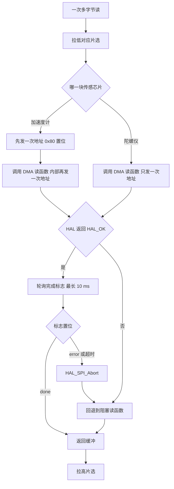
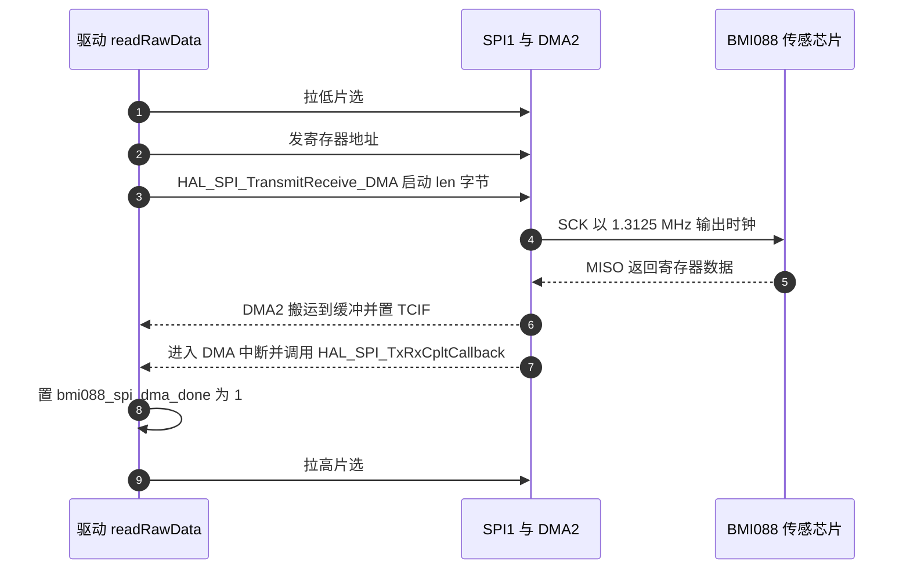

# DMA 读取与 CS 时序

> 源码对象：`BMI088/Src/BMI088.cpp` 的通信工具函数与 DMA 段、`BSP/Src/bsp_dwt.cpp`、`Core/Src/spi.c` 的 DMA 流配置。
> 片选全部由 GPIO 软件翻转，SPI 外设的 NSS 是软件模式。

IMU 读取的通信层要处理三件事：片选什么时候把哪一块传感芯片挂上总线，翻转之后芯片需要多久完成内部动作，以及多字节数据用阻塞还是 DMA 搬运。本工程单字节读写走阻塞路径，多字节读走 DMA 路径并在失败时回退到阻塞路径。

两条路径并存带来一处容易被忽略的差别：加速度计的读操作在地址与数据之间需要一个哑字节，而两条路径各有自己的地址发送，同一次读里可能出现多次地址字节。这一处是否需要修正，标为待实测。

本文按片选、等待、传输方式、完成标志与回退顺序展开，最后把这套开销放回 1 毫秒的任务周期里核算。

> 源码索引

| 路径 | 作用 |
| --- | --- |
| `BMI088/Src/BMI088.cpp` | 片选函数、收发函数、DMA 路径与回调 |
| `BMI088/BMI088config.h` | 两个等待常量与缓冲上限宏 |
| `BSP/Src/bsp_dwt.cpp` | 微秒与毫秒延时实现 |
| `Core/Src/spi.c` | SPI1 参数与 DMA 流配置 |
| `Core/Src/gpio.c` | 片选初始电平与模式 |
| `Task/Src/ImuTask.cpp` | 读取调用与 1 毫秒循环 |

## 片选由 GPIO 翻转

片选低电平表示选中。每次操作由同一个函数成对完成拉低、收发、拉高三步。片选函数本身只翻转引脚：

```cpp
/* BMI088/Src/BMI088.cpp:180-194 */
void BMI088::csAccelLow() {
    HAL_GPIO_WritePin(cs_accel_port_, cs_accel_pin_, GPIO_PIN_RESET);
}
void BMI088::csAccelHigh() {
    HAL_GPIO_WritePin(cs_accel_port_, cs_accel_pin_, GPIO_PIN_SET);
}
...
```

翻转引脚与 SPI 传输之间没有等待。CS 建立时间与保持时间由 SPI 传输本身的时序提供，是否满足 BMI088 手册的 $t_{cssu}$ 与 $t_{csh}$ 需要按手册核对，属待实测项。

选择软件片选的理由是引脚可以任意分配，并且时序完全由代码控制。代价是每次操作多两次 GPIO 写，而且建立与保持时间不再由外设硬件保证。

## 两个等待常量的用途

工程里定义了两个等待常量（`BMI088/BMI088config.h:205-207`）：

| 常量 | 值 | 用途 |
| --- | --- | --- |
| `BMI088_COM_WAIT_SENSOR_TIME` | 150 微秒 | 每次寄存器读写前后等待内部生效 |
| `BMI088_LONG_DELAY_TIME` | 80 毫秒 | 软复位后等待器件重启 |

两者都用 DWT 实现。`BSP/Src/bsp_dwt.cpp:24-30` 用 CPU 周期数换算微秒：

$$N_{\text{cycles}} = \frac{f_{\text{HCLK}}}{10^{6}} \times t_{\mu s}$$

168 MHz 时每微秒 168 个周期，150 微秒对应 25200 个周期。毫秒延时用微秒延时循环实现（`BSP/Src/bsp_dwt.cpp:32-36`）。

150 微秒的等待只出现在初始化路径：每次读芯片 ID 与每次配置寄存器读写之间（`BMI088/Src/BMI088.cpp:47-59`、`:70-72`）。正常读数据路径里没有这个等待，只靠 SPI 的传输间隔。

## 单字节阻塞与多字节 DMA 的分工

单字节读写用一个固定长度 1 的收发：

```cpp
/* BMI088/Src/BMI088.cpp:260-265 */
inline uint8_t BMI088::BMI088_readandwrite_byte(uint8_t txdata)
{
    uint8_t rx_data;
    HAL_SPI_TransmitReceive(&hspi1, &txdata, &rx_data, 1, 1000);
    return rx_data;
}
```

超时参数是 1000。HAL 的这个参数单位是毫秒，在 1.3125 MHz 下传 1 字节约 6 微秒，1000 毫秒的余量极大。

多字节读分两条实现：

- 阻塞版 `BMI088_read_multiple_reg()`（`:268-277`）：发一次地址，然后循环收发 `len` 次。
- DMA 版 `BMI088_read_multiple_reg_dma()`（`:279-315`）：发一次地址，填充哑字节缓冲，启动 `HAL_SPI_TransmitReceive_DMA`，轮询完成标志。

加速度计的多字节读在调用 DMA 版之前额外发了一次地址（`:217`），陀螺仪没有这一行（`:248-250`）。DMA 版内部也会发地址（`:288`），因此加速度计路径上会出现两个地址字节，陀螺仪路径只有一个。是否因此造成读回数据错位，需要逻辑分析仪核对 MOSI 与 MISO 波形，标注为待实测。



## 完成标志与回调

DMA 传输完成后，HAL 在中断上下文里调用回调。驱动用两个文件级标志记录结果：

```cpp
/* BMI088/Src/BMI088.cpp:15-17 */
static volatile uint8_t bmi088_spi_dma_done = 0;
static volatile uint8_t bmi088_spi_dma_error = 0;
static uint8_t bmi088_dma_tx_buf[BMI088_DMA_MAX_LEN];

/* BMI088/Src/BMI088.cpp:356-369（节选） */
void HAL_SPI_TxRxCpltCallback(SPI_HandleTypeDef *hspi) {
    if (hspi == &hspi1) { bmi088_spi_dma_done = 1; }
}
void HAL_SPI_ErrorCallback(SPI_HandleTypeDef *hspi) {
    if (hspi == &hspi1) { bmi088_spi_dma_error = 1; }
}
```

DMA 版在启动前把两个标志清零，启动后轮询它们，超过 10 毫秒就调用 `HAL_SPI_Abort` 并返回超时。等待循环用 `HAL_GetTick()`，其节拍来自 TIM2 的 1 毫秒中断。



## 片选与硬件资源

| 项目 | 取值 | 源码位置 |
| --- | --- | --- |
| 加速度计片选 | PA4 | `BMI088/Src/BMI088.cpp:343-344` |
| 陀螺仪片选 | PB0 | `:343-345` |
| 片选初始电平 | 高 | `Core/Src/gpio.c:63`、`:66` |
| SPI1 DMA 接收 | DMA2_Stream2，Channel3 | `Core/Src/spi.c:99-108` |
| SPI1 DMA 发送 | DMA2_Stream3，Channel3 | `Core/Src/spi.c:117-126` |
| DMA 发送缓冲上限 | 32 字节 | `BMI088/Src/BMI088.cpp:11-13` |

DMA 流在 `HAL_SPI_MspInit` 里初始化（`Core/Src/spi.c:64-137`），两条流都是单次模式、字节宽度、内存地址自增、外设地址固定。SPI1_RX 优先级最高，SPI1_TX 为高。

## DMA 读函数逐行

```cpp
/* BMI088/Src/BMI088.cpp:279-315（节选） */
HAL_StatusTypeDef BMI088::BMI088_read_multiple_reg_dma(uint8_t reg, uint8_t *buf, uint8_t len)
{
    if (!buf || len == 0 || len > BMI088_DMA_MAX_LEN) return HAL_ERROR;

    bmi088_spi_dma_done = 0;
    bmi088_spi_dma_error = 0;

    BMI088_readandwrite_byte(reg | 0x80);

    for (uint8_t i = 0; i < len; ++i) bmi088_dma_tx_buf[i] = 0x55;

    if (HAL_SPI_TransmitReceive_DMA(&hspi1, bmi088_dma_tx_buf, buf, len) != HAL_OK) {
        return HAL_ERROR;
    }

    uint32_t t0 = HAL_GetTick();
    const uint32_t timeout_ms = 10;
    while (!bmi088_spi_dma_done && !bmi088_spi_dma_error) {
        if ((HAL_GetTick() - t0) > timeout_ms) {
            HAL_SPI_Abort(&hspi1);
            return HAL_TIMEOUT;
        }
    }
    if (bmi088_spi_dma_error) { return HAL_ERROR; }
    return HAL_OK;
}
```

启动前清零标志避免上一轮的结果干扰。发送缓冲填充 `0x55`，这是任意的哑字节，SPI 全双工下主机必须提供时钟，因此也要提供数据。

## 失败回退到阻塞路径

`accelReadMulti` 与 `gyroReadMulti` 在 DMA 返回非 `HAL_OK` 时调用阻塞版重读一次：

```cpp
/* BMI088/Src/BMI088.cpp:218-224（加速度计） */
HAL_StatusTypeDef st = BMI088_read_multiple_reg_dma(reg, data, (uint8_t)len);
if (st != HAL_OK) {
    BMI088_read_multiple_reg(reg, data, len);
}
```

回退路径保证单次通信失败不至于让本次读取整体失败。代价是加速度计回退时，连同 `:217` 与 DMA 版 `:288` 的两次地址，阻塞版 `:270` 还会再发一次，同一次读里出现三次地址字节。这一点的实际影响同样列为待实测。

## 与 1 毫秒任务周期的关系

`ImuTask` 主循环周期 1 毫秒，循环末尾用 `DWT_Delay_ms(1)` 忙等（`Task/Src/ImuTask.cpp:111`）。每次三轴读取包含加速度计 6 字节、陀螺仪 8 字节、温度 2 字节共三次多字节传输。以 1.3125 MHz 计，纯传输时间约

$$(6 + 8 + 2) \times \frac{8}{1.3125\ \text{MHz}} \approx 97.5\ \mu\text{s}$$

三次 DMA 启动与轮询、三次片选翻转、任务内其余计算都在这 1 毫秒预算里。

## 时序层面的易错点

### 在 DMA 完成前拉高片选

片选必须在 DMA 传输结束后才释放。若在启动 DMA 之后立即拉高片选，芯片会在传输中途被取消，读回的数据不完整。本工程把拉高放在 DMA 函数返回之后（`:225`、`:256`），DMA 函数内部会等待完成标志，顺序正确。

### 缓冲长度超过上限

DMA 发送缓冲固定 32 字节。`convertData` 之前的多字节读最长 8 字节，未触及上限。若把读取长度改到 33 字节以上，函数直接返回 `HAL_ERROR` 并走阻塞回退，现象是 DMA 路径静默失效而读取结果看似正确。

### DMA 流未配置

`HAL_SPI_TransmitReceive_DMA` 依赖 `hspi1` 的 `hdmatx` 与 `hdmarx` 已链接。若 `Core/Src/spi.c` 的 DMA 段被删除，启动调用返回 `HAL_ERROR`，每次读都走阻塞回退。功能不报错，但 CPU 占用上升。

### 超时期间的忙等

等待循环是任务上下文里的忙等，最长 10 毫秒。正常传输几十微秒，很少触发。一旦 DMA 流被其它外设抢占或回调未使能，等待会占满一个任务周期。

### 回调未检查句柄

`HAL_SPI_TxRxCpltCallback` 是全工程唯一的弱函数覆盖点。若别的 SPI 外设也使用 DMA，必须在回调里按 `hspi` 区分，否则会误置 IMU 的完成标志。当前代码检查了 `hspi == &hspi1`。

### 地址重复发送

加速度计路径在 `:217` 与 DMA 版 `:288` 各发一次地址，回退时阻塞版 `:270` 再发一次。是否需要其中一次作为加速度计要求的哑字节，按手册与实测波形确认。这一项的后果是数据可能整体偏移一个寄存器。

### 初始化等待不足

软复位后只等一次 80 毫秒（`:53`、`:94`）。若实际器件重启时间更长，随后的配置写入会失败，且因为 `init()` 丢失错误码而静默。定位方式是在 `accelInit()` 与 `gyroInit()` 内观察回读值。

## 小结

### 核心概念

- 片选低电平选中，由 GPIO 软件翻转，上电置高，通信期间保持低。
- 150 微秒等待只用于初始化路径的寄存器读写，80 毫秒只用于软复位之后。毫秒与微秒延时都由 DWT 周期计数实现。
- 单字节读写走阻塞的 `HAL_SPI_TransmitReceive`，多字节读走 DMA，失败时回退到阻塞版。
- DMA 完成由 `HAL_SPI_TxRxCpltCallback` 置标志，错误由 `HAL_SPI_ErrorCallback` 置标志，超时 10 毫秒后中止。
- 加速度计与陀螺仪在多字节读里的地址发送次数不同，加速度计多发一次。

### 设计权衡

| 决策 | 收益 | 代价 |
| --- | --- | --- |
| 软件片选 | 引脚任意分配，可精细控制时序 | 每次操作多两次 GPIO 写，时序靠代码保证 |
| 短操作阻塞、长操作 DMA | 单字节简单，多字节不占 CPU | 两条路径并存，回退逻辑增加分支 |
| 10 毫秒超时后回退 | 偶发 DMA 故障不影响读取 | 忙等最长占满一个任务周期 |
| 每次读都经过 DMA 启动 | 传输期间 CPU 可被调度 | 每次启动有固定开销，8 字节以下收益有限 |
| 等待标志而非中断唤醒 | 同步调用风格，调用者不需要状态机 | 任务在等待期间空转 |

## 练习

### 基础题

1. 写出加速度计与陀螺仪的片选引脚、初始电平与选中电平。
2. 说明 150 微秒与 80 毫秒两个等待常量各自出现的场合。
3. 说明 DMA 完成标志由哪个回调置位，错误标志由哪个回调置位。
4. 说明 DMA 发送缓冲的长度上限，以及超过上限时函数的行为。

### 挑战题

5. 已知 SPI1 为 1.3125 MHz、DMA 单次模式。计算一次 8 字节 DMA 读在传输、启动、中断与轮询上的总耗时量级，并与阻塞版比较。
6. 画出加速度计多字节读在 DMA 失败并回退时完整的地址字节序列，指出哪几次可能被器件当作哑字节。
7. 把等待完成标志改为中断或任务通知，给出改动点与对 `ImuTask` 调用的影响，并说明为什么当前接口是同步阻塞的。

## 附：本页引用的固件路径

| 路径 | 用途 |
| --- | --- |
| `/home/wyx/rm/2026SentriOmeniGimbal/2026OmniSentryGimbal/BMI088/Src/BMI088.cpp` | 片选函数（:180-194）、单字节收发（:260-265）、阻塞多字节（:268-277）、DMA 多字节（:279-315）、标志与回调（:15-17、:356-369）、多字节入口（:215-226、:247-257） |
| `/home/wyx/rm/2026SentriOmeniGimbal/2026OmniSentryGimbal/BMI088/BMI088config.h` | 两个等待常量（:205-207）、DMA 长度上限宏引用 |
| `/home/wyx/rm/2026SentriOmeniGimbal/2026OmniSentryGimbal/BSP/Src/bsp_dwt.cpp` | 微秒与毫秒延时实现（:24-36） |
| `/home/wyx/rm/2026SentriOmeniGimbal/2026OmniSentryGimbal/Core/Src/spi.c` | SPI1 参数（:42-53）、DMA 流配置（:64-137） |
| `/home/wyx/rm/2026SentriOmeniGimbal/2026OmniSentryGimbal/Core/Src/gpio.c` | 片选初始电平与模式（:63、:66、:94-106） |
| `/home/wyx/rm/2026SentriOmeniGimbal/2026OmniSentryGimbal/Task/Src/ImuTask.cpp` | 读取调用与 1 毫秒循环（:40-43、:111） |
| `/home/wyx/rm/2026SentriOmeniChassis/2026OmniSentryChassis/Core/Src/spi.c` | 底盘板 DMA 流配置一致（:99-132） |
