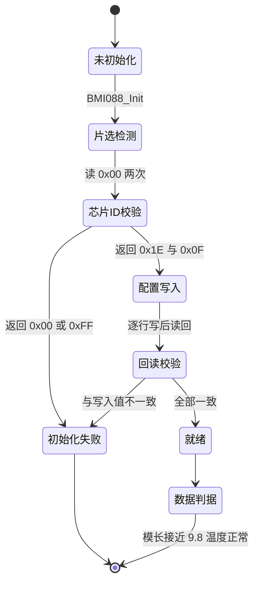
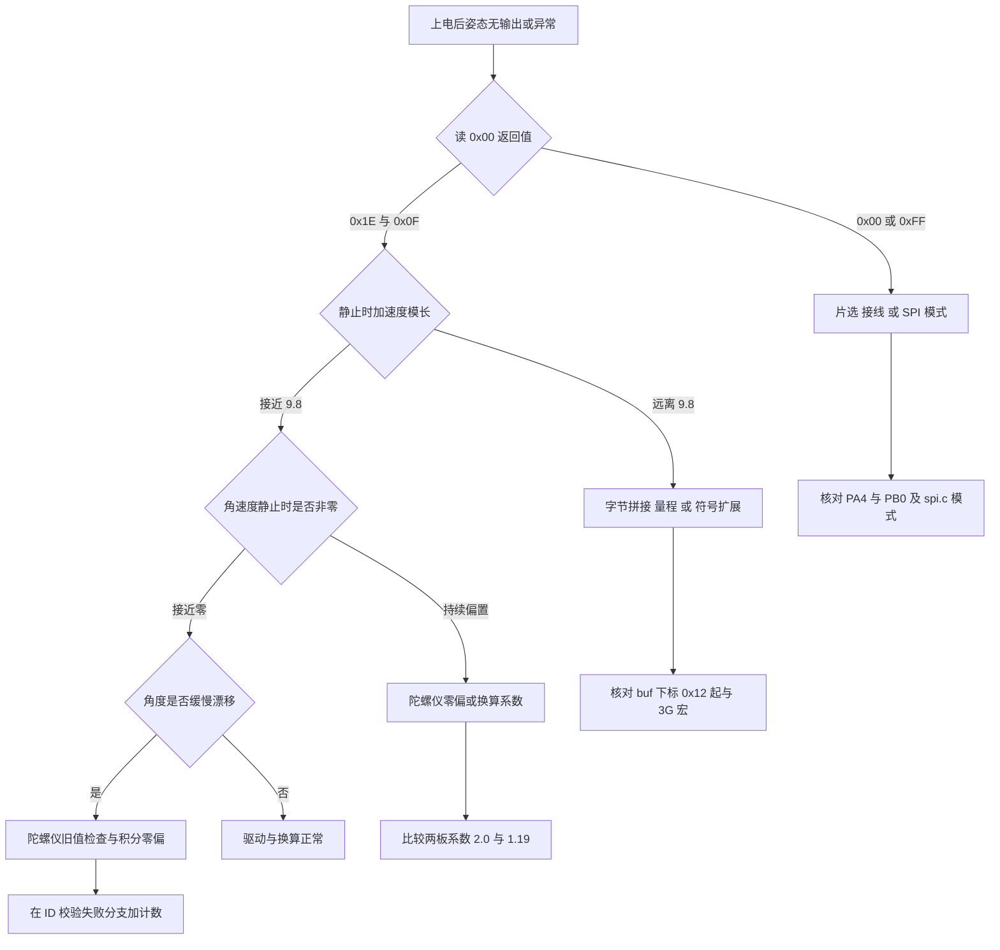

# 易错点与调试

> 前四页出现过的故障现象按信号链顺序整理成一张排查顺序表，每一步给出源码位置。
> 涉及的驱动版本以云台板为准，底盘板差异单列。

BMI088 驱动的问题分布在四段链路上：片选与接线、SPI 字节收发、码值到物理量的换算、以及应用层的集成。从现象反推故障段，比逐行通读代码快。可观测的判据只有三个：读 `0x00` 的返回值、静止时三轴加速度的模长（$\sqrt{a_x^2+a_y^2+a_z^2}$）、温度读数。

三条判据分别覆盖通信、换算与集成。芯片 ID 正确说明片选与 SPI 模式没问题；模长正确说明字节顺序与量程宏匹配；温度合理说明位宽与符号扩展处理正确。逐条核对可以快速缩小范围。

初始化失败是静默的，这一点最容易把排查带偏；九类易错点、各判据的参考值与从现象入手的排查流程依次列在下面。

> 源码索引

| 路径 | 作用 |
| --- | --- |
| `BMI088/Src/BMI088.cpp` | 初始化、返回值、读写位、多字节入口与 DMA 等待 |
| `BMI088/Inc/BMI088.h` | 子初始化返回类型与错误码枚举 |
| `BMI088/BMI088config.h` | 等待常量 |
| `Task/Src/ImuTask.cpp` | 初始化调用点与主循环忙等 |
| `Core/Src/spi.c` | SPI1 模式核对 |
| 底盘板同名文件 | 陀螺仪系数 1.19 |

## 三条判据覆盖三段信号链

| 判据 | 观测方式 | 正常值 |
| --- | --- | --- |
| 读 `0x00` 的返回值 | 单寄存器读，分别拉低两条片选 | 加速度计 `0x1E`，陀螺仪 `0x0F` |
| 静止时三轴加速度模长 | 由 `BMI088_Read` 的三轴值计算 | 约 9.8 m/s²，与安装方向无关 |
| 温度读数 | `imu_data.temperature` 或调试变量 | 室温下 20 到 40 摄氏度，随环境缓慢变化 |

判据的观测点都在驱动对外接口上，不需要改代码即可读取。模长这条判据对安装方向不敏感，因此更换板子姿态后仍然有效。

## 初始化失败为什么静默

`BMI088_Init()` 的返回值是 void（`BMI088/Src/BMI088.cpp`），内部的 `init()` 又把两个 bool 子初始化结果按位或。`accelInit()` 与 `gyroInit()` 声明为 `bool`（`BMI088/Inc/BMI088.h`），体内返回的 `BMI088_NO_SENSOR` 或逐寄存器错误码会被折叠成 `true`。调用点 `Task/Src/ImuTask.cpp` 不接收状态。整条初始化失败路径不产生任何输出，故障表现只是后续读到旧值或零值。

定位手段有三个：在 `accelInit()` 与 `gyroInit()` 内部下断点，把两个函数临时改成返回 `uint8_t`，或把 `init()` 的返回值通过调试变量上传。

```cpp
/* 简化：返回类型决定错误码能否上传 */
bool accelInit();                 /* 声明为 bool，体内 return BMI088_NO_SENSOR(0xFF) */
uint8_t BMI088::init() {
    return accelInit() | gyroInit();  /* 0xFF 变 true，再并成 1，只剩 0 或 1 */
}
```

## 两块板的换算差异

云台板陀螺仪换算乘 2.0（`BMI088/Src/BMI088.cpp`），底盘板乘 1.19（`底盘板 BMI088/Src/BMI088.cpp`）。两块板的初始化表、寄存器宏与字节拼装完全一致，差异只在这一处系数。把云台板的固件烧到另一块板的硬件上，角速度会出现约 1.68 倍的比例偏差。



## 逐项易错点

### 片选搞反

加速度计片选是 PA4，陀螺仪是 PB0（`BMI088/Src/BMI088.cpp`）。两根线互换后，`accelReadReg` 实际选中陀螺仪，读回的 `0x00` 是 `0x0F`，与期望的 `0x1E` 不符，`accelInit()` 返回 `BMI088_NO_SENSOR`；`gyroInit()` 对称地失败。由于返回值被丢弃，现象是无有效数据。

核对方法：在 `BMI088_Init()` 之后单独调用一次单寄存器读，分别拉低 PA4 与 PB0，比较 `0x00` 的返回值。若两次相同，说明其中一根片选没有起作用。

### 读写位 0x80

读命令必须把地址最高位置 1（`BMI088/Src/BMI088.cpp`），写命令保持最高位为 0。漏掉读操作的 `0x80` 时，器件按写命令解释该字节，MISO 不驱动数据，读回值恒定。反之若写操作误置 `0x80`，写入落到只读路径，回读校验必然失败。

```c
/* 读写命令字节只差最高位 */
uint8_t read_cmd  = reg | 0x80;   /* 读：最高位置 1 */
uint8_t write_cmd = reg & 0x7F;   /* 写：最高位保持 0 */
```

### 量程与灵敏度不匹配

配置表写 3G 与 2000 dps（`BMI088/Src/BMI088.cpp`），换算写死 `BMI088_ACCEL_3G_SEN` 与 `BMI088_GYRO_2000_SEN`。量程改动而换算不改时，读数比例全错：

| 配置量程 | 换算用的宏 | 现象 |
| --- | --- | --- |
| 3G | 3G | 正确 |
| 6G | 3G | 读数只有真实值一半 |
| 24G | 3G | 读数只有真实值八分之一 |

现象是静止模长不再是 9.8，而是按比例缩放后的值。判据仍然是模长。

### 温度符号扩展

温度是 11 位有效位，拼装式为 `(buf[0] << 3) | (buf[1] >> 5)`（`BMI088/Src/BMI088.cpp`）。漏掉符号扩展那两行 `if (raw_.temp > 1023) raw_.temp -= 2048;` 时，负码值会变成 1000 到 2047 之间的正数，换算后温度跳到 150 摄氏度以上。低温环境或冷启动最容易观察到。

另一个方向是按 16 位拼接温度。这会把 11 位结果放大 32 倍，读数同样异常。两种错误的区别在于数值量级：漏符号扩展偏移约 256 摄氏度，按 16 位处理偏移上千摄氏度。

```c
/* 简化：11 位温度的拼接与符号扩展 */
raw_.temp = (int16_t)((buf[0] << 3) | (buf[1] >> 5));
if (raw_.temp > 1023) raw_.temp -= 2048;   /* 1023 是 11 位的符号门限 */
```

### DMA 缓冲长度

DMA 发送缓冲是 32 字节的静态数组（`BMI088/Src/BMI088.cpp`），DMA 读函数对 `len > BMI088_DMA_MAX_LEN` 直接返回 `HAL_ERROR`。当前最长读取 8 字节，未触及上限。若把读取长度改到 33 字节，DMA 路径静默失效并回退到阻塞版，读取仍能成功，但 DMA 不再起作用。判断方法是统计 DMA 回退次数。

### 初始等待时间不足

软复位后等待 80 毫秒（`BMI088/Src/BMI088.cpp`），每次寄存器读写之间等待 150 微秒（`BMI088/BMI088config.h`）。缩短这两个值会让配置写入时有时无，回读校验随机失败，且因为错误码被折叠而不易发现。按数据手册的复位时间核对，属于待实测项。

### 加速度计多字节读的地址重复

`accelReadMulti` 在调用 DMA 版之前多发了一次地址（`BMI088/Src/BMI088.cpp`），DMA 版内部也发一次，阻塞回退时再发一次。陀螺仪路径没有第一处。加速度计的读操作按手册需要一个哑字节（一次不携带有效数据的占位传输）。多发的那一次地址是否正好充当哑字节，需要用逻辑分析仪同时抓 PA4、PB3、PA7、PB4 核对，标注为待实测。若读回数据整体偏移一个寄存器，现象是静止模长仍接近 9.8 但三轴互相串位。

### 陀螺仪读取保留旧值

陀螺仪分支只在 `buf[0] == 0x0F` 时更新 `raw_.gyro`（`BMI088/Src/BMI088.cpp`）。一次通信故障后，该轴角速度保留上一轮的值，姿态解算继续积分旧数据，表现为缓慢漂移而不报错。排查时应在 ID 校验失败的 else 分支加计数器。

### DMA 等待的忙等

DMA 完成等待是任务上下文的忙等，最长 10 毫秒（`BMI088/Src/BMI088.cpp`）。忙等指循环空转查看标志、期间不让出 CPU。`ImuTask` 循环末尾的 `DWT_Delay_ms(1)` 也是忙等（`Task/Src/ImuTask.cpp`）。两者叠加会占满任务优先级档，影响低优先级任务的调度稳定性。

## 排查流程与参考值

从现象出发，按下面的顺序核对。每一步都给出可观测判据与源码位置。



判据的正常范围已在前一节列出，这里只留位置与复核命令：

| 位置 | 复核命令 |
| --- | --- |
| `BMI088/Src/BMI088.cpp` | 分别拉低 PA4 与 PB0 读 `0x00`，比较两次返回值 |
| `BMI088/Src/BMI088.cpp` | 静止读三轴加速度算模长，核对是否落在 9.7 到 9.9 m/s² |
| `BMI088/Src/BMI088.cpp` | 读温度两个寄存器，核对 11 位符号扩展 |
| `BMI088/Src/BMI088.cpp` | 断开一次陀螺仪读，观察角速度是否保留上一轮值 |
| `BMI088/Src/BMI088.cpp` | 抓读命令字节，核对最高位是否为 1 |

## 九类问题的位置与复核命令

症状与机理在《逐项易错点》已经逐条展开，这里只留位置与复核命令。

| 位置 | 复核命令 |
| --- | --- |
| `BMI088/Src/BMI088.cpp` | 交换 PA4 与 PB0 后读 `0x00`，看两次返回值是否相同 |
| `BMI088/Src/BMI088.cpp` | 抓一次读命令与写命令字节，确认最高位分别为 1 与 0 |
| `BMI088/Src/BMI088.cpp` | 改量程宏后复测静止模长，看是否等比缩放 |
| `BMI088/Src/BMI088.cpp` | 用 `0xE0`、`0x00` 两组字节代入，核对温度是否为负 |
| `BMI088/Src/BMI088.cpp` | 把读取长度改成 33 字节，统计 DMA 回退次数 |
| `BMI088/Src/BMI088.cpp`、`BMI088/BMI088config.h` | 缩短等待后连续初始化多次，记录回读校验失败率 |
| `BMI088/Src/BMI088.cpp` | 逻辑分析仪同时抓 PA4、PB3、PA7、PB4，数地址字节 |
| `BMI088/Src/BMI088.cpp` | 在 ID 校验失败的 else 分支加计数器 |
| `BMI088/Src/BMI088.cpp`、`BMI088/Inc/BMI088.h` | 把 `init()` 返回值上传到调试变量 |

## 小结

### 核心概念

- 三个判据分别是芯片 ID、静止加速度模长与温度，覆盖通信、换算与集成三段。
- 初始化失败在当前代码里静默：子初始化返回 bool，枚举错误码被折叠成 0 或 1，且 `BMI088_Init()` 不返回状态。
- 加速度计与陀螺仪的多字节读在地址发送次数上不同，加速度计多一次，是否充当哑字节待实测。
- 两块板陀螺仪换算系数不同，云台板 2.0，底盘板 1.19。
- DMA 路径失败会静默回退到阻塞版，功能不受影响，问题藏在性能与路径统计里。

### 设计权衡

| 决策 | 收益 | 代价 |
| --- | --- | --- |
| 错误码用枚举逐寄存器定义 | 可精确定位哪一行配置失败 | 返回类型是 bool，实际全部折叠 |
| 芯片 ID 与数据合并读取 | 省一次往返 | ID 失败时保留旧值，故障更隐蔽 |
| DMA 失败自动回退 | 单次通信故障不影响读取 | 问题不报错，只能靠计数发现 |
| 换算宏写死在 `convertData()` | 上层调用简单 | 改量程需要同步改两处 |
| 等待标志忙等 | 接口同步，调用者不需要状态机 | 最长占满一个任务周期 |

## 练习

### 基础题

1. 列出三条可观测判据及各自的正常值。
2. 说明片选 PA4 与 PB0 互换后，`accelInit()` 的芯片 ID 校验会发生什么。
3. 说明漏掉温度符号扩展时读数的大致偏差方向与量级。
4. 说明 DMA 缓冲超过 32 字节时驱动的行为。

### 挑战题

5. 设计一个在不改动返回类型的前提下把初始化错误码上传到在线变量的方案，列出需要的调试变量与写入位置。
6. 用一位逻辑分析仪同时抓 PB3、PA7、PB4、PA4，给出判断加速度计多字节读是否存在数据错位的完整步骤与预期波形。
7. 假设静止时加速度模长正确、角速度为零，但绕 Z 轴转动时角度大约只有真实值的一半。给出至少两条可能原因，并设计实验区分它们。

## 附：本页引用的固件路径

| 路径 | 用途 |
| --- | --- |
| `BMI088/Src/BMI088.cpp` | 初始化与返回值、芯片 ID 校验、读写位、多字节入口与地址重复、DMA 等待、片选构造 |
| `BMI088/Inc/BMI088.h` | 子初始化返回类型、错误码枚举 |
| `BMI088/BMI088config.h` | 等待常量 |
| `Task/Src/ImuTask.cpp` | 初始化调用点、主循环忙等 |
| `Core/Src/spi.c` | SPI1 模式核对 |
| `底盘板 BMI088/Src/BMI088.cpp` | 底盘板陀螺仪系数 1.19 |
