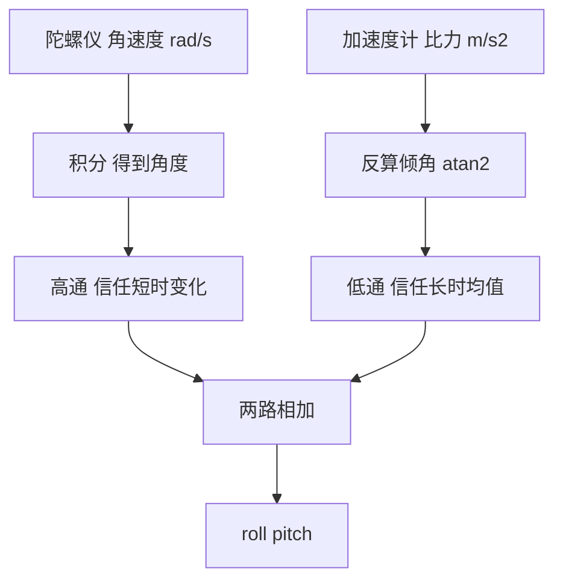
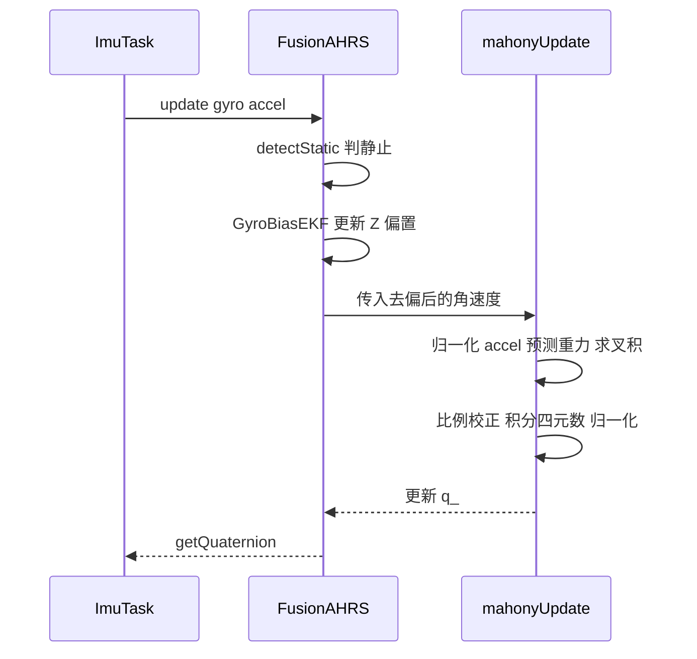

# 互补滤波与Mahony原理

云台在动起来之前，控制器必须先知道当前姿态。陀螺仪和加速度计是本工程唯一的姿态传感器，两者都无法单独给出可靠结果：陀螺短时精确但会漂，加速度计长期稳定但噪声大。姿态解算要做的，就是把这两路信息按各自的可靠频段拼起来。

本工程的答案有两份实现。云台板走 `Algorithm/Src/FusionAHRS.cpp` 的 `mahonyUpdate`，底盘板直接调用 `Algorithm/Src/MahonyAHRS.c` 的六轴入口，两份代码结构一致，差别集中在积分通道与归一化实现。

## 1. 两个传感器的误差方向相反

陀螺仪输出角速度，短时间积分得到的角度变化准确，长时间积分因零偏累积而漂移。加速度计在静止或低动态下能通过重力方向反算倾角，没有累积误差，测量噪声和线加速度会直接进入结果。两者的误差在时间尺度上互补，短时以陀螺为主，长时以加速度计为主，这是姿态估计的出发点。

姿态角没有直接的测量量，只能从这两类观测里构造估计。互补滤波把两路信息按频率分工相加，Mahony 把同样的分工写成四元数形式的反馈控制。

## 2. 一阶互补滤波器的频域分工

设真实倾角为 $\theta$，陀螺仪观测为

$$\omega_g(t) = \dot\theta(t) + b + n_g(t)$$

其中 $b$ 是零偏，$n_g$ 是噪声。积分得到

$$\theta_g(t) = \int_0^t \omega_g(\tau)\,d\tau = \theta(t) + b t + \int_0^t n_g(\tau)\,d\tau$$

零偏项 $bt$ 随时间线性增长，这是漂移的来源。

加速度计在静止时测得比力方向，倾角为

$$\theta_a = \operatorname{atan2}(a_y, a_z)$$

$\theta_a$ 不含累积误差，但叠加了振动噪声和机动产生的线加速度。两类误差的频谱不重叠：陀螺漂移集中在低频，加速度噪声集中在高频。

一阶互补滤波器对陀螺积分结果做高通，对加速度倾角做低通：

$$\hat\Theta(s) = \frac{s}{s+\omega_c}\Theta_g(s) + \frac{\omega_c}{s+\omega_c}\Theta_a(s)$$

$\omega_c$ 是交叉频率，决定两条通路的信任边界。低于 $\omega_c$ 的分量以加速度计为主，高于 $\omega_c$ 的分量以陀螺仪为主。

离散形式为

$$\hat\theta_k = \alpha\left(\hat\theta_{k-1} + \omega_k \Delta t\right) + (1-\alpha)\,\theta_{a,k}, \qquad \alpha = \frac{\tau}{\tau+\Delta t} = \frac{1}{1+\omega_c \Delta t}$$

$\tau = 1/\omega_c$。$\alpha$ 越接近 1，越信陀螺，响应快但漂移抑制弱；$\alpha$ 越小，越信加速度计，漂移被压住但动态噪声进入姿态。工程上常用 $\alpha = 0.98$ 一类的固定系数，此时交叉频率约 $1/(0.02\Delta t)$。

## 3. Mahony 的重力叉积 PI 校正

互补滤波需要在欧拉角上做加减，接近万向锁时三角函数会退化。Mahony 把互补关系搬进四元数：用当前四元数预测重力方向，用加速度计给出观测重力方向，两者的叉积作为姿态误差，再把误差当作角速度的反馈项。

单位四元数记作 $q = [q_0, q_1, q_2, q_3]^T$，标量部分是 $q_0$。本工程里 $q_0$ 对应 $w$ 分量，欧拉角公式以 $q_0$ 为实部（`Task/Src/ImuTask.cpp:62-64`）。

由四元数预测的重力方向（本体系）为

$$v(q) = \begin{bmatrix} 2(q_1 q_3 - q_0 q_2) \\ 2(q_0 q_1 + q_2 q_3) \\ 2(q_0^2 - 0.5 + q_3^2) \end{bmatrix}$$

代码里存的是它的一半，也就是 `halfvx/halfvy/halfvz`：

$$v/2 = \begin{bmatrix} q_1 q_3 - q_0 q_2 \\ q_0 q_1 + q_2 q_3 \\ q_0^2 - 0.5 + q_3^2 \end{bmatrix}$$

加速度计归一化后记作 $a$。误差取叉积

$$e = a \times v = \begin{bmatrix} a_y v_z - a_z v_y \\ a_z v_x - a_x v_z \\ a_x v_y - a_y v_x \end{bmatrix}$$

比例与积分校正后的角速度为

$$\omega_{corr} = \omega_{meas} + K_p e + K_i \int_0^t e\,d\tau$$

$K_p$ 对应互补滤波的交叉频率，$K_i$ 用于估计并抵消陀螺零偏。四元数按

$$\dot q = \frac12\, q \otimes \begin{bmatrix} 0 \\ \omega_{corr} \end{bmatrix}$$

更新，$\otimes$ 是四元数乘法。展开与离散化在《四元数微分方程与梯度下降》里给出。

静止时 $a$ 与 $v$ 平行，$e = 0$，反馈项为零，姿态只由陀螺积分维持。姿态有偏差时叉积不为零，反馈把 $v$ 拉向 $a$。纯航向旋转对重力方向没有影响，$v$ 不变，$e$ 为零，六轴条件下 yaw 得不到校正。

## 4. 两板各自的调用路径

云台板生效路径是 `FusionAHRS`，`MahonyAHRS.c` 有完整实现但云台板仓库内没有调用点；底盘板没有 `FusionAHRS`，直接在 `Task/Src/ImuTask.cpp:40`、`:59` 调用 `MahonyAHRSupdateIMU`。两板差异在《两板调用差异与增益》里列表说明。

实例与调用：

| 位置 | 内容 |
| --- | --- |
| `Task/Src/ImuTask.cpp:19` | `static FusionAHRS ahrs(1000.0f);` 采样频率按 1 kHz 传入 |
| `Task/Src/ImuTask.cpp:43` | 每轮读一次 BMI088 |
| `Task/Src/ImuTask.cpp:49-56` | 用 `gyro[0..2]` 与 `accel[0..2]` 调 `ahrs.update` |
| `Task/Src/ImuTask.cpp:59` | `q = ahrs.getQuaternion()` |
| `Task/Src/ImuTask.cpp:62-64` | 四元数转 roll / pitch / yaw |

`FusionAHRS::update`（`Algorithm/Src/FusionAHRS.cpp:73-86`）的顺序是静态检测、Z 轴偏置 EKF、去偏、调 `mahonyUpdate`。偏置 EKF 只在静止时更新（`:30-41`、`:79`），去偏只作用于 Z 轴。

`FusionAHRS::mahonyUpdate`（`Algorithm/Src/FusionAHRS.cpp:88-136`）的结构与上文一致：

- `:96-101` 加速度计零向量检查与归一化；
- `:103-105` 计算 `halfvx/halfvy/halfvz`；
- `:107-109` 计算 `halfex/halfey/halfez`；
- `:111-113` 比例校正，比例增益是成员 `twoKp_`；
- `:116-127` 缩放并积分四元数；
- `:129-135` 归一化。

本工程没有积分通道：`twoKi_` 构造为 `0.0f`（`Algorithm/Src/FusionAHRS.cpp:52`），`mahonyUpdate` 里也没有积分分支，成员 `integralFBx_/integralFBy_/integralFBz_` 只在构造函数里清零（`:53-55`）。

参考实现 `Algorithm/Src/MahonyAHRS.c` 里，比例与积分增益写作 `twoKp = 2.0f * 0.5f`、`twoKi = 2.0f * 0.0f`（`:25-26`、`:33-34`），比例校正 `:128-130`，积分与限幅 `:113-125`。这套代码在云台板没有进入执行路径，在底盘板则是生效入口。

## 5. 易错点

| # | 易错点 | 表现 |
| --- | --- | --- |
| 1 | 在云台板把 `MahonyAHRS.c` 当成运行代码 | 云台板改它不改变姿态输出；底盘板改它会变 |
| 2 | 混淆 $K_p$ 与 `twoKp` | 代码里的 `twoKp` 是 $2K_p$，叉积里半个重力方向抵消了这个因子 |
| 3 | 交叉频率与增益关系理解错 | $K_p$ 增大等价于交叉频率提高，加速度计权重上升 |
| 4 | 忽略加速度计的线加速度 | 机动时 $a$ 偏离重力方向，反馈把错误方向拉进姿态 |
| 5 | 认为六轴能定航向 | 重力方向对 yaw 不提供信息，yaw 只能靠陀螺积分 |

## 6. 小结

### 核心概念

- 陀螺短时准、长时漂；加速度计长时准、短时噪声大，误差谱互补。
- 一阶互补滤波器用 $\alpha$ 或交叉频率 $\omega_c$ 划分信任区间。
- Mahony 用重力预测与观测的叉积构造误差，比例项代替互补，积分项估计零偏。
- 本工程只有比例项，`twoKi_` 为 0，积分成员未参与运算。
- 云台板参考实现 `MahonyAHRS.c` 未接入调用链；底盘板直接调用它。

### 设计权衡

| 权衡点 | 本工程选择 | 收益与代价 |
| --- | --- | --- |
| 算法形式 | 四元数叉积反馈 | 无万向锁；代价是每步需要归一化 |
| 积分项 | 关闭 | 无积分饱和风险；代价是 Z 轴零偏只能靠 EKF，且仅在静止更新 |
| 重力观测 | 单加速度计 | 实现简单；代价是线加速度污染反馈 |
| 比例增益 | `twoKp_ = 1.0f` | 调试保守；代价是收敛慢，标称值待实测 |

## 7. 练习

### 基础题

1. 写出陀螺积分角与加速度倾角的误差来源，说明各自在哪个频段占优。
2. 已知 $\omega_c = 1\ \text{rad/s}$、$\Delta t = 1\ \text{ms}$，求 $\alpha$。
3. 用 $q = [1,0,0,0]$、$a = (0,0,1)$ 计算 `halfv`、`halfex/halfey/halfez`。

### 挑战题

4. 从互补滤波的传递函数出发，说明 $K_p$ 与 $\omega_c$ 的量纲关系，给出一种从 $K_p$ 估算交叉频率的方法。
5. 把积分项打开（`twoKi_ = 0.1f`），推导静止时零偏估计的收敛时间常数，说明它与 $K_i$、$K_p$ 的关系。
6. 在 `FusionAHRS::mahonyUpdate` 中加入磁力计观测，写出航向误差的构造方式与所需的坐标变换。

### 附：本页引用的固件路径

| 路径 | 用途 |
| --- | --- |
| `2026OmniSentryGimbal/Task/Src/ImuTask.cpp` | 实例、调用与欧拉角输出（`:19`、`:41-64`） |
| `2026OmniSentryGimbal/Algorithm/Src/FusionAHRS.cpp` | 生效的 Mahony 变体（`:73-136`） |
| `2026OmniSentryGimbal/Algorithm/Inc/FusionAHRS.h` | 类成员与接口（`:26-57`） |
| `2026OmniSentryGimbal/Algorithm/Src/MahonyAHRS.c` | 云台板无调用点，底盘板在 Task/Src/ImuTask.cpp:40/59 调用（`:24-150`） |
| `2026OmniSentryGimbal/Algorithm/Inc/MahonyAHRS.h` | 参考实现的接口声明（`:19-31`） |
