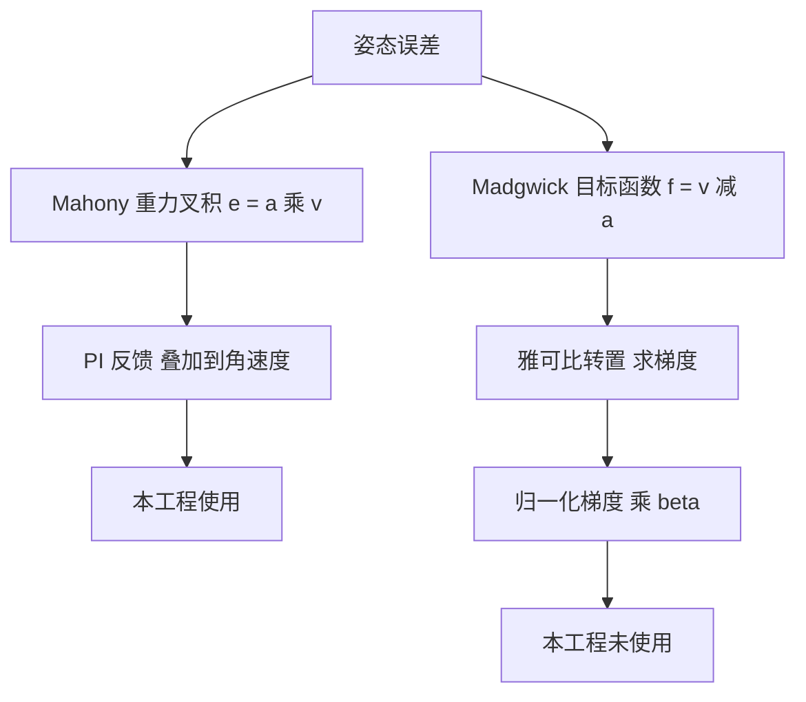
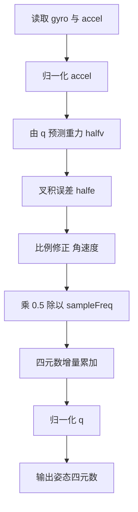

# 四元数微分方程与梯度下降

四元数用四个数记录本体系相对参考系的旋转，避开了欧拉角在俯仰接近 90 度时的退化。姿态解算的每一步都是「读角速度、更新四元数、归一化」这三件事，更新用的方程来自刚体运动学。

运动学方程 `q̇ = ½ q ⊗ [0, ω]` 展开后是四个分量式；一阶欧拉离散化在 1 kHz 下的误差量级，决定了为什么每步都必须归一化。Madgwick 用梯度下降把预测重力推向观测重力，本工程没有实现它，但公式与 Mahony 的关系需要写清。

## 1. 四元数作为姿态变量

姿态描述的是本体系相对参考系的旋转。四元数用四个数表示这个旋转，单位四元数满足

$$q = \begin{bmatrix} q_0 \\ q_1 \\ q_2 \\ q_3 \end{bmatrix} = \begin{bmatrix} \cos(\theta/2) \\ u_x \sin(\theta/2) \\ u_y \sin(\theta/2) \\ u_z \sin(\theta/2) \end{bmatrix}, \qquad \|q\| = 1$$

$\theta$ 是旋转角，$u = [u_x, u_y, u_z]^T$ 是旋转轴单位向量。向量 $v$ 的旋转写作

$$v' = q \otimes \begin{bmatrix}0\\ v\end{bmatrix} \otimes q^*$$

单位四元数的逆等于共轭 $q^* = [q_0, -q_1, -q_2, -q_3]^T$，这是四元数表示旋转方便的一点。欧拉角从 $q$ 反解，本工程用 `Task/Src/ImuTask.cpp:62-64` 的三条公式。

## 2. 四元数运动学微分方程

设本体系角速度为 $\omega = [\omega_x, \omega_y, \omega_z]^T$，四元数的导数为

$$\dot q = \frac12\, q \otimes \begin{bmatrix} 0 \\ \omega_x \\ \omega_y \\ \omega_z \end{bmatrix}$$

乘法 $\otimes$ 的定义为

$$q \otimes p = \begin{bmatrix} q_0 p_0 - q_1 p_1 - q_2 p_2 - q_3 p_3 \\ q_0 p_1 + q_1 p_0 + q_2 p_3 - q_3 p_2 \\ q_0 p_2 - q_1 p_3 + q_2 p_0 + q_3 p_1 \\ q_0 p_3 + q_1 p_2 - q_2 p_1 + q_3 p_0 \end{bmatrix}$$

代入 $p = [0, \omega_x, \omega_y, \omega_z]^T$ 并乘以 $1/2$，得到分量形式

$$\dot q_0 = \frac12(-q_1\omega_x - q_2\omega_y - q_3\omega_z)$$
$$\dot q_1 = \frac12(q_0\omega_x + q_2\omega_z - q_3\omega_y)$$
$$\dot q_2 = \frac12(q_0\omega_y - q_1\omega_z + q_3\omega_x)$$
$$\dot q_3 = \frac12(q_0\omega_z + q_1\omega_y - q_2\omega_x)$$

写成矩阵形式：

$$\dot q = \frac12\,\Omega(\omega)\,q, \qquad \Omega(\omega) = \begin{bmatrix} 0 & -\omega_x & -\omega_y & -\omega_z \\ \omega_x & 0 & \omega_z & -\omega_y \\ \omega_y & -\omega_z & 0 & \omega_x \\ \omega_z & \omega_y & -\omega_x & 0 \end{bmatrix}$$

$\Omega(\omega)$ 是反对称矩阵。乘法顺序决定角速度在哪个坐标系表达：本工程的 $q \otimes \omega$ 对应本体系角速度，换成 $\omega \otimes q$ 会得到反向的姿态变化。

## 3. 从连续方程到每步更新

一阶离散化取前向欧拉：

$$q_{k+1} = q_k + \Delta t\,\dot q_k = q_k + \frac{\Delta t}{2}\, q_k \otimes \begin{bmatrix} 0 \\ \omega_k \end{bmatrix}$$

代码把 $\Delta t/2$ 预先乘进三个角速度分量，再做分量累加。`Algorithm/Src/FusionAHRS.cpp:116-127` 就是这个形式，`MahonyAHRS.c:134-143` 与 `:204-214` 同样如此。

欧拉离散化在 $\|\omega\|\Delta t$ 较大时误差上升，还可能与真实旋转方向相反。1 kHz 采样下单步转角通常远小于 $1^\circ$，一阶近似足够。若采样率降到 100 Hz 以下，应改用二阶或旋转矩阵指数形式。

连续积分会破坏单位模长约束：$\|q + \Delta t\dot q\| \ne 1$，误差随步数累积。数值积分后必须归一化：

$$q \leftarrow \frac{q}{\|q\|} = \frac{q}{\sqrt{q_0^2 + q_1^2 + q_2^2 + q_3^2}}$$

`FusionAHRS.cpp:129-135` 用 `1.0f / std::sqrt(...)`，`MahonyAHRS.c:146-150` 用 `invSqrt`（快速平方根倒数，`:228-236`）。归一化每步都做，缺一步只影响一步，长期缺失会让模长偏离 1，欧拉角随之产生比例误差。

## 4. 梯度下降法（本工程未使用）

Mahony 用叉积误差加 PI 反馈修正角速度。Madgwick 用另一条路线：把重力观测写成最优化问题，用梯度下降逐步把预测重力推向观测重力。

设归一化加速度为 $a$，由 $q$ 预测的重力方向（完整量，是 `halfv` 的两倍）为

$$v(q) = \begin{bmatrix} 2(q_1 q_3 - q_0 q_2) \\ 2(q_0 q_1 + q_2 q_3) \\ 2(q_0^2 - 0.5 + q_3^2) \end{bmatrix}$$

目标函数取预测与观测之差

$$f_g(q) = v(q) - a$$

对 $q$ 求雅可比

$$J_g(q) = \begin{bmatrix} -2q_2 & 2q_3 & -2q_0 & 2q_1 \\ 2q_1 & 2q_0 & 2q_3 & 2q_2 \\ 4q_0 & 0 & 0 & 4q_3 \end{bmatrix}$$

梯度为 $\nabla f_g = J_g^T f_g$。沿梯度反方向走一步，步长 $\mu$：

$$q_{k+1} = q_k - \mu\,\frac{\nabla f_g}{\|\nabla f_g\|}$$

把梯度修正与陀螺积分合并，得到 Madgwick 的 6 轴更新式

$$\dot q = \frac12\, q \otimes \begin{bmatrix} 0 \\ \omega \end{bmatrix} - \beta\,\frac{\nabla f_g}{\|\nabla f_g\|}$$

$\beta$ 是滤波增益，量纲与角速度一致。叉积误差 $e = a \times v$ 与 $J_g^T f_g$ 在小角度下方向一致，这是两类方法效果接近的原因，推导略。

本工程没有实现梯度下降：源码里没有 `beta` 或 `Madgwick` 相关符号，`FusionAHRS` 与 `MahonyAHRS.c` 都是叉积反馈加比例（或 PI）校正。以上公式按 Madgwick 2010 年公开实现整理，属按文献内容，未在本工程验证。

## 5. 本工程的单步流程与采样频率

`FusionAHRS::mahonyUpdate` 的单步流程（`Algorithm/Src/FusionAHRS.cpp:88-136`）：

| 行号 | 操作 | 公式对应 |
| --- | --- | --- |
| `:96-101` | 检查并归一化加速度 | $a \leftarrow a/\|a\|$ |
| `:103-105` | 预测重力的一半 `halfv` | $v/2$ |
| `:107-109` | 叉积误差 `halfe` | $e/2$ |
| `:111-113` | 比例校正 `g += twoKp_ * halfe` | $\omega + K_p e$ |
| `:116-118` | 乘 `0.5f / sampleFreq_` | $\Delta t/2$ |
| `:120-127` | 分量累加 | $q + \Delta t\,\dot q$ |
| `:129-135` | 归一化 | $q/\|q\|$ |

采样频率由构造函数传入，`Task/Src/ImuTask.cpp:19` 传 `1000.0f`。参考实现把频率写成宏 `sampleFreq 1000.0f`（`MahonyAHRS.c:24`），两处数值相同，配置方式不同。

快速平方根倒数 `invSqrt`（`MahonyAHRS.c:228-236`）用整数位运算加一次牛顿迭代，精度约 0.1% 量级，属按文献说明。云台板生效路径没有用它，用的是标准 `std::sqrt`；底盘板直接调用 `MahonyAHRS.c`，`invSqrt` 参与运算。

## 6. 易错点

| # | 易错点 | 表现 |
| --- | --- | --- |
| 1 | 漏掉每步归一化 | 模长缓慢偏离 1，欧拉角出现比例误差 |
| 2 | 把非单位四元数的共轭当逆 | 旋转公式在小数误差下失真 |
| 3 | 乘法顺序写反 | 姿态变化方向相反 |
| 4 | 用大步长一阶欧拉 | 单步转角大时误差上升甚至反向 |
| 5 | 采样周期与 `sampleFreq` 不一致 | 角速度缩放错误，姿态变化快慢不符 |
| 6 | 把叉积 PI 说成梯度下降 | 两种方法的误差和增益含义不同 |

## 7. 小结

### 核心概念

- 单位四元数表示旋转，逆等于共轭。
- 运动学方程 $\dot q = \frac12 q \otimes [0, \omega]^T$ 描述本体系角速度下的姿态变化。
- 一阶欧拉离散化在 1 kHz 下可用，积分后必须归一化。
- Mahony 用叉积误差加 PI 反馈，Madgwick 用目标函数梯度下降。
- 本工程只使用叉积反馈，梯度下降部分未实现。

### 设计权衡

| 权衡点 | 本工程选择 | 收益与代价 |
| --- | --- | --- |
| 离散化阶数 | 一阶欧拉 | 计算量小；代价是低采样率下误差上升 |
| 归一化位置 | 每步末尾 | 模长稳定；代价是每步一次平方根 |
| 平方根实现 | 标准 `std::sqrt` | 精度可控；代价是无快速近似的速度收益 |
| 误差来源 | 叉积（仅陀螺与加速度计） | 实现直接；代价是无梯度下降的收敛性描述 |

## 8. 练习

### 基础题

1. 写出单位四元数的模长约束与共轭表达式。
2. 用 $q_0 = 1$、$\omega = [\omega_x,0,0]^T$ 代入微分方程，求一步积分后的 $q_1$。
3. 说明归一化前后四元数对应的旋转是否改变。

### 挑战题

4. 推导 $\Omega(\omega)$ 的反对称性，说明它与旋转矩阵的关系。
5. 用二阶龙格库塔代替前向欧拉，写出更新式并比较单步误差阶数。
6. 实现 Madgwick 的 6 轴梯度下降更新，与 `FusionAHRS::mahonyUpdate` 在同一段数据上对比收敛速度。

### 附：本页引用的固件路径

| 路径 | 用途 |
| --- | --- |
| `2026OmniSentryGimbal/Algorithm/Src/FusionAHRS.cpp` | 离散积分与归一化（`:96-136`） |
| `2026OmniSentryGimbal/Algorithm/Src/MahonyAHRS.c` | 参考实现的积分与 `invSqrt`（`:134-150`、`:228-236`） |
| `2026OmniSentryGimbal/Task/Src/ImuTask.cpp` | 采样频率与欧拉角反解（`:19`、`:62-64`） |
| `2026OmniSentryGimbal/Algorithm/Inc/FusionAHRS.h` | 私有成员与接口（`:36-56`） |
