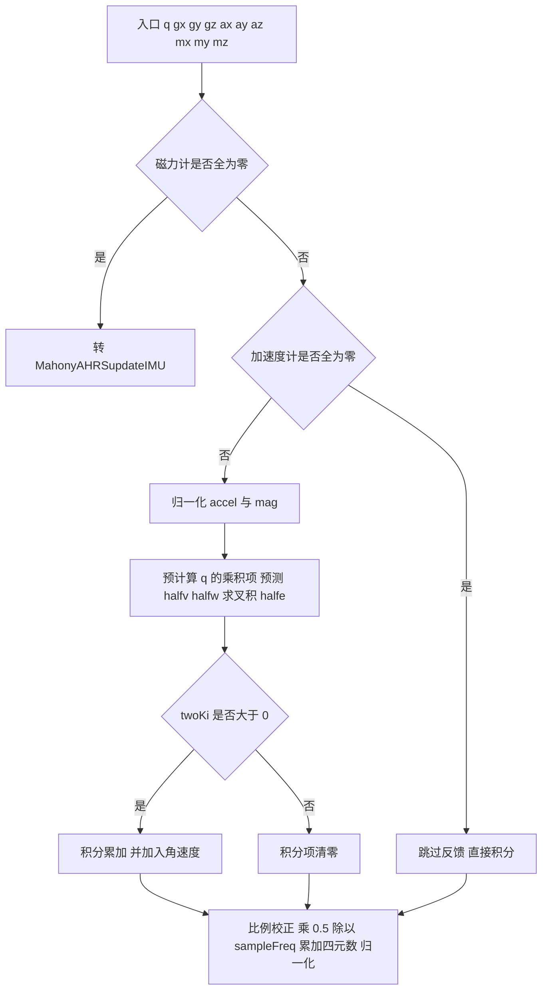
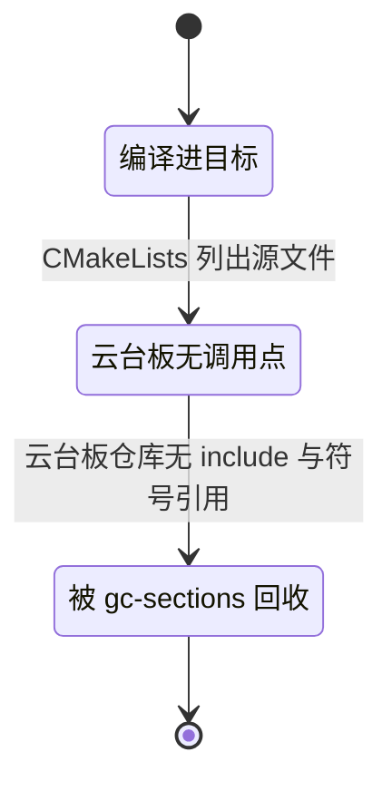

# MahonyAHRS逐行

`Algorithm/Src/MahonyAHRS.c` 有 239 行完整实现，在云台板上看不到任何效果；底盘板没有 `FusionAHRS`，反而是这份文件在实际算姿态。同一个文件名在两条固件里地位完全不同，这是本单元最容易踩空的一点。

`MahonyAHRS.c` 的宏与全局变量带着若干残留取值，九轴入口与六轴入口的每条分支都要走到，快速平方根倒数的位运算实现也要核对。走完这些，云台板生效路径 `FusionAHRS::mahonyUpdate` 与它的差别只剩三处。

## 1. 文件定位与两板归属

`Algorithm/Src/MahonyAHRS.c` 共 239 行，配套头文件 `Algorithm/Inc/MahonyAHRS.h` 共 39 行。文件顶部注释把它标为 Madgwick 对 Mahony 算法的实现，来源是 x-io 的公开 AHRS 代码。云台板把它列入 `CMakeLists.txt` 的源文件清单却没有调用点，改它不影响云台板输出；底盘板没有 `FusionAHRS`，`Task/Src/ImuTask.cpp` 包含该头文件并调用 `MahonyAHRSupdateIMU`，此处才是生效路径。

逐行解读的价值在于：算法主体与云台板生效路径 `FusionAHRS.cpp` 结构一致；同时它的积分、磁力计、`invSqrt` 三块在云台板生效路径里被裁掉，对照能看清云台板做了哪些简化。

## 2. 整体结构与数据流

`MahonyAHRSupdate`是九轴入口，接收磁力计 `mx/my/mz`。磁力计三个分量同时为零时直接转调 `MahonyAHRSupdateIMU`。`MahonyAHRSupdateIMU`是六轴版本，只使用加速度计。两个函数结构相同：归一化观测、预测场方向、叉积误差、比例与可选积分校正、积分四元数、归一化。



## 3. 逐行：宏与全局变量

| 名称 | 取值 | 状态与用途 |
| --- | --- | --- |
| `sampleFreq` | `1000.0f` | 采样频率宏，积分与积分项使用，也是底盘板的步长来源 |
| `twoKpDef` | `2.0f * 0.5f` 即 1.0 | 比例增益初值，`twoKp` 取它 |
| `twoKiDef` | `2.0f * 0.0f` 即 0.0 | 积分增益初值，`twoKi` 取它 |
| `GYRO_STATIC_THRESH` | `0.015f` | 定义后无引用，死常量 |
| `twoKp` | 1.0 | 比例校正系数 使用 |
| `twoKi` | 0.0 | 积分使能与系数 判断 |
| `q0..q3` 定义 | 被注释 | 头文件 `MahonyAHRS.h` 声明为 `extern`，工程内没有定义 |
| `integralFBx/y/z` | 0.0 | 积分误差累加器 |
| `gyroZ_bias`、`imu_static` | 0.0、0 | 定义后无引用，死变量 |

头文件声明 `extern volatile float q0, q1, q2, q3;`（`MahonyAHRS.h`），对应的定义在源文件里被注释掉。算法函数改用参数 `q[4]` 传递四元数，`q0..q3` 没有被任何表达式引用，所以链接期不会报未定义符号。若后续代码直接使用这四个全局量，会出现链接错误。

## 4. 逐行：九轴入口

函数签名 `void MahonyAHRSupdate(float q[4], float gx, float gy, float gz, float ax, float ay, float az, float mx, float my, float mz)`。角速度与加速度用参数传入，与旧版 Madgwick 用全局量的写法不同。

| 代码要点 | 说明 |
| --- | --- |
| 局部变量 | `recipNorm`、乘积项、`halfv/halfw/halfe`、`qa/qb/qc` |
| `mx==0 && my==0 && mz==0` 判断 | 磁力计无有效值时转六轴版本，避免归一化除零得 NaN（NaN 是浮点的非法数，一旦进入积分会污染后续所有姿态值） |
| 加速度计非零检查与归一化 | 零向量会跳过整个反馈块，`recipNorm = invSqrt(ax*ax+ay*ay+az*az)` |
| 归一化磁力计 | 同一套 `invSqrt` |
| 预计算 $q_i q_j$ 与地磁参考方向 | `hx`、`hy` 求模得到 `bx`，`bz` 取投影，这一步用的是标准 `sqrt` |
| 预测重力与磁场方向的一半 | `halfvx = q1*q3 - q0*q2` 等；`halfw` 用 `bx`、`bz` 与 $q$ 组合 |
| 叉积误差 | 重力误差加磁场误差，各含一半因子 |
| 积分通道与清零 | `twoKi > 0` 时累加并加入角速度，否则清零，注释写的是防止积分饱和 |
| 比例通道与四元数累加 | `gx += twoKp * halfex`，`gx *= 0.5f / sampleFreq`，用 `qa/qb/qc` 保存旧值避免同步污染 |
| 归一化 | `invSqrt(q0^2+q1^2+q2^2+q3^2)` |

比例通道里 `twoKp = 2K_p`，误差项 `halfe = e/2`，两者乘积等于 $K_p e$。积分通道同理，`twoKi = 2K_i` 与 `halfe` 相乘得到 $K_i e$。

对应源码的主体结构：

```c
/* 摘录：Algorithm/Src/MahonyAHRS.c 九轴入口主体（省略局部变量声明） */
if (mx == 0.0f && my == 0.0f && mz == 0.0f) {          /* 无磁力计 → 六轴版 */
    MahonyAHRSupdateIMU(q, gx, gy, gz, ax, ay, az);
    return;
}
if (!(ax == 0.0f && ay == 0.0f && az == 0.0f)) {       /* 加速度计有效才做校正 */
    recipNorm = invSqrt(ax*ax + ay*ay + az*az);
    ax *= recipNorm; ay *= recipNorm; az *= recipNorm;  /* 归一化观测 */
    /* ... 预计算 q 乘积项，求 halfv/halfw 与叉积 halfe ... */
    if (twoKi > 0.0f) {                                 /* 积分通道，默认关闭 */
        integralFBx += twoKi * halfex * (1.0f / sampleFreq);
        gx += integralFBx;
    } else { integralFBx = integralFBy = integralFBz = 0.0f; }
    gx += twoKp * halfex;                               /* 比例通道 */
}
gx *= (0.5f / sampleFreq);                              /* 预乘 Δt/2 */
q[0] += (-qb * gx - qc * gy - q[3] * gz);               /* 四元数累加 */
recipNorm = invSqrt(q[0]*q[0] + q[1]*q[1] + q[2]*q[2] + q[3]*q[3]);
q[0] *= recipNorm;                                      /* 归一化 */
```

## 5. 逐行：六轴入口与快速平方根倒数

六轴版本 `MahonyAHRSupdateIMU` 是九轴版本去掉磁力计后的形式：

| 代码要点 | 说明 |
| --- | --- |
| 加速度计非零检查与归一化 | 与九轴版一致 |
| 预测重力的一半与叉积误差 | `halfvx = q1*q3 - q0*q2`、`halfex = ay*halfvz - az*halfvy` 等 |
| 积分通道与清零 | 与九轴版结构相同 |
| 比例、预乘与累加 | `gx += twoKp * halfex`，再乘 `0.5f / sampleFreq` |
| 归一化 | 与九轴版相同 |

这个六轴版本就是底盘板实际调用的函数（`Task/Src/ImuTask.cpp`）。云台板生效路径 `FusionAHRS::mahonyUpdate`（`FusionAHRS.cpp`）与它逐块对应，差别是去掉了积分通道、把 `invSqrt` 换成 `1.0f / std::sqrt`、把 `sampleFreq` 宏换成成员 `sampleFreq_`。

`invSqrt`：

| 代码 | 说明 |
| --- | --- |
| `halfx = 0.5f * x`、`y = x` | 牛顿迭代需要的半值与初值 |
| `long i = *(long*)&y; i = 0x5f3759df - (i>>1); y = *(float*)&i;` | 位运算给出平方根倒数的近似初值 |
| `y = y * (1.5f - halfx * y * y)` | 一次牛顿迭代 |

```c
/* 摘录：Algorithm/Src/MahonyAHRS.c 的 invSqrt */
float invSqrt(float x) {
    float halfx = 0.5f * x;
    float y = x;
    long i = *(long*)&y;
    i = 0x5f3759df - (i >> 1);          /* 位运算给出近似初值 */
    y = *(float*)&i;
    y = y * (1.5f - (halfx * y * y));   /* 一次牛顿迭代 */
    return y;
}
```

`long` 在 ARM EABI 下是 32 位，魔数常量按 32 位浮点位模式设计，能工作；换到 `long` 为 64 位的主机编译，这段位运算会失效，属按平台规格说明。通过 `*(long*)&y` 做类型双关（把同一段内存按另一种类型重新解释）在 C 标准下是未定义行为，编译器开启严格别名优化（假定不同类型的指针不会指向同一块内存）时可能被改变行为，属推断。一次牛顿迭代（用切线逼近修正初值）后的相对误差在 0.2% 以内，也是按文献结论，未在本工程实测。

## 6. 数值验证：静止输入下的校正量符号

取静止条件下的一步，加速度计输出 `accel = (0, 0, g)`，$g$ 约 9.81，归一化后 $a = (0,0,1)$，初始四元数 $q = [1,0,0,0]$。预测重力的一半与叉积误差为

$$halfv_x = q_1 q_3 - q_0 q_2 = 0, \quad halfv_y = q_0 q_1 + q_2 q_3 = 0, \quad halfv_z = q_0^2 - 0.5 + q_3^2 = 0.5$$

$$halfe_x = a_y\,halfv_z - a_z\,halfv_y = 0, \quad halfe_y = a_z\,halfv_x - a_x\,halfv_z = 0, \quad halfe_z = 0$$

误差为零，比例通道不产生修正，四元数保持不变，这是平衡点。

再取一个有倾角的状态。设真实横滚角为 $\varphi$，加速度计在本体系测得 $a = (0,\ \sin\varphi,\ \cos\varphi)$，滤波四元数仍为 $[1,0,0,0]$，于是 $halfe_x = 0.5\sin\varphi$。比例校正 `twoKp = 1.0`：

$$g_x^{corr} = twoKp \cdot halfe_x = 0.5\sin\varphi > 0$$

角速度再乘 `0.5f / sampleFreq`，即 $5\times10^{-4}$，得到 $g_x^{scaled} = 2.5\times10^{-4}\sin\varphi$。四元数累加里 `q[1] += qa*gx + ...`，`qa = 1`，所以一步后 $q_1$ 增量为 $2.5\times10^{-4}\sin\varphi$，为正，估计被拉向观测，符号正确。取 $\varphi = 0.1\ \text{rad}$，单步 $q_1$ 增量约 $2.5\times10^{-5}$，达到平衡值 $q_1 \approx \sin(\varphi/2) \approx 0.05$ 需要约两千步，即两秒量级，这是按比例增益 1.0 与 1 kHz 估算，未实测。

横滚的平衡条件可反过来核对：当 $q_1 \approx \varphi/2$、$q_0 \approx 1$ 时，`halfvy = q0*q1` 约为 $\varphi/2$，预测方向 $y$ 分量约为 $\varphi$，与观测 $a_y = \sin\varphi \approx \varphi$ 相等，叉积回到零。

航向不可观可以从同一组公式看出。纯航向四元数 $q_{yaw} = [\cos(\psi/2), 0, 0, \sin(\psi/2)]$ 代入后 $halfv_x = 0$、$halfv_y = 0$、$halfv_z = 0.5$，预测方向恒为 $(0,0,1)$，与 $\psi$ 无关。与静止加速度叉积误差为零，比例通道对 yaw 不产生任何校正，只能靠陀螺 Z 轴积分维持。九轴版本的 `halfw` 提供磁场方向才能观测航向，本工程没有磁力计。



## 7. 编译、调用与链接回收

- 文件被编译：`CMakeLists.txt` 同时列出头文件与源文件。
- 云台板无调用点：云台板仓库内只有 `MahonyAHRS.c` 包含 `MahonyAHRS.h`，没有文件调用 `MahonyAHRSupdate` 或 `MahonyAHRSupdateIMU`。
- 底盘板有调用点：`Task/Src/ImuTask.cpp` 包含头文件 调用 `MahonyAHRSupdateIMU`。
- 链接回收：云台板链接参数含 `-Wl,--gc-sections`（`cmake/gcc-arm-none-eabi.cmake`，让链接器回收没有被引用的代码段），构建 map 中该目标文件的段落在地址 0 处，属云台板构建产物观察；底盘板 map 中 `.text.MahonyAHRSupdateIMU` 有实际地址。
- 云台板生效算法：`FusionAHRS::mahonyUpdate`（`FusionAHRS.cpp`），六轴、只有比例项。

## 8. 易错点

| # | 易错点 | 表现 |
| --- | --- | --- |
| 1 | 把某处 `sqrt` 当成全部 | 其余归一化走 `invSqrt`，精度与实现不同 |
| 2 | 认为 `twoKi > 0` 分支会执行 | 默认 `twoKi = 0`，积分项每步清零 |
| 3 | 在云台板修改 `MahonyAHRS.c` 观察效果 | 云台板无调用点，输出不变；底盘板改它则生效 |
| 4 | 引用 `q0..q3` 全局量 | 定义被注释，会链接失败 |
| 5 | 忽略 `mx/my/mz` 全零判断 | 磁力计缺失时九轴版本会除零得 NaN |
| 6 | 把 `halfv` 当成完整重力方向 | 它是方向的一半，与 `halfe` 的一半因子配对 |

## 9. 小结

### 核心概念

- 九轴入口在有磁力计时使用，磁力计全零时退回六轴版本。
- 预测项 `halfv` 是重力方向的一半，与 `halfe` 的一半因子抵消。
- 比例通道等效 $K_p e$，积分通道等效 $K_i e$，`twoKp`、`twoKi` 是两倍系数。
- 静止水平时叉积误差为零，带倾角时校正符号把估计拉向观测。
- 重力观测对 yaw 不产生误差，六轴航向不可观。
- 底盘板走 `MahonyAHRSupdateIMU`，云台板走 `FusionAHRS::mahonyUpdate`。

### 设计权衡

| 权衡点 | 本文件选择 | 收益与代价 |
| --- | --- | --- |
| 四元数传递 | 参数 `q[4]` | 可重入；代价是 `q0..q3` 全局声明成为无效残留 |
| 磁力计 | 九轴与六轴双入口 | 兼容无磁力计平台；代价是代码量增加 |
| 归一化 | 快速平方根倒数 | 省计算；代价是位运算与别名风险 |
| 积分 | 使能开关加清零 | 无积分饱和；代价是默认关闭后零偏无估计 |

## 10. 练习

### 基础题

1. 列出 `MahonyAHRSupdate` 中的三个无引用符号，并说明它们为什么不会引起链接错误。
2. 说明 `mx/my/mz` 全零时的执行路径。
3. 用 $q=[1,0,0,0]$、$a=(0,0,1)$ 复算叉积误差。

### 挑战题

4. 对 $a = (0,\sin\varphi,\cos\varphi)$ 推导平衡四元数，验证叉积误差在该点为零。
5. 把 `twoKi` 设为 $0.1$，指出 `integralFB*` 的稳态值和对应零偏估计。

### 附：本页引用的固件路径

| 路径 | 用途 |
| --- | --- |
| `2026OmniSentryGimbal/Algorithm/Src/MahonyAHRS.c` | 逐行对象（全文 239 行） |
| `2026OmniSentryGimbal/Algorithm/Inc/MahonyAHRS.h` | `extern` 声明与函数原型 |
| `2026OmniSentryGimbal/Algorithm/Src/FusionAHRS.cpp` | 云台板生效的对应实现 |
| `2026OmniSentryGimbal/Task/Src/ImuTask.cpp` | 云台板调用链 |
| `2026OmniSentryGimbal/CMakeLists.txt` | 云台板源文件清单 |
| `2026OmniSentryGimbal/cmake/gcc-arm-none-eabi.cmake` | 云台板链接参数 `gc-sections` |
| `2026OmniSentryChassis/Task/Src/ImuTask.cpp` | 底盘板调用点 |
| `2026OmniSentryChassis/Algorithm/Src/MahonyAHRS.c` | 底盘板生效实现 |
