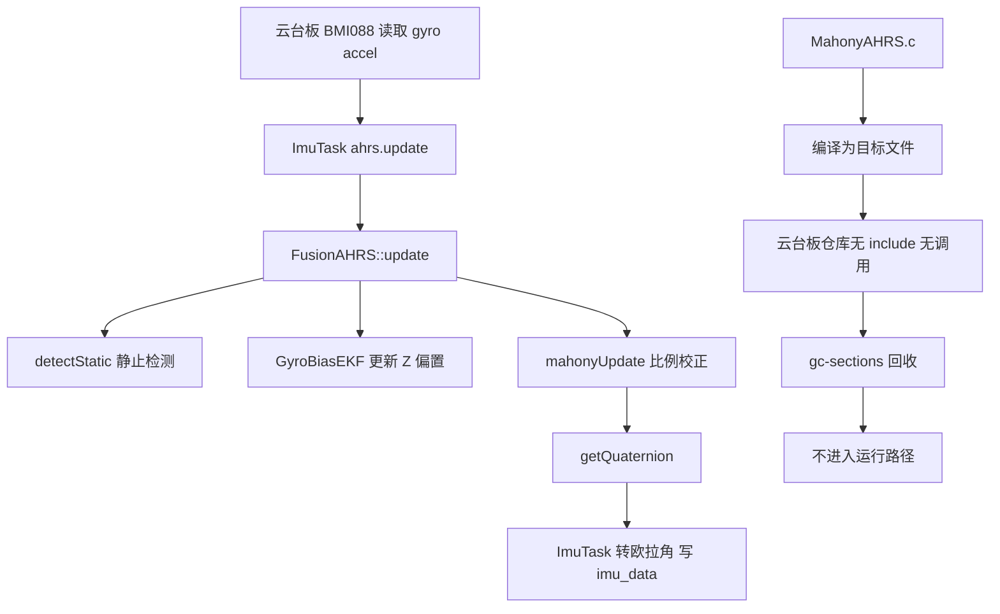
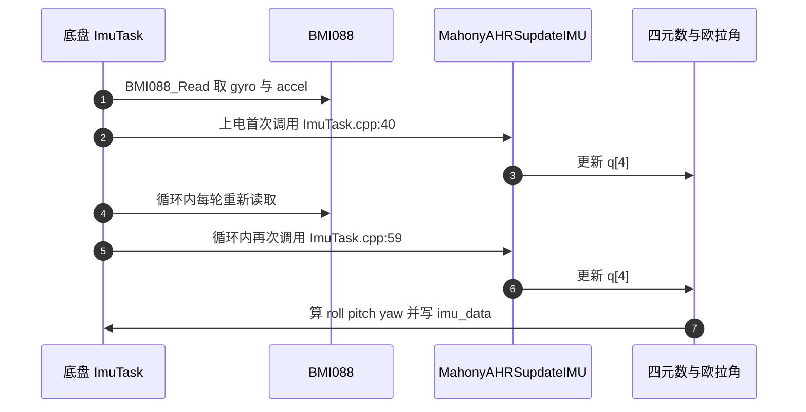

# 两板调用差异与增益

云台板的姿态由 `Algorithm/Src/FusionAHRS.cpp` 算，底盘板由 `Algorithm/Src/MahonyAHRS.c` 算。两份实现的算法结构相同、比例与积分增益数值也相同，差别在调用链、归一化实现与零偏处理方式。

判断一段代码在某块板上是否生效，要依次看三件事：是否进入该板的构建目标、是否有文件引用它的符号、链接器是否保留它的段。这三步用在两块板上的结果与两处的参数对照在下面给出。

## 1. 两块固件选了不同实现

云台板与底盘板是两个独立的固件仓库，姿态解算选用的实现不同，一块板上的调用结论不能直接搬到另一块。

云台板仓库同时存在 `Algorithm/Src/MahonyAHRS.c` 与 `Algorithm/Src/FusionAHRS.cpp`，实际进入运行的是 `FusionAHRS::mahonyUpdate`；`MahonyAHRS.c` 虽然被列入构建，云台板仓库内却没有调用点，链接期被回收。底盘板仓库没有 `FusionAHRS`，`Task/Src/ImuTask.cpp:10` 包含 `MahonyAHRS.h`，`:40` 与 `:59` 两次调用 `MahonyAHRSupdateIMU`，MahonyAHRS 在底盘板上是生效路径。

区分两块板是排查姿态问题的第一步：云台板改 `MahonyAHRS.c` 不会改变输出，底盘板改同一个文件会直接改变姿态。

## 2. 云台板无调用点与链接回收

云台板源文件清单里两份都存在：`CMakeLists.txt:67` 列出 `Algorithm/Inc/MahonyAHRS.h`，`:70` 列出 `Algorithm/Src/MahonyAHRS.c`，编译阶段会生成 `MahonyAHRS.c.obj`。

判定一段代码在指定板上是否生效，要依次看三件事：

1. 是否被列入该板的构建目标，决定有没有目标文件；
2. 该板是否有文件包含其头并调用其符号，决定有没有引用；
3. 该板链接器是否保留其段，决定最终镜像里有没有代码。

云台板在第 2 步断开：云台板仓库内只有 `Algorithm/Src/MahonyAHRS.c:17` 包含自己的头文件，没有任何 `.c`、`.cpp`、`.h` 调用 `MahonyAHRSupdate` 或 `MahonyAHRSupdateIMU`。

第 3 步由链接参数决定，`cmake/gcc-arm-none-eabi.cmake:41` 含 `-Wl,--gc-sections`，未引用的函数段会被丢弃。云台板构建目录里的 map 文件把 `MahonyAHRS.c.obj` 的 `.group` 与 `.text.invSqrt` 记在地址 `0x00000000`，属云台板构建产物观察，说明这些段没有进入最终地址空间。

`MahonyAHRS.h:21` 还留有 `extern volatile float q0, q1, q2, q3;`，定义行在源文件里被注释（`MahonyAHRS.c:35`）。算法改用参数 `q[4]` 传递四元数，这四个全局量从未被引用，所以没有定义也不会产生链接错误，这是从全局状态改为参数传递后遗留的声明。

## 3. 底盘板的真实调用链

底盘板仓库里没有 `FusionAHRS`，姿态解算直接落在 `MahonyAHRS.c` 的六轴入口上。

| 行号 | 内容 |
| --- | --- |
| `Task/Src/ImuTask.cpp:10` | `#include "MahonyAHRS.h"` |
| `Task/Src/ImuTask.cpp:40` | 上电首次读 BMI088 后调用 `MahonyAHRSupdateIMU(q, gyro[0..2], accel[0..2])` |
| `Task/Src/ImuTask.cpp:59` | 主循环每轮再次调用同一函数更新四元数 |
| `Task/Src/ImuTask.cpp:69-71` | 由四元数算 roll / pitch / yaw |
| `Task/Src/ImuTask.cpp:79-86` | `yaw_bias` 滑动平均动态零偏补偿在循环内参与运算 |

底盘板 map 文件里 `.text.MahonyAHRSupdateIMU` 记在 `0x08009e48`，是进入地址空间的函数段；九轴入口 `MahonyAHRSupdate` 没有被调用，仍按未引用段处理。`MahonyAHRS.c:24` 的 `sampleFreq 1000.0f` 宏是底盘板的积分步长来源，主循环以 `DWT_Delay_ms(1)` 收尾。

## 4. 两板对照

| 项目 | 云台板 | 底盘板 |
| --- | --- | --- |
| 算法 | `FusionAHRS::mahonyUpdate` | `MahonyAHRSupdateIMU` |
| 文件 | `Algorithm/Src/FusionAHRS.cpp` 生效，`Algorithm/Src/MahonyAHRS.c` 无调用 | `Algorithm/Src/MahonyAHRS.c` |
| 调用点 | `Task/Src/ImuTask.cpp:19` 构造、`:49-56` 调 `update`、`:59` 取四元数 | `Task/Src/ImuTask.cpp:10` 包含、`:40` 与 `:59` 调 `updateIMU` |
| 采样方式 | 构造参数 `sampleFreq_`，`ImuTask.cpp:19` 传 `1000.0f` | 宏 `sampleFreq 1000.0f`（`MahonyAHRS.c:24`） |
| 零偏处理 | `GyroBiasEKF` 估计 Z 轴，仅静止更新 | 默认无积分项；`ImuTask.cpp:79-86` 动态补偿 |
| 磁力计 | 不接 | 不接 |
| 积分通道 | `FusionAHRS` 无积分分支 | `MahonyAHRS.c` 有 `twoKi > 0` 分支，但 `twoKi = 0` 时每步清零 |
| 加速度归一化 | `1.0f / std::sqrt`（`FusionAHRS.cpp:98-101`） | `invSqrt` 位运算（`MahonyAHRS.c:70-73`） |

两处实现的比例与积分增益数值相同：`twoKp` 与 `twoKp_` 都是 1.0，`twoKi` 与 `twoKi_` 都是 0.0（`MahonyAHRS.c:25`、`:33`，`FusionAHRS.cpp:51-52`）。把 `twoKp_` 改成别的值只影响云台板；把 `twoKp` 改成别的值，云台板无响应，底盘板会跟着变。

## 5. 云台板生效路径关键行

| 行号 | 内容 |
| --- | --- |
| `FusionAHRS.h:44-56` | 成员 `sampleFreq_`、`q_[4]`、`twoKp_`、`twoKi_`、三个积分成员、`biasEKF_` |
| `FusionAHRS.cpp:14-16` | `GRAVITY 9.81f`、`GYRO_STATIC_THRESH 0.02f`、`ACC_STATIC_THRESH 0.2f` |
| `FusionAHRS.cpp:22-28` | EKF 初值 `P_ = 0.1f`、`Q_ = 1e-6f`、`R_ = 1e-4f` |
| `FusionAHRS.cpp:30-41` | EKF 先预测后按静止标志更新，只处理标量 `gyroZ` |
| `FusionAHRS.cpp:49-61` | 构造：`twoKp_ = 1.0f`、`twoKi_ = 0.0f`、`q_ = {1,0,0,0}` |
| `FusionAHRS.cpp:63-71` | `detectStatic` 双阈值判据 |
| `FusionAHRS.cpp:73-86` | `update`：检测、EKF、去偏、`mahonyUpdate` |
| `FusionAHRS.cpp:88-136` | `mahonyUpdate`：归一化、预测、误差、比例、归一化 |
| `FusionAHRS.cpp:138-140` | `getQuaternion` 返回 `std::array<float,4>` |

`FusionAHRS.cpp:79` 把 `gz` 送进 EKF 之前不做其它处理，`:82` 用 `gz -= biasEKF_.getBias()` 去偏。EKF 只有一维状态，X 与 Y 轴没有对应的偏置估计，去偏仅作用于 Z 轴。

## 6. 易错点

| # | 易错点 | 表现 |
| --- | --- | --- |
| 1 | 在云台板只改 `MahonyAHRS.c` 的参数 | 输出无变化，误以为参数无效 |
| 2 | 在底盘板找 `FusionAHRS` | 底盘板根本没有这个文件 |
| 3 | 把云台板无调用的结论搬到全工程 | 底盘板 `ImuTask.cpp:40`、`:59` 确实在调用 |
| 4 | 认为两处增益数值不同 | 源码里 `twoKp` 与 `twoKp_` 都是 1.0 |
| 5 | 认为 `twoKi_` 在云台板生效路径里有分支 | 构造函数把它设为 0，`mahonyUpdate` 里没有积分代码 |
| 6 | 在云台板生效路径里找磁力计处理 | 两块板的算法都是六轴，`ImuTask.cpp:15` 的 `mag[3]` 未使用 |

## 7. 小结

### 核心概念

- 云台板与底盘板姿态解算路径不同，先确认板子再下结论。
- 云台板 `MahonyAHRS.c` 被编译但无调用，链接期被 `gc-sections` 回收。
- 底盘板 `ImuTask.cpp:10` 包含头文件，`:40` 与 `:59` 调用 `MahonyAHRSupdateIMU`，是生效路径。
- 两处比例与积分增益数值相同，都是 1.0 与 0.0。
- 云台板用 `GyroBiasEKF` 处理 Z 轴零偏且仅静止更新；底盘板用 `yaw_bias` 动态补偿。
- 生效与否要按板判定，符号检索结论只对检索的那块仓库成立。

### 设计权衡

| 权衡点 | 本工程选择 | 收益与代价 |
| --- | --- | --- |
| 参考实现 | 云台板保留 `MahonyAHRS.c` 但不接入 | 便于对照；代价是编译产物与阅读干扰 |
| 增益配置 | 类成员与宏各一份 | 云台板可随实例调整；代价是参数分散在两处文件 |
| 零偏估计 | 云台板单轴 EKF，底盘板滑动平均 | 计算量小；代价是两板行为不一致 |
| 磁力计 | 两块板都不接 | 无航向观测，yaw 会漂；代价最小 |

## 8. 练习

### 基础题

1. 分别写出判定云台板、底盘板上一段代码是否生效的三个步骤。
2. 列出 `MahonyAHRS.c` 中定义但无引用的三个符号及行号，并说明它们在底盘板是否被调用。
3. 说明底盘板 `twoKi = 0` 时 `MahonyAHRSupdateIMU` 的行为。

### 挑战题

4. 设计一个在线实验，用同一段静止数据分别驱动两块板的实现，比较四元数输出差异。
5. 把 EKF 从标量扩展为三维偏置估计，写出状态方程与观测矩阵，说明仅静止更新的问题。

### 附：本页引用的固件路径

| 路径 | 用途 |
| --- | --- |
| `2026OmniSentryGimbal/Algorithm/Src/FusionAHRS.cpp` | 云台板生效实现与参数（`:14-136`） |
| `2026OmniSentryGimbal/Algorithm/Inc/FusionAHRS.h` | 云台板类成员（`:26-57`） |
| `2026OmniSentryGimbal/Algorithm/Src/MahonyAHRS.c` | 云台板无调用实现（`:24-150`） |
| `2026OmniSentryGimbal/Algorithm/Inc/MahonyAHRS.h` | 云台板 `extern` 声明（`:19-31`） |
| `2026OmniSentryGimbal/Task/Src/ImuTask.cpp` | 云台板调用链与成员使用（`:15-64`） |
| `2026OmniSentryGimbal/CMakeLists.txt` | 云台板源文件清单（`:67-70`） |
| `2026OmniSentryGimbal/cmake/gcc-arm-none-eabi.cmake` | `gc-sections` 参数（`:41`） |
| `2026OmniSentryChassis/Task/Src/ImuTask.cpp` | 底盘板调用点 `MahonyAHRSupdateIMU`（`:10-59`） |
| `2026OmniSentryChassis/Algorithm/Src/MahonyAHRS.c` | 底盘板生效实现（`:24-150`） |
| `2026OmniSentryChassis/Algorithm/Inc/MahonyAHRS.h` | 底盘板头文件（`:19-31`） |
| `2026OmniSentryChassis/CMakeLists.txt` | 底盘板源文件清单（`:65-68`） |
| `2026OmniSentryChassis/cmake/gcc-arm-none-eabi.cmake` | `gc-sections` 参数（`:41`） |
