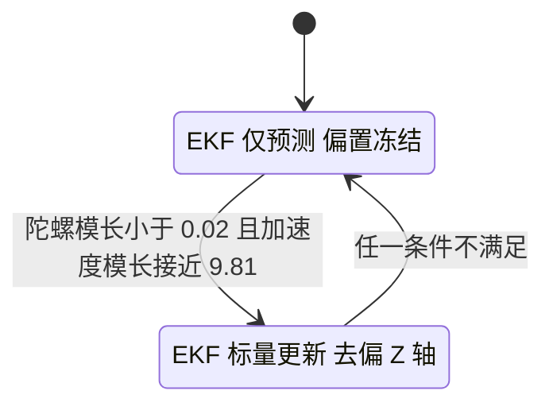
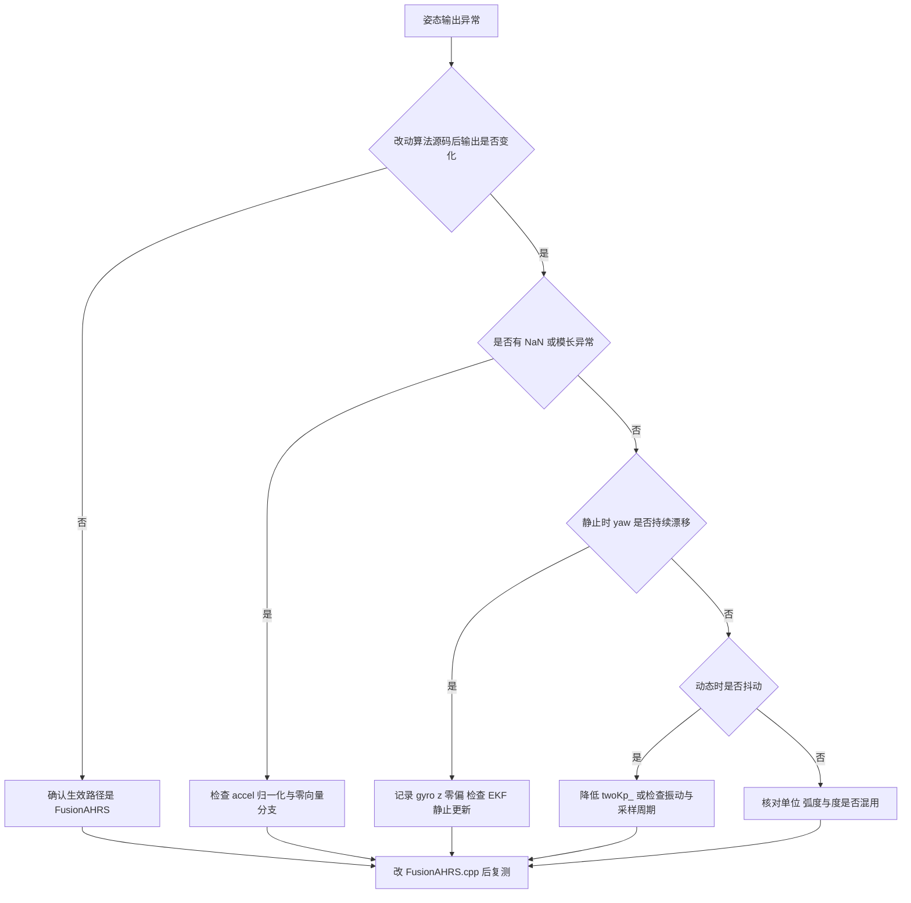

# 易错点与调试

姿态输出不对时，先别动参数。按经验，问题多半落在三类：改了不生效的文件、弧度与度混用、把未启用的功能当成在工作。这三类的现场表现都能用现有调试变量区分开。

排查按「路径、数值、参数」三层推进：先用一次增益改动确认生效路径，再用量纲与零偏推导判断哪一路数据可疑，最后是可观测变量清单与一份按顺序走的流程。

## 1. 故障分类与排查顺序

姿态输出异常大致分成四类：数值错误、量纲错误、参数错误、路径错误。数值错误让四元数模长漂移或出现 NaN（浮点非法值，出现后会把错误传遍后续运算）；量纲错误让角度与实际不符；参数错误让响应抖动或收敛过慢；路径错误让人改了不生效的代码。四类的表现不同，排查顺序也不同：先确认路径，再查数值，最后调参数。

## 2. 航向不可观与零偏漂移

六轴条件下，重力方向只提供俯仰与横滚信息。纯航向四元数

$$q_{yaw} = \begin{bmatrix} \cos(\psi/2) \\ 0 \\ 0 \\ \sin(\psi/2) \end{bmatrix}$$

代入预测重力的一半 `halfvx = q1*q3 - q0*q2`、`halfvy = q0*q1 + q2*q3`、`halfvz = q0*q0 - 0.5f + q3*q3`，得到

$$halfv_x = 0, \quad halfv_y = 0, \quad halfv_z = 0.5$$

结果与 $\psi$ 无关，预测方向恒为 $(0,0,1)$。静止加速度与它平行，叉积误差为零，比例通道不对 yaw 产生校正。yaw 只能靠陀螺 Z 轴积分维持，陀螺零偏会以固定速率积累成航向误差。

工程用 `GyroBiasEKF`（一维扩展卡尔曼滤波，用预测与测量两步递推估计状态）估计 Z 轴零偏（`Algorithm/Src/FusionAHRS.cpp`），但更新条件是 `isStatic`。静止判据同时要求陀螺模长小于 `0.02f` 且加速度模长与 `9.81f` 之差小于 `0.2f`。机动时只做预测不做测量更新，偏置保持上一次的估计值，机动中的零偏变化得不到跟踪。

```cpp
/* 简化：静止判据决定了 EKF 是否用测量修正 */
bool isStatic = detectStatic(gx, gy, gz, ax, ay, az);  // 陀螺模长 < 0.02 且 |accel 模长 - 9.81| < 0.2
biasEKF_.update(gz, isStatic);   // isStatic 为假时只预测，偏置冻结
gz -= biasEKF_.getBias();        // 去偏只作用于 Z 轴
```



## 3. 量纲与单位的两套口径

算法内部有两套单位同时存在：

| 变量 | 位置 | 单位 |
| --- | --- | --- |
| `gyro[0..2]` | `ImuTask.cpp` 写入 | rad/s |
| `accel[0..2]` | `ImuTask.cpp` 写入 | m/s2 |
| `q` | `ImuTask.cpp` | 无量纲，模长为 1 |
| `roll/pitch/yaw` | `ImuTask.cpp` | 弧度 |
| `roll_out/pitch_out/yaw_out` | `ImuTask.cpp` | 弧度 |
| `imu_data.roll/pitch/yaw` | `ImuTask.cpp` | 度 |

`ImuTask.cpp` 把 `roll/pitch/yaw` 就地乘 `180.0f / M_PI`，之后写入 `imu_data`。在此之前已经把弧度值赋给三个 `volatile` 调试变量（`volatile` 让编译器每次都从内存读取，调试器可实时观察），所以调试输出与总线数据单位不同。读取 `roll_out` 得到的是弧度，读取 `imu_data.roll` 得到的是度，直接比较会出现约 57.3 倍的差异。

```cpp
/* 简化：ImuTask.cpp 里弧度与度的分界 */
roll  = atan2f(...);  pitch = asinf(...);  yaw = ...;   /* 先算弧度 */
roll_out = roll;  pitch_out = pitch;  yaw_out = yaw;      /* volatile 调试变量，弧度 */
imu_data.roll  = roll  * 180.0f / M_PI;                  /* 总线数据，度 */
imu_data.pitch = pitch * 180.0f / M_PI;
imu_data.yaw   = yaw   * 180.0f / M_PI;
```

采样周期也有两处定义。`ImuTask.cpp` 给 `FusionAHRS` 传 `1000.0f`，算法按 1 ms 步长积分（`FusionAHRS.cpp`）；主循环用 `DWT_Delay_ms(1)` 结尾，实际周期等于读取与运算耗时再加 1 ms，与 1 ms 存在偏差。积分步长偏大或偏小，姿态变化速率会随比例缩放，静态时看不出来，动态时表现为角度变化与真实转动不同步。

## 4. 易错点清单

| # | 易错点 | 后果 | 涉及位置 |
| --- | --- | --- | --- |
| 1 | 漏做四元数归一化 | 模长漂移，欧拉角比例误差 | `FusionAHRS.cpp` 有归一化，改动时不可删除 |
| 2 | 加速度计未归一化 | 误差量纲与预测重力不匹配 | `FusionAHRS.cpp` 负责归一化 |
| 3 | 比例增益过大 | 姿态抖动，静止时也振荡 | `FusionAHRS.cpp` 的 `twoKp_` |
| 4 | 静止时陀螺零偏未标定 | yaw 匀速漂移 | `FusionAHRS.cpp` |
| 5 | 在云台板把 `MahonyAHRS.c` 当成生效路径 | 云台板改动无效果 | 云台板 `MahonyAHRS.c` 无调用点 |
| 6 | 弧度与度混用 | 数值差约 57.3 倍 | `ImuTask.cpp` |
| 7 | 认为积分项在工作 | 期望零偏被自动补偿 | `FusionAHRS.cpp` 的 `twoKi_ = 0` |
| 8 | 未使用的零偏代码被当作功能 | 云台板动态零偏补偿未运行；底盘板 `ImuTask.cpp` 在用 | `ImuTask.cpp` 的 `yaw_bias` 等 |
| 9 | 认为算法含磁力计 | 期望 yaw 有绝对参考 | `ImuTask.cpp` 的 `mag[3]` 未使用 |
| 10 | 把采样周期当严格 1 ms | 动态角度速率缩放错误 | `ImuTask.cpp` 忙等 |
| 11 | 把云台板的结论套到底盘板 | 误判 `MahonyAHRS.c` 为无调用代码 | 底盘板 `ImuTask.cpp` 调用它 |

`yaw_bias`、`GYRO_ZERO_THRESHOLD`、`BIAS_ALPHA`、`LOOP_DT` 在云台板 `ImuTask.cpp` 声明，云台板主循环里没有任何引用，动态零偏补偿属于预留但未落地；底盘板同名变量在 `ImuTask.cpp` 主循环里参与运算，两板在这点上不能互推。加速度计方面，线加速度会让观测偏离重力方向，反馈会把错误方向拉进姿态，这类误差在快速平移时出现。

## 5. 调试方法

可用观测点：

| 观测点 | 位置 | 含义 |
| --- | --- | --- |
| `roll_out`、`pitch_out`、`yaw_out` | `ImuTask.cpp` | 弧度，上电零点已从 yaw 中扣除 |
| `imu_data.roll/pitch/yaw` | `ImuTask.cpp` | 度 |
| `imu_data.gimbal_yaw_total_angle` | `ImuTask.cpp` | 累加航向，未减上电零点 |
| `imu_data.gyro[0..2]` | `ImuTask.cpp` | rad/s，可观察零偏 |
| `imu_data.temperature` | `ImuTask.cpp` | 摄氏度，观察温漂 |

排查流程按路径、数值、参数的顺序：



具体做法：

1. 路径确认。云台板在 `FusionAHRS.cpp` 临时改 `twoKp_`，底盘板在 `MahonyAHRS.c` 临时改 `twoKp`，观察 `roll_out` 响应；若不变化，说明观察对象与实际编译路径不一致。
2. 静止漂移测试。设备静止放置若干分钟，记录 `yaw_out` 随时间的变化，拟合斜率得到 Z 轴残余漂移率。数值与设备温度有关，属待实测项。
3. 零偏观察。静止时读取 `imu_data.gyro[2]`，其均值即当前 Z 轴角速度零偏的近似值。
4. 归一化检查。在 `FusionAHRS.cpp` 前后打印模长，正常应接近 1。
5. 单位核对。同时读 `yaw_out` 与 `imu_data.yaw`，两者比值应约为 `57.29578`。
6. 采样周期测量。在 `ImuTask.cpp` 前后记录时间戳，得到实际循环周期，与传入的 `1000.0f` 比较。

## 6. 小结

### 核心概念

- 六轴无绝对航向参考，重力观测对 yaw 的校正恒为零。
- Z 轴零偏只在静止时被 EKF 更新，机动中偏置冻结。
- 算法内弧度与度两套单位并存，调试变量与总线数据单位不同。
- 积分项未启用，动态零偏补偿代码未落地。
- 生效路径按板区分：云台板是 `FusionAHRS`，底盘板是 `MahonyAHRSupdateIMU`。

### 设计权衡

| 权衡点 | 本工程选择 | 收益与代价 |
| --- | --- | --- |
| 航向参考 | 无磁力计 | 无航向观测，yaw 漂移；代价最小 |
| 零偏估计 | 单轴 EKF 且仅静止更新 | 静止精度好；代价是机动期漂移 |
| 调试输出 | `volatile` 变量，弧度 | 读取方便；代价是与总线单位不一致 |
| 循环节拍 | `DWT_Delay_ms(1)` 忙等 | 时序简单；代价是周期随负载波动，占用 CPU |

## 7. 练习

### 基础题

1. 列出 `ImuTask.cpp` 中声明但未使用的四个符号。
2. 说明 `roll_out` 与 `imu_data.roll` 的单位关系。
3. 写出六轴 yaw 不可观的推导要点。

### 挑战题

4. 设计静止漂移测试方案，给出采样时长、温度条件与判据。
5. 把 `yaw_bias` 的动态补偿接入主循环，写出更新式并分析它与 Z 轴 EKF 的冲突。
6. 用实测循环周期替代 `ImuTask.cpp` 的固定 `1000.0f`，说明对积分精度和零偏估计的影响。

### 附：本页引用的固件路径

| 路径 | 用途 |
| --- | --- |
| `2026OmniSentryGimbal/Task/Src/ImuTask.cpp` | 单位、调试变量与循环 |
| `2026OmniSentryGimbal/Algorithm/Src/FusionAHRS.cpp` | 增益、静止判据与归一化 |
| `2026OmniSentryGimbal/Algorithm/Inc/FusionAHRS.h` | 成员声明 |
| `2026OmniSentryGimbal/Algorithm/Src/MahonyAHRS.c` | 云台板无调用、底盘板生效 |
| `2026OmniSentryChassis/Task/Src/ImuTask.cpp` | 底盘板 `MahonyAHRSupdateIMU` 调用点 |
| `2026OmniSentryChassis/Algorithm/Src/MahonyAHRS.c` | 底盘板生效实现 |
