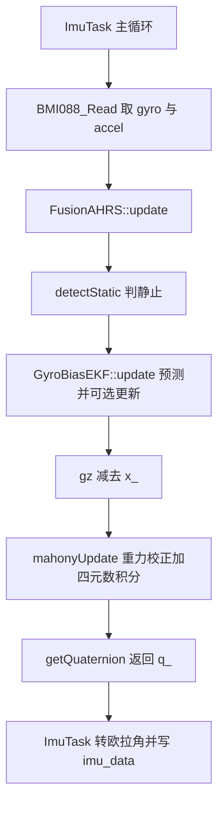
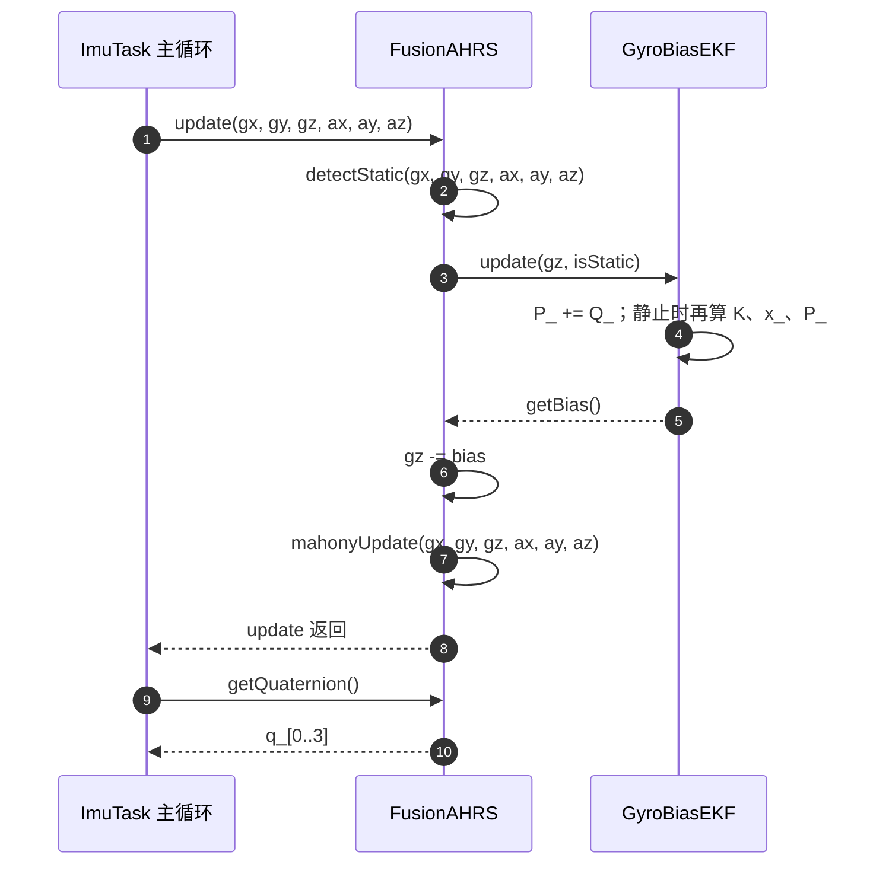

# FusionAHRS 的组成

云台板要在一个 1 kHz 的循环里给出三轴姿态，可用的传感器只有 BMI088 的陀螺与加速度计。陀螺积分能跟上快速转动，零偏却会随时间累积成角度误差；加速度计长期不漂，又会把车体平动的加速度混进重力方向。`Algorithm/Src/FusionAHRS.cpp`里的 FusionAHRS 把这两路信息合成一个四元数，另用一个只在静止时工作的卡尔曼滤波估计 Z 轴陀螺零偏。

FusionAHRS 与 GyroBiasEKF 各自负责什么，头文件里的成员哪些在源文件中有读写点，运行入口以什么采样率构造它、与云台板未启用的 MahonyAHRS.c 差在哪里——这三组问题是理解后面四篇的前提。

下文行号都相对固件仓库根目录，例如`Algorithm/Src/FusionAHRS.cpp:82`指该文件第 82 行。

> 源码索引（本单元引用的固件路径都相对于固件仓库根目录）

| 文件 | 作用 |
| --- | --- |
| `Algorithm/Inc/FusionAHRS.h` | 两个类的声明与全部数据成员 |
| `Algorithm/Src/FusionAHRS.cpp` | 融合与零偏估计实现，末行`}`在`:141` |
| `Algorithm/Src/MahonyAHRS.c` | 云台板未启用的参考实现，该板无调用点 |
| `Task/Src/ImuTask.cpp` | 运行入口、采样率实参与欧拉角换算 |
| `Task/Src/UsbConnectTask.cpp` | 额外的头文件引用点，未构造对象 |

## 两个类各自负责什么

六轴 IMU 没有磁力计，重力参考只能约束倾斜方向。加速度计静止时测的是重力反作用力，把读数归一化后就是机体系下的重力单位向量；把它与四元数推算出的重力方向做叉乘，叉乘结果指向姿态误差绕哪根轴、往哪个方向修正。绕 Z 轴转动不改变重力在机体系下的方向，误差向量的 Z 分量恒接近零，因此偏航在这套观测量下不可观测，只能靠陀螺积分维持。这一条决定了融合必须分成两件事：倾斜方向由加速度计长期拉住，偏航方向的常值误差只能靠估计陀螺零偏来压。

两个类正好对应这两件事。FusionAHRS 负责重力校正与四元数传播，GyroBiasEKF 负责 Z 轴零偏。把零偏单独成类的好处是状态维度降到一，没有矩阵运算，每次更新的乘除次数是个位数。

| 组件 | 处理的量 | 观测量 | 输出 |
| --- | --- | --- | --- |
| Mahony 比例校正 | roll/pitch 角度漂移 | 加速度计重力方向 | 角速度修正量 |
| `GyroBiasEKF` | Z 轴陀螺零偏 | 静止时的 gyroZ | 标量偏置估计 |
| 四元数积分 | 三轴姿态传播 | 校正后角速度 | 四元数 `q_` |

三者的数据流向是单向的：EKF 不知道四元数，Mahony 也不会把误差回写给 EKF。零偏补偿发生在 Mahony 之前，Mahony 拿到的是已经减掉 Z 轴偏置估计的角速度，它再叠加比例修正量并积分。这个顺序在第三篇里逐行展开。

## GyroBiasEKF 只维护一个状态

零偏估计器一共四个私有成员（`Algorithm/Inc/FusionAHRS.h:20-23`）：状态 `x_`、协方差 `P_`、过程噪声 `Q_`、观测噪声 `R_`。状态量纲是 rad/s，协方差的量纲是 (rad/s)²，两个噪声参数都是方差而不是标准差，这一点在后两篇的量级讨论里会反复用到。

`Algorithm/Inc/FusionAHRS.h:10-24`的类定义：

```cpp
class GyroBiasEKF
{
public:
    GyroBiasEKF();

    void update(float gyroZ, bool isStatic);

    float getBias() const;

private:
    float x_;      // bias estimate
    float P_;      // covariance
    float Q_;      // process noise
    float R_;      // measurement noise
};
```

公开接口只有三个：构造、带静止门控的 `update`、只读的 `getBias`。没有 setter，也没有重置接口，四个参数在构造时写死（`FusionAHRS.cpp:22-28`）。预测步每拍无条件执行 `P_ += Q_`，更新步放在 `if(isStatic)` 里面，因此运动期间状态冻结、协方差继续增长。这套门控的后果和自锁条件留到第二篇推。

## FusionAHRS 的成员与初始化顺序

融合类的声明在 `Algorithm/Inc/FusionAHRS.h:26-57`，公开接口只有构造、`update`、`getQuaternion` 三个。私有成员分三组：采样率 `sampleFreq_`、四元数 `q_[4]`、Mahony 参数与积分残项。其中 `twoKi_` 与三个 `integralFB*` 在头文件里声明，在源文件里只出现在构造函数的初始化列表中，此后没有任何读写点。

| 成员 | 声明位置 | 作用 | 实际使用情况 |
| --- | --- | --- | --- |
| `sampleFreq_` | `FusionAHRS.h:44` | 四元数积分的步长分母 | `mahonyUpdate` 中读两次 |
| `q_[4]` | `FusionAHRS.h:47` | 姿态四元数，顺序 w,x,y,z | 每步读写并归一化 |
| `twoKp_` | `FusionAHRS.h:50` | 比例增益，构造为 1.0f | `mahonyUpdate` 中乘三轴误差 |
| `twoKi_` | `FusionAHRS.h:51` | 积分增益，构造为 0.0f | 源文件无读取点 |
| `integralFBx_` | `FusionAHRS.h:52` | X 轴积分残项 | 源文件无读取点 |
| `integralFBy_` | `FusionAHRS.h:53` | Y 轴积分残项 | 源文件无读取点 |
| `integralFBz_` | `FusionAHRS.h:54` | Z 轴积分残项 | 源文件无读取点 |
| `biasEKF_` | `FusionAHRS.h:56` | Z 轴零偏估计器 | `update` 中调用 |

构造函数的初始化列表顺序与成员声明顺序一致（`FusionAHRS.cpp:49-55`），这样在 `-Wreorder` 下不会告警；`q_` 放在函数体里赋值：

```cpp
FusionAHRS::FusionAHRS(float sampleFreq)
    : sampleFreq_(sampleFreq),
      twoKp_(1.0f),
      twoKi_(0.0f),
      integralFBx_(0),
      integralFBy_(0),
      integralFBz_(0)
{
    q_[0] = 1.0f;
    q_[1] = 0.0f;
    q_[2] = 0.0f;
    q_[3] = 0.0f;
}
```

`q_` 的初值 `{1,0,0,0}` 就是单位四元数，四个分量按 w、x、y、z 排列。这个顺序在运行入口换算欧拉角时会再用到，写错顺序会让 roll 与 yaw 互换。 `biasEKF_` 是值成员而不是指针（`FusionAHRS.h:56`），FusionAHRS 构造时一并构造 EKF，因此没有独立的初始化步骤。

源文件的实现按区段分布如下，行号可以用来交叉验证：

| 区段 | 行号 | 内容 |
| --- | --- | --- |
| 常量 | `FusionAHRS.cpp:14-16` | `GRAVITY`、`GYRO_STATIC_THRESH`、`ACC_STATIC_THRESH` |
| EKF 构造 | `:22-28` | `x_=0`、`P_=0.1`、`Q_=1e-6`、`R_=1e-4` |
| EKF 更新 | `:30-41` | 预测 `P_+=Q_`，静止时标量卡尔曼更新 |
| 融合构造 | `:49-62` | 增益与四元数初值 |
| 静态检测 | `:63-71` | 陀螺模长与重力模长双条件 |
| 融合更新 | `:73-86` | 检测、EKF、去偏、调用 Mahony |
| Mahony 更新 | `:88-136` | 归一化、重力误差、比例校正、积分、归一化 |
| 取四元数 | `:138-141` | 返回 `{q_[0],q_[1],q_[2],q_[3]}`，`:141` 是末行 |

## 一次 update 里两个类的先后

一次 `update` 内部固定走四步：静态检测、EKF 更新、去 Z 轴偏置、Mahony 校正。检测与 EKF 拿到的是原始 `gz`，只有传给 Mahony 的才是去偏值。



从对象视角看，FusionAHRS 只做转发：它调用成员 `biasEKF_` 的 `update` 与 `getBias`，自己不做零偏运算。EKF 的观测量是原始陀螺读数，状态是零偏绝对值，两者同为 rad/s，做减法时才不需要额外换算。



## 运行入口在 ImuTask 主循环

`Task/Src/ImuTask.cpp:19` 定义了一个全局静态实例，采样率按 1 kHz 传入：

```cpp
static FusionAHRS ahrs(1000.0f);   // 1kHz
```

主循环里 `BMI088_Read` 取回陀螺与加速度（`:43`），`ahrs.update` 消费这两组三轴量（`:49-56`），`ahrs.getQuaternion` 取回四元数（`:59`），随后按 `q[0]` 为标量部计算欧拉角（`:62-64`）。融合类不参与量纲转换，输入必须是 rad/s 与 m/s²，换算在驱动侧完成。

`Task/Src/UsbConnectTask.cpp:14` 也包含了该头文件，但全文件没有构造 FusionAHRS 对象，也不调用 `update`。读代码时如果只按 include 统计使用点，会把这个文件算进去。

## 与 MahonyAHRS.c 的五处差别

`Algorithm/Src/MahonyAHRS.c` 是同一算法族的参考 C 实现，两个更新函数 `MahonyAHRSupdate` 与 `MahonyAHRSupdateIMU` 都完整，但它们只有头文件声明，没有调用点。差别集中在零偏处理：

| 对照项 | `FusionAHRS` | `MahonyAHRS.c` |
| --- | --- | --- |
| 语言形态 | C++ 类，两个类 | C 函数加全局变量 |
| 零偏估计 | `GyroBiasEKF` 标量卡尔曼 | 无 |
| 磁力计 | 无，6 轴 | 有 `MahonyAHRSupdate` 九轴版 |
| 积分支路 | 成员声明，源文件无实现 | 有，受 `twoKi` 控制 |
| 静态检测 | `detectStatic`，阈值 0.02 rad/s | 阈值 `0.015f` 定义后未使用 |
| 工程引用 | 云台板 `Task/Src/ImuTask.cpp:10` 引用 | 云台板无调用点；底盘板 `Task/Src/ImuTask.cpp:40`、`:59` 调用 `MahonyAHRSupdateIMU` |

参考实现里还有两处只声明不使用的痕迹：`Algorithm/Src/MahonyAHRS.c:38-39` 定义了全局变量 `gyroZ_bias` 与 `imu_static`，文件里没有任何函数读写它们；`:28` 的 `GYRO_STATIC_THRESH` 取 0.015f，注释写 1.1 deg/s，同样没有使用点；0.015 rad/s 换算过来是 0.86 deg/s，与注释的 1.1 deg/s 对不上，两处数值只有一处是对的，以值还是以注释为准需另行确认。本工程实际生效的阈值是 `FusionAHRS.cpp:15` 的 0.02f，对应 1.146 deg/s。零偏与静止判定在参考实现里停在了声明阶段。

另一个实现层面的差别是反平方根。`FusionAHRS.cpp` 的归一化用 `1.0f / std::sqrt(...)`（`:98`、`:129-130`），参考实现用 `invSqrt` 的位运算初值加一次牛顿迭代（`MahonyAHRS.c:228-236`）。两者精度不同，数值差异属待实测比较。

## 读这份代码时容易数错的地方

| 容易读错的地方 | 现象 | 对应位置 |
| --- | --- | --- |
| 把 `FusionAHRS` 与 `MahonyAHRS.c` 当同一实现 | 调参数时改了本板无调用点的文件 | `Algorithm/Src/MahonyAHRS.c` 全文件；`FusionAHRS.cpp` |
| 以为 `twoKi_` 与积分项在生效 | 改 `twoKi_` 无任何响应 | `FusionAHRS.h:51-54`，`FusionAHRS.cpp:88-136` |
| 按 `wc -l` 认为末行是 140 | 逐行引用错位 | 末行 `}` 在 `:141`，文件无行尾换行，`wc -l` 计 140 |
| 把重复 `#include` 当作两个实现 | 读代码时数错构造次数 | `FusionAHRS.cpp:5` 与 `:10` 两次包含同一头文件 |
| 静态检测阈值与采样率耦合 | 改采样率后静止判定行为变化 | `FusionAHRS.cpp:15`，`ImuTask.cpp:19` |
| 只看 `getQuaternion` 就断言姿态可用 | 忽略了 yaw 没有绝对参考 | `FusionAHRS.cpp:138-141`，`ImuTask.cpp:15` 的 `mag` 未使用 |

头文件里的类共有 59 行（含末行 `#endif`），源文件末行 `}` 在 `:141`。两者都没有行尾换行，按编辑器的行号引用是准的，按 `wc -l` 的结果会各差一行。

## 小结

### 核心概念

- `FusionAHRS` 以值成员持有一个 `GyroBiasEKF`，一次 `update` 顺序执行检测、EKF、去偏、Mahony。
- `GyroBiasEKF` 只有一个状态 `x_`，估计 Z 轴陀螺零偏，只在 `isStatic` 为真时更新。
- Mahony 部分只用加速度计，是六轴算法，`twoKi_` 与三个积分残项在源文件中没有实现。
- 头文件两个类共 59 行，源文件末行 `}` 在 `:141`，公开接口只有构造、`update`、`getQuaternion`。
- 云台板引用 `FusionAHRS` 的是 `ImuTask.cpp`；`MahonyAHRS.c` 在云台板无调用点，其中的 `gyroZ_bias` 与 `imu_static` 也没有读写点。底盘板走另一条路径，`Task/Src/ImuTask.cpp:40`、`:59` 调用 `MahonyAHRSupdateIMU`。
- 运行实例采样率写死为 1000 Hz，与主循环的实际周期无关。

### 设计权衡

| 决策 | 选择 | 收益 | 代价 |
| --- | --- | --- | --- |
| 零偏放在独立类 | 标量 EKF 单轴 | 状态少、计算量小 | X/Y 偏置不估计 |
| 静态检测决定 EKF 是否更新 | 双阈值门控 | 运动中不把机动当零偏 | 静止判定错了偏置就学错 |
| 积分项保留声明不实现 | 只做比例校正 | 代码路径短，无积分饱和 | 稳态 tilt 误差无法消除 |
| 采样率作为构造参数 | 外部传入 1000 | 免改算法源码 | 与实际周期不一致时无校验 |
| 六轴而非九轴 | 不接磁力计 | 无磁干扰与标定 | yaw 无绝对参考，长期漂移 |
| 归一化用 `std::sqrt` | 不做快速反平方根 | 精度明确 | 每步开方开销高于 `invSqrt` |

## 练习

### 基础题

1. 打开 `Algorithm/Inc/FusionAHRS.h`，列出 `FusionAHRS` 的私有数据成员并写出各自在源文件中的首次读写行号。
2. 在 `FusionAHRS.cpp` 中找出 `twoKi_` 与 `integralFBx_` 的全部出现位置，判断它们是否参与运算。
3. 画出一帧主循环从 `BMI088_Read` 到写 `imu_data` 的调用链，标注每一步所在行号。
4. 说明为什么零偏估计器被设计成只在静止时更新，运动时 `P_` 如何处理。

### 挑战题

1. 若要给 `FusionAHRS` 加上 X/Y 轴零偏估计，评估状态维度、可观测量与对现有 `GyroBiasEKF` 接口的改动范围。
2. 主循环的 `DWT_Delay_ms(1)` 与构造参数的 1000 Hz 不一致，设计一个不改动主循环结构的观测方案，用实测周期反推真实采样率，并说明该误差对四元数积分的影响方向。

### 附：本页引用的固件路径

| 路径 | 用途 |
| --- | --- |
| `/home/wyx/rm/2026SentriOmeniGimbal/2026OmniSentryGimbal/Algorithm/Inc/FusionAHRS.h` | 两个类的声明与成员 |
| `/home/wyx/rm/2026SentriOmeniGimbal/2026OmniSentryGimbal/Algorithm/Src/FusionAHRS.cpp` | 融合与零偏估计实现 |
| `/home/wyx/rm/2026SentriOmeniGimbal/2026OmniSentryGimbal/Algorithm/Src/MahonyAHRS.c` | 未启用的参考实现 |
| `/home/wyx/rm/2026SentriOmeniGimbal/2026OmniSentryGimbal/Task/Src/ImuTask.cpp` | 运行入口与调用顺序 |
| `/home/wyx/rm/2026SentriOmeniGimbal/2026OmniSentryGimbal/Task/Src/UsbConnectTask.cpp` | 额外的头文件引用点 |
