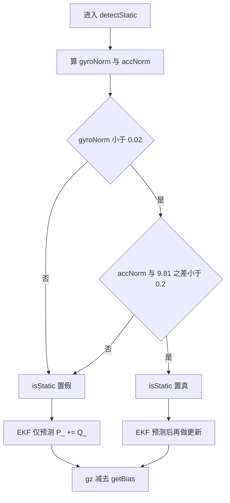
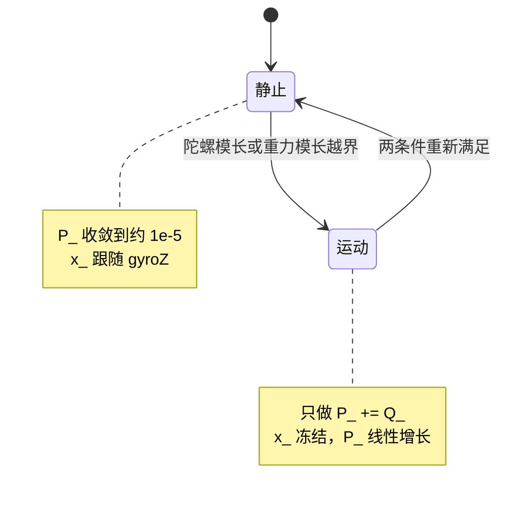

# 静态检测与零偏 EKF

零偏估计只有在载体确实静止时才有意义：静止时陀螺的真实角速度为 0，读数就等于零偏加测量噪声，这时才存在一个可以拿来当观测量的参考值。FusionAHRS 把这个前提做成一个门控函数 detectStatic，用与运算同时约束陀螺模长与重力模长；门打开后，GyroBiasEKF 才对 Z 轴状态做一次标量卡尔曼更新，门关着时只做预测。

`Algorithm/Src/FusionAHRS.cpp:14-41` 里的 Q、R 决定稳态增益与收敛时间，由此带出自锁、初值影响与单轴假设三处后果。需要回答的是：0.02 rad/s 与 0.2 m/s² 两个阈值各自挡什么；为什么第一拍几乎不滤波；偏置模长大于阈值时估计为什么停在零。

## 静止判据的两个与条件

`detectStatic` 的判据只有四行（`FusionAHRS.cpp:63-71`），先算两个模长，再用与运算连接两个比较：

```cpp
float gyroNorm = std::sqrt(gx*gx + gy*gy + gz*gz);
float accNorm  = std::sqrt(ax*ax + ay*ay + az*az);

return (gyroNorm < GYRO_STATIC_THRESH &&
        std::fabs(accNorm - GRAVITY) < ACC_STATIC_THRESH);
```

写成公式是两个独立不等式：

$$\|\omega\| = \sqrt{g_x^2+g_y^2+g_z^2} < 0.02\ \text{rad/s}$$

$$\bigl|\,\|a\| - 9.81\,\bigr| < 0.2\ \text{m/s}^2$$

第一条限制三轴角速度的合模长。0.02 rad/s 换成常用单位是 0.02 × 180/π = 1.146 deg/s，所以判据允许的静止窗口只有每秒 1 度出头。第二条限制加速度模长与 9.81 的偏差，0.2/9.81 = 0.0204，即 2% 的重力。两个条件都只取模长，与载体姿态无关，倾斜静止同样会被判为静止；判据没有用到方向信息，因此也分不出水平方向的缓慢转动与小偏置，两种情形在陀螺读数上表现一致。

阈值常量是三个 `#define` 宏（`FusionAHRS.cpp:14-16`），没有单位后缀，单位由驱动换算的结果决定。`GRAVITY` 取 9.81，而驱动里的加速度灵敏度按 9.8 归一化（`BMI088/BMI088config.h:227`），两者差 0.01 m/s²，相对 0.2 m/s² 的阈值可以忽略。



判据的两个分支对应 EKF 的两种行为：任一条件不满足就只执行预测，两个都满足才进入更新。判定结果只在本次调用内使用，不作为状态保存，所以不存在迟滞，输入在阈值附近抖动时 `isStatic` 会逐拍跳变。

## 标量卡尔曼的预测与更新

状态取随机游走模型，静止时真实角速度为零，观测方程直接写成状态加噪声：

$$x_{k+1} = x_k + w_k,\qquad w_k \sim N(0, Q)$$

$$z_k = g_z = x_k + v_k,\qquad v_k \sim N(0, R)$$

源码只保留标量形式，没有矩阵与求逆。预测步无条件执行，更新步由 `isStatic` 门控：

$$P^{-}_{k} = P_{k-1} + Q$$

静止时：

$$K_k = \frac{P^{-}_k}{P^{-}_k + R}$$

$$x_k = x_{k-1} + K_k\,(z_k - x_{k-1})$$

$$P_k = (1 - K_k)\,P^{-}_k$$

对应实现只有八行（`FusionAHRS.cpp:30-41`）：

```cpp
void GyroBiasEKF::update(float gyroZ, bool isStatic)
{
    // 预测
    P_ += Q_;

    if(isStatic)
    {
        float K = P_ / (P_ + R_);
        x_ += K * (gyroZ - x_);
        P_ = (1 - K) * P_;
    }
}
```

状态预测没有写回 `x_`，因为随机游走模型下状态的最优预测就是上一拍的值，$x^{-}_k = x_{k-1}$，预测步只把不确定度累加上去。观测残差取 `gyroZ - x_`，静止时真实角速度为零，残差即偏置估计误差。增益公式里的 `P_` 是刚加过 `Q_` 的预测值，这一点在算稳态增益时决定用哪个表达式。

## Q 与 R 决定的稳态增益

静止连续更新时 `P` 迭代收敛到不动点。把更新式写成一拍映射：先加预测噪声，再乘 `(1-K)`，于是

$$P^{*} = \frac{R\,(P^{*} + Q)}{P^{*} + Q + R}$$

两边展开得 $P^{*2} + QP^{*} = RQ$，即

$$P^{*} = \frac{-Q + \sqrt{Q^2 + 4QR}}{2}$$

式中的 $Q^2$ 与一次项相对 $4QR$ 小一个数量级，把两者丢掉得到 $P^{*} \approx \sqrt{QR}$，比数值解低约 5%。代入 $Q=10^{-6}$、$R=10^{-4}$：

| 量 | 近似 | 数值求解 |
| --- | --- | --- |
| 稳态 $P^{*}$ | $\sqrt{QR} = 1.0\times10^{-5}$ | $9.512\times10^{-6}$ |
| 稳态 $K^{*}$ | $\approx 0.0909$ | $0.0951$ |
| 时间常数 $\tau = 1/(K^{*} f_s)$ | $\approx 11\ \text{ms}$ | $10.5\ \text{ms}$ |

稳态增益要用预测后的协方差算，即 $K^{*} = (P^{*}+Q)/(P^{*}+Q+R)$，所以数值解 0.0951 比近似值 0.0909 高一点。时间常数按 $f_s = 1000$ Hz 的静止样本折算。下表是 $x$ 从 0 向 $z = 0.01$ rad/s 收敛的逐拍结果：

| 拍数 | $P$ | $K$ | $x$ |
| --- | --- | --- | --- |
| 1 | $9.99\times10^{-5}$ | 0.9990 | 0.009990 |
| 2 | $5.02\times10^{-5}$ | 0.5022 | 0.009995 |
| 3 | $3.39\times10^{-5}$ | 0.3387 | 0.009997 |
| 4 | $2.59\times10^{-5}$ | 0.2586 | 0.009998 |
| 8 | $1.46\times10^{-5}$ | 0.1458 | 0.009999 |
| 14 | $1.08\times10^{-5}$ | 0.1081 | 0.009999 |

第十四拍的 $P$ 已经接近稳态 $9.512\times10^{-6}$，时间常数约十拍的结论与表格一致。整个过程没有振荡，因为标量卡尔曼的增益恒落在 0 到 1 之间。

## P 初值 0.1 让第一拍几乎不滤波

初值 $P_0 = 0.1$ 比稳态高四个数量级，它决定第一拍的增益：

$$K_1 = \frac{0.1 + 10^{-6}}{0.1 + 10^{-6} + 10^{-4}} = 0.9990$$

于是

$$x_1 = 0 + 0.9990 \times (z_1 - 0) = 0.9990\, z_1$$

第一个静止样本的 99.9% 直接进入状态，噪声也一起进来。这个取值把上电后的首次收敛压到一拍以内，代价是初值对首个样本不鲁棒：若上电瞬间恰好有一次冲击，$P$ 还没降下来，冲击就会被当成偏置吸进 `x_`。$P$ 在第 2 拍降到约 $5\times10^{-5}$，第 4 拍降到 $2.6\times10^{-5}$，前十拍内完成主要衰减，之后增益才稳定在 0.1 附近。

## 持续运动时 P 线性增长

预测步不受 `isStatic` 限制，每一拍都执行 `P_ += Q_`。持续运动时状态冻结，协方差以每拍 $Q$、每秒 $Q f_s = 10^{-3}$ 的速度线性上升。下表列出重回静止瞬间的 $P$ 与下一拍的增益：

| 持续运动时间 | $P$ | 下一静止拍的 $K$ |
| --- | --- | --- |
| 0.01 s | $2.0\times10^{-5}$ | 0.167 |
| 0.1 s | $1.1\times10^{-4}$ | 0.524 |
| 1 s | $1.0\times10^{-3}$ | 0.910 |
| 10 s | $1.0\times10^{-2}$ | 0.990 |

运动越久，$P$ 越大，重回静止后的第一拍越接近直接采用新样本。这种设计让偏置在短静止窗口内快速重收敛，代价是连续机动后没有平均效果，单次样本噪声原样进入状态。



## 只估 Z 轴留下的倾斜误差

重力参考只约束姿态的倾斜分量。姿态水平时，机体系重力方向接近 $(0,0,1)$，误差向量 $e = a \times v$ 的 Z 分量接近 0，偏航误差不进入校正量 `halfez`。因此 Z 轴零偏会直接积分进 yaw，X/Y 轴零偏则被 Mahony 的比例项压成静态倾斜误差。

平衡时比例校正产生的角速度与偏置抵消，$2K_p\,h_e = b$。小角度下 $|h_e| \approx \theta/2$，代回得

$$\theta \approx \frac{2b}{2K_p} = \frac{b}{K_p}$$

按 `twoKp_` 等于 1.0 代入：$b = 0.005$ rad/s 的 X 轴偏置对应约 0.005 rad，即 0.29° 的静态倾斜偏差。偏置越大，倾斜偏差越大，且不随时间收敛。该数量级来自公式推导，没有实测数据，属待实测项。

## 阈值与 EKF 在源码里的位置

三个常量定义在 `FusionAHRS.cpp:14-16`，均为 `#define` 宏：

```cpp
#define GRAVITY 9.81f
#define GYRO_STATIC_THRESH 0.02f
#define ACC_STATIC_THRESH  0.2f
```

EKF 构造在 `:22-28`，状态与噪声参数都在这里赋初值：

```cpp
GyroBiasEKF::GyroBiasEKF()
{
    x_ = 0.0f;
    P_ = 0.1f;
    Q_ = 1e-6f;
    R_ = 1e-4f;
}
```

调用顺序在 `FusionAHRS::update` 的 `:73-86`：先 `detectStatic`，再把原始 `gz` 交给 `biasEKF_.update`，然后 `gz -= biasEKF_.getBias()`，最后进 Mahony。去偏发生在 Mahony 之前，而检测与估计读的都是原始值。

| 行为 | 行号 | 说明 |
| --- | --- | --- |
| 计算模长 | `FusionAHRS.cpp:66-67` | 陀螺与加速度各一次 `std::sqrt` |
| 双条件返回 | `:69-70` | 与运算，任一不满足即为运动 |
| 预测 | `:33` | 每拍无条件 `P_ += Q_` |
| 更新门控 | `:35` | `if(isStatic)` |
| 增益 | `:37` | $K = P/(P+R)$ |
| 状态更新 | `:38` | 残差取 `gyroZ - x_` |
| 协方差更新 | `:39` | $P = (1-K)P$ |

运行侧每毫秒调用一次 `ahrs.update`（`Task/Src/ImuTask.cpp:49-56`），采样率按 1000 Hz 构造（`ImuTask.cpp:19`）。`Q` 按拍施加，实际循环周期大于 1 ms 时每秒注入的过程噪声低于 $10^{-3}$，收敛时间常数相应变长。这一耦合在第四篇的参数整定里会再算一次。

## 容易被误读的门控与量纲

| 容易读错的地方 | 现象 | 对应位置 |
| --- | --- | --- |
| 认为 `Q`、`R` 决定绝对收敛速度 | `Q` 按拍施加，改采样率后行为变化 | `FusionAHRS.cpp:26-27`、`ImuTask.cpp:19` |
| 认为零偏估计始终在跑 | 运动时 `x_` 不变，只有 `P_` 增长 | `FusionAHRS.cpp:35` |
| 偏置大于陀螺阈值时的门控自锁 | 陀螺模长恒超 0.02 rad/s，永不判静止，永学不到偏置 | `FusionAHRS.cpp:15`、`:33-40`、`:79` |
| 用去偏后的角速度做静止检测 | 代码用的是原始 `gz`，偏置参与模长 | `FusionAHRS.cpp:76`、`:79` |
| 把 `ACC_STATIC_THRESH` 当方向误差 | 判据只比较模长，倾斜静止也判静止 | `FusionAHRS.cpp:67`、`:70` |
| 初值 `P_ = 0.1` 被忽略 | 首个静止样本几乎直接决定 `x_` | `FusionAHRS.cpp:25`、`:37-38` |
| 认为 X/Y 偏置也被补偿 | X/Y 无状态，只体现为静态倾斜误差 | `FusionAHRS.h:20`、`FusionAHRS.cpp:79-85` |

门控自锁是表格里唯一需要写出链条的一条。判据读的是原始 `gz`（`:66`、`:79`），初值 `x_` 为零（`:24`），更新受 `isStatic` 门控；当偏置本身超过 `GYRO_STATIC_THRESH` 时，门不会再打开。链条写成

$$|b| \ge 0.02\ \text{rad/s} \;\Rightarrow\; \|\omega\| \ge 0.02 \;\Rightarrow\; isStatic = \text{false} \;\Rightarrow\; \hat x \equiv 0$$

可估计区间因此不对称：偏置在门限以下才有机会被估计，越接近门限静止占空比越低、收敛越慢，超过门限则完全不收敛。器件零偏的实际分布属待实测。

## 小结

### 核心概念

- `detectStatic` 用陀螺模长与重力模长两个与姿态无关的条件判静止，阈值分别是 0.02 rad/s 与 0.2 m/s²。
- `GyroBiasEKF` 是一维状态、一维观测的卡尔曼滤波，预测步无条件执行，更新步由 `isStatic` 门控。
- $Q=10^{-6}$、$R=10^{-4}$ 下稳态协方差的数值解是 $P^{*}=9.512\times10^{-6}$，$\sqrt{QR}=10^{-5}$ 是低约 5% 的近似；对应稳态增益 $K^{*}=0.0951$，1 kHz 静止样本下时间常数 10.5 ms。
- 初值 $P_0=0.1$ 让首拍增益接近 1，偏置初值由第一个静止样本决定。
- 运动时 $P$ 按每拍 $Q$ 线性增长，重回静止后增益随运动时长增大，短静止窗口内重收敛快。
- 只有 Z 轴有零偏状态，X/Y 偏置转为静态倾斜误差，$\theta \approx b/K_p$。

### 设计权衡

| 决策 | 选择 | 收益 | 代价 |
| --- | --- | --- | --- |
| 观测模型假设静止时真实角速度为 0 | 残差取 `gyroZ - x_` | 无需外部参考，实现简单 | 误判静止时把机动当偏置 |
| 用原始 gyroZ 做静止检测 | 检测不依赖估计值 | 顺序清晰 | 大偏置下门控自锁 |
| $Q$ 每拍施加 | 预测与更新分离 | 运动后快速重收敛 | 过程噪声率随采样率变化 |
| $P_0$ 取 0.1 | 首拍高增益 | 上电后迅速给出估计 | 对首个样本噪声不鲁棒 |
| 单轴估计 | 只加一个状态 | 计算量最小 | X/Y 偏置不消除 |

## 练习

### 基础题

1. 用 `FusionAHRS.cpp:63-71` 的判据，判断“静止但倾斜 30°”“水平方向缓慢匀速转动 0.01 rad/s”“自由落体”三种工况是否被判为静止，并说明依据。
2. 若把 $Q$ 改为 $10^{-4}$、$R$ 保持 $10^{-4}$，重新计算 $P^{*}$、$K^{*}$ 与 1 kHz 下的时间常数。
3. 解释为什么静止检测用原始 `gz` 而非去偏后的值，并写出由此产生的门控自锁条件。
4. 在 $P_0 = 0.1$ 下计算第一拍与第二拍的增益，说明为什么第一拍几乎不滤波。

### 挑战题

1. 设计一个不依赖外部传感器的偏置自举流程，使初始偏置大于 0.02 rad/s 时仍能进入估计，并说明对现有 `detectStatic` 与 `GyroBiasEKF` 接口的最小改动。
2. 把标量 EKF 推广到三轴，写出状态转移与观测矩阵，并论证在六轴无磁力计条件下 Z 轴可观测性来自何处。

### 附：本页引用的固件路径

| 路径 | 用途 |
| --- | --- |
| `/home/wyx/rm/2026SentriOmeniGimbal/2026OmniSentryGimbal/Algorithm/Inc/FusionAHRS.h` | `GyroBiasEKF` 成员声明 |
| `/home/wyx/rm/2026SentriOmeniGimbal/2026OmniSentryGimbal/Algorithm/Src/FusionAHRS.cpp` | 阈值、检测、EKF 实现 |
| `/home/wyx/rm/2026SentriOmeniGimbal/2026OmniSentryGimbal/Task/Src/ImuTask.cpp` | 调用周期与采样率实参 |
| `/home/wyx/rm/2026SentriOmeniGimbal/2026OmniSentryGimbal/BMI088/Src/BMI088.cpp` | 陀螺与加速度量纲换算来源 |
| `/home/wyx/rm/2026SentriOmeniGimbal/2026OmniSentryGimbal/BMI088/BMI088config.h` | `BMI088_ACCEL_3G_SEN` 的 9.8 归一化说明 |
