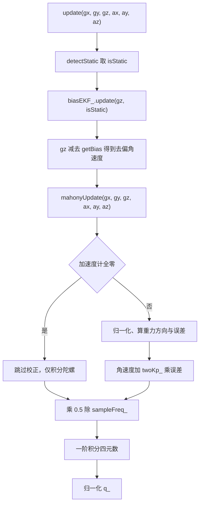
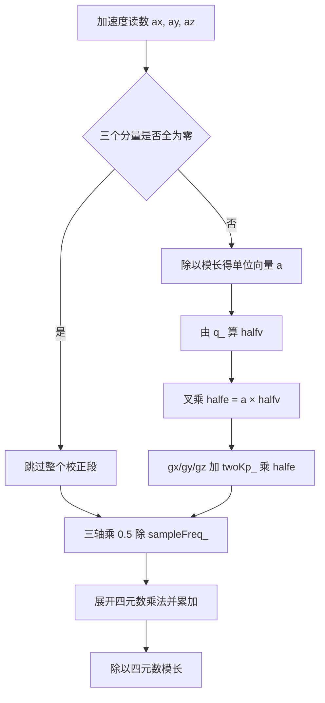

# 融合更新逐行

FusionAHRS::update 是融合类对外的唯一入口。它先判静止并更新零偏，再把去偏后的角速度交给私有的 mahonyUpdate；后者用加速度计估计的重力方向构造误差，按比例叠加到角速度，最后积分四元数并归一化。整条路径没有矩阵运算，每拍的开销集中在一次开方与几次乘加。

逐行对照 `Algorithm/Src/FusionAHRS.cpp:73-136`，把两段容易读错的地方拆开：重力方向为什么取一半向量，以及四元数四个分量在写回顺序上为什么不会互相覆写。读完要能回答：校正量凭什么与角速度直接相加；两个增益哪个在生效；步长从哪里来。

## update 的四步顺序

`update` 本体只有十行左右（`:73-86`），顺序固定：



```cpp
void FusionAHRS::update(float gx, float gy, float gz,
                        float ax, float ay, float az)
{
    bool isStatic = detectStatic(gx, gy, gz, ax, ay, az);

    // 更新 bias EKF
    biasEKF_.update(gz, isStatic);

    // 去偏
    gz -= biasEKF_.getBias();

    // 进入 Mahony
    mahonyUpdate(gx, gy, gz, ax, ay, az);
}
```

`detectStatic` 与 `biasEKF_.update` 拿到的都是原始 `gz`，只有传给 Mahony 的才是去偏值。EKF 的观测量是原始陀螺读数，状态是零偏绝对值，两者同量纲，做减法时不需要换算系数。四步里只有第三步会改写局部变量 `gz`，它按值传递，不会影响调用者的 `gyro[2]`。

## 偏置补偿放在 Mahony 之前

顺序不能对调。Mahony 的比例项把姿态误差当成角速度反馈注入，反馈的基准应当是真实角速度；如果先去偏、再算误差、最后把未去偏的量加回去，Z 轴偏置会被当成误差的一部分，比例项会持续输出一个抵消偏置的修正量，而 EKF 也在估计同一个偏置，两个环节的语义重叠，状态量 `x_` 就不再对应物理零偏。

当前顺序让两个环节职责清楚：EKF 负责常值部分，比例项负责倾斜方向的瞬时偏差。代价是检测环节仍用原始值，偏置大到一定程度会把静止判据顶出去，这在第二篇里已经展开。

## mahonyUpdate 的重力方向估计

四元数 $q = [q_0,q_1,q_2,q_3]$，$q_0$ 为标量部。机体系下估计重力方向取四元数旋转后 Z 轴单位向量的一半：

$$half v = \begin{bmatrix} q_1q_3 - q_0q_2 \\ q_0q_1 + q_2q_3 \\ q_0^2 - 0.5 + q_3^2 \end{bmatrix}$$

对应三行实现（`:103-105`）：

```cpp
halfvx = q_[1]*q_[3] - q_[0]*q_[2];
halfvy = q_[0]*q_[1] + q_[2]*q_[3];
halfvz = q_[0]*q_[0] - 0.5f + q_[3]*q_[3];
```

取一半不是随手写的缩放。四元数微分方程含 1/2 系数，误差叉乘若也带 1/2，两个因子在后面的积分里相消，源码索性把两边都省掉，变量名统一加 `half` 前缀。代入单位四元数 $q=[1,0,0,0]$：`halfvx = 0`、`halfvy = 0`、`halfvz = 0.5`，方向为 $(0,0,0.5)$，即机体系 Z 轴向上，与重力方向相差一个整体比例，这正是叉乘误差方向所需的形式。



## mahonyUpdate 的区段分布

函数体从 `:88` 到 `:136`，按功能可切成九段。段与段之间没有空行分隔，靠变量复用衔接，读代码时按行号定位比按视觉分段更快。

| 区段 | 行号 | 内容 |
| --- | --- | --- |
| 局部量 | `:91-94` | `recipNorm`、`halfvx/y/z`、`halfex/y/z`、`qa/qb/qc` |
| 加速度有效性 | `:96` | `if(!(ax == 0 && ay == 0 && az == 0))` |
| 归一化加速度 | `:98-101` | 除以加速度模长 |
| 估计重力方向 | `:103-105` | 由四元数算 $halfv$ |
| 误差叉乘 | `:107-109` | $half e = a \times half v$ |
| 比例校正 | `:111-113` | 三轴加 $2K_p\,half e$ |
| 半步长缩放 | `:116-118` | 三轴乘 $0.5/f_s$ |
| 积分 | `:120-127` | 一阶更新四个分量 |
| 归一化 | `:129-135` | 除以四元数模长 |

## 误差叉乘与比例校正的量纲

加速度计单位向量 $a$ 与 $half v$ 的叉乘给出误差方向：

$$half e = a \times half v = \begin{bmatrix} a_y half v_z - a_z half v_y \\ a_z half v_x - a_x half v_z \\ a_x half v_y - a_y half v_x \end{bmatrix}$$

$a$ 无量纲（归一化后的方向余弦），$half v$ 同样是四元数的纯数组合，所以 $half e$ 是无量纲量，物理含义是小角度误差的正弦值。比例项把它乘上增益后直接加到角速度上：

$$\omega_{corr} = \omega + twoK_p\, half e$$

两边量纲要一致，意味着 `twoKp_` 的单位是 rad/s（角速度除以无量纲误差）。本工程取 1.0，比例项以误差的 1 倍注入角速度；`twoKi_` 取 0.0，源码里也没有积分支路，`\omega_{corr}` 不含积分项。按 1 kHz 折算，1.0 rad/s 的增益对应每拍约 0.001 rad 的姿态修正，误差在一秒内被压掉约 $e^{-1}$ 量级，属按源码推导的量级估计。

三行实现（`:111-113`）：

```cpp
gx += twoKp_ * halfex;
gy += twoKp_ * halfey;
gz += twoKp_ * halfez;
```

这里直接改写 `gx/gy/gz`，没有另开中间变量。`gz` 在此刻已经是去偏值，加上比例项后就是最终参与积分的角速度。三个分量的处理完全对称，没有哪个轴被特殊对待。

## 一阶积分与四个分量的写回顺序

四元数微分方程：

$$\dot q = \frac{1}{2}\,q \otimes \omega_{corr}$$

一阶欧拉离散，$\Delta t = 1/f_s$：

$$q_{k+1} = q_k + \frac{\Delta t}{2}\,\bigl(q_k \otimes \omega_{corr}\bigr)$$

源码先把角速度三轴乘 $0.5/f_s$（`:116-118`），再按四元数乘法展开成四个分量（`:120-127`）：

```cpp
gx *= (0.5f / sampleFreq_);
gy *= (0.5f / sampleFreq_);
gz *= (0.5f / sampleFreq_);

qa = q_[0];
qb = q_[1];
qc = q_[2];

q_[0] += (-qb*gx - qc*gy - q_[3]*gz);
q_[1] += (qa*gx + qc*gz - q_[3]*gy);
q_[2] += (qa*gy - qb*gz + q_[3]*gx);
q_[3] += (qa*gz + qb*gy - qc*gx);
```

把 $q_k \otimes \omega$ 按分量展开，其中 $\omega = (0, \omega_x, \omega_y, \omega_z)$，得到

$$q \otimes \omega = \begin{bmatrix} -q_1\omega_x - q_2\omega_y - q_3\omega_z \\ q_0\omega_x + q_2\omega_z - q_3\omega_y \\ q_0\omega_y - q_1\omega_z + q_3\omega_x \\ q_0\omega_z + q_1\omega_y - q_2\omega_x \end{bmatrix}$$

由于 `gx/gy/gz` 已经带了 $0.5/f_s$ 因子，这四行直接把结果加回 `q_` 即完成一步积分。`q_[3]` 在前三行右端反复出现，它直到第四行才被写回，前三行读到的都是上一拍的旧值；`q_[0]`、`q_[1]`、`q_[2]` 则分别用 `qa`、`qb`、`qc` 显式保存旧值。四个分量的更新因此等价于同时使用上一拍的 `q_[0..3]`，写回顺序不影响结果。如果哪天有人把第四行挪到最前面，前三行就会读到新的 `q_[3]`，积分结果随之改变。

积分完成后除以模长（`:129-135`），消除一阶积分引入的模长漂移。这一步用的是普通除法加 `std::sqrt`，而参考实现 MahonyAHRS.c 用的是 `invSqrt` 快速反平方根。

## 加速度计全零的短路分支

`:96` 的判断是精确浮点比较：

```cpp
if(!(ax == 0 && ay == 0 && az == 0))
```

三个分量同时为 0 时才跳过整个校正段，只做陀螺积分。这样做的目的是避免对零向量归一化，否则 `1.0f / std::sqrt(0)` 会得到无穷，后续把无穷乘回 `ax/ay/az` 会得到 NaN，并污染整条姿态链。代价是加速度计失效期间姿态完全依赖陀螺，零偏估计也停摆。

判据用精确相等而不是小于某个小量。小于小量的写法会在加速度接近 0 但未归零时进入校正段，归一化把噪声放大到单位长度，方向完全随机。当前写法只拦住严格全零的输入，中间地带仍会进入校正，属于按源码推导的边界行为。

## 输入量纲由驱动给定

融合类内部没有量纲转换。传入的陀螺必须是 rad/s，加速度必须是 m/s²；换算发生在 `BMI088/Src/BMI088.cpp:152-163` 的 `convertData()`：加速度乘 `BMI088_ACCEL_3G_SEN`，陀螺乘 `BMI088_GYRO_2000_SEN` 后再乘 2.0f。因此 `detectStatic` 里 0.02 与 0.2 两个阈值作用在驱动输出上，驱动的缩放系数会直接改变阈值的物理含义。

运行侧的衔接在 `Task/Src/ImuTask.cpp:49-56`：把 `gyro[0..2]`、`accel[0..2]` 按顺序传入 `ahrs.update`，`:59` 取回四元数，`:62-64` 按 `q[0]` 为 w 转欧拉角。融合类只提供四元数，欧拉角换算与角度制转换都留在任务里。

## 逐行引用时的偏移来源

| 容易读错的地方 | 现象 | 对应位置 |
| --- | --- | --- |
| 把 `twoKi_` 当作可调积分项 | 调整无响应，源码无积分支路 | `FusionAHRS.cpp:88-136`、`FusionAHRS.h:51-54` |
| 认为 `gz` 一直是原始值 | 进 Mahony 的 `gz` 已去偏，还被叠加比例项 | `FusionAHRS.cpp:82`、`:113` |
| 加速度全零判据用近似比较 | 代码是精确浮点比较，只拦全零 | `FusionAHRS.cpp:96` |
| 认为 `halfv` 是完整重力方向 | 它是旋转后 Z 轴的一半，配 `halfe` 消去 1/2 | `FusionAHRS.cpp:103-109` |
| 忽略 `sampleFreq_` 是外传常量 | 实际周期变化时积分与校正强度都变 | `FusionAHRS.cpp:116-118`、`ImuTask.cpp:19` |
| 认为 `twoKp_ = 1.0` 是弱校正 | 误差直接按 1 倍角速度注入，1 kHz 下回正很快 | `FusionAHRS.cpp:51`、`:111-113` |
| 积分后不归一化 | 一阶积分模长漂移，姿态尺度失真 | `FusionAHRS.cpp:129-135` |
| 把欧拉角输出当作融合类职责 | 转欧拉角在 `ImuTask`，融合类只给四元数 | `FusionAHRS.cpp:138-141`、`ImuTask.cpp:62-64` |

源文件末行 `}` 在 `:141`，文件没有行尾换行，按 `wc -l` 会得到 140。逐行引用时以编辑器行号为准，否则整段会错开一行。

## 小结

### 核心概念

- `update` 的顺序固定为静态检测、EKF 更新、去 Z 轴偏置、Mahony 校正。
- `mahonyUpdate` 用加速度计单位向量与四元数估计重力方向的叉乘构造误差，乘 `twoKp_` 后加到角速度。
- `twoKp_ = 1.0` 表示误差以 1 倍系数直接进入角速度；`twoKi_ = 0.0` 且源码无积分支路，纯比例加陀螺积分。
- 积分是一阶欧拉，步长 $\Delta t/2 = 0.5/sampleFreq_$，积分后必须归一化。
- 加速度计全零时跳过校正段，只做陀螺积分，防止对零向量归一化。
- 融合类不做量纲转换，输入必须是 rad/s 与 m/s²。

### 设计权衡

| 决策 | 选择 | 收益 | 代价 |
| --- | --- | --- | --- |
| 偏置补偿放在 Mahony 之前 | 先减 `x_` 再算误差 | 校正基准干净 | 检测仍用原始值，大偏置下门控受影响 |
| 只用比例项 | `twoKi_ = 0`，无积分实现 | 无积分饱和与 windup | 静态倾斜偏差无法消除 |
| 重力方向取一半向量 | `halfv` 与 `halfe` 成对 | 与四元数 1/2 系数相消 | 变量语义不直观 |
| 一阶欧拉积分 | 每步一次乘加 | 计算量小，适合 1 kHz | 高速旋转时截断误差增大 |
| 每步归一化 | 除以模长 | 抑制模长漂移 | 每步一次平方根 |

## 练习

### 基础题

1. 写出 `FusionAHRS.cpp:111-113` 中三轴校正量的量纲，并解释它为什么能与陀螺角速度直接相加。
2. 从 `halfvx/halfvy/halfvz` 在 $q=[1,0,0,0]$ 时的取值出发，验证此时估计重力方向为 $(0,0,0.5)$。
3. 计算 $\Delta t = 1/1000$ s、$\omega = (0,0,1)$ rad/s 时四元数一积分前后的变化，说明归一化前后模长差。
4. 解释 `if(!(ax == 0 && ay == 0 && az == 0))` 为真与为假时，`mahonyUpdate` 的行为差异。

### 挑战题

1. 若把积分从一阶欧拉改成二阶龙格库塔，写出需要的额外四元数计算，并评估在 1 kHz、$|\omega| = 5$ rad/s 下两种离散的截断误差量级。
2. 论证源码中 `q_[3]` 没有单独副本但四个分量更新仍等价于全部使用旧值，给出四元数乘法的分量展开并逐项核对。

### 附：本页引用的固件路径

| 路径 | 用途 |
| --- | --- |
| `/home/wyx/rm/2026SentriOmeniGimbal/2026OmniSentryGimbal/Algorithm/Src/FusionAHRS.cpp` | `update` 与 `mahonyUpdate` 实现 |
| `/home/wyx/rm/2026SentriOmeniGimbal/2026OmniSentryGimbal/Algorithm/Inc/FusionAHRS.h` | 成员与接口声明 |
| `/home/wyx/rm/2026SentriOmeniGimbal/2026OmniSentryGimbal/Task/Src/ImuTask.cpp` | 调用顺序与欧拉角换算 |
| `/home/wyx/rm/2026SentriOmeniGimbal/2026OmniSentryGimbal/Algorithm/Src/MahonyAHRS.c` | 比例加积分参考实现 |
| `/home/wyx/rm/2026SentriOmeniGimbal/2026OmniSentryGimbal/BMI088/Src/BMI088.cpp` | 输入量纲换算 |
