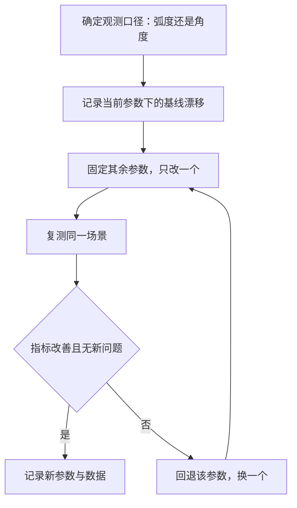
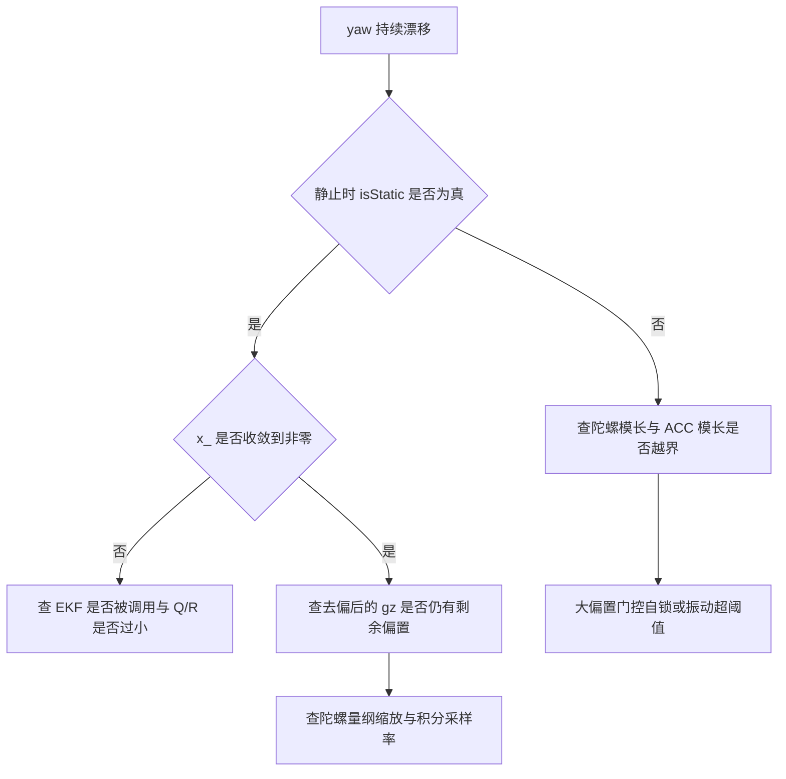

# 参数整定与实测

FusionAHRS 里可调的常量分成三组：静态检测阈值、零偏 EKF 的噪声参数、Mahony 的比例增益与采样率。三组互相牵制，单独改动一个参数，效果往往由另一组的状态解释，所以整定流程要求先固定基线、记录观测口径，再单变量改动、复测同一场景。

`Algorithm/Src/FusionAHRS.cpp` 与 `Task/Src/ImuTask.cpp` 里可调的常量集中成表，逐条给出调大调小的后果与实测方法；没有实测数据的条目按代码推导，标明为待实测。

## 三组参数的目标冲突

按目标拆开，参数的作用各自清楚：静态检测决定 EKF 何时工作，$Q/R$ 决定偏置估计的收敛速度与噪声水平，`twoKp_` 与 `sampleFreq_` 决定重力校正的时间常数。麻烦在于目标之间方向相反。

| 整定目标 | 主要参数 | 冲突目标 |
| --- | --- | --- |
| 静止时 yaw 漂移小 | $Q$、$R$、陀螺阈值 | 收敛速度、误判静止 |
| 动态时 roll/pitch 跟随快 | `twoKp_` | 振动噪声进入姿态 |
| 上电快速给出偏置 | $P_0$、$Q$ | 初值受首个样本噪声影响 |
| 静止判定准确 | 陀螺阈值、重力阈值 | 收敛速度 |

把阈值调大能让更多帧进入估计，收敛变快，代价是机动过程被误判成静止、真实角速度被当成零偏吸收；把阈值调小能减少误判，代价是静止帧变少、偏置收敛变慢甚至不收敛。这两个方向不能同时改善，只能按使用场景取折中。云台的主要工作是低频指向，静止窗口多，偏置估计的收益大于误判风险，因此当前阈值取得偏宽松。

## 采样率把三组参数串在一起

三组参数里只有 `sampleFreq_` 是外部传入的，它同时出现在三个环节：四元数积分的步长、比例校正每秒累积的次数、EKF 过程噪声每秒注入的方差。改它的影响是全局的。

零偏 EKF 的时间常数由 $Q$、$R$ 与实际采样率共同决定。按 `FusionAHRS.cpp` 的 $Q=10^{-6}$、$R=10^{-4}$ 和 1 kHz 推导，稳态协方差 $P^{*}=9.512\times10^{-6}$、增益 $K^{*}=0.0951$，时间常数 10.5 ms（$\sqrt{QR}$ 近似口径见第二篇）。实际循环周期大于 1 ms 时，静止样本到达率下降，同一个 $Q$ 每秒注入的方差减少，时间常数变长。

`twoKp_` 与 `sampleFreq_` 的耦合方向相反。比例项每拍加 `twoKp_ * halfe` 到角速度，再统一乘 $0.5/sampleFreq_$ 积分，$halfe$ 是角度量级，最终每拍的姿态修正量与比例项近似成正比，每秒的修正总量则与采样率成正比。标称 1000 Hz 而实际周期偏大时，每秒的修正次数减少，等效校正带宽下降。



## 参数表与单变量调法

| 参数 | 位置 | 当前值 | 调大后果 | 调小后果 | 实测方法 |
| --- | --- | --- | --- | --- | --- |
| `GRAVITY` | `FusionAHRS.cpp` | 9.81 m/s² | 静止判据整体上移，水平静止仍满足 | 静止判据下移，偏差偏正时误判运动 | 静止记录 `accNorm`，与 9.81 比较 |
| `GYRO_STATIC_THRESH` | `FusionAHRS.cpp` | 0.02 rad/s | 更多帧判静止，机动被当零偏；大偏置自锁阈值抬高 | 静止帧变少，偏置收敛慢或不收敛 | 静止记录三轴陀螺模长分布，取分位数 |
| `ACC_STATIC_THRESH` | `FusionAHRS.cpp` | 0.2 m/s² | 加减速与振动也判静止 | 轻微振动即判运动，EKF 少更新 | 静止与手持晃动两组记录 `\|accNorm-9.81\|`，驱动按 9.8 归一化，实测基线在 9.8 附近，与判据差 0.01 |
| `P_` 初值 | `FusionAHRS.cpp` | 0.1 | 首拍增益更接近 1，更依赖首个样本 | 首拍增益下降，初值收敛变慢 | 上电静止，观察前十余拍偏置估计 |
| `Q_` | `FusionAHRS.cpp` | $10^{-6}$ | 偏置跟随快，静止噪声进入估计；运动后重收敛更快 | 收敛慢，长机动后恢复慢 | 注入已知恒定偏置，测 `x_` 收敛时间 |
| `R_` | `FusionAHRS.cpp` | $10^{-4}$ | 估计平滑但收敛慢 | 收敛快但估计抖动大 | 同上，同时记录 `x_` 的方差 |
| `twoKp_` | `FusionAHRS.cpp` | 1.0 | 重力校正强，回正快，振动下 roll/pitch 抖动 | 回正慢，动态倾斜恢复差 | 快速倾斜后释放，测 roll/pitch 回到稳态的时间 |
| `twoKi_` | `FusionAHRS.cpp` | 0.0 | 无效果，源码无积分支路 | 无效果 | 全文件搜索写入点 |
| `sampleFreq_` 实参 | `ImuTask.cpp` | 1000 Hz | 积分步长变小，同样角速度下姿态变化变小 | 积分步长变大，姿态变化放大 | 实测循环周期后重新计算 |
| 循环延时 | `ImuTask.cpp` | 1 ms 忙等 | 采样率下降，积分欠步，校正每秒次数减少 | 采样率上升但 CPU 占用增加 | DWT 计数或 GPIO 翻转加示波器 |

表里 `twoKi_` 一行是特例：调大调小都没有后果，因为 `FusionAHRS.cpp` 没有任何一行读写它。这类参数在表里保留，是为了避免后来者以为漏调了。

后果两列都按其余参数不动推导，实际复测时至少有一个耦合项会跟着变：改 $Q$ 会改变 EKF 的时间常数，也会改变重回静止后的首拍增益；改 `twoKp_` 会改变静态倾斜偏差 $b/K_p$，把原本由 X/Y 偏置引起的误差掩盖掉。记录数据时把改动前后的两组曲线放在同一时间轴，先看趋势再看绝对值。

$Q$ 与 $R$ 是方差，开方后才是标准差：$\sqrt{Q}=10^{-3}$、$\sqrt{R}=10^{-2}$，观测噪声的标准差是过程噪声的十倍。把 $Q$ 误写成 $10^{-3}$ 会让稳态 $P^{*}$ 抬高一个数量级，增益接近 1，估计退化为跟随瞬时读数。

## 静止漂移与阶跃回正的测法

静止漂移的测法：让云台在水平台面上静止，记录 `yaw_out`（弧度）或 `imu_data.yaw`（角度），统计每分钟的变化量。若每分钟漂移远大于陀螺零偏量级，检查 `isStatic` 是否长期为真、`x_` 是否收敛。漂移量的记录必须先声明单位，两套变量的数值差 57.3 倍。

阶跃回正的测法：水平静止后手动把云台快速倾斜约 20°，释放并保持静止，记录 `roll_out` 与 `pitch_out` 回到最终值的时间与超调。`twoKp_` 越大，回正越快，振动耦合越明显。该测试同时反映比例增益与采样率的耦合，因为每秒修正次数由后者决定。

## 循环周期与偏置注入的测法

循环周期的测法：在主循环首尾翻转一个空闲 GPIO，用示波器测周期；或读取 DWT 计数器（内核自带的周期计数器，按 CPU 时钟累加，见 `bsp_dwt.h`），连续两次采样求差。实际周期是 1 ms 延时加上 `BMI088_Read`、控温、融合与写总线的耗时，必然大于 1 ms，属待实测项。测得周期后，`sampleFreq_` 的实参应当按实测值重算，而不是继续沿用注释里的 1000。

DWT 测周期的做法只有三行：

```c
/* 示意：用 DWT 周期计数测一次循环耗时 */
uint32_t t0 = DWT->CYCCNT;
main_loop_body();
uint32_t cycles = DWT->CYCCNT - t0;
float period_us = cycles / 168.0f;   /* 168 MHz 下每计数约 5.95 ns */
```

偏置注入的测法：在 `ImuTask` 调用 `ahrs.update` 前给 `gyro[2]` 叠加一个常量偏置，重新上电静止，观察 `x_` 在多少拍内收敛到该常量。该方法需要临时改动调用点，测完回退。

DWT 测量的分辨率由计数时钟决定，`BSP/Src/bsp_dwt.cpp` 里的计数器按 CPU 周期运行，168 MHz 下每计数约 5.95 ns，测 1.3 ms 量级的周期时量化误差可以忽略。示波器方法的误差主要来自 GPIO 翻转本身的开销，两次翻转之间的其他代码越短，测得越接近真实循环周期。

偏置注入实验有一个前提要检查：叠加后的陀螺模长要小于 `GYRO_STATIC_THRESH`，否则 `detectStatic` 恒为假，`x_` 不会更新，测出来的是一条水平线而不是收敛曲线。这也是门控自锁在实验设计里的体现。



## 弧度与角度两套观测口径

`ImuTask.cpp` 的三个 `volatile` 变量是主要观察点，单位是弧度；`imu_data` 在 `Message_Bus/message_bus.h` 定义，单位是角度制，写回见 `ImuTask.cpp`。两组变量同时存在，用途不同。

| 观测变量 | 单位 | 来源 | 用途 |
| --- | --- | --- | --- |
| `roll_out` | rad | `ImuTask.cpp` | 阶跃回正 |
| `pitch_out` | rad | `ImuTask.cpp` | 阶跃回正 |
| `yaw_out` | rad | `ImuTask.cpp` | 相对上电零点的漂移 |
| `imu_data.yaw` | deg | `ImuTask.cpp` | 角度制漂移，写总线 |
| `x_`、`P_` | rad/s、方差 | `FusionAHRS.h` | 私有，需要调试器或临时导出 |

两套口径的成因是历史遗留：`volatile` 变量给调试器与波形观察用，总线结构体给控制任务用。换算发生在 `ImuTask.cpp`，三行里把 roll、pitch、yaw 统一乘 180/π。若在调试器里直接读 `yaw_out` 再与总线的 yaw 比较，数值差 57.3 倍，容易被当成解算错误。记录时应当在表格里写明变量名与单位，而不是只写角度值。

## 常量写死带来的整定限制

四个 EKF 参数与两个增益都在构造时写死（`FusionAHRS.cpp`），没有运行期修改接口。`getBias` 是只读的，`x_` 与 `P_` 不对外暴露，整定只能改源码重新编译。

```cpp
GyroBiasEKF::GyroBiasEKF()
{
    x_ = 0.0f;
    P_ = 0.1f;
    Q_ = 1e-6f;
    R_ = 1e-4f;
}
```

```cpp
FusionAHRS::FusionAHRS(float sampleFreq)
    : sampleFreq_(sampleFreq),
      twoKp_(1.0f),
      twoKi_(0.0f),
```

`ImuTask.cpp` 的 `GYRO_ZERO_THRESHOLD`、`BIAS_ALPHA`、`LOOP_DT` 是另一类：它们声明在文件里，却没有使用点，属于未接线的整定预留。`Task/Src/UsbConnectTask.cpp` 虽然包含融合头文件，也没有构造对象，不能当作第二处调用点。

## 记录数据时的单位与接线问题

| 容易读错的地方 | 现象 | 对应位置 |
| --- | --- | --- |
| 改 `twoKi_` 期望改变稳态误差 | 无任何响应 | `FusionAHRS.cpp` |
| 把 `x_` 与 `gz` 混作同一量 | 以为去偏后 `gz` 为零 | `FusionAHRS.cpp` |
| 用角度制变量套弧度阈值 | 阈值差 57 倍 | `ImuTask.cpp`、`FusionAHRS.cpp` |
| 忽略 `GRAVITY` 与驱动 9.8 的不一致 | 误判为传感器标定误差 | `FusionAHRS.cpp`、`BMI088/BMI088config.h` |
| 只改 `Q` 或 `R` 而不动采样率 | 时间常数与预期不符 | `FusionAHRS.cpp`、`ImuTask.cpp` |
| 把 `DWT_Delay_ms(1)` 当精确 1 ms | 实际采样率低于 1000 Hz | `ImuTask.cpp` |
| 调试输出与总线数据单位混用 | 漂移量记录差 57 倍 | `ImuTask.cpp` |
| 认为未使用宏会自动生效 | 整定无效果 | `ImuTask.cpp` |

角度与弧度的换算关系固定：1 rad = 180/π = 57.2958°，所以用弧度阈值比较角度制变量时，判据会宽出 57.3 倍。把 `GRAVITY` 从 9.81 改成 9.8 的收益很小，因为差值 0.01 相对 0.2 的阈值只有 5%，改与不改都不影响判据结果。

## 整定的先后顺序

三组参数不能同时动。采样率是唯一会出现在三个环节里的量，先测出实际循环周期并据此确定 `sampleFreq_`，再调阈值，最后调 $Q$、$R$ 与 `twoKp_`，这样每次改动的影响才能归到一个环节上。顺序反过来时，阈值与增益的调整会被采样率的偏差掩盖，同一组参数在不同循环负载下表现不一致。

第一步测周期。用 DWT 或 GPIO 翻转测出主循环的实际周期，按 1/T 重算采样率实参。第二步调阈值。在静止与手持晃动两组数据上取陀螺模长的分位数与加速度模长的偏差分布，选出既能覆盖大部分静止帧、又不把晃动判成静止的一组值。第三步调 $Q$、$R$。这两个参数只影响 EKF，与姿态校正解耦，可以用偏置注入实验单独观察。第四步调 `twoKp_`。比例增益会直接改变姿态输出，放在最后调，前面三步确定后它的效果才可复现。

每个参数改完都要回退一次再复测一遍，确认指标变化确实来自这次改动。云台的机械结构在加减速时会带来低频振动，`ACC_STATIC_THRESH` 的取值需要覆盖这一项，否则 EKF 在运动段会频繁被门控打断。覆盖范围属待实测。

整定记录至少要包含四项：循环周期的实测值、两组阈值的分位数、$Q/R$ 的取值，以及每组参数下 yaw 的漂移速度。缺任何一项，复测结果都无法与上一组参数对照。

若把采样率按实测的 1.28 ms 周期改成 781 Hz，`Q` 仍按拍施加，稳态 $P^{*}$ 与 $K^{*}$ 不变，时间常数从 10.5 ms 变为 1/(0.0951 × 781) = 13.5 ms；四元数积分每拍乘的 $0.5/f_s$ 从 $5\times10^{-4}$ 变为 $6.4\times10^{-4}$，单拍姿态变化相应放大。这两个方向都属按公式推导，需要实测确认。

## 小结

### 核心概念

- 可调参数分静态阈值、EKF 噪声、Mahony 增益与采样率三组，互相耦合。
- `GYRO_STATIC_THRESH` 0.02 rad/s 与 `ACC_STATIC_THRESH` 0.2 m/s² 决定 EKF 更新门控，调大偏向漏判机动，调小偏向漏判静止。
- $Q=10^{-6}$、$R=10^{-4}$ 决定偏置收敛速度与平滑度，1 kHz 下时间常数约 10.5 ms，实际周期变化时同步变化。
- `twoKp_ = 1.0` 决定重力校正强度；`twoKi_ = 0.0` 与积分残项无实现，调节无效。
- `sampleFreq_` 由构造实参固定为 1000 Hz，与 `DWT_Delay_ms(1)` 忙等循环的实际周期不一致，属待实测项。
- `roll_out/pitch_out/yaw_out` 是弧度，`imu_data` 是角度制，实测记录必须先声明单位。

### 设计权衡

| 决策 | 选择 | 收益 | 代价 |
| --- | --- | --- | --- |
| 参数编译期常量 | 全部 `#define` 或构造初始化 | 无运行期分支，参数稳定 | 整定需重编译，不能在线调 |
| 静止阈值取模长 | 与姿态解耦 | 倾斜静止也可估计 | 无法区分水平转动与小偏置 |
| $Q/R$ 保持固定量级 | 不随运动状态切换 | 实现简单 | 机动与静止共用一套收敛速度 |
| 观测变量用 `volatile` | 便于调试器查看 | 无需额外接口 | 单位与总线数据不同，容易混用 |
| 采样率外部传入 | 与循环解耦 | 算法源码可复用 | 与实际周期不一致时无告警 |

## 练习

### 基础题

1. 根据 `FusionAHRS.cpp` 的取值，推导 $P^{*}$ 与 $K^{*}$，并说明把 $Q$ 调到 $10^{-4}$ 后时间常数如何变化。
2. 说明 `GYRO_STATIC_THRESH` 调大后，为什么机动过程中可能把真实角速度当成零偏吸收。
3. `roll_out` 与 `imu_data.roll` 分别是什么单位，记录 yaw 漂移时应选哪一个，为什么。
4. 指出 `ImuTask.cpp` 三个宏在文件中的使用情况，并说明它们属于什么状态。

### 挑战题

1. 设计一个不重编译也能整定的方案：给出需要新增的最小接口、参数存储位置与生效时机，并评估对中断与主循环的影响。
2. 实测循环周期后，若得到 1.28 ms，重新计算 `sampleFreq_` 应传入的值，并分别说明这对 EKF 时间常数、四元数积分、比例校正每秒累积量的影响方向。

### 附：本页引用的固件路径

| 路径 | 用途 |
| --- | --- |
| `Algorithm/Src/FusionAHRS.cpp` | 全部可调常量与实现 |
| `Algorithm/Inc/FusionAHRS.h` | 私有成员与接口 |
| `Task/Src/ImuTask.cpp` | 采样率实参、观测变量、循环延时 |
| `BMI088/BMI088config.h` | 加速度与陀螺灵敏度常量 |
| `BSP/Src/bsp_dwt.cpp` | 循环周期测量所用计时器 |
