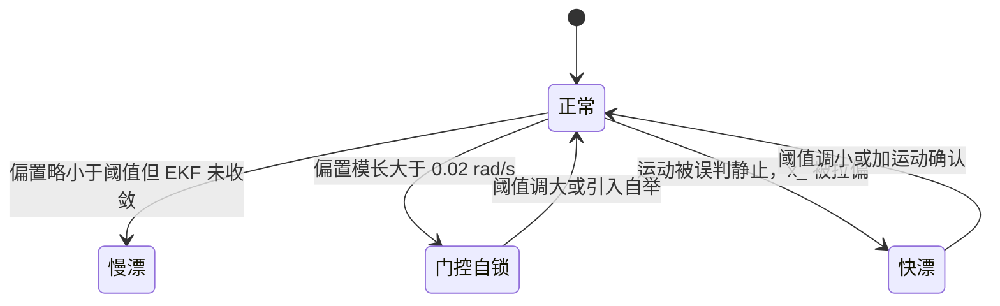
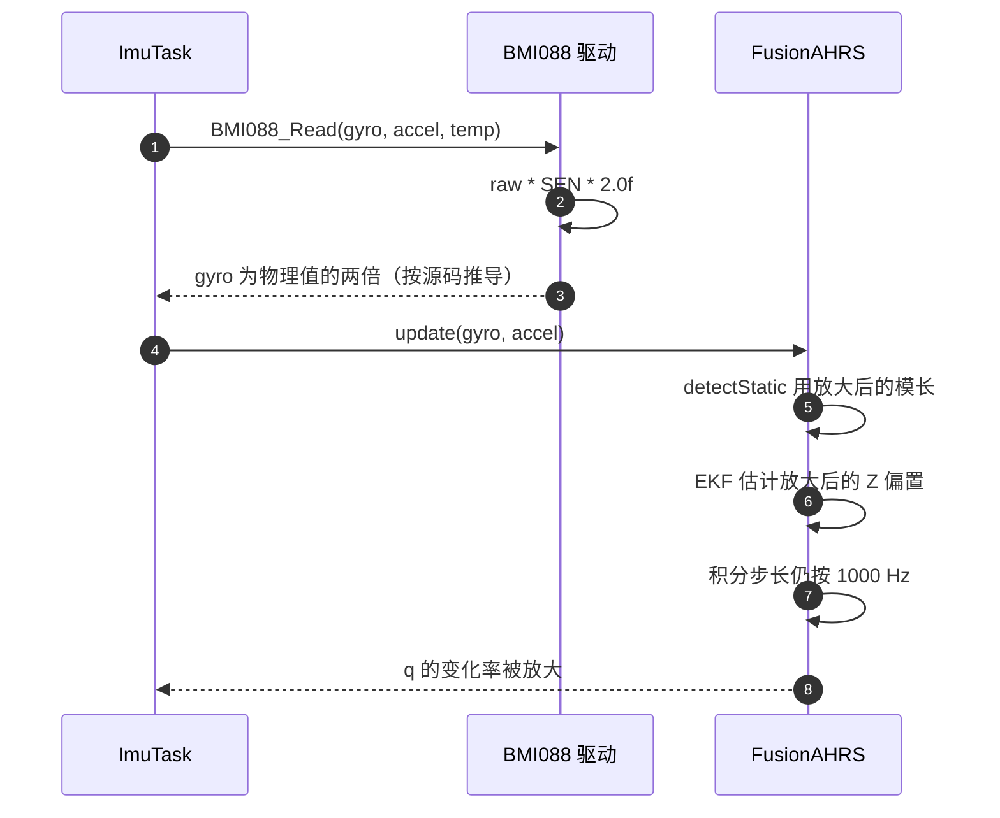

# 易错点与调试

姿态解算的输出错误很少来自公式本身，多数来自量级、单位与门控条件。零偏只在静止时更新，静止判定又依赖原始陀螺，两个环节的耦合会把一个参数问题放大成整条链路失效：陀螺缩放错了，阈值对应的物理门限跟着错；采样率与实参不一致，积分与收敛速度同时偏。

`Algorithm/Src/FusionAHRS.cpp`、`Algorithm/Inc/FusionAHRS.h`、`Task/Src/ImuTask.cpp` 与 `BMI088/Src/BMI088.cpp` 里已核对的问题汇总成一张清单，区分代码事实与按源码推导的推断，末尾是从现象定位到代码位置的顺序。前面四篇展开过的推导只给结论，重点放在现象与排查动作。

## 六类已核对问题的来源

按来源分类，便于定位。

| 类别 | 典型表现 | 涉及位置 |
| --- | --- | --- |
| 量级与单位 | 阈值差一个数量级或 57 倍 | `FusionAHRS.cpp:14-16`、`ImuTask.cpp:70-76` |
| 门控逻辑 | 偏置大时永不判静止 | `FusionAHRS.cpp:33-40`、`:76-79` |
| 模型假设 | X/Y 偏置不估计，yaw 无绝对参考 | `FusionAHRS.h:20`、`ImuTask.cpp:15` |
| 采样率 | 标称 1 kHz 与实际周期不符 | `ImuTask.cpp:19`、`:111` |
| 未接线的代码 | 改了无响应或变量声明未用 | `ImuTask.cpp:24`、`:29-31`、`FusionAHRS.h:51-54` |
| 驱动换算 | 陀螺输出与物理量不成比例 | `BMI088/Src/BMI088.cpp:158-160` |

## 把方差当成标准差

$Q=10^{-6}$、$R=10^{-4}$ 是方差，不是标准差。开方后 $\sqrt{Q}=10^{-3}$、$\sqrt{R}=10^{-2}$，观测噪声的标准差是过程噪声标准差的十倍，这个比例才是 $R$ 大于 $Q$ 的实际含义。$P$ 每拍加 $Q$，而更新只在静止时执行，所以过程噪声按拍累积，单位是每拍而不是每秒。

按 `FusionAHRS.cpp:26-27` 推导的稳态协方差与增益见下表。若把 $Q$ 误当标准差并写成 $10^{-3}$，稳态 $P$ 会抬高一个数量级，增益接近 1，估计退化为跟随瞬时读数。

| 写法 | 稳态 $P^{*}$ | 稳态 $K^{*}$ | 表现 |
| --- | --- | --- | --- |
| $Q=10^{-6}$、$R=10^{-4}$ | $9.512\times10^{-6}$ | 0.0951 | 10.5 ms 收敛 |
| $Q=10^{-3}$、$R=10^{-4}$ | $3.1\times10^{-4}$ | 0.76 | 每拍跟随，噪声直接进入估计 |

这类错误的隐蔽之处在于曲线仍然收敛，只是估计值抖动明显、去偏后的 `gz` 残差仍大。判断方法是同时记录 `x_` 与静止时的 `gz`，若两者方差接近，说明增益已经饱和。

## 偏置大于阈值后的门控自锁

`detectStatic` 用原始 `gz` 的模长判断（`FusionAHRS.cpp:66`、`:79`），而 `x_` 初值为 0（`:24`），更新只在判为静止后执行。若真实偏置的模长大于 `GYRO_STATIC_THRESH`，陀螺模长恒越界，`isStatic` 恒为假，EKF 永不更新，偏置估计恒为 0。这是一个自锁回路：

$$|b| \ge 0.02\ \text{rad/s} \;\Rightarrow\; \|\omega\| \ge 0.02 \;\Rightarrow\; isStatic = \text{false} \;\Rightarrow\; \hat x \equiv 0$$

0.02 rad/s 对应 1.146 deg/s。BMI088 的零偏量级常见在 1 deg/s 附近，该门限把可估计范围卡在一个较窄的区间；器件实际分布属待实测。反方向是阈值过大：机动中角速度偶尔落进阈值且重力模长偏差很小，`isStatic` 短暂为真，EKF 把真实角速度当偏置吸收，`x_` 被拉偏，随后 yaw 出现同向漂移。

两个方向的现象有区别：自锁时 yaw 以恒定速率漂移，`x_` 一直贴着 0；误判吸收时漂移方向随最近一次动作改变，`x_` 会跳到非零值。排查时先看 `x_` 是否动过，再看动的时间点是否对应一次机动。

## 单轴假设的两个后果

`GyroBiasEKF` 只有一个状态 `x_`（`FusionAHRS.h:20`），`update` 只把 `gz` 传给它（`FusionAHRS.cpp:79`），去偏也只改 `gz`（`:82`）。X/Y 轴偏置没有状态，不会被消除，后果是静态倾斜误差。平衡时 Mahony 比例项提供的角速度等于偏置，$2K_p half e = b$，小角度下 $half e \approx \theta/2$，得

$$\theta \approx \frac{b}{K_p}$$

按 `twoKp_ = 1.0` 推导，$b = 0.005$ rad/s 对应约 0.005 rad（0.29°）的 roll 或 pitch 稳态偏差。偏置越大，倾斜偏差越大，且不随时间收敛。

Z 轴偏置的后果不同。重力参考对偏航不可观测，`halfez` 在姿态水平时接近 0，Z 偏置直接积分进 yaw。单轴估计覆盖了会持续漂移的那一轴，代价是放弃对 X/Y 稳态精度的改善。两轴现象可以用同一份静止数据分开：roll/pitch 有固定偏差而 yaw 匀速漂，说明 X/Y 偏置与 Z 偏置同时存在，但只有后者被估计。

## 标称 1000 Hz 与实际周期

`ImuTask.cpp:19` 以 1000.0f 构造，注释写 1 kHz。主循环末尾是 `DWT_Delay_ms(1)`（`:111`），加上 `BMI088_Read`、控温、融合与写总线的耗时，实际周期大于 1 ms，实际采样率低于 1000 Hz。影响落在三个环节：

| 环节 | 使用的采样率 | 实际周期偏大时的后果 |
| --- | --- | --- |
| 四元数积分 | `0.5f / sampleFreq_`（`FusionAHRS.cpp:116-118`） | 每拍步长偏小，姿态对角速度欠积分 |
| 比例校正每秒累积 | 每拍固定，频率随周期下降 | 校正带宽下降，回正变慢 |
| EKF 过程噪声 | 每拍加 $Q$（`:33`） | 每秒注入方差低于 $10^{-3}$，收敛变慢 |

三个后果方向一致：姿态对真实运动的响应变弱，零偏收敛变慢。实际周期属待实测项，可以用 DWT 或 GPIO 翻转测量，测得后按 1/T 重算实参。DWT 计数器按 CPU 周期运行，168 MHz 下每计数约 5.95 ns，测 1 ms 量级周期的分辨率足够。

## 驱动侧陀螺乘了 2.0f

`BMI088/Src/BMI088.cpp:158-160` 把陀螺原始值乘 `BMI088_GYRO_2000_SEN` 后再乘 2.0f。宏的值是 $2000/32768\times\pi/180 = 0.0010653$，单位是 rad/s 每 LSB；乘 2 后输出为 0.0021305 rad/s 每 LSB，是物理角速度的两倍。底盘板同位置乘的是 1.19f，两块板不一致。

按源码推导，待实测。若成立，融合环节收到的角速度是真实值的 2 倍，后果包括：

- 四元数积分把姿态变化放大一倍，yaw 漂移速度翻倍。
- `detectStatic` 的 0.02 rad/s 阈值作用在放大后的值上，对应的物理门限降到 0.01 rad/s（0.573 deg/s），门控自锁更容易发生。
- 零偏 EKF 估计的是放大后的偏置，去偏后的残差仍是放大后的量。

验证方法：给云台一个已知的匀速转动，比较融合输出的角速度与外部参考；或用静止时的陀螺读数与器件手册的零偏范围对比。该问题属于 01 单元的量纲换算范围，本单元只记录它对融合链路的影响。

## 未接线变量与双单位观测

`ImuTask.cpp:24` 的 `yaw_bias`、`:29-31` 的 `GYRO_ZERO_THRESHOLD`、`BIAS_ALPHA`、`LOOP_DT` 全文件没有使用点。这组常量看起来是为动态零偏补偿准备的，但补偿没有落地，实际运行的零偏补偿只有 EKF 一条路。`FusionAHRS.h:51-54` 的 `twoKi_` 与三个 `integralFB*` 同样只在构造里初始化，源文件没有读写，改这些值不产生任何效果。参考实现 `MahonyAHRS.c:38-39` 也留下了 `gyroZ_bias` 与 `imu_static` 两个没有读写点的全局变量。

观察点本身也有单位问题。`ImuTask.cpp:20` 的三个 `volatile` 变量是弧度，`:74-76` 之后写入 `imu_data` 的是角度制，两组变量同时存在。

| 观察目标 | 变量 | 位置 | 备注 |
| --- | --- | --- | --- |
| 相对上电零点的偏航 | `yaw_out` | `ImuTask.cpp:70` | 弧度 |
| 绝对欧拉角 | `imu_data.yaw` | `ImuTask.cpp:99` | 角度制 |
| 累计偏航 | `gimbal_yaw_total` | `ImuTask.cpp:93` | 未减 `yaw_zero` |
| 零偏估计 | `x_`、`P_` | `FusionAHRS.h:20-21` | 私有 |
| 静止标志 | `isStatic` | `FusionAHRS.cpp:76` | 局部量，需在线或加探针 |

`ImuTask.cpp:97-107` 依次把 roll、pitch、yaw、角速度、加速度与温度写回 `imu_data`。调试时以 `imu_data` 为准可以避免 57.3 倍的换算错误。`gimbal_yaw_total` 在 `:77-94` 累加的是未减 `yaw_zero` 的角度差，和 `yaw_out` 不是同一条基准，不能直接相加。

## 静止标志怎么观察

`isStatic` 是 `update` 的局部量（`FusionAHRS.cpp:76`），调试器里看不到，波形工具也取不到。要观察它，需要在 `:76` 与 `:79` 之间把它写进一个全局探针，或者临时改成 volatile 成员。改法只动这一处，测完回退。

探针落地后可以回答两个问题：静止判定的占空比是多少，以及 `x_` 非零的那些拍是否只出现在静止段。若占空比远低于预期，先查两个阈值与驱动缩放；若占空比正常而 `x_` 不动，查 `biasEKF_.update` 是否真的被调用（`:79`），以及 `Q` 是否被改成了极小值。

探针不要长期留在提交里：它多一次内存写，还会把 `isStatic` 的语义暴露成全局状态，后续可能被误用。观察结束后撤回改动，只在日志里保留一段记录。

## 从现象到位置的排查顺序

| 容易读错的地方 | 现象 | 对应位置 |
| --- | --- | --- |
| $Q$、$R$ 当成标准差 | 增益接近 1，估计跟随噪声 | `FusionAHRS.cpp:26-27` |
| 偏置大于陀螺阈值导致门控自锁 | yaw 恒速漂移，`x_` 恒为 0 | `FusionAHRS.cpp:15`、`:24`、`:33-40` |
| 运动被误判静止 | `x_` 被拉偏，漂移方向随动作改变 | `FusionAHRS.cpp:69-70` |
| 认为 X/Y 偏置也被估计 | 静止时存在固定 tilt 偏差 | `FusionAHRS.h:20`、`FusionAHRS.cpp:79-82` |
| 采样率按注释取 1000 Hz | 积分与校正强度都与实测不符 | `ImuTask.cpp:19`、`:111` |
| 陀螺缩放按 1 倍理解 | 漂移速度与阈值都偏两倍 | `BMI088/Src/BMI088.cpp:158-160` |
| 用 `roll_out` 记录角度 | 与 `imu_data` 差 57.3 倍 | `ImuTask.cpp:70-76` |
| 认为 `twoKi_` 可调 | 改值无响应 | `FusionAHRS.h:51-54` |
| 认为 `yaw_bias` 补偿已生效 | 相关宏未接线 | `ImuTask.cpp:24`、`:29-31` |
| 期望 yaw 有绝对参考 | 无磁力计，`mag` 声明未用 | `ImuTask.cpp:15` |
| 累计总角度减去了零点 | `gimbal_yaw_total` 累加的是未减 `yaw_zero` 的 yaw | `ImuTask.cpp:77-94` |
| 重复包含头文件当成两个实现 | 读构造次数出错 | `FusionAHRS.cpp:5`、`:10` |

按现象走一遍顺序：yaw 匀速漂且 `x_` 恒为 0，先量静止时陀螺模长，判断是否越过 0.02 rad/s；yaw 漂移方向随动作变，查 `isStatic` 是否在机动中短暂为真；roll/pitch 有固定偏差而 yaw 平稳，说明是 X/Y 偏置，属单轴假设的已知范围；所有量都偏两倍，回驱动查 `158-160` 的缩放系数；回正速度与预期不符，先测循环周期再谈增益。

这五条分支覆盖了已核对的问题来源。超出这张表的现象，先确认驱动输出与坐标定义，再查融合链路；顺序反了会把时间花在算法参数上，而问题实际在输入量纲。

## 小结

### 核心概念

- $Q$、$R$ 是方差，过程噪声每拍施加，收敛速度与采样率耦合。
- 静止检测使用原始陀螺模长，偏置模长超过 0.02 rad/s 时出现门控自锁，估计恒为 0。
- 单轴 EKF 只消除 Z 偏置引起的 yaw 漂移，X/Y 偏置转为约 $b/K_p$ 的静态倾斜误差。
- 实际循环周期大于 1 ms，四元数积分、比例校正与 EKF 收敛都按标称 1000 Hz 计算。
- 驱动侧陀螺乘了 2.0f，输出可能是物理角速度的两倍，属按源码推导的待实测项。
- 未接线的变量与宏集中在 `ImuTask.cpp:24`、`:29-31` 与 `FusionAHRS.h:51-54`，修改不会生效。

### 设计权衡

| 决策 | 选择 | 收益 | 代价 |
| --- | --- | --- | --- |
| 门控依赖原始陀螺 | 检测与估计共享输入 | 顺序简单 | 大偏置自锁 |
| 只估 Z 轴 | 一维状态 | 计算量最小，覆盖主要漂移 | X/Y 稳态精度不改善 |
| 采样率写死构造实参 | 不动态测量 | 源码可复用 | 与实际周期不符无告警 |
| 保留未接线变量 | 预留动态零偏接口 | 便于后续扩展 | 读代码时误认为已生效 |
| 观测变量与总线数据双单位 | 调试方便 | 各自满足用途 | 记录时容易混用 |

## 练习

### 基础题

1. 写出偏置模长等于 0.03 rad/s 时，`detectStatic` 的返回序列，并说明 `x_` 是否会变化。
2. 计算 $b = 0.01$ rad/s 时 X 轴偏置引起的静态倾斜误差，说明该结论用的是哪条公式。
3. 列出 `ImuTask.cpp` 中所有声明后未使用的变量与宏，并标注行号。
4. 说明 `yaw_out` 与 `imu_data.yaw` 的单位差异，以及混用时数值会差多少。

### 挑战题

1. 设计一个在不增加状态维度的前提下打破门控自锁的方案，要求给出对 `detectStatic` 或 EKF 初值的具体改动，并分析对正常偏置工况的影响。
2. 针对驱动侧 2.0f 缩放，设计一组只用云台自身数据、不依赖外部转台的验证实验，说明观测量、判据与可能的混淆因素。

### 附：本页引用的固件路径

| 路径 | 用途 |
| --- | --- |
| `/home/wyx/rm/2026SentriOmeniGimbal/2026OmniSentryGimbal/Algorithm/Src/FusionAHRS.cpp` | 阈值、EKF、融合实现 |
| `/home/wyx/rm/2026SentriOmeniGimbal/2026OmniSentryGimbal/Algorithm/Inc/FusionAHRS.h` | 成员声明与未接线参数 |
| `/home/wyx/rm/2026SentriOmeniGimbal/2026OmniSentryGimbal/Task/Src/ImuTask.cpp` | 主循环、单位换算、未使用变量 |
| `/home/wyx/rm/2026SentriOmeniGimbal/2026OmniSentryGimbal/Message_Bus/message_bus.h` | `imu_data` 结构定义 |
| `/home/wyx/rm/2026SentriOmeniGimbal/2026OmniSentryGimbal/BMI088/Src/BMI088.cpp` | 陀螺与加速度换算 |
| `/home/wyx/rm/2026SentriOmeniGimbal/2026OmniSentryGimbal/BMI088/BMI088config.h` | 灵敏度宏定义 |
| `/home/wyx/rm/2026SentriOmeniGimbal/2026OmniSentryGimbal/BSP/Src/bsp_dwt.cpp` | 循环周期测量 |
| `/home/wyx/rm/2026SentriOmeniGimbal/2026OmniSentryGimbal/Algorithm/Src/MahonyAHRS.c` | 参考实现里未接线的全局变量 |
| `/home/wyx/rm/2026SentriOmeniChassis/2026OmniSentryChassis/BMI088/Src/BMI088.cpp` | 底盘板缩放系数对比 |
