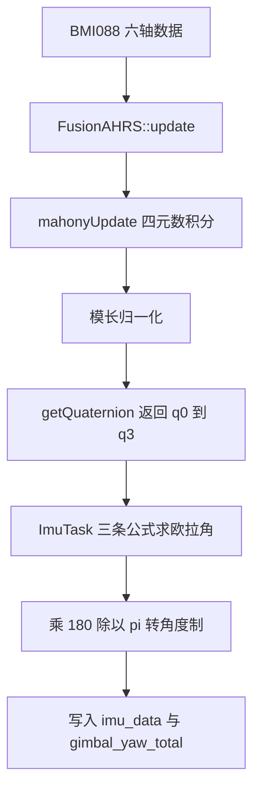
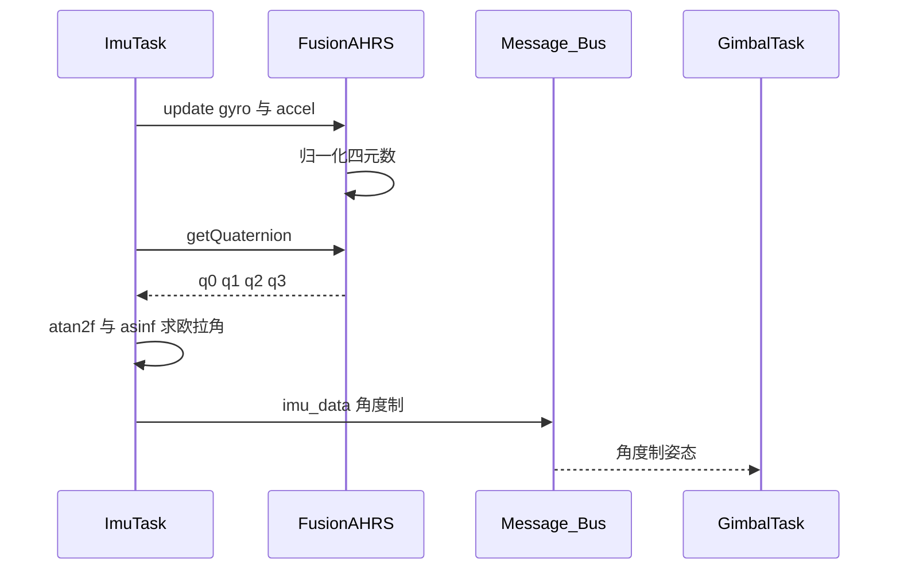

# 四元数表示与欧拉角换算

欧拉角用三个数描述姿态，直观，但俯仰接近 ±90 度时出现奇异（横滚与偏航退化为同一个自由度）；旋转矩阵没有奇异，却要维持九个元素的正交约束；四元数用四个数加一条模长约束，表示上没有奇异点。云台控制逐帧需要连续的横滚、俯仰与偏航，固件从融合算法取到四元数后，再换算成欧拉角交给 PID。

三种表示并不互斥：固件内部用四元数做积分，输出到控制环时换算成欧拉角，视觉端又把姿态封回四元数传给云台。三种表示的代价与 `ImuTask` 里的换算公式、取值范围需要逐项核对。

## 1. 三种姿态表示

| 表示 | 参数 | 约束 | 主要问题 |
| --- | --- | --- | --- |
| 欧拉角 | 3 | 无 | 俯仰 ±90 度附近奇异 |
| 旋转矩阵 | 9 | 正交且行列式为 1 | 冗余，逐帧更新代价高 |
| 四元数 | 4 | 模长为 1 | 双重覆盖，$q$ 与 $-q$ 表示同一旋转 |

四元数的一般形式

$$ q = q_0 + q_1 i + q_2 j + q_3 k $$

对应本项目的数组 `q[0]` 到 `q[3]`。单位约束是

$$ q_0^2 + q_1^2 + q_2^2 + q_3^2 = 1 $$

模长偏离 1 会同时破坏旋转矩阵的正交性与欧拉角公式的精度，融合算法在每帧末尾重新归一化（`Algorithm/Src/FusionAHRS.cpp`）。

## 2. 从四元数到欧拉角

### 2.1 实部在前的证据

两种主流写法（实部在前、实部在后）都能自洽，判定依据要来自代码本身。

1. `FusionAHRS` 构造函数把 `q_[0]` 置 1、其余置 0（`Algorithm/Src/FusionAHRS.cpp`），单位旋转对应实部为 1。
2. `Task/Src/UsbConnectTask.cpp` 的 `eulerToQuaternion` 逐行标注 `q[0]` 为 `w`、`q[3]` 为 `z`。
3. `Algorithm/Inc/MahonyAHRS.h` 用 `q0` 到 `q3` 命名全局四元数，沿用原版 Mahony 实现。
4. 三条换算公式与该约定一致，推导见 2.3 节。

### 2.2 四元数到旋转矩阵

单位四元数对应的旋转矩阵（本体到世界）为

$$ R = \begin{bmatrix}
1-2(q_2^2+q_3^2) & 2(q_1q_2-q_0q_3) & 2(q_1q_3+q_0q_2) \\
2(q_1q_2+q_0q_3) & 1-2(q_1^2+q_3^2) & 2(q_2q_3-q_0q_1) \\
2(q_1q_3-q_0q_2) & 2(q_2q_3+q_0q_1) & 1-2(q_1^2+q_2^2)
\end{bmatrix} $$

矩阵的更新来自陀螺仪积分。`mahonyUpdate` 在 `Algorithm/Src/FusionAHRS.cpp` 先把角速度乘以 $0.5/f_s$，再按

$$ \dot{q} = \frac{1}{2} \begin{bmatrix}
0 & -\omega_x & -\omega_y & -\omega_z \\
\omega_x & 0 & \omega_z & -\omega_y \\
\omega_y & -\omega_z & 0 & \omega_x \\
\omega_z & \omega_y & -\omega_x & 0
\end{bmatrix} q $$

用一阶欧拉法累加到 `q_[0..3]`。积分后立即归一化，避免浮点误差累积成模长漂移。

### 2.3 三条欧拉角公式

按 ZYX 顺序（先偏航、再俯仰、后横滚）从旋转矩阵取角：

$$ \text{roll} = \operatorname{atan2}(R_{32}, R_{33}), \quad
\text{pitch} = \arcsin(-R_{31}), \quad
\text{yaw} = \operatorname{atan2}(R_{21}, R_{11}) $$

把矩阵元素代入：

$$ R_{32} = 2(q_0q_1+q_2q_3), \quad R_{33} = 1-2(q_1^2+q_2^2) $$

$$ -R_{31} = 2(q_0q_2-q_1q_3) $$

$$ R_{21} = 2(q_0q_3+q_1q_2), \quad R_{11} = 1-2(q_2^2+q_3^2) $$

得到

$$ \text{roll} = \operatorname{atan2}\!\left(2(q_0q_1+q_2q_3),\ 1-2(q_1^2+q_2^2)\right) $$

$$ \text{pitch} = \arcsin\!\left(2(q_0q_2-q_1q_3)\right) $$

$$ \text{yaw} = \operatorname{atan2}\!\left(2(q_0q_3+q_1q_2),\ 1-2(q_2^2+q_3^2)\right) $$

三条式子与 `Task/Src/ImuTask.cpp` 的代码逐项对应。

```c
/* 简化：ImuTask 里的三条欧拉角公式，与上式逐项对应 */
float roll  = atan2f(2.0f*(q[0]*q[1] + q[2]*q[3]), 1.0f - 2.0f*(q[1]*q[1] + q[2]*q[2]));
float pitch = asinf(2.0f*(q[0]*q[2] - q[1]*q[3]));
float yaw   = atan2f(2.0f*(q[0]*q[3] + q[1]*q[2]), 1.0f - 2.0f*(q[2]*q[2] + q[3]*q[3]));
```

### 2.4 asinf 的奇异区间

$\arcsin$ 的定义域是 $[-1,1]$。俯仰角达到 ±90 度时，$2(q_0q_2-q_1q_3)$ 取 ±1，导数趋于无穷，横滚与偏航不再独立。参数因浮点舍入略超出 ±1 时，`asinf` 返回 NaN（浮点非法值），并沿 `roll`、`pitch`、`yaw` 传播到 `imu_data`。`Task/Src/ImuTask.cpp` 没有对参数做限幅。

```c
/* 现状（示意）：pitch 的参数没有限幅 */
float pitch = asinf(2.0f*(q[0]*q[2] - q[1]*q[3]));
/* 舍入使参数略超 [-1,1] 时，这里返回 NaN，并污染下游角度 */
```

云台机械上俯仰被限制在 -20 到 30 度（`Task/Src/GimbalTask.cpp`），正常工况远离奇异点。该限幅是软件常量，实际机械行程按结构件设计，属待现场确认项。

## 3. 本工程的换算与调用点

### 3.1 数据流



### 3.2 关键变量

| 名称 | 位置 | 含义 |
| --- | --- | --- |
| `q` | `Task/Src/ImuTask.cpp` | `std::array<float,4>`，标量在前 |
| `q_` | `Algorithm/Inc/FusionAHRS.h` | 融合类内部四元数 |
| `roll`、`pitch`、`yaw` | `Task/Src/ImuTask.cpp` | 换算结果，先弧度后角度制 |
| `roll_out` 等 | `Task/Src/ImuTask.cpp` | `volatile` 调试量，弧度制 |
| `imu_data.roll` 等 | `Message_Bus/message_bus.h` | 角度制输出 |

### 3.3 时序



## 4. 易错点

| # | 易错点 | 表现 | 位置 |
| --- | --- | --- | --- |
| 1 | 按分量在前的约定读 q | 欧拉角换算错位 | `Task/Src/ImuTask.cpp` |
| 2 | 不给 `asinf` 参数限幅 | 姿态异常时输出 NaN | 同上 |
| 3 | 跳过归一化直接换算 | 矩阵非正交，角度缓慢漂移 | `Algorithm/Src/FusionAHRS.cpp` |
| 4 | 弧度与角度制混用 | 误差量级差约 57 倍 | `Task/Src/ImuTask.cpp` |
| 5 | 把 q 与 -q 当作不同姿态 | 直接比较或插值时符号跳变 | 全文约定 |
| 6 | 认为板子的 roll 就是云台俯仰 | 视觉侧 pitch 实际取 `imu_data.roll` | `Task/Src/UsbConnectTask.cpp` |

## 5. 小结

### 核心概念

- 四元数用四个数与一条模长约束描述旋转，没有表示奇异。
- 本项目采用实部在前的约定，`q[0]` 为 w，四条证据一致。
- 欧拉角按 ZYX 顺序从旋转矩阵抽取，代码三条公式与之逐项对应。
- 俯仰 ±90 度是 `asinf` 的奇异点，参数越界会产生 NaN。
- 角度制与弧度制的分界落在 `Task/Src/ImuTask.cpp`。

### 设计权衡

| 权衡点 | 本工程选择 | 收益与代价 |
| --- | --- | --- |
| 姿态内部表示 | 单位四元数 | 无奇异、积分稳定；代价是换算成欧拉角多两次三角函数 |
| 输出表示 | 欧拉角角度制 | PID 直接相减；代价是俯仰奇异与绕圈问题外移给控制层 |
| 实部位置 | 标量在前 | 与 Mahony 原版一致；代价是与部分库的分量在前约定不同 |
| 参数保护 | 未做限幅 | 代码短；代价是异常姿态下 NaN 会传播 |

## 6. 练习

### 基础题

1. 写出单位四元数约束，并说明模长偏大 1% 时旋转矩阵的误差来源。
2. 给定 $q=(1,0,0,0)$，用三条公式求欧拉角。
3. 已知俯仰 10 度、横滚 5 度、偏航 30 度，写出 $q_0$ 的表达式（用半角公式）。

### 挑战题

4. 在 `Task/Src/ImuTask.cpp` 求 pitch 的那一行前后加入参数限幅，给出不会引入跳变的限幅方式，并说明理由。
5. 从旋转矩阵的九个元素出发，重新推导三条欧拉角公式，验证 ZYX 顺序的对应关系。
6. 用同一组四元数分别计算 $q$ 与 $-q$ 的欧拉角，解释结果差异的几何含义。

### 附：本页引用的固件路径

| 路径 | 用途 |
| --- | --- |
| `2026OmniSentryGimbal/Task/Src/ImuTask.cpp` | 四元数声明与欧拉角换算 |
| `2026OmniSentryGimbal/Algorithm/Src/FusionAHRS.cpp` | 四元数积分与归一化 |
| `2026OmniSentryGimbal/Algorithm/Inc/FusionAHRS.h` | 四元数成员与接口 |
| `2026OmniSentryGimbal/Algorithm/Inc/MahonyAHRS.h` | `q0` 命名与全局量 |
| `2026OmniSentryGimbal/Task/Src/UsbConnectTask.cpp` | 欧拉角转四元数与实部标注 |
| `2026OmniSentryGimbal/Task/Src/GimbalTask.cpp` | 俯仰软件限幅 |
| `2026OmniSentryGimbal/Message_Bus/message_bus.h` | `LocalImuData` 字段 |
