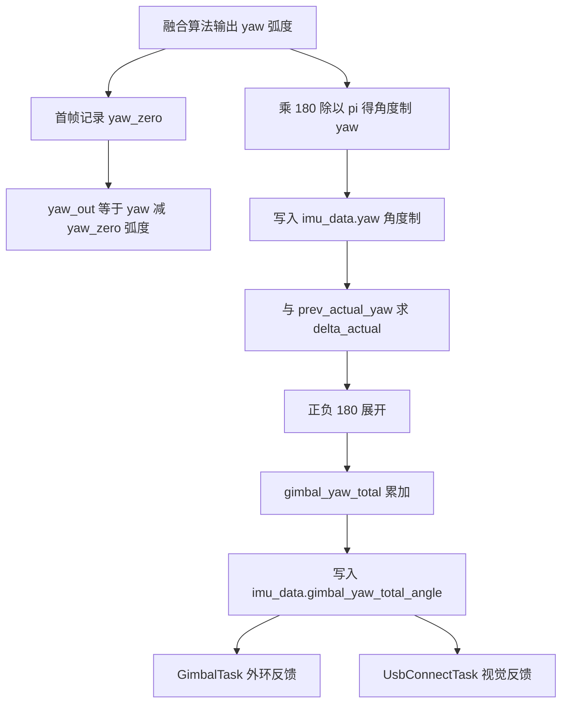
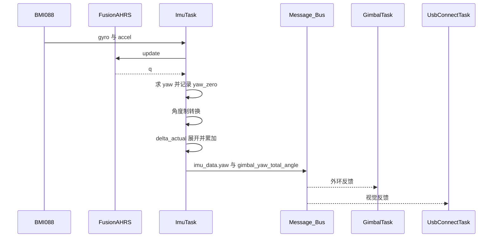

# 偏航零点与总角度累加

陀螺仪积分给出的偏航角只有相对精度，上电时刻的绝对值由融合算法初始状态决定。云台控制需要相对上电时刻的转角，自瞄还需要一个能跨过 ±180 度、逐圈累加的总角度。本项目把这两件事放在两条独立路径上：调试变量记录相对零点，`gimbal_yaw_total` 记录累加转角。

零点与累加是两条独立路径：前者只做一次减法，后者每帧都要处理绕圈。把两者混在同一条链路上，就会出现总角度在过零处跳变、或者相对零点被重复扣减这两类故障。

## 1. 三种偏航量

| 量 | 定义 | 单位 | 用途 |
| --- | --- | --- | --- |
| 相对零点偏航 `yaw_out` | $yaw - yaw_{zero}$ | 弧度 | 调试观测 |
| 原始偏航 `imu_data.yaw` | 融合算法输出的偏航 | 角度制 | 姿态记录、累加输入 |
| 总角度 `gimbal_yaw_total` | 逐帧增量求和 | 角度制 | 云台外环反馈、视觉反馈 |

累加式写成

$$ \Theta_N = \sum_{n=1}^{N} \Delta_n, \quad \Delta_n = \operatorname{wrap}(yaw_n - yaw_{n-1}) $$

`wrap` 把增量折算到 $(-180, 180]$ 区间，阈值处理见本单元 03。

零点相减与增量累加对常量偏置的处理不同。设 $yaw_n = \hat{y}_n + b$，则

$$ yaw_n - yaw_{zero} = \hat{y}_n - \hat{y}_{zero} $$

$$ \Delta_n = \hat{y}_n - \hat{y}_{n-1} $$

两式都不含 $b$，差别在于累加的初值：零点相减以上电零点为基准，增量累加以首帧的绝对偏航为基准。这一点在 3.4 节展开。

## 2. 首帧零点与逐帧累加

### 2.1 首帧零点

`Task/Src/ImuTask.cpp` 里定义 `static float yaw_zero` 与 `static bool first_run`。循环第一次执行到首帧记录段时，把融合算法刚算出的 $yaw$ 写入 `yaw_zero` 并清 `first_run`。之后每帧执行

$$ yaw_{out} = yaw - yaw_{zero} $$

结果写入 `volatile float yaw_out`（`Task/Src/ImuTask.cpp`）。`first_run` 记录的是循环首帧，此时四元数刚从单位阵开始积分，融合尚未收敛，零点带有初始误差。是否在正式记录前等待若干帧或做静止平均，属待实测的改进项。

```c
/* 简化：首帧记录零点，之后每帧相减 */
if (first_run) { yaw_zero = yaw; first_run = false; }
yaw_out = yaw - yaw_zero;          /* 弧度，只用于调试 */
```

### 2.2 逐帧累加

`Task/Src/ImuTask.cpp` 维护 `prev_actual_yaw` 与 `first_actual`：

```cpp
static float prev_actual_yaw = 0.0f;
static bool first_actual = true;

if (first_actual) {
    prev_actual_yaw = imu_data.yaw;   // 首次运行，将当前实际角度作为基准
    first_actual = false;
}

float delta_actual = imu_data.yaw - prev_actual_yaw;
if (delta_actual > 180.0f) {
    delta_actual -= 360.0f;
} else if (delta_actual < -180.0f) {
    delta_actual += 360.0f;
}

gimbal_yaw_total += delta_actual;
prev_actual_yaw = imu_data.yaw;
```

两个操作数都取自 `imu_data.yaw`，而 `imu_data.yaw` 要到本帧末尾才被新值覆盖。首帧那一步的注释写「将当前实际角度作为基准」，实际读到的是尚未更新的 `imu_data.yaw`。开机时该字段还是全局零值，逐帧追踪如下表。

| 循环次数 | 本帧 $yaw$ | 读到的 `imu_data.yaw` | `prev_actual_yaw` | `delta_actual` | `gimbal_yaw_total` |
| --- | --- | --- | --- | --- | --- |
| 1 | $Y_1$ | 0 | 0 | 0 | 0 |
| 2 | $Y_2$ | $Y_1$ | 0 | $Y_1$ | $Y_1$ |
| 3 | $Y_3$ | $Y_2$ | $Y_1$ | $Y_2-Y_1$ | $Y_2$ |
| 4 | $Y_4$ | $Y_3$ | $Y_2$ | $Y_3-Y_2$ | $Y_3$ |

表里的 $Y_n$ 是第 $n$ 帧经 ±180 展开后的偏航。两次效果叠加：第一个有效增量是首帧的绝对偏航 $Y_1$，此后每帧增量是相邻两帧差。求和后 `gimbal_yaw_total` 在数值上等于展开后的绝对偏航，比当前帧滞后一帧，并以上电首帧为锚点。它与 `yaw_out` 相差常量 `yaw_zero`，后者只出现在调试路径。

### 2.3 两条路径的分工



## 3. 零点、总角度与调用点

### 3.1 完整链路



### 3.2 关键位置

| 内容 | 位置 |
| --- | --- |
| `yaw_zero`、`first_run` 定义 | `Task/Src/ImuTask.cpp` |
| 首帧记录零点 | `Task/Src/ImuTask.cpp` |
| `yaw_out` 赋值 | `Task/Src/ImuTask.cpp` |
| 角度制转换 | `Task/Src/ImuTask.cpp` |
| 增量展开与累加 | `Task/Src/ImuTask.cpp` |
| `gimbal_yaw_total` 全局定义 | `Task/Src/ImuTask.cpp` |
| 写入 `imu_data` | `Task/Src/ImuTask.cpp` |
| `imu_data` 结构声明 | `Message_Bus/message_bus.h` |
| 结构体实例定义 | `Message_Bus/message_bus.cpp` |
| 外环消费 | `Task/Src/GimbalTask.cpp` |
| 视觉消费 | `Task/Src/UsbConnectTask.cpp` |

### 3.3 单位不一致

`yaw_out`、`roll_out`、`pitch_out` 在 `Task/Src/ImuTask.cpp` 里赋的是弧度值，赋值发生在角度制转换之前。同一循环里写入 `imu_data` 的 `roll`、`pitch`、`yaw` 是角度制。调试串口读数与总线读数相差 $180/\pi$ 倍。

### 3.4 累加值与零点

`imu_data.yaw` 不减去 `yaw_zero`，累加值因此不是相对零点的转角。由 2.2 节的追踪，`gimbal_yaw_total` 近似等于展开后的绝对偏航，锚定在首帧。若外环目标角来自视觉的绝对角，反馈与目标在同一参考系下可比；若目标角被当作相对量，则存在常量偏差 `yaw_zero`。该偏差是否影响闭环，取决于视觉侧约定的参考系，属待现场确认项。

## 4. 易错点

| # | 易错点 | 表现 | 位置 |
| --- | --- | --- | --- |
| 1 | 认为 `imu_data.yaw` 已减零点 | 总线读数与调试读数相差常量 | `Task/Src/ImuTask.cpp` |
| 2 | 认为 `gimbal_yaw_total` 从当前 yaw 起算 | 上电第 1 帧总角度为 0 | `Task/Src/ImuTask.cpp` |
| 3 | 按注释理解首帧基准 | 注释说取当前角，实际读到未更新的字段 | `Task/Src/ImuTask.cpp` |
| 4 | 忽略累加比当前帧滞后一帧 | 控制反馈晚一个周期 | `Task/Src/ImuTask.cpp` |
| 5 | 把累加值当作绝对航向 | 无磁力计，长时间漂移 | `Task/Src/ImuTask.cpp` |
| 6 | 弧度与角度制混用 | 调试量与总线量相差约 57 倍 | `Task/Src/ImuTask.cpp` |

## 5. 小结

### 核心概念

- 偏航零点由首帧单个样本记录，只写入调试变量。
- `imu_data.yaw` 是角度制原始偏航，未减零点。
- `gimbal_yaw_total` 逐帧累加相邻偏航差，首帧增量是绝对偏航，结果锚定在首帧。
- 累加值比当前帧滞后一帧，与外环目标是否同参考系需要现场核对。
- 调试变量是弧度制，总线变量是角度制。

### 设计权衡

| 权衡点 | 本工程选择 | 收益与代价 |
| --- | --- | --- |
| 零点获取 | 首帧单样本 | 实现简单；代价是首帧抖动会带入常量偏差 |
| 零点作用范围 | 只作用于调试变量 | 控制路径不受零点误差影响；代价是零点未参与控制基准 |
| 总角度来源 | 姿态角增量累加 | 与 IMU 姿态一致；代价是继承姿态漂移与跨零处理 |
| 累加实现 | 依赖全局 `imu_data.yaw` | 少一个缓存变量；代价是数据依赖跨帧，阅读时容易误判 |

## 6. 练习

### 基础题

1. 写出 `yaw_out` 与 `imu_data.yaw` 的换算关系，并给出 30 度对应的弧度值。
2. 设首帧偏航为 45 度且此后静止，按 2.2 节的表算出循环 2 与循环 3 的 `gimbal_yaw_total`。
3. 说明为什么减去 `yaw_zero` 不影响增量累加的差值项。

### 挑战题

4. 把零点记录改为静止窗口内多帧平均，列出需要增加的状态与判定条件。
5. 把 `prev_actual_yaw` 的初始化改为本帧 $yaw$，推导 `gimbal_yaw_total` 的初值变化，并说明对控制的影响。
6. 设计一组测试，覆盖上电即转动、上电静止、上电后反向转动三种情形，给出 `gimbal_yaw_total` 的预期曲线。

### 附：本页引用的固件路径

| 路径 | 用途 |
| --- | --- |
| `2026OmniSentryGimbal/Task/Src/ImuTask.cpp` | 零点、累加与写入 |
| `2026OmniSentryGimbal/Message_Bus/message_bus.h` | `LocalImuData` 声明 |
| `2026OmniSentryGimbal/Message_Bus/message_bus.cpp` | 全局实例定义 |
| `2026OmniSentryGimbal/Task/Src/GimbalTask.cpp` | 外环消费总角度 |
| `2026OmniSentryGimbal/Task/Src/UsbConnectTask.cpp` | 视觉反馈消费总角度 |
