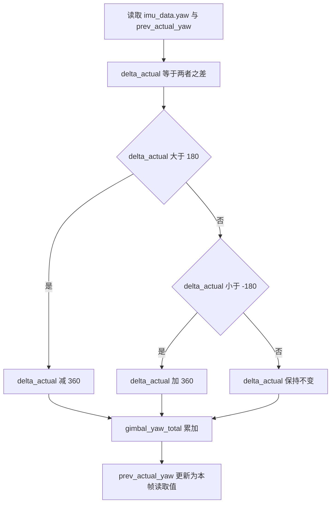
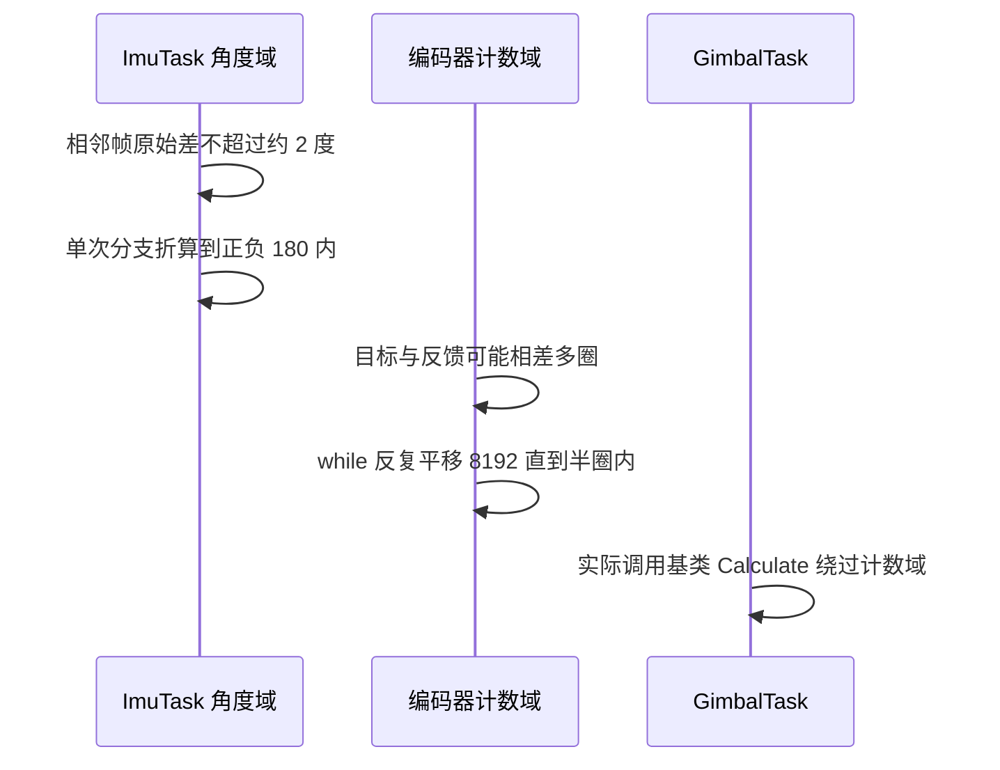

# 角度绕圈与跨零

偏航角由 `atan2f` 给出，取值范围 $(-180, 180]$，跨越 ±180 度时数值会从一端跳到另一端。直接对两次采样求差，在绕圈附近会得到接近 ±360 度的假增量。累加总角度必须在差值上做展开，把假增量折算回真实转动量。

展开的判据只有一条：把差值压回 $(-180, 180]$。实现上可以用一次条件分支，也可以用取模加补偿；本工程选前者，因为它不依赖浮点取模的舍入行为。

## 1. 周期量的等价表示

角度满足

$$ \theta \equiv \theta + k \cdot 360^\circ, \quad k \in \mathbb{Z} $$

同一个物理朝向对应无数个数值表示。相邻两帧的真实转动 $\Delta$ 落在 $(-360^\circ, 360^\circ)$ 内，而原始差 $d = yaw_n - yaw_{n-1}$ 在绕圈处会接近 ±360。展开的目标是从 $d$ 与 $d \mp 360$ 里选出绝对值不超过 180 的那个。

最近表示等价于

$$ \Delta = \big((d + 180^\circ) \bmod 360^\circ\big) - 180^\circ $$

结果区间是 $[-180^\circ, 180^\circ)$。本项目用条件分支实现同一件事，结果区间是 $[-180^\circ, 180^\circ]$，比闭式解多保留一个端点。

同一件事也可以用取模写成一行（本工程未采用）：

```c
/* 示意：闭式展开，等价于上面的 if/else if */
float d = yaw - prev_yaw;                          /* 落在 (-360, 360) */
float delta = fmodf(d + 180.0f, 360.0f) - 180.0f;  /* 结果区间 [-180, 180) */
```

## 2. 单次分支展开

`Task/Src/ImuTask.cpp` 的实现是

```cpp
float delta_actual = imu_data.yaw - prev_actual_yaw;
if (delta_actual > 180.0f) {
    delta_actual -= 360.0f;
} else if (delta_actual < -180.0f) {
    delta_actual += 360.0f;
}
```

判断用严格大于与严格小于，没有循环。

### 2.1 为什么单次分支足够

两个操作数都是 `atan2f` 的输出，各自落在 $(-180^\circ, 180^\circ]$，原始差 $d$ 因此落在 $(-360^\circ, 360^\circ)$。对 $d > 180^\circ$ 减 360 后落到 $(-180^\circ, 0)$，对 $d < -180^\circ$ 加 360 后落到 $(0, 180)$，其余保持不动。三种情形合起来恰好覆盖整个定义域，一次判断即可完成展开。

编码器域的 `handleZeroCross` 需要循环，原因是它的两个操作数不是相邻采样：目标角与反馈角可以相差任意整数圈，单次平移只能覆盖 1.5 圈，这一差别见第 3 节。

### 2.2 边界恰为 180 度

$d = 180^\circ$ 时两个分支都不进入，$\Delta$ 保持 180；$d = -180^\circ$ 时保持 -180。两个端点表示同一个半圈旋转，方向相反，属于平局点。结果取值集合是 $[-180^\circ, 180^\circ]$，包含 361 个整数值。

物理上相邻两帧不可能转半圈。陀螺仪量程是 2000 dps，循环周期按 1 ms 估算，单帧最大转角是

$$ \Delta_{\max} = 2000\ \text{dps} \times 0.001\ \text{s} = 2^\circ $$

真实 $d$ 只在绕圈处接近 ±360，被分支折算；远离绕圈时 $|d|$ 只有几度，永不触及 ±180。阈值取半圈，正好落在两种表示等距的位置。

### 2.3 误差累积与符号

展开是累加的前置步骤，`gimbal_yaw_total` 把每一帧的 $\Delta$ 永久累加（`Task/Src/ImuTask.cpp`）。一旦某帧漏展开，误差不会自行消失：

$$ \Theta_N = \sum \Delta_n = \text{真值} \pm 360^\circ $$

符号也会翻转。真实转动 -0.5 度而分支未触发时，$\Delta$ 记为 $+359.5$ 度，总角度跳升 360 度并保持该偏差。触发漏展开的条件是单帧真实转角超过 180 度，对应角速度超过 180000 dps，远在量程之外，正常运行不会出现。需要关注的是阈值附近的选择：若某帧原始差恰好落在 ±180，两个分支的取舍会让总角度产生 ±360 的固定差。



## 3. 与编码器域方案的对照

`AnglePID::handleZeroCross` 在云台板 `PID/Src/angle_pid.cpp` 用 while 循环平移反馈值：

```cpp
int32_t error = target - current;
while (error > 4096) {
    current += 8192;
    error = target - current;
}
while (error < -4096) {
    current -= 8192;
    error = target - current;
}
```

底盘板同一函数在 `PID/Src/angle_pid.cpp` 改成单次条件判断：

```cpp
int32_t error = target - current;
if (error > 4096) {
    current += 8192;
} else if (error < -4096) {
    current -= 8192;
}
```

两处的周期常量来自 DJI 电机编码器每圈 8192 计数，半圈 4096 计数。云台板的 `angle_pid_calculate`（`PID/Src/angle_pid.cpp`）与底盘板对应封装都没有调用点，`Task/Src/GimbalTask.cpp` 调用的是基类 `Calculate`，所以运行时走的是 IMU 角度域的展开。

| 维度 | IMU 角度域（`Task/Src/ImuTask.cpp`） | 编码器计数域（`PID/Src/angle_pid.cpp`） |
| --- | --- | --- |
| 输入量 | 偏航角，度 | 编码器计数 |
| 周期 | 360 | 8192 |
| 阈值 | 180 | 4096 |
| 平移对象 | 差值 $\Delta$ | 反馈值 `current` |
| 平移步长 | 360 | 8192 |
| 结构 | 单次 `if/else if` | 云台 `while`，底盘单次 `if` |
| 输入间距 | 相邻两帧，几度以内 | 目标与反馈可差任意圈 |
| 边界 | ±180 严格比较，保留原值 | ±4096 严格比较，保留原值 |
| 运行状态 | 每帧执行 | 封装函数无调用点 |



## 4. 本工程的展开实现

### 4.1 数据来源

展开的两个操作数是 `imu_data.yaw` 的相邻两次写入，而 `imu_data.yaw` 与 `prev_actual_yaw` 都在本帧末尾才更新。展开的输入依赖上一帧的总线字段，首帧差值为 0，这一数据依赖在 02 篇展开。

### 4.2 阈值常量

阈值为字面量 180.0f 与 -180.0f，与 360.0f 的平移步长成对出现，没有抽成常量。若角度的取值范围或单位改变，三处数字需要同步修改。

## 5. 易错点

| # | 易错点 | 表现 | 位置 |
| --- | --- | --- | --- |
| 1 | 直接在累加时不展开 | 绕圈处总角度跳变 360 度 | `Task/Src/ImuTask.cpp` |
| 2 | 认为 ±180 会触发平移 | 判断是严格比较，等于时保留原值 | `Task/Src/ImuTask.cpp` |
| 3 | 把角度域阈值 180 与计数域 4096 混用 | 量纲错误，展开失效 | `Task/Src/ImuTask.cpp`、`PID/Src/angle_pid.cpp` |
| 4 | 认为计数域用 while 是冗余 | 目标与反馈可差多圈，单次平移不够 | `PID/Src/angle_pid.cpp` |
| 5 | 忽略漏展开的误差会永久保留 | 总角度出现 ±360 固定偏差 | `Task/Src/ImuTask.cpp` |
| 6 | 以为控制走的是 `handleZeroCross` | 实际调用基类 `Calculate` | `Task/Src/GimbalTask.cpp` |

## 6. 小结

### 核心概念

- 角度是周期量，绕圈处的原始差需要用 ±360 折算。
- 相邻采样保证原始差落在 $(-360^\circ, 360^\circ)$，单次分支即可完成展开。
- 阈值取半圈 180 度，边界处两个分支都不触发，保留原值。
- 单帧最大物理转角约 2 度，正常运行时原始差远小于阈值。
- 展开漏掉一次，总角度会永久保留 ±360 度的偏差。
- 编码器域周期是 8192 计数、阈值 4096，与角度域是两套独立实现。

### 设计权衡

| 权衡点 | 本工程选择 | 收益与代价 |
| --- | --- | --- |
| 展开结构 | 单次 `if/else if` | 判断次数少；代价是仅在相邻采样输入下成立 |
| 阈值常量 | 字面量 180 与 360 | 直观；代价是单位或周期改变时三处要同改 |
| 边界处理 | 严格比较 | 半圈平局保留原值；代价是 ±180 两种符号都可能出现 |
| 实现数量 | 角度域与计数域各写一份 | 各自贴合数据来源；代价是同一概念出现两套阈值 |

## 7. 练习

### 基础题

1. 给定相邻两帧偏航 179 度与 -179 度，求原始差与展开后的 $\Delta$。
2. 写出展开的闭式解，并指出它与代码分支在边界上的差异。
3. 说明为什么 $d = 180$ 度时总角度会得到一个固定端点值。

### 挑战题

4. 用 2000 dps 量程与实测循环周期估算单帧最大真实转角，判断阈值留有多少余量。
5. 为 `ImuTask` 的展开逻辑写一个单元测试，覆盖 0、179.9、-179.9、180、-180、绕圈六种输入。
6. 把角度域的阈值改成可配置常量，列出需要同步修改的位置，并分析改动对计数域方案的影响。

### 附：本页引用的固件路径

| 路径 | 用途 |
| --- | --- |
| `2026OmniSentryGimbal/Task/Src/ImuTask.cpp` | 角度域 ±180 展开与累加 |
| `2026OmniSentryGimbal/PID/Src/angle_pid.cpp` | 云台 while 版跨零处理 |
| `2026OmniSentryChassis/PID/Src/angle_pid.cpp` | 底盘单次 if 版跨零处理 |
| `2026OmniSentryGimbal/Task/Src/GimbalTask.cpp` | 外环调用基类 `Calculate` |
