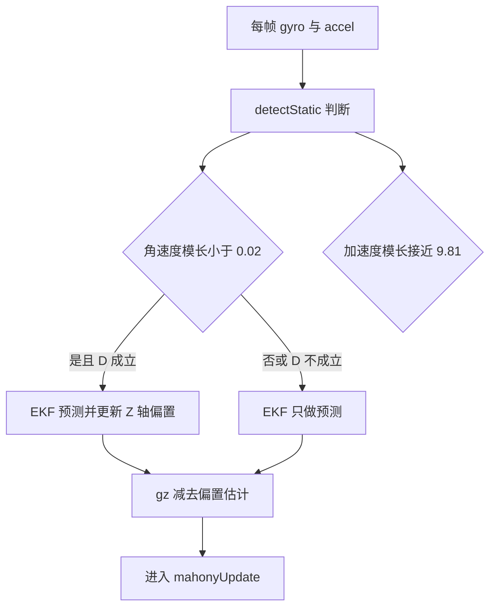
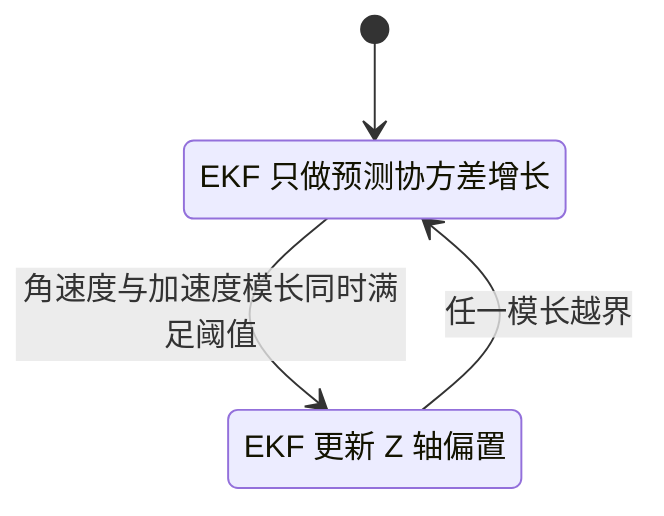

# 零偏漂移与抑制

陀螺仪输出里叠着一个与真实角速度无关的直流分量，积分后变成随时间增长的角度误差。云台长时间工作后偏航缓慢转动，多数来自这一项。抑制手段分两类：静态标定在开机时扣掉常量部分，动态估计在运行中跟踪随温度和时间变化的部分。

零偏抑制的选择取决于工况：云台长时间静止时静态标定足够，机动与温变场景需要运行中估计。本工程把动态估计压缩成一维 EKF，只在判定静止时更新。

## 1. 零偏与噪声

陀螺仪误差按频率成分划分，Allan 方差（用不同平均时间下的方差曲线区分噪声类型的标准方法）把它们分成几段。下表的随平均时间变化规律按行业常识列出，本项目没有做过完整的 Allan 方差测试，条目属参考性质。

| 项 | 双对数斜率特征 | 常见来源 |
| --- | --- | --- |
| 量化噪声 | 随平均时间减小 | ADC 量化 |
| 角度随机游走 | 随平均时间平方根减小 | 白噪声积分 |
| 零偏不稳定性 | 在中等平均时间取最小 | 1/f 噪声、温度 |
| 速率随机游走 | 随平均时间平方根增大 | 低频漂移 |
| 速率斜坡 | 随平均时间线性增大 | 缓慢温漂 |

零偏 $b$ 与真实角速度 $\omega$ 的关系写作

$$ \tilde{\omega} = \omega + b + n $$

积分后的角度误差是

$$ \theta_{err}(t) = \int_0^t b(\tau)\,d\tau + \int_0^t n(\tau)\,d\tau $$

常量零偏产生线性增长，白噪声产生随机游走。静态标定只能扣掉开机时刻的 $b$，温度变化引起的漂移需要在线估计。本项目没有独立的静态标定流程，开机零点由 `yaw_zero` 承担，作用范围只到调试变量，见本单元 02。

## 2. 标量 EKF 估计 Z 轴零偏

`FusionAHRS` 内部持有 `GyroBiasEKF`（`Algorithm/Inc/FusionAHRS.h`），只对 Z 轴估计。状态是一维零偏 $x$，过程与测量都是标量。预测与更新写成

$$ P^- = P + Q $$

$$ K = \frac{P^-}{P^- + R}, \quad x \leftarrow x + K(z - x), \quad P \leftarrow (1-K)P^- $$

$z$ 是本帧的 `gyroZ`，$Q$ 是每采样过程噪声，$R$ 是测量噪声。更新带条件：只有 `isStatic` 为真时才执行，运动期间只做预测。

```cpp
/* 简化：GyroBiasEKF 的预测与更新 */
P_ += Q_;                              /* 预测：每拍执行 */
if (isStatic) {                        /* 更新：只在静止时执行 */
    float K = P_ / (P_ + R_);
    x_ += K * (gyroZ - x_);
    P_ = (1 - K) * P_;
}
```

### 2.1 稳态增益

构造函数给 $P = 0.1$、$Q = 10^{-6}$、$R = 10^{-4}$（`Algorithm/Src/FusionAHRS.cpp`）。静止时反复更新，协方差收敛到固定点，把 $P^- = P+Q$ 代入条件 $P = (1-K)P^-$，得到

$$ P(P+Q) = RQ $$

数值解 $P \approx 9.5\times10^{-6}$，对应增益

$$ K = \frac{P+Q}{P+Q+R} \approx 0.095 $$

每个静止采样让估计向测得值移动约 9.5%，等效时间常数约 10.5 个采样。按 1 kHz 折算约 10 ms，收敛很快。运动期间 $P$ 每帧加 $Q$，协方差缓慢增大，为下一次静止段保留调整幅度。以上数值由常量推算，未经实测标定。

### 2.2 静止检测

`detectStatic`（`Algorithm/Src/FusionAHRS.cpp`）同时判断角速度模长与加速度模长：

$$ \|\omega\| < 0.02, \quad \big|\|a\| - 9.81\big| < 0.2 $$

两项都满足才返回真。阈值为硬编码常量 `GYRO_STATIC_THRESH`、`ACC_STATIC_THRESH` 与 `GRAVITY`（`Algorithm/Src/FusionAHRS.cpp`）。`ImuTask` 传入的角速度来自 `BMI088::convertData`，该函数在换算后额外乘了 2.0f（`BMI088/Src/BMI088.cpp`）。若基数本身已是 rad/s 系数，则 0.02 的实际物理阈值约减半，属按代码推断，需要在 01 单元核实后统一口径。



### 2.3 只有 Z 轴

$X$、$Y$ 轴不参与偏置估计。横滚与俯仰由加速度计长期校正，零偏被重力观测约束；偏航没有绝对参考，Z 轴零偏只能靠静止段估计。若陀螺仪存在绕 X、Y 的常值偏置且加速度计未完全压住，横滚与俯仰会残留小偏差，属按结构推断。



## 3. 本工程的零偏估计链路

### 3.1 FusionAHRS 的调用链

`FusionAHRS::update`（`Algorithm/Src/FusionAHRS.cpp`）依次执行静止检测、`biasEKF_.update(gz, isStatic)`、`gz -= biasEKF_.getBias()`，再把去偏后的角速度送进 `mahonyUpdate`。偏置只影响 Z 轴，X、Y 原样进入四元数积分。

### 3.2 ImuTask 中未使用的动态零偏

`ImuTask.cpp` 同时定义了一套没有接线的动态零偏参数：

| 名称 | 位置 | 值 | 引用情况 |
| --- | --- | --- | --- |
| `yaw_bias` | `Task/Src/ImuTask.cpp` | 0.0f | 仅定义，无其它引用 |
| `GYRO_ZERO_THRESHOLD` | `Task/Src/ImuTask.cpp` | 0.005236f（0.3 deg/s） | 仅定义 |
| `BIAS_ALPHA` | `Task/Src/ImuTask.cpp` | 0.999f | 仅定义 |
| `LOOP_DT` | `Task/Src/ImuTask.cpp` | 0.001f | 仅定义 |

这四个符号在主循环里没有出现，动态零偏补偿停留在预留状态。当前运行的零偏抑制只有 `FusionAHRS` 的 Z 轴 EKF，且只在 `detectStatic` 判定静止时更新。这是真实缺陷：运动状态下 Z 轴零偏不被跟踪，而陀螺仪零偏随温度变化，云台持续运动时偏航漂移没有在线补偿。

### 3.3 可落地修法

用静止门限做指数滑动平均（用固定权重把新样本混进估计，跟踪慢变量），接入现有主循环：

```cpp
// 运动间隙估计零偏，静止时缓慢跟踪
if (fabsf(gyro[2]) < GYRO_ZERO_THRESHOLD) {
    yaw_bias = BIAS_ALPHA * yaw_bias + (1.0f - BIAS_ALPHA) * gyro[2];
}
gyro[2] -= yaw_bias;   // 去偏后再送融合
```

`BIAS_ALPHA` 取 0.999、采样 1 kHz 时时间常数约 1 s，兼顾跟踪速度与抗噪。要点有三条：

1. 去偏应在 `ahrs.update` 之前完成，否则 EKF 与滑动平均会叠加两次补偿，稳态偏置被过度扣除。
2. 门限用 `GYRO_ZERO_THRESHOLD` 判断单轴角速度，静止检测比 `detectStatic` 的模长判据宽松，运动中也会偶尔采样，需要评估误触发。
3. `LOOP_DT` 与 `ahrs(1000.0f)` 都假设 1 ms 周期，实际周期由 `DWT_Delay_ms(1)` 加处理时间决定，建议改为读取真实 $dt$ 后再更新 $\alpha$。

上述改法未经实测，`BIAS_ALPHA` 与门限需要现场标定。另一条路径是把 `yaw_bias` 交给 EKF 的初值，减少两套估计器的耦合。

## 4. 易错点

| # | 易错点 | 表现 | 位置 |
| --- | --- | --- | --- |
| 1 | 认为 `ImuTask` 已做动态零偏 | 四个符号只在定义处出现 | `Task/Src/ImuTask.cpp` |
| 2 | 把 EKF 当成全轴估计 | 只估计 Z 轴，X、Y 无偏置项 | `Algorithm/Src/FusionAHRS.cpp` |
| 3 | 认为静止判定很严格 | 阈值是硬编码常量，未按整机噪声标定 | `Algorithm/Src/FusionAHRS.cpp` |
| 4 | 去偏与 EKF 叠加 | 零偏被扣两次，姿态反向漂移 | `Algorithm/Src/FusionAHRS.cpp` |
| 5 | 忽略角速度尺度 | 换算里的 2.0f 改变静态阈值的物理含义 | `BMI088/Src/BMI088.cpp` |
| 6 | 认为静止段随时出现 | 云台持续运动时 EKF 长期只预测 | `Algorithm/Src/FusionAHRS.cpp` |

## 5. 小结

### 核心概念

- 陀螺仪零偏积分后变成随时间增长的角度误差。
- Allan 方差把误差分成量化噪声、随机游走、零偏不稳定性等项。
- `FusionAHRS` 用一维 EKF 估计 Z 轴零偏，静止时更新，运动时只预测。
- 稳态增益约 0.095，静止段内约 10 ms 收敛，数值由常量推算。
- `ImuTask` 的四个动态零偏符号没有接线，云台只有 EKF 一条抑制路径。
- X、Y 轴无偏置估计，偏航以外的两轴靠加速度计约束。

### 设计权衡

| 权衡点 | 本工程选择 | 收益与代价 |
| --- | --- | --- |
| 偏置维度 | 只估 Z 轴 | 计算量小；代价是横滚俯仰依赖加速度计校正 |
| 更新时机 | 仅静止时 | 避免运动误估；代价是持续运动时偏置无补偿 |
| 静止判据 | 模长硬阈值 | 实现简单；代价是阈值与实际噪声不匹配时漏判或误判 |
| 动态零偏 | 预留未接线 | 不影响当前行为；代价是缺陷留在代码里，容易误以为已生效 |

## 6. 练习

### 基础题

1. 写出标量卡尔曼的预测与更新式，说明 $Q$ 与 $R$ 各自的物理含义。
2. 用 $Q=10^{-6}$、$R=10^{-4}$ 计算 $K$ 的一阶近似，并估算收敛所需的静止采样数。
3. 解释为什么偏航的零偏比横滚、俯仰更难抑制。

### 挑战题

4. 按 3.3 节把动态零偏接入主循环，给出接入点在 `ahrs.update` 前后的两版代码与预期差异。
5. 用一段静止数据离线拟合零偏，比较 EKF 估计与滑动平均的时间常数。
6. 设计一个把 `LOOP_DT` 换成实测 $dt$ 的方案，列出需要改动的宏、函数与调用点。

### 附：本页引用的固件路径

| 路径 | 用途 |
| --- | --- |
| `2026OmniSentryGimbal/Algorithm/Src/FusionAHRS.cpp` | 标量 EKF、静止检测与去偏 |
| `2026OmniSentryGimbal/Algorithm/Inc/FusionAHRS.h` | `GyroBiasEKF` 成员 |
| `2026OmniSentryGimbal/Task/Src/ImuTask.cpp` | 未接线的动态零偏参数 |
| `2026OmniSentryGimbal/BMI088/Src/BMI088.cpp` | 角速度换算中的 2.0f |
| `2026OmniSentryGimbal/BMI088/BMI088config.h` | 灵敏度基数 |
