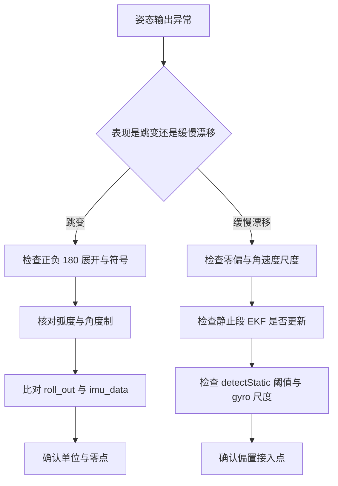
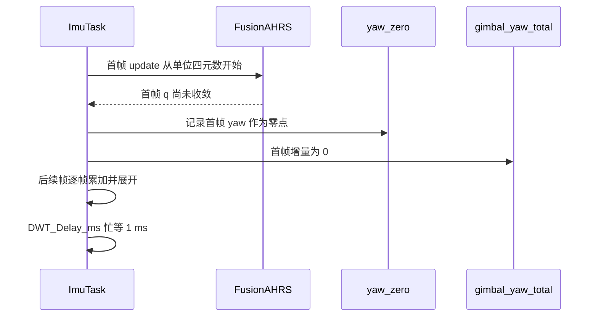

# 易错点与调试

姿态链路的故障很少表现为明显跳变，多数是缓慢漂移、常量偏差或单位错位。排查时按四类切分：单位、零点、尺度、参考系。每类都有固定的观测点与对照量。

## 1. 错误分类

> 本页引用的路径相对固件仓库根目录。
| --- | --- | --- |
| 单位 | 读数相差约 57 倍，误差量级不对 | `roll_out` 与 `imu_data.roll` 对比 |
| 零点 | 相对偏航有常量偏差，控制稳态偏离 | `yaw_zero` 与首帧 $yaw$ |
| 尺度 | 角度变化速率与真实转动不一致 | 陀螺仪读数与量程、循环周期 |
| 参考系 | 总角度与外环目标系统性错位 | `gimbal_yaw_total` 的锚点与视觉约定 |

## 2. 单位：弧度与角度制

同一份姿态在代码里有两种单位，分界落在 `Task/Src/ImuTask.cpp`。

| 变量 | 单位 | 位置 |
| --- | --- | --- |
| `roll`、`pitch`、`yaw`（转换前） | 弧度 | `Task/Src/ImuTask.cpp` |
| `roll_out`、`pitch_out`、`yaw_out` | 弧度 | `Task/Src/ImuTask.cpp` |
| `imu_data.roll`、`pitch`、`yaw` | 度 | `Task/Src/ImuTask.cpp` |
| `imu_data.gimbal_yaw_total_angle` | 度 | `Task/Src/ImuTask.cpp` |
| `imu_data.gyro` | rad/s（含 2 倍系数） | `Task/Src/ImuTask.cpp` |
| 外环目标 `control_target.gimbal_yaw_angle` | 度 | `Task/Src/ControlCenterTask.cpp` |

换算关系是

$$ 1\ \text{rad} = 57.29578\ \text{deg} $$

调试量取弧度、总线量与 PID 取角度，是两套并行数值。用串口读 `yaw_out` 去核对 `imu_data.yaw` 的绝对值，会得到约 57 倍的比例差。

```c
/* 简化：ImuTask 里的单位分界 */
roll = atan2f(...);                     /* 融合换算结果，弧度 */
roll_out = roll;                        /* volatile 调试量，弧度 */
imu_data.roll = roll * 180.0f / M_PI;   /* 总线字段，度 */
```

## 3. 零点与参考系

### 3.1 零点只落在首帧

`yaw_zero` 在 `Task/Src/ImuTask.cpp` 由循环首帧的单个 $yaw$ 记录。首帧四元数从单位阵开始积分，融合尚未收敛，零点带有初始误差。上电瞬间若云台被手推动或机械回弹，零点被污染，之后所有相对偏航都带同一常量偏差。

### 3.2 总角度的锚点

`gimbal_yaw_total` 的首个有效增量是首帧绝对偏航，累加值锚定在首帧而不是 0，且比当前帧滞后一帧，推导见本单元 02。外环目标来自视觉的绝对角，反馈是 IMU 参考系下的角度，两者是否同参考系取决于视觉协议约定，属待现场确认项。

### 3.3 无磁力计

`Task/Src/ImuTask.cpp` 声明了 `mag[3]`，全文件没有其它引用。融合输入只有六轴，偏航没有绝对参考，静止时 EKF 抑制零偏，运动时零偏不被跟踪，长时间工作后偏航缓慢漂移。相对姿态可用，绝对航向不可信。

## 4. 尺度

`BMI088::convertData` 在 `BMI088/Src/BMI088.cpp` 把原始值乘以 `BMI088_GYRO_2000_SEN` 后再乘 2.0f。基数 `0.0010652644f`（`BMI088/BMI088config.h`）等于 $2000/32768$ 再乘 $\pi/180$，量纲是 rad/s 每 LSB（最低有效位）。若该读数成立，实际的 2 倍系数会让角速度偏大一倍，静态阈值与积分步长都要按比例重算。此判断由常量数值推得，属推断，需要在 01 单元用实测数据核对。

融合类的采样周期在 `Task/Src/ImuTask.cpp` 固定传 1000.0f，主循环末尾是 `DWT_Delay_ms(1)` 的忙等（循环空转等待，不让出 CPU）。忙等的 1 ms 加读数、控温、融合与换算的处理时间，实际周期大于 1 ms。四元数积分按 $0.5/f_s$ 折算，$f_s$ 偏大会让积分量偏小，姿态跟踪滞后。`LOOP_DT` 的 0.001f 与同一假设一致，也没有参与运算。真实周期需要用 DWT 在循环首尾打点测量，属待实测项。

## 5. 视觉端的四元数对照

`Task/Src/UsbConnectTask.cpp` 声明了 `extern std::array<float,4> q`，但发送路径没有使用融合算法输出的四元数，而是用欧拉角重新构造：

```cpp
std::array<float, 4> q_array = eulerToQuaternion(
    imu_data.gimbal_yaw_total_angle, imu_data.roll, imu_data.roll);
```

`eulerToQuaternion`（`Task/Src/UsbConnectTask.cpp`）内部把入参当角度制转成弧度，输出标量在前的四元数。构造处的注释写「对于 roll 角度，我们设为 0」，实际传入的是 `imu_data.roll`，注释与实现不一致，以代码为准。视觉侧拿到的是重新构造的四元数与单独的角度字段，字段打包在 `Communication/Src/usb_protocol.cpp`。

## 6. 调试流程





## 7. 常用观测点

| 观测点 | 位置 | 用途 |
| --- | --- | --- |
| `roll_out`、`pitch_out`、`yaw_out` | `Task/Src/ImuTask.cpp` | 弧度制调试量，观察相对零点 |
| `DebugUART_Init(&huart1)` | `Task/Src/ImuTask.cpp` | 调试串口初始化 |
| `DWT_Delay_ms(1000)` | `Task/Src/ImuTask.cpp` | 上电等待传感器与融合收敛 |
| `imu_data` 各字段 | `Task/Src/ImuTask.cpp` | 任务间总线，核对单位与参考系 |
| `gimbal_yaw_total` | `Task/Src/ImuTask.cpp` | 观察累加漂移与跨零跳变 |
| `detectStatic` 结果 | `Algorithm/Src/FusionAHRS.cpp` | 判断静止段是否出现 |

## 8. 易错点

| # | 易错点 | 表现 | 位置 |
| --- | --- | --- | --- |
| 1 | 用调试量核对总线量 | 相差约 57 倍，误判为解算错误 | `Task/Src/ImuTask.cpp` |
| 2 | 零点在首帧抖动时被污染 | 相对偏航有常量偏差 | `Task/Src/ImuTask.cpp` |
| 3 | 认为 `mag` 参与解算 | 无磁力计，绝对航向不可信 | `Task/Src/ImuTask.cpp` |
| 4 | 忽略累加依赖总线字段 | 跨零错误累积成 ±360 偏差 | `Task/Src/ImuTask.cpp` |
| 5 | 把 `ahrs(1000.0f)` 当作真实周期 | 忙等使实际 $dt$ 更大，积分偏小 | `Task/Src/ImuTask.cpp` |
| 6 | 认为视觉收到融合四元数 | 实际由欧拉角重构 | `Task/Src/UsbConnectTask.cpp` |
| 7 | 按注释理解视觉四元数分量 | 注释说 roll 置 0，代码传 `imu_data.roll` | `Task/Src/UsbConnectTask.cpp` |

## 9. 小结

### 核心概念

- 姿态错误按单位、零点、尺度、参考系四类定位。
- 弧度与角度制的分界在 `Task/Src/ImuTask.cpp`。
- 首帧零点受抖动污染，总角度锚定在首帧且滞后一帧。
- `mag` 未使用，偏航没有绝对参考。
- 角速度换算的 2 倍系数与忙等周期都会改变等效尺度，两项均为推断或待实测。
- 视觉端发送的四元数由欧拉角重构，与融合四元数是两条路径。

### 设计权衡

| 权衡点 | 本工程选择 | 收益与代价 |
| --- | --- | --- |
| 调试量单位 | 弧度 | 与融合内部一致；代价是与总线量差 57 倍，需显式换算 |
| 循环延时 | `DWT_Delay_ms(1)` 忙等 | 实现简单、无需 RTOS 延时；代价是占 CPU，周期随处理时间浮动 |
| 采样频率 | 硬编码 1000.0f | 与 1 ms 延时对应；代价是实际周期变化时积分尺度漂移 |
| 视觉四元数 | 由欧拉角重构 | 可单独选择发送的偏航参考；代价是与融合状态不一致 |

## 10. 练习

### 基础题

1. 列出四个观测点，说明各自能区分哪一类错误。
2. 给定 `yaw_out = 0.5`，求对应的角度制数值。
3. 说明 `mag[3]` 未被使用时，偏航漂移为什么不能靠自身修正。

### 挑战题

4. 用 DWT 在循环首尾打点，写出测量真实周期并传给 `FusionAHRS` 的改动方案。
5. 设计一个上电静止 1 s 的零点标定流程，列出状态机与判定条件。
6. 对比视觉端两种四元数来源（融合输出与欧拉角重构），分析各自在自瞄闭环中的影响。

### 附：本页引用的固件路径

| 路径 | 用途 |
| --- | --- |
| `2026OmniSentryGimbal/Task/Src/ImuTask.cpp` | 单位分界、零点、累加与忙等 |
| `2026OmniSentryGimbal/Task/Src/UsbConnectTask.cpp` | 视觉端四元数重构 |
| `2026OmniSentryGimbal/Communication/Src/usb_protocol.cpp` | 帧打包 |
| `2026OmniSentryGimbal/Algorithm/Src/FusionAHRS.cpp` | 静止检测与去偏 |
| `2026OmniSentryGimbal/BMI088/Src/BMI088.cpp` | 角速度换算中的 2.0f |
| `2026OmniSentryGimbal/BMI088/BMI088config.h` | 灵敏度基数 |
| `2026OmniSentryGimbal/Task/Src/ControlCenterTask.cpp` | 外环目标角来源 |
