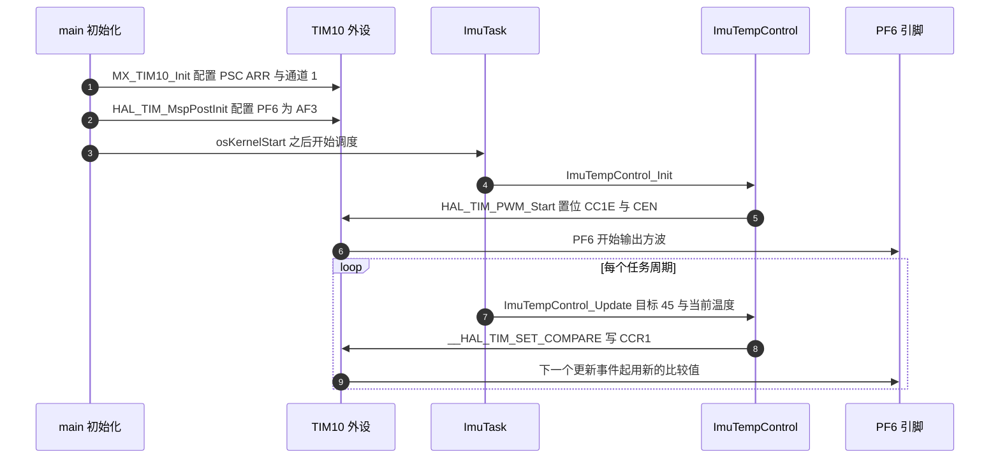
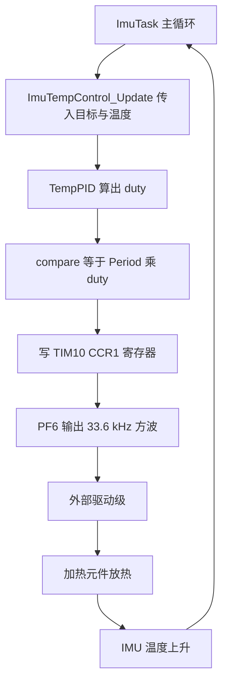

# 温控硬件与 PWM 通道

温度环算出的占空比要变成热量，中间隔着一整条链路。固件能直接决定的部分只有定时器、通道和引脚，热量本身由外部驱动级、加热元件与供电轨决定，这三样都不在源码里。把链路按可见性切开，才能在排查时快速判断问题落在哪一侧。

对象是 `Core/Src/tim.c` 的 `MX_TIM10_Init`、`Core/Src/main.c` 的调用与 `BMI088/Src/ImuTempControl.cpp` 的启动、更新函数，梳理固件侧的每个环节，并给出占空比到功率的换算前提。读完要能回答：33.6 kHz 是怎么算出来的；写 CCR1 要等哪个事件生效；NVIC 已经使能为什么中断不产生。

> 本页引用的路径相对固件仓库根目录。

## 加热通道的固件段与原理图段

链路按可见性分两段。固件段是 TIM10 计数、通道 1 比较、CCR1、PF6 复用；原理图段是栅极驱动、功率开关、加热元件和供电轨。占空比直接当加热功率用，隐含了驱动级工作在开关状态、负载近似纯电阻、供电轨恒定三个前提，这三个前提都要现场确认。

| 段 | 组成 | 固件可见性 | 依据 |
| --- | --- | --- | --- |
| 定时器与通道 | TIM10 计数、通道 1 比较、CCR1 | 可见 | `Core/Src/tim.c` |
| 引脚复用 | PF6 复用为 AF3_TIM10 | 可见 | `Core/Src/tim.c` |
| 驱动级 | 栅极驱动与功率开关 | 不可见 | 待现场确认 |
| 加热元件 | 加热电阻或加热膜 | 不可见 | 待现场确认 |
| 供电轨 | 驱动级电源电压 | 不可见 | 待现场确认 |

固件只产生波形。同一组寄存器配置，换上不同的驱动级与负载，加热功率会差出数倍，因此温控整定的结论只在同一套硬件上成立。

## APB2 定时器时钟是 PCLK2 的两倍

TIM10 挂在 APB2 上。APB2 预分频不为 1 时，定时器看到的计数时钟是 PCLK2 的两倍，这一条是算频率时最容易漏掉的规则：

| 节点 | 值 | 依据 |
| --- | --- | --- |
| HSE | 12 MHz | `Core/Inc/stm32f4xx_hal_conf.h` |
| PLLM、PLLN、PLLP | 6、168、2 | `Core/Src/main.c` |
| SYSCLK、HCLK | 168 MHz | 12 除以 6 再乘 168 除以 2 |
| APB1、APB2 分频 | 4、2 | `Core/Src/main.c` |
| PCLK2 | 84 MHz | HCLK 除以 2 |
| APB2 定时器时钟 | 168 MHz | 两倍 PCLK2 |

把 PCLK2 当成定时器时钟，频率会算成 16.8 kHz，比实际值低一半，占空比与开关损耗的结论都会跟着偏。判断方法是看 APB2 的分频系数：只要不是 1，就要乘 2。

## 33.6 kHz 从哪个式子来

边沿对齐、向上计数时，PWM 频率由计数器时钟与两个分频系数决定：

$$f_{PWM}=\frac{f_{CK\_PSC}}{(PSC+1)(ARR+1)}$$

代入 $f_{CK\_PSC}=168$ MHz、$PSC=0$、$ARR=4999$：

$$f_{PWM}=\frac{168\times 10^6}{5000}=33.6\ \text{kHz},\qquad T_{PWM}=29.76\ \mu\text{s},\qquad t_{count}=\frac{1}{168\times 10^6}=5.95\ \text{ns}$$

一个周期 5000 个计数时钟，每个计数 5.95 ns，所以周期是 $5000\times5.95\,\text{ns}=29.76\,\mu\text{s}$，取倒数得到 33.6 kHz。33.6 kHz 落在音频上限之上，人耳不会听到开关声；提高频率会加大端口与驱动级的开关损耗与电磁干扰，降低频率会加大温度纹波与供电电流纹波。当前取值的代价与收益都在这一对矛盾里。

## CCR1 写入什么时候生效

PWM1 模式下计数值小于比较值时输出为高，一周期共 $ARR+1$ 个计数，占空比是

$$D=\frac{CCR}{ARR+1}$$

自动重装预装载被关闭（`Core/Src/tim.c`），运行期改 ARR 立即生效，可能产生半个周期。通道 1 的比较预装载由 HAL 无条件打开（`Core/Src/tim.c`），写 CCR1 先落在预装载寄存器，更新事件到来时再搬进真正起作用的影子寄存器，因此比较值总在周期边界切换、不会切出窄脉冲；代价是写入最多晚一个 PWM 周期生效。

两者的差别在运行期写值时体现：改 ARR 立刻改变周期，改 CCR1 最多晚一个周期生效。温度环的输出周期是毫秒级，一个 29.76 微秒的延迟可以忽略；但如果哪天改 ARR 做调频，就必须考虑那半个周期的毛刺。

## 通道配置逐项对照

| 配置项 | 值 | 位置 |
| --- | --- | --- |
| 计数模式 | 向上计数 | `Core/Src/tim.c` |
| 时钟分频 | TIM_CLOCKDIVISION_DIV1 | `Core/Src/tim.c` |
| 自动重装预装载 | 关闭 | `Core/Src/tim.c` |
| 通道模式 | TIM_OCMODE_PWM1 | `Core/Src/tim.c` |
| 初始脉宽 | 0 | `Core/Src/tim.c` |
| 输出极性 | 高电平有效 | `Core/Src/tim.c` |
| 快速模式 | 关闭 | `Core/Src/tim.c` |

`HAL_TIM_Base_MspInit` 使能了 `TIM1_UP_TIM10_IRQn` 并设为优先级 5（`Core/Src/tim.c`），中断服务函数也映射到 `HAL_TIM_IRQHandler(&htim10)`（`Core/Src/stm32f4xx_it.c`）。运行期没有打开更新中断：`HAL_TIM_PWM_Start` 只置位 `CCER.CC1E` 与 `CR1.CEN`，工程里 `HAL_TIM_Base_Start_IT` 的唯一调用点给 TIM2 做 HAL 时基（`Core/Src/stm32f4xx_hal_timebase_tim.c`）。NVIC 使能与外设中断使能是两级开关，前者打开不代表后者打开，TIM10 的更新中断当前不产生，属按 HAL 实现推导。TIM10 不是带刹车输入的实例，启动过程不涉及 MOE（MOE 是高级定时器的输出使能位）。



## 占空比换算成加热功率

驱动级把加热元件接在电压 $V$ 的供电轨上，元件阻值为 $R$：

$$P_{max}=\frac{V^2}{R},\qquad P_{avg}=D\cdot P_{max}=D\cdot\frac{V^2}{R}$$

维持目标温度的稳态占空比由热平衡决定：

$$D_{ss}=\frac{T^*-T_{amb}}{R_{th}\,P_{max}}$$

其中 $R_{th}$ 是加热区到环境的等效热阻。三个参数 $V$、$R$、$R_{th}$ 都不在固件源码内，$P_{max}$ 与 $D_{ss}$ 的数值待现场测量。公式的用途是给出量纲关系：温度目标越远离环境、热阻越大，需要的稳态占空比越高；供电电压升高时 $P_{max}$ 按平方增长，所需占空比相应下降。



## 外部使能引脚的文档差异

`Core/Src/gpio.c` 把 PG6 与 PH11 配成推挽输出并初始化为低，同文件其余配置只写模式与上下拉，源码里没有第二处引用。早期文档（`02-STM32 与 HAL/01-时钟树与GPIO/04-本项目引脚分配.md` 与 `02-STM32 与 HAL/02-定时器与PWM/02-PWM原理与配置.md`）把这两脚写成 `ImuTempControl::init()` 里拉高的加热使能，当前两块板的实现都只有 `HAL_TIM_PWM_Start`。

以当前源码为准，PG6 与 PH11 在温控通路里的作用待现场确认。当前 `ImuTempControl.cpp` 的 `init()` 只有一行 `HAL_TIM_PWM_Start`，函数体里没有 GPIO 写操作。

```cpp
/* 摘录：BMI088/Src/ImuTempControl.cpp 的启动与更新 */
void ImuTempControl_Init(void) {
    HAL_TIM_PWM_Start(&htim10, TIM_CHANNEL_1);          /* 置位 CC1E 与 CEN */
}

void ImuTempControl_Update(float target, float temp, float dt) {
    float duty = TempPID_Calculate(target, temp, dt);
    __HAL_TIM_SET_COMPARE(&htim10, TIM_CHANNEL_1, (uint32_t)(Period * duty));
}
```

## 两块板的配置一致

底盘板的实现与云台板逐行一致：`2026OmniSentryChassis/BMI088/Src/ImuTempControl.cpp` 同样只有 PWM 启动与 `Period * duty`，`2026OmniSentryChassis/Core/Src/tim.c` 同样是 PSC 0、ARR 4999、通道 1。两块板的固件版本一致时，温控硬件侧的差异只可能来自焊接、驱动级或加热元件，这给对照试验提供了前提。

| 项 | 位置 | 内容 |
| --- | --- | --- |
| TIM10 句柄 | `Core/Src/tim.c` | 文件级 `htim10` |
| 定时器初始化 | `Core/Src/tim.c` | PSC 0、ARR 4999、通道 1、PWM1 |
| 引脚 MspPostInit | `Core/Src/tim.c` | PF6 复用推挽、AF3 |
| 初始化调用点 | `Core/Src/main.c` | `MX_TIM10_Init()` 在 `MX_GPIO_Init()` 之后 |
| PWM 启动 | `BMI088/Src/ImuTempControl.cpp` | `init()` 调 `HAL_TIM_PWM_Start` |
| 占空比写入 | `BMI088/Src/ImuTempControl.cpp` | `update()` 写 CCR1 |
| 任务启动 | `Task/Src/ImuTask.cpp` | `ImuTempControl_Init()` |
| 任务更新 | `Task/Src/ImuTask.cpp` | `ImuTempControl_Update(45, temp, 0.001f)` |

## 配置项容易混淆的地方

| 容易读错的地方 | 现象 | 位置 |
| --- | --- | --- |
| 认为 GPIO 能直接驱动加热元件 | 引脚电流不足，热量达不到 | 驱动级不在源码内 |
| 认为 NVIC 使能就有定时器中断 | 中断从不进入，计数照常 | `Core/Src/tim.c` |
| 把 PCLK2 当定时器时钟 | 频率算成 16.8 kHz | `Core/Src/main.c` |
| 用 Period 当满量程 | 占空比偏大一个计数 | `BMI088/Src/ImuTempControl.cpp` |
| 把占空比当功率 | 忽略 $V$、$R$ 与驱动级特性 | 功率公式的前提 |
| 运行期改 ARR 后仍按旧周期换算 | 占空比整体偏移 | `Core/Src/tim.c` |
| 认为 PG6 与 PH11 是加热使能 | 与当前源码不符 | `Core/Src/gpio.c` |

“用 Period 当满量程”这一条的影响是一个计数：占空比应当是 $CCR/5000$，按 $CCR/4999$ 计算时，$CCR=4999$ 的读数从 0.9998 变成 1.0000，相对误差约 0.02%。这个偏差在温度环的量纲问题面前可以忽略，但在需要精确标定占空比的场合要单独修正。

## 小结

### 核心概念

- 加热通道固件侧由 TIM10 通道 1 与 PF6 组成，外部驱动级与加热元件不在源码内。
- APB2 定时器时钟为 168 MHz，PSC 0、ARR 4999 给出 33.6 kHz 与 29.76 微秒周期。
- 占空比等于 CCR 除以 ARR 加 1，比较预装载打开，写入下一个更新事件生效。
- 当前换算缺少归一化，非零输出下占空比饱和，量纲分析引用温度环单元。
- TIM10 的 NVIC 已使能但更新中断未打开，这条中断当前不产生。
- 云台板与底盘板的 TIM10 配置与温控实现一致。

### 设计权衡

| 决策 | 选择 | 收益 | 代价 |
| --- | --- | --- | --- |
| PWM 频率 | 33.6 kHz | 高于音频，纹波小 | 开关损耗与电磁干扰上升 |
| 比较预装载 | 打开 | 更新在周期边界，避免窄脉冲 | 写入有一周期延迟 |
| 自动重装预装载 | 关闭 | 改 ARR 立即生效 | 运行期改 ARR 可能产生半个周期 |
| 中断 | 不用更新中断 | 不占 CPU | 无法用中断做占空比统计 |
| 外部使能 | 源码未实现 PG6 与 PH11 拉高 | 减少未知状态 | 与早期文档不一致，待现场确认 |

## 练习

### 基础题

1. 用频率公式计算 PSC 改成 167、ARR 保持 4999 时的 PWM 频率与周期。
2. 写出占空比为 0.5 时 CCR1 的值，并说明比较预装载对写入时刻的影响。
3. 说明 `HAL_TIM_PWM_Start` 置位了哪两个寄存器位，以及 `HAL_TIM_Base_Start_IT` 为什么不必调用。

### 挑战题

4. 已知供电轨 24 V、加热元件 20 欧，估算满占空比功率，并计算维持 45 摄氏度所需占空比在等效热阻 40 摄氏度每瓦时的值。
5. 设计一个用 TIM10 更新中断统计 PF6 高电平占比的方案，写出需要打开的寄存器位与采样窗口长度。
6. 若把驱动级换成低边 MOSFET 加续流回路，分析 PWM 频率与占空比对电流纹波和开关损耗的影响。

### 附：本页引用的固件路径

| 路径 | 用途 |
| --- | --- |
| `Core/Src/tim.c` | TIM10 配置与 PF6 复用 |
| `Core/Src/main.c` | TIM10 初始化调用与时钟树 |
| `Core/Inc/stm32f4xx_hal_conf.h` | HSE 12 MHz |
| `Core/Src/stm32f4xx_it.c` | TIM10 中断向量 |
| `Core/Src/stm32f4xx_hal_timebase_tim.c` | TIM2 时基的 HAL_TIM_Base_Start_IT |
| `Core/Src/gpio.c` | PG6 与 PH11 输出配置 |
| `BMI088/Src/ImuTempControl.cpp` | PWM 启动与占空比写入 |
| `Task/Src/ImuTask.cpp` | 温控调用点 |
| `底盘板 BMI088/Src/ImuTempControl.cpp` | 底盘板同构实现 |
| `底盘板 Core/Src/tim.c` | 底盘板 TIM10 配置 |
