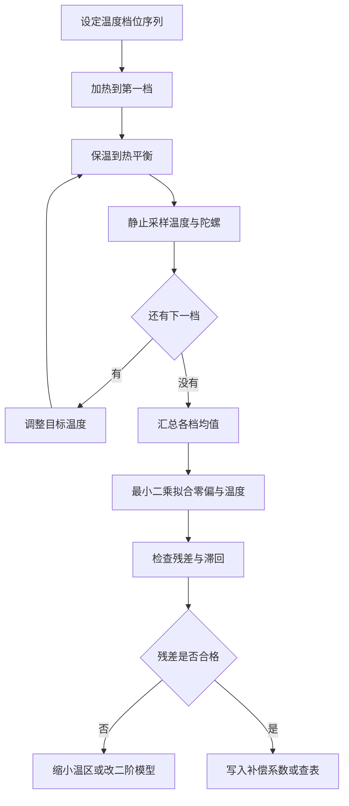
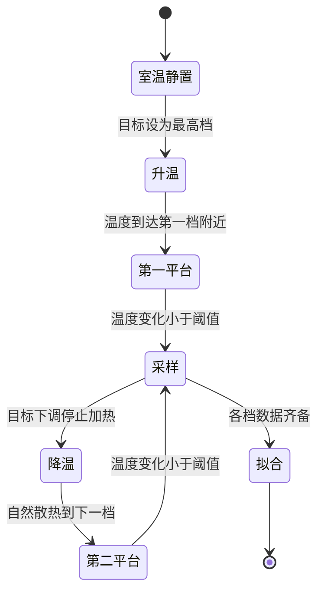

# 温漂与标定

温控把温度压在目标附近，标定回答温度变化多少对应多少零偏。两者解决的是不同的问题：温度稳定把波动量 $\Delta T$ 压小，标定把已知的灵敏度系数补掉，随机噪声项两者都不处理。本工程只实现了前者，后者停留在可落地的流程阶段。

对象是 `BMI088/Src/BMI088.cpp` 的温度读取与换算、`Task/Src/ImuTask.cpp` 的温度发布，以及 `Algorithm/Src/FusionAHRS.cpp` 的静态零偏估计，说明温漂口径与一套能在本工程复现的温度标定流程。读完要能回答：为什么温度稳定后 yaw 仍会缓慢漂移；静态标定为什么必须角速度为零；只有加热器时温度扫描怎么做。

## 温控与标定各自回答什么

| 项 | 温控 | 温度标定 |
| --- | --- | --- |
| 目标 | 减小温度波动 | 建立零偏与温度的关系 |
| 输入 | 目标温度、当前温度 | 温度序列、静止陀螺均值 |
| 输出 | 占空比 | 零偏曲线或系数 |
| 作用范围 | 缓变漂移 | 已知温区内的确定性偏移 |
| 本工程现状 | 已实现 | 未实现 |

温控的输出是控制量，标定的输出是系数。温控不改变零偏对温度的依赖关系，只是让工作点停在一个温度上；标定不减少温度波动，只是把波动引起的确定性偏移算出来。两者叠加之后，剩下的误差是随机噪声的积分。

## 陀螺输出里的温度项

把陀螺输出写成标度因数与零偏都随温度变化的形式：

$$\omega_{meas}=(1+s(T))\,\omega_{true}+b(T)+n$$

在小温区内做一阶展开，$s$ 与 $b$ 线性化：

$$s(T)\approx s_0+\alpha(T-T_0),\qquad b(T)\approx b_0+\beta(T-T_0)$$

姿态角由角速度积分得到，把上式代进积分：

$$\Delta\theta(t)=\int_0^t b(T(\tau))\,d\tau+\int_0^t n\,d\tau$$

零偏项按时间线性累积，噪声项按时间的平方根累积，因为白噪声积分的标准差是 $\sigma\sqrt{t}$。若温度稳定在 $T^*$，零偏项简化为 $b(T^*)\,t$，是一条匀速漂移；温度波动 $\Delta T$ 时，误差多出 $\beta\,\Delta T\,t$ 一项，漂移速度随温度变化。以 $\beta=0.01$ 度每秒每摄氏度、$\Delta T=5$ 摄氏度为例，残余零偏 0.05 度每秒，积分 60 秒得到 3 度。该数字用于说明量级，BMI088 的实际系数以器件手册与实测为准。

## 静态标定为什么要求角速度为零

温度标定要求输入角速度为零。静止时 $\omega_{true}=0$，输出只剩零偏与噪声：

$$\omega_{meas}=b(T)+n$$

在一个温度平台上采 $N$ 个样本，样本均值为零偏的估计：

$$\hat b(T_j)=\frac{1}{N}\sum_{k=1}^{N}\omega_{meas,k}$$

均值估计的标准差是 $\sigma_n/\sqrt{N}$，样本越多越接近真值。若采样时载体有真实角速度，均值里会混入 $\bar\omega_{true}$，拟合出来的系数就带上了运动项，而且这一项与温度没有因果关系，无法通过增加样本消除。样本数 $N$ 要保证均值标准差不明显大于零偏本身的量级，具体门限按实测噪声水平确定。

三轴共用同一个温度序列，$b_0$ 与 $\beta$ 都是三维向量。Z 轴与 X/Y 轴的处理方式可以不同：Z 轴零偏直接积分进 yaw，影响最大；X/Y 轴零偏只造成静态倾斜偏差，允许更粗的标定。

## 最小二乘的两个系数怎么解

得到若干平台的数据点 $(T_j,\hat b(T_j))$ 后，用最小二乘拟合线性模型：

$$\min_{b_0,\beta}\sum_j\big(\hat b(T_j)-b_0-\beta(T_j-T_0)\big)^2$$

令 $T_0$ 取所有平台温度的平均值 $\bar T$，两个系数的闭式解是

$$\beta=\frac{\sum_j (T_j-\bar T)\big(\hat b(T_j)-\bar{\hat b}\big)}{\sum_j (T_j-\bar T)^2},\qquad b_0=\bar{\hat b}-\beta(\bar T-T_0)$$

分母是所有温度的平方偏差和。温度档位跨度越大，分母越大，同样的零偏差给出的 $\beta$ 越稳定；档位集中在目标温度附近时，$\beta$ 对测量噪声很敏感。这也是温度扫描要覆盖尽量宽温区的原因。

## 只有加热器时温度扫描怎么做

本工程只有加热器，没有制冷元件，温度扫描只能向上做。做法是把目标温度分成若干档，每档保温到热平衡后采样，一档结束后把目标调低，靠自然散热回到下一档。升档靠加热控制，比降档的可控性高。

| 阶段 | 操作 | 采样判据 |
| --- | --- | --- |
| 预热 | 目标设成最低档 | 温度变化小于 0.1 摄氏度每分钟 |
| 保温 | 保持目标不变 | 连续数分钟 |
| 采样 | 静止，记录温度与陀螺 | 每档不少于 30 秒 |
| 降档 | 目标下调，停止加热 | 自然散热到下一档 |
| 拟合 | 汇总各档均值 | 残差与滞回检查 |

降档速度由热时间常数决定，与热容和热阻的乘积同量级。若某一档降到一半就重启加热，温度会在两档之间来回，采样窗口里混入控制振荡，均值失去意义。热平衡判据取“温度变化小于 0.1 摄氏度每分钟”，是一个按经验给出的门限，具体数值要按实测调整。

## 拟合之后要检查残差与滞回

拟合后要检查两项。第一项是残差：残差应无系统弯曲，决定系数接近 1；如果残差随温度呈 U 形，说明一阶模型不够，需要缩小温区或改用二阶。第二项是滞回：升温与降温两条曲线的同一温度点若偏差明显，说明存在热滞回或热梯度，线性模型不能同时拟合两条路径。

两项都必须用实测数据判定，没有可以预先写死的门限。滞回的一种来源是加热区与温度传感器之间有热梯度：升温时加热元件温度高于芯片，降温时反过来，同一读数对应不同的实际芯片温度。

## 本工程的温度链路现状

温度链路已经打通到发布层：`BMI088_Read` 在 `BMI088/Src/BMI088.cpp:166-176` 返回温度，换算在 `:162`，常数在 `BMI088/BMI088config.h:193-194`；`Task/Src/ImuTask.cpp:107` 把它写进 `imu_data.temperature`，结构体定义在 `Message_Bus/message_bus.h:15-20`。发布之后没有消费者，全工程检索只找到这一处写入。

温度换算分三步：11 位补码扩展、乘 0.125、加 23.0。0.125 摄氏度是寄存器 LSB 对应的温度步进，23.0 是寄存器值为 0 时的基准温度（`BMI088/BMI088config.h:193-194` 的注释）。三步缺任何一步，控制与标定都会工作在错误的温度上。

## 在线零偏估计里没有温度项

在线零偏估计只有一路：`FusionAHRS` 内部的 `GyroBiasEKF`，标量状态、过程噪声 $10^{-6}$、测量噪声 $10^{-4}$（`Algorithm/Src/FusionAHRS.cpp:22-28`），只在静止判定成立时更新（`:30-41`），且只估计 Z 轴。X、Y 轴没有在线偏置估计，也没有温度项。

`ImuTask` 里预留的动态零偏变量 `yaw_bias`、`GYRO_ZERO_THRESHOLD`、`BIAS_ALPHA`、`LOOP_DT`（`Task/Src/ImuTask.cpp:24-31`）在主循环里没有使用，动态零偏补偿没有落地。当前运行的补偿只有静态 EKF 一条路，它的状态里没有温度，所以温度变化引起的零偏变化只能靠缓慢收敛去追。

## 标定落地需要新增哪些环节

温度标定本身在本工程没有实现。下表给出若要做标定，需要新增的观测点与改动位置。

| 环节 | 需要的改动 | 位置 |
| --- | --- | --- |
| 温度记录 | 增加温度与陀螺的同步打印 | `Task/Src/ImuTask.cpp:41-113` 循环内 |
| 温度目标扫描 | 让 `ImuTempControl_Update` 的实参可调 | `Task/Src/ImuTask.cpp:46` |
| 档位控制 | 新增上位机或遥控指令 | 本工程未实现 |
| 拟合 | 在主机侧做最小二乘 | 上位机脚本，本工程无 |
| 补偿 | 在零偏估计中叠加温度项 | `Algorithm/Src/FusionAHRS.cpp:30-41` |

以上步骤属于建议流程，本工程未实现，也没有做过温箱或转台标定。标定所需的最低温区、采样时长与残差门限，都要按实测与手册确定。

## 标定结论里容易弄错的几处

| 容易读错的地方 | 现象 | 位置 |
| --- | --- | --- |
| 把温控当温度补偿 | 温度稳定后仍有缓变残差 | 第 1 节 |
| 用环境温度代替芯片温度 | 拟合点整体偏移 | 热梯度，未实测 |
| 在非静止条件下采样本 | 均值混入真实角速度 | `Algorithm/Src/FusionAHRS.cpp:30-41` |
| 只标 Z 轴 | 水平姿态的温漂未覆盖 | `Algorithm/Src/FusionAHRS.cpp:30-41` |
| 把温度量化当噪声 | 0.125 摄氏度步进被当作真实波动 | `BMI088/Src/BMI088.cpp:162` |
| 认为预留的 `yaw_bias` 已生效 | 主循环没有读它 | `Task/Src/ImuTask.cpp:24-31` |
| 忽略升温与降温的滞回 | 同一温度给出两个零偏 | 第 2.3 节 |
| 认为温度发布有消费者 | `imu_data.temperature` 无人读取 | `Task/Src/ImuTask.cpp:107` |

其中“在非静止条件下采样本”最难自查：载体是否静止要靠陀螺模长判断，而陀螺本身正在被标定。可操作的做法是先用阈值筛出低角速度窗口，再在窗口里取均值；阈值取多少，取决于本底噪声与标定精度要求，属待实测。

## 小结

### 核心概念

- 温控压的是温度波动，标定建的是零偏与温度的关系，两者互补。
- 陀螺零偏与标度因数都随温度变化，一阶模型用 $b_0$ 与 $\beta$ 描述。
- 静态标定在 $\omega_{true}=0$ 时取温度平台上的样本均值，再做最小二乘。
- 最小二乘的两个系数有闭式解，温区跨度越大，斜率估计越稳。
- 本工程只有加热通道，温度扫描只能向上做，降档靠自然散热。
- 在线零偏估计只有 Z 轴、只在静止更新，没有温度项；本工程未做温度标定。

### 设计权衡

| 决策 | 选择 | 收益 | 代价 |
| --- | --- | --- | --- |
| 标定方式 | 静态平台采样 | 无需转台 | 每档需要等待热平衡 |
| 温度来源 | BMI088 内部温度寄存器 | 与陀螺同芯片，热耦合好 | 分辨率 0.125 摄氏度，位置不一定是芯片热点 |
| 模型 | 一阶线性 | 参数少，易验证 | 大温区或滞回下残差大 |
| 补偿位置 | 建议放在零偏估计 | 与静态检测复用 | 需要区分温漂与随机游走 |
| 本工程现状 | 不做标定 | 省去工装与流程 | 温漂只能靠温控压小 |

## 练习

### 基础题

1. 写出陀螺输出的温度模型，并说明静态标定时 $\omega_{true}$ 取零的依据。
2. 计算 $\beta=0.01$ 度每秒每摄氏度、温度稳定在 45 摄氏度时，积分 120 秒的零偏角度误差。
3. 说明为什么温度扫描的降档只能靠自然散热，并给出一个判断热平衡的判据。

### 挑战题

4. 设计一个只用 `imu_data.temperature` 与 `imu_data.gyro` 的标定数据格式，包含时间戳、温度、三轴角速度与静止标志。
5. 若同一块板升温与降温的零偏曲线相差 0.02 度每秒，分析可能的来源并给出区分方法与改进措施。
6. 把温度项加入 `GyroBiasEKF`，写出扩展后的状态与观测方程，并说明过程噪声如何随温度变化率调整。

### 附：本页引用的固件路径

| 路径 | 用途 |
| --- | --- |
| `/home/wyx/rm/2026SentriOmeniGimbal/2026OmniSentryGimbal/BMI088/Src/BMI088.cpp` | 温度读取与换算 |
| `/home/wyx/rm/2026SentriOmeniGimbal/2026OmniSentryGimbal/BMI088/BMI088config.h` | 温度常数 |
| `/home/wyx/rm/2026SentriOmeniGimbal/2026OmniSentryGimbal/Task/Src/ImuTask.cpp` | 温度发布与预留零偏变量 |
| `/home/wyx/rm/2026SentriOmeniGimbal/2026OmniSentryGimbal/Message_Bus/message_bus.h` | LocalImuData 结构 |
| `/home/wyx/rm/2026SentriOmeniGimbal/2026OmniSentryGimbal/Algorithm/Src/FusionAHRS.cpp` | Z 轴静态零偏估计 |
| `/home/wyx/rm/2026SentriOmeniGimbal/2026OmniSentryGimbal/Algorithm/Inc/FusionAHRS.h` | GyroBiasEKF 声明 |
| `/home/wyx/rm/2026SentriOmeniGimbal/2026OmniSentryGimbal/BMI088/Src/ImuTempControl.cpp` | 温度环执行入口 |
