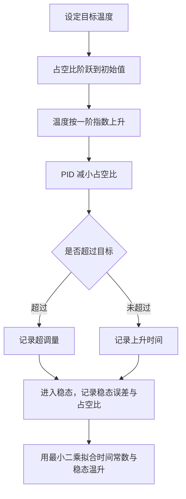
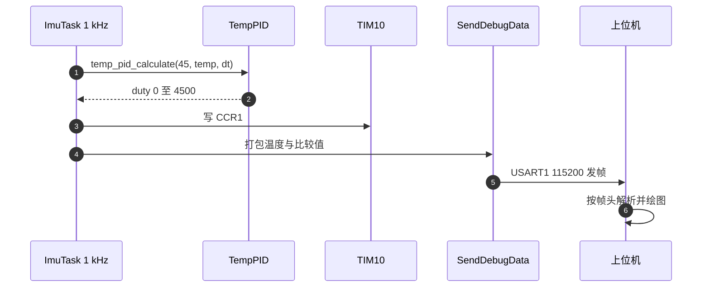

# 控温实测方法

温度环好不好用，只能从响应曲线判断。曲线包含四类信息：到达目标的时间、超调量、稳态误差、以及占空比是否饱和。要读出这四类信息，先要有一个能刻画加热过程的模型，再确定采什么量、用什么工具采、采到哪里去。

本工程可用的控温实测方案包括：集总热容模型与时间常数的量级、超调量与稳态误差的定义、温度采样与 1 kHz 循环的时间尺度关系、`BSP/Src/debug.cpp` 的打包格式，以及一条完整测量记录应包含的字段。模型参数与实测数值待现场测量。

## 要测的量与时间尺度

温度环的输入、输出与状态各有一个可测量：

| 观测对象 | 变量 | 采样位置 |
| --- | --- | --- |
| 当前温度 | `imu_data.temperature` | `Task/Src/ImuTask.cpp` |
| 温度原始码值 | `BMI088::raw_.temp` | `BMI088/Src/BMI088.cpp` |
| PID 输出 | `temp_pid_calculate` 返回值 | `BMI088/Src/ImuTempControl.cpp` |
| 比较值 | `compare` | `BMI088/Src/ImuTempControl.cpp` |
| 目标温度 | `ImuTempControl_Update` 第一个实参 | `Task/Src/ImuTask.cpp` |

其中比较值 `compare` 是 `update` 的局部量（`BMI088/Src/ImuTempControl.cpp`），波形工具取不到，要观察它需要在写入前加一个探针。温度与陀螺可以从调试器或新增的调试输出里取，目标温度是调用实参，改起来需要动 `Task/Src/ImuTask.cpp`。

温度的时间尺度由加热区热容与散热路径决定，通常落在秒到几十秒。控制循环是 1 kHz，温度每毫秒采一次，采样密度比过程快三到四个数量级。这个差距意味着温度数据本身有很强的平滑性，单点毛刺多数来自量化或通信，而不是真实温度跳变。

## 集总热容模型与阶跃响应

把加热区看成一块热容 $C$、向环境散热热阻 $R_{th}$ 的集总体（集总假设：加热区内部温度均匀，忽略温度梯度），加热功率为 $P$：

$$C\frac{dT}{dt}=P-\frac{T-T_{amb}}{R_{th}}$$

定义热时间常数 $\tau=R_{th}C$，稳态温升 $\Delta T_{ss}=R_{th}P$，方程化为

$$\tau\frac{dT}{dt}+T=T_{amb}+\Delta T_{ss}$$

从 $T_{amb}$ 出发、功率 $P$ 恒定时的解是

$$T(t)=T_{amb}+\Delta T_{ss}\left(1-e^{-t/\tau}\right)$$

到达 63.2% 稳态温升的时间就是 $\tau$，到达 95% 的时间约 $3\tau$。本工程用 PWM 变占空比控制，等效功率 $P=D\,P_{max}$，所以 $D$ 恒定就等价于一个阶跃。

模型有两个前提要现场核验：加热区内部温度均匀（集总假设），散热以对流或传导为主、近似线性。若加热元件与传感器之间热阻不可忽略，响应会出现两级滞后，一阶模型拟合残差会明显变大。



## 超调量与稳态误差的定义

阶跃响应的三个指标要先把定义写死，否则不同人记录的数字不可比：

$$M_p=\frac{T_{max}-T^*}{T^*}\times 100\%$$

其中 $T_{max}$ 是响应过程中的最高温度，$T^*$ 是目标温度。稳态误差取最终一段窗口的平均温度与目标的差：

$$e_{ss}=\bar T_{window}-T^*$$

上升时间定义为从 $T_{amb}$ 的 10% 到 90% 温升所需时间。占空比饱和与否要单独记录：如果稳态占空比已经达到上限，稳态误差会一直存在，此时调 PID 参数没有意义，问题在加热功率不足。当前换算使非零输出直接饱和（`BMI088/Src/ImuTempControl.cpp`），测稳态误差之前必须先确认比较值的量级。

窗口长度的选择影响 $e_{ss}$ 的数值：窗口太短会把过渡段算进去，太长会受环境温度漂移影响。取 3 到 5 倍时间常数、且环境温度变化小于 0.5 摄氏度的时间段，是常用做法；具体长度按曲线确定。

三个指标里，上升时间对判定点最敏感：它只用到从 10% 到 90% 的一段，起点与终点的误差会直接进入结果。如果温升总幅度接近量化步进，0.125 摄氏度的台阶会让两个判定点各偏一格，时间常数的估计随之偏。

阶跃测试建议至少重复三次，取三项指标的均值与极差。单次曲线的结论只作为初步判断，重复之间的差异才反映环境温度、风冷条件与装配状态带来的真实散布。

## 温度采样慢于 1 kHz 循环

温度在 1 kHz 循环里每毫秒读一次，而热过程的时间常数是秒级。直接用 1 kHz 采样做拟合会带来两个问题：数据量大，且相邻点高度相关，拟合的有效自由度远小于样本数。常用的处理是按固定间隔抽稀，比如每 100 毫秒取一点，再用普通最小二乘拟合。

抽稀在代码里就是一次计数判断：

```c
/* 示意：把 1 kHz 温度序列抽稀到 100 ms 再拟合 */
if (++tick % 100 == 0) {            /* 每 100 个循环取一点 */
    record(imu_data.temperature, compare, HAL_GetTick());
}
```

抽稀会丢失快速毛刺。如果要检查毛刺，可以保留原始序列做差分：温度序列的一阶差分超过 0.5 摄氏度每毫秒时，查 `BMI088/Src/BMI088.cpp` 的温度换算与补码扩展，而不是先怀疑热过程。量化步进 0.125 摄氏度意味着相邻两个读数的最小差就是 0.125，差分分布呈离散台阶，属于已知特性。

另一处时间尺度问题是 `Task/Src/ImuTask.cpp` 的 `DWT_Delay_ms(1)`。它决定的是控制与采样的节拍，不改变热过程的时间常数，但会让温控的实际更新率低于标称 1 kHz。测得的温度曲线与占空比序列都带有这个节拍，拟合前不需要校正，比较不同循环负载下的曲线才需要。

## 观测入口与量化下限

温度寄存器更新慢于循环，连续两次读到的往往是同一个码值；温度分辨率是 0.125 摄氏度（`BMI088/BMI088config.h`），小于该步进的超调量测不出来。要观察温度有三个入口：

| 入口 | 方式 | 位置 |
| --- | --- | --- |
| 调试串口 | 在循环里调 `SendDebugData` 打包温度与比较值 | `BSP/Src/debug.cpp`，初始化在 `Task/Src/ImuTask.cpp` |
| 调试器 | 在 `imu_data.temperature` 或局部 `temp` 上设观察点 | `Task/Src/ImuTask.cpp` |
| 上位机 | 给 USB 或串口协议增加温度字段 | 本工程未实现 |

温度发布到 `imu_data.temperature` 后没有消费者，`Message_Bus/message_bus.h` 的结构里只有这个字段无人读取。温度原始码值的读取与补码扩展在 `BMI088/Src/BMI088.cpp`，乘 0.125 并加 23.0 之后才成为摄氏度。比较值的计算与写入在 `BMI088/Src/ImuTempControl.cpp`；判断占空比要用 `Core/Src/tim.c` 配置出的 ARR，单次读 CNT 只能说明当前的计数位置。

## 用 SendDebugData 打包温度与比较值

`BSP/Src/debug.cpp` 的 `SendDebugData` 提供了现成的打包工具，格式串支持 `f`（4 字节浮点）、`i`（`int32`）、`u`（`uint32`）、`s`（`int16`）、`h`（`uint16`）、`c`（`uint8`），帧头为 `0xAA 0xBB`，最后经 `HAL_UART_Transmit` 发送。它没有时间戳字段，时间基准要靠接收端按帧率与已知的发送周期推算，或者在数据里附带一个自增序号。

温度环里最直接的两个观测量是温度与比较值：

```cpp
// 温度与占空比的打包示例（属于新增观测，本工程未实现）
SendDebugData("ff", imu_data.temperature, (float)compare);
```

上面这行只是格式示意，本工程当前的调试输出没有包含温度，属于待新增的观测点。打包时要把温度与占空比放在同一帧，才能对齐时间轴；分两帧发送时，两帧之间至少差一个循环周期，做阶跃响应分析时会产生相位差。



## 一次测量记录包含什么

一条可复现的记录至少要包含六项，缺一项就无法与下一次对照：

| 字段 | 示例形式 | 来源 |
| --- | --- | --- |
| 采样时间戳 | 相对启动的毫秒数 | 接收端推算或自增序号 |
| 环境温度 | 摄氏度 | 外部温度计，待实测 |
| 当前温度 | 摄氏度 | `imu_data.temperature` |
| 目标温度 | 摄氏度 | `ImuTempControl_Update` 实参 |
| 占空比或比较值 | 无量纲 | `BMI088/Src/ImuTempControl.cpp` |
| 循环节拍 | 毫秒 | `Task/Src/ImuTask.cpp` |

记录里还要写清三件事：目标温度序列、采样时长、环境温度是否稳定。这三项决定了曲线能不能用来拟合。当前工程没有专门的数据记录通道，温度发布也没有消费者（`Task/Src/ImuTask.cpp` 是唯一写入点），要记录就得新增调试输出，改动位置限于 `Task/Src/ImuTask.cpp` 附近。

波特率 115200（`Core/Src/usart.c`）对应每字节约 87 微秒。一个包含两浮点的帧十几字节，每毫秒发一帧会占掉传输能力的十分之一以上，因此实际采样应当抽稀到 100 毫秒一帧。这是观测需求与带宽之间的直接换算，采样率不是越高越好。

## 阶跃幅度怎么选

阶跃幅度决定信噪比与安全性。幅度太小，温度变化被 0.125 摄氏度的量化步进淹没，曲线看不出指数形状；幅度太大，加热区与传感器的温差拉大，集总假设变差，还可能超过器件与加热元件的允许温度。常用范围是 5 到 10 摄氏度；本工程的目标 45 摄氏度相对室温 25 摄氏度对应 20 摄氏度温升，若从室温做整段阶跃，幅度已在常用范围之上，需要先确认加热元件与 IMU 的耐温。

阶跃的起点要选在热平衡状态。从非平衡状态起跳，响应里会叠加前一段的残余，指数拟合的两个参数互相补偿，给出的时间常数偏大或偏小。判断起跳点是否平衡，用前文的热平衡判据。

阶跃期间不要改变目标温度。中途调目标会让输入变成双层阶跃，一阶模型无法直接拟合。若确实需要变目标，把每一段阶跃单独截出来处理。

## 实测口径里容易弄错的地方

| 容易读错的地方 | 现象 | 位置 |
| --- | --- | --- |
| 用 1 kHz 原始序列直接拟合 | 相关样本过多，参数置信区间虚高 | `Task/Src/ImuTask.cpp` |
| 把量化台阶当温度抖动 | 差分呈 0.125 摄氏度台阶 | `BMI088/Src/BMI088.cpp` |
| 未确认占空比饱和就算稳态误差 | 误差由功率上限决定，非控制参数 | `BMI088/Src/ImuTempControl.cpp` |
| 温度与占空比分帧发送 | 两条曲线有固定相位差 | `BSP/Src/debug.cpp` |
| 忽略环境温度漂移 | 长窗口的稳态误差含环境项 | 记录字段 |
| 认为温度已有记录通道 | 发布后无人读取 | `Task/Src/ImuTask.cpp` |
| 在中断里做长打印 | 阻塞会拖慢 1 kHz 循环 | `BSP/Src/debug.cpp` |
| 用未使用的 `mag` 判断姿态可用 | 该字段未赋值 | `Task/Src/ImuTask.cpp` |

中断里长打印这一条在本工程有直接后果：`SendDebugData` 内部是阻塞发送，调用点如果放在 1 kHz 循环里，每帧会占用数十微秒到数百微秒，循环实际周期被拉长。要记录温度时应当抽稀发送，或者把数据累积到缓冲区、在低优先级任务里整批发送。

## 小结

### 核心概念

- 加热过程用集总热容模型描述，热时间常数为热阻与热容的乘积，阶跃响应按指数上升。
- 超调量、稳态误差、上升时间三项指标要在记录里写清定义与窗口长度。
- 温度在 1 kHz 循环里采样，过程时间常数是秒级，拟合前要抽稀。
- `SendDebugData` 支持六种标量格式，没有时间戳，需要接收端推算。
- 一条完整记录包含时间戳、环境温度、当前温度、目标温度、占空比与循环节拍。
- 本工程没有温度记录通道，温度发布后无人读取，记录功能待新增。

### 设计权衡

| 决策 | 选择 | 收益 | 代价 |
| --- | --- | --- | --- |
| 模型 | 一阶集总 | 参数少，拟合稳定 | 热梯度明显时残差大 |
| 采样 | 抽稀到 100 毫秒 | 数据量与相关性可控 | 丢失快速毛刺 |
| 传输 | 115200 波特率 | 无需改配置 | 高频整帧发送会挤占带宽 |
| 记录通道 | 复用调试串口 | 零额外硬件 | 需要新增打包代码 |
| 指标定义 | 上升时间取 10% 到 90% | 与常规一致 | 起点受环境温度影响 |

## 练习

### 基础题

1. 写出一阶阶跃响应的表达式，并计算到达 63.2% 与 95% 稳态温升所需时间与时间常数的关系。
2. 说明为什么用 1 kHz 原始温度序列直接拟合会高估参数置信度。
3. 列出一条完整测量记录的六个字段，并说明每个字段从哪里取。

### 挑战题

4. 设计一个不改动控制代码、只用调试串口的温度记录方案，给出帧格式、抽稀周期与上位机解析流程。
5. 若阶跃响应出现两级滞后，写出二阶模型的传递函数，并说明如何从曲线上读出两个时间常数。
6. 计算目标温度从 25 升到 45 摄氏度、时间常数 8 秒时到达 95% 所需的时间，并说明环境温度同时上升 1 摄氏度会给稳态误差带来多少偏差。

### 附：本页引用的固件路径

| 路径 | 用途 |
| --- | --- |
| `Task/Src/ImuTask.cpp` | 温控调用、温度发布与循环节拍 |
| `BMI088/Src/ImuTempControl.cpp` | PID 调用与比较值写入 |
| `BMI088/Src/BMI088.cpp` | 温度读取与换算 |
| `BMI088/BMI088config.h` | 温度常数 |
| `BSP/Src/debug.cpp` | SendDebugData 打包格式 |
| `Core/Src/usart.c` | 调试串口波特率 |
| `PID/Src/temp_pid.cpp` | 温度环实现与限幅 |
