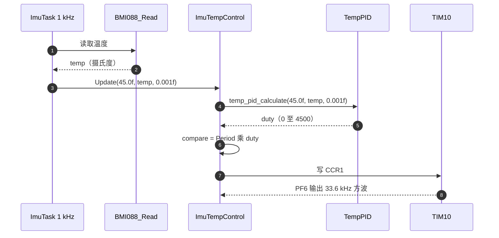
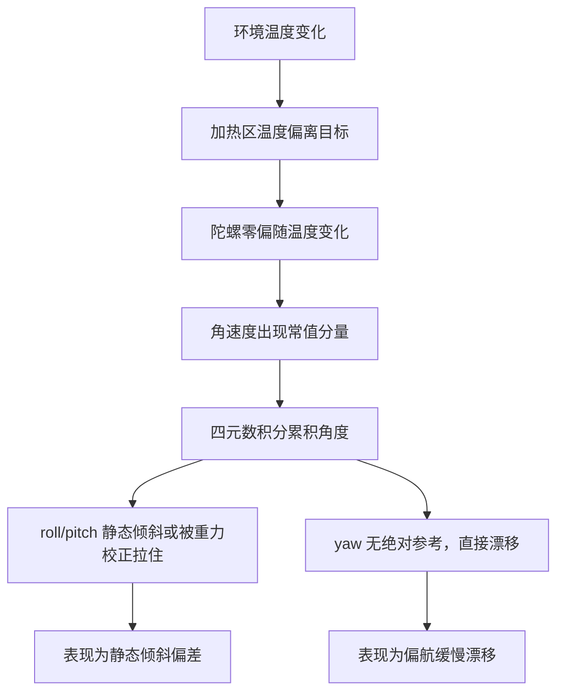

# 与 PID 温度环的分工

温控链由两个单元共同完成：温度环负责把温度误差算成控制量，本单元负责把这个控制量变成引脚上的方波。分工不清时会出现两种错判：把占空比偏差算成 PID 参数问题，或者把温度不收敛算成 PWM 配置问题。分清界限的前提是知道接口上流动的是什么量、量纲是什么、饱和发生在哪一侧。

对象是 `BMI088/Src/ImuTempControl.cpp` 的 `update`、`PID/Src/temp_pid.cpp` 的构造参数与 `Task/Src/ImuTask.cpp` 的调用点，给出四段职责划分、接口量纲与交接点分析。读完要能回答：控制量在接口上是什么类型；非零输出为什么直接饱和；温度波动通过哪条路径传到 yaw。

## 控温链的四段归属

整条链按职责切成四段，每段有唯一的负责人：

| 段 | 输入 | 输出 | 归属 |
| --- | --- | --- | --- |
| 温度测量 | 原始码值 | 摄氏度 | BMI088 驱动单元 |
| 温度环 | 目标与当前温度 | 控制量 `duty` | 温度环单元 |
| 换算与写入 | `duty` | CCR1 比较值 | 本单元 |
| 功率与热过程 | PWM 波形 | 温度变化 | 硬件，不在固件内 |

四段串行，前一段的输出就是后一段的输入。排查顺序也因此确定：先确认温度读数可信，再确认控制量在合理范围，再确认比较值没有饱和，最后才怀疑硬件。

## 温度环与本单元的接口数据流

接口只有一个函数：`ImuTempControl_Update(float targetTemp, float currentTemp, float dt)`（`BMI088/Src/ImuTempControl.cpp:15`）。三个实参都是浮点，单位是摄氏度、摄氏度、秒。`dt` 是控制周期，当前调用点传 0.001f（`Task/Src/ImuTask.cpp:46`），对应标称 1 kHz。

`update` 内部先调 `temp_pid_calculate(targetTemp, currentTemp, dt)`（`:16`），返回值赋给 `uint32_t duty`，再做换算：

```cpp
void ImuTempControl::update(float targetTemp, float currentTemp, float dt) {
    uint32_t duty = temp_pid_calculate(targetTemp,currentTemp, dt);

    auto compare = static_cast<uint32_t>(htim_->Init.Period * duty);

    __HAL_TIM_SET_COMPARE(htim_, channel_, compare);
}
```

链路上每一段的输入输出与位置：

| 段 | 输入 | 输出 | 位置 |
| --- | --- | --- | --- |
| `BMI088_Read` | 无 | 温度摄氏度 | `BMI088/Src/BMI088.cpp:166-176` |
| `ImuTempControl_Update` | 目标、温度、`dt` | 无 | `BMI088/Src/ImuTempControl.cpp:15-21` |
| `temp_pid_calculate` | 目标、温度、`dt` | duty 码值 | `PID/Src/temp_pid.cpp:47-50` |
| `__HAL_TIM_SET_COMPARE` | duty | CCR1 | `BMI088/Src/ImuTempControl.cpp:20` |

接口上的控制量是 PID 的输出原值，没有经过归一化。这一点决定了换算一侧必须知道自己收到的是什么量纲，而当前实现把控制量当成占空比直接乘周期，量纲在交界处断开。



## 温度环的 PID 参数与限幅

温度环构造参数是 `TempPID(1600.0f, 0.2f, 0.0f, 4500.0f, 4400.0f)`（`PID/Src/temp_pid.cpp:41`），依次是 $K_p$、$K_i$、$K_d$、输出上限、积分上限。比例增益 1600 的量级来自温度误差的量纲：误差是摄氏度，输出是整数控制量，1 摄氏度的误差对应 1600 的输出。微分项为 0，积分上限 4400 略低于输出上限 4500。

输出被限幅在 0 到 4500。函数声明为 `int16_t`（`PID/Inc/temp_pid.h:29`），赋给 `uint32_t duty` 时发生整型转换；由于限幅保证了非负，转换结果与数值一致。控制量的物理含义由后续换算定义，温度环本身只保证它落在 0 到 4500。

| 参数 | 值 | 含义 |
| --- | --- | --- |
| $K_p$ | 1600.0f | 每摄氏度误差对应的控制量 |
| $K_i$ | 0.2f | 积分项系数 |
| $K_d$ | 0.0f | 微分项关闭 |
| 输出上限 | 4500.0f | 控制量上限 |
| 积分上限 | 4400.0f | 抗积分饱和上限 |

## 温度波动如何传到 yaw

温度波动通过零偏传到姿态角。温控把温度压在目标附近的 $\pm\Delta T$ 范围内，陀螺零偏随温度变化，变化量 $\beta\Delta T$ 被积分进 yaw：

$$\Delta\theta_{yaw}=\int \beta\,\Delta T(\tau)\,d\tau$$

以 $\beta=0.01$ 度每秒每摄氏度、温度波动 0.1 摄氏度、周期 1 秒为例，每次波动叠加的零偏是 0.001 度每秒，持续一秒得到 0.001 度；若这一项按同方向持续累积一小时，总量是 $0.001\times3600=3.6$ 度。该数字用于说明量级，实际系数与波动幅度以实测为准。

这条路径解释了为什么温控与姿态解算要分开看：温控的任务是把 $\Delta T$ 压小，姿态一侧的任务是把残余零偏估掉。两者都不处理随机噪声积分，随机项只能靠时间平均或更好的传感器。

本工程没有磁力计，`Task/Src/ImuTask.cpp:15` 的 `mag` 声明后未赋值，yaw 只能靠陀螺积分维持，温度稳定对 yaw 的作用比对水平角更直接。



## 哪些问题归温度环，哪些归本单元

| 现象 | 归属 | 判据 |
| --- | --- | --- |
| 温度在目标附近振荡 | 温度环 | 观察温度曲线与 PID 输出 |
| 超调大、回稳慢 | 温度环 | 阶跃响应指标 |
| 温度完全不动 | 本单元或硬件 | 先看 PF6 是否有波形 |
| 占空比恒为 100% | 换算 | 比较值超过 ARR |
| 温度到不了目标 | 硬件或功率 | 占空比已饱和 |
| 温度缓慢漂移不收敛 | 换算或积分 | 看积分限幅是否生效 |
| 温度读数为负或异常 | 驱动 | 查换算三步 |
| 温控正常但 yaw 仍漂 | 姿态侧 | 查零偏估计与标定 |

划分的标准是“控制量是否已经正确”。如果 PID 输出落在 0 到 4500 且波形正常，温度却不收敛，问题在温度环参数或硬件；如果 PID 输出正常而比较值饱和，问题在换算。

几处交接点的归属也列在一起：

| 项 | 位置 | 归属 |
| --- | --- | --- |
| PID 参数与满量程 | `PID/Src/temp_pid.cpp:41` | 温度环 |
| 单向限幅 | `PID/Src/temp_pid.cpp:20-32` | 温度环 |
| 占空比换算 | `BMI088/Src/ImuTempControl.cpp:18` | 温度环的量纲问题 |
| PWM 启动 | `BMI088/Src/ImuTempControl.cpp:11-13` | 本单元 |
| TIM10 配置 | `Core/Src/tim.c:42-63` | 本单元 |
| 温度读取与换算 | `BMI088/Src/BMI088.cpp:141-162` | BMI088 驱动单元 |
| 初始化调用 | `Task/Src/ImuTask.cpp:36` | 本单元与调度 |
| 温度发布 | `Task/Src/ImuTask.cpp:107` | 只用于温控，不参与姿态补偿 |
| 温度与姿态的关系 | `Algorithm/Src/FusionAHRS.cpp:30-41` | 融合单元 |

## 交界处最脆弱的一环

换算只有一个表达式：`compare = Period * duty`（`BMI088/Src/ImuTempControl.cpp:18`）。`Period` 是 4999，控制量上限 4500，于是比较值上限约 $4999\times4500=22\,495\,500$，远超 $ARR+1=5000$。只要控制量非零，比较值就达到或超过 ARR，PWM1 模式下输出恒为高，占空比 100%。

把边界列出来更直观：

| 控制量 `duty` | 比较值 | 实际占空比 |
| --- | --- | --- |
| 0 | 0 | 0% |
| 1 | 4999 | 约 100% |
| 20 | 99 980 | 100% |
| 4500 | 22 495 500 | 100% |

换算缺少除以满量程的一步。正确的形式是 $compare=(ARR+1)\times duty/4500$，这样控制量与占空比成比例。当前形式把控制量当成占空比的分子，量纲不匹配，温度环的输出范围与 PWM 的计数范围之间没有建立起对应关系。

这一处属于本单元与温度环共同的责任：温度环定义了控制量 0 到 4500 的量纲，本单元负责把它映射到 0 到 5000 的计数。映射错了两侧都表现得“工作正常”，只有温度曲线会暴露问题。

换算修正属于温度环与本单元共同确认的接口约定：改一侧就要同步改另一侧的归一化常数与量纲说明，否则同一个控制量在两侧的理解会再次分叉。

## 交接测试怎么设计

交接测试的目标是把控制量从温度环里取出来，单独验证换算。做法是在写入比较值之前加一个探针，或者在 `temp_pid_calculate` 返回后打印控制量，再把温度环短接：固定目标与当前温度，让误差恒定，观察控制量是否稳定。

测试分两步。第一步固定控制量，绕过温度环直接写 CCR1，用示波器测 PF6 占空比，验证换算表达式。第二步固定温度误差，观察控制量的数值范围是否落在 0 到 4500，验证温度环限幅。两步都通过之后，再合起来做闭环阶跃测试。

固定控制量的做法是在 `BMI088/Src/ImuTempControl.cpp:16` 与 `:18` 之间插入临时分支，跳过 PID 直接赋值。这属于临时探针，测完要撤回。绕过温度环后温度会持续上升，测试窗口要短，或者断开加热元件只测波形。

## 边界划错时的表现

| 容易读错的地方 | 现象 | 位置 |
| --- | --- | --- |
| 把饱和算成 PID 参数问题 | 调 $K_p$ 无改善 | `BMI088/Src/ImuTempControl.cpp:18` |
| 认为控制量已经是占空比 | 数值范围 0 到 4500 被当成 0% 到 100% | `PID/Src/temp_pid.cpp:41` |
| 用 `Period` 当满量程 | 分母少一个计数 | `BMI088/Src/ImuTempControl.cpp:18` |
| 把 `int16_t` 返回值当无符号 | 限幅保证了非负，暂时无影响 | `PID/Inc/temp_pid.h:29` |
| 认为温度波动不影响 yaw | 零偏随温度积分进 yaw | `FusionAHRS.cpp:30-41` |
| 把温度不收敛归到融合算法 | 融合不控制温度 | `FusionAHRS.cpp:22-28` |
| 忽略 `dt` 实参与循环不一致 | 积分项按错误周期累积 | `Task/Src/ImuTask.cpp:46` |

第七条的后果限于积分项：$K_i$ 为 0.2，误差累积按 `dt` 加权，`dt` 取 0.001 而实际周期 1.3 毫秒时，积分增长速度高出约 30%。比例项不受 `dt` 影响，所以现象是回稳变慢而非比例响应变化。

## 小结

### 核心概念

- 控温链分温度测量、温度环、换算写入、功率热过程四段，本单元负责换算与写入。
- 接口只有一个函数，三个浮点实参分别是目标温度、当前温度与控制周期。
- 温度环输出是 0 到 4500 的整数控制量，量纲由换算一侧解释。
- 当前换算是 `Period * duty`，非零输出直接饱和到 100% 占空比。
- 温度波动通过陀螺零偏积分进 yaw，yaw 没有绝对参考，漂移不可回正。
- 判断问题归属的标准是控制量是否已经正确。

### 设计权衡

| 决策 | 选择 | 收益 | 代价 |
| --- | --- | --- | --- |
| 接口传控制量原值 | 不做归一化 | 温度环可独立更换 | 换算一侧必须知道量纲 |
| 控制量上限 4500 | 略低于整千 | 与积分上限 4400 留出余量 | 换算必须按 4500 归一化 |
| 微分项为 0 | 只用 PI | 温度量化噪声不放大 | 大滞后对象回稳慢 |
| 换算放在 PWM 侧 | 温度环不关心计数范围 | 单元职责清楚 | 交界处成为单点故障 |
| 温度与姿态分工 | 温控压波动，估计补零偏 | 各自可独立验证 | 温漂未标定时仍有残差 |

## 练习

### 基础题

1. 写出 `ImuTempControl_Update` 的三个实参含义与单位，并说明 `dt` 在温度环里的作用。
2. 计算 `duty` 取 1、4500 时的比较值，判断各自的实际占空比。
3. 说明为什么温度波动会进入 yaw，而 roll 与 pitch 的同类误差会被重力校正拉住。

### 挑战题

4. 给出换算的修正表达式，说明 4500 这个归一化常数的来源，并分析修正后温度环参数是否需要重调。
5. 若把 `dt` 实参改成实测循环周期，分析对比例项、积分项与温度阶跃响应的影响。
6. 设计一个把温控状态（目标、温度、控制量、比较值）发布到 `Message_Bus` 的方案，给出结构体字段与写入点。

### 附：本页引用的固件路径

| 路径 | 用途 |
| --- | --- |
| `/home/wyx/rm/2026SentriOmeniGimbal/2026OmniSentryGimbal/BMI088/Src/ImuTempControl.cpp` | 接口与占空比换算 |
| `/home/wyx/rm/2026SentriOmeniGimbal/2026OmniSentryGimbal/BMI088/Inc/ImuTempControl.h` | 类声明 |
| `/home/wyx/rm/2026SentriOmeniGimbal/2026OmniSentryGimbal/PID/Src/temp_pid.cpp` | 温度环实现与限幅 |
| `/home/wyx/rm/2026SentriOmeniGimbal/2026OmniSentryGimbal/PID/Inc/temp_pid.h` | 返回类型声明 |
| `/home/wyx/rm/2026SentriOmeniGimbal/2026OmniSentryGimbal/Task/Src/ImuTask.cpp` | 调用点与周期实参 |
| `/home/wyx/rm/2026SentriOmeniGimbal/2026OmniSentryGimbal/Algorithm/Src/FusionAHRS.cpp` | 零偏估计与温度路径 |
| `/home/wyx/rm/2026SentriOmeniGimbal/2026OmniSentryGimbal/Message_Bus/message_bus.h` | 温度发布结构 |
