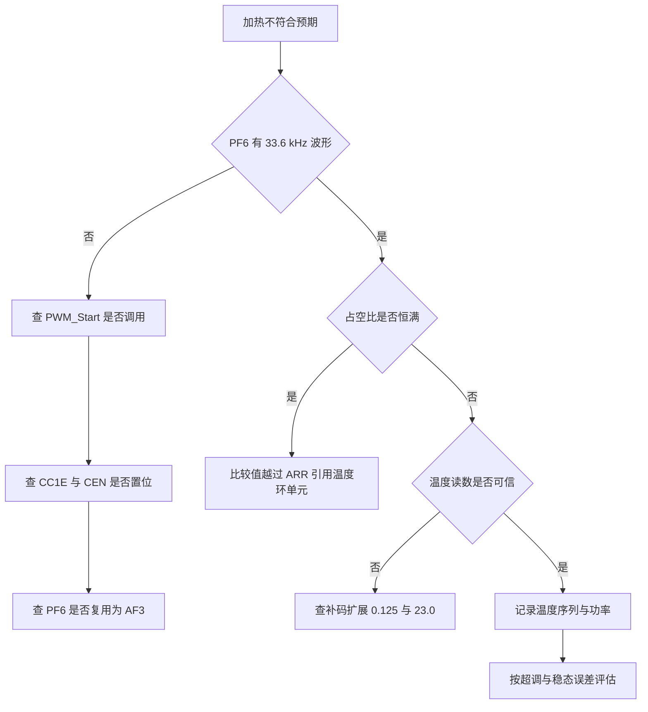
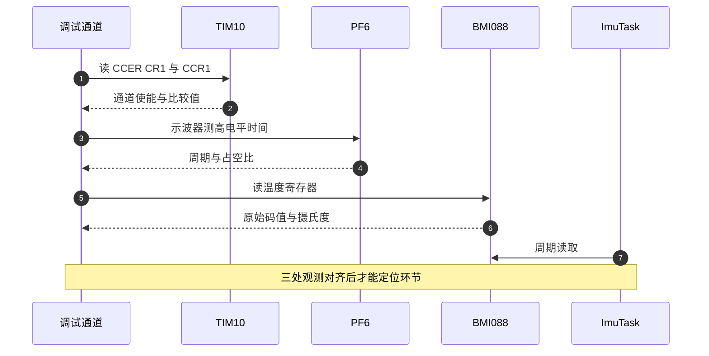

# 温控易错点与调试

温控的问题按出错环节分四类：通道、换算、传感、观测。四类的现象有重叠，比如不加热既可能是通道没启动，也可能是比较值算错，单看温度曲线分不出来。可操作的排查方式是把观测点对齐到波形、原始码值和控制量三处，再按类别逐个排除。

对象是 `Core/Src/tim.c`、`BMI088/Src/ImuTempControl.cpp` 与 `Task/Src/ImuTask.cpp`，把硬件与实测侧的问题归类，并给出从现象到代码位置的顺序。换算类的完整推导在 `06-PID 控制/03-温度环/05-易错点与调试.md`，只在与观测相关处引用它。

## 温控问题的四类归属

| 类别 | 出错环节 | 典型现象 |
| --- | --- | --- |
| 通道 | 定时器未启动或引脚未复用 | PF6 无波形，完全不加热 |
| 换算 | 比较值越过 ARR | 加热只有全开，温度开关振荡 |
| 传感 | 温度口径或单位 | 目标判断整体偏移 |
| 观测 | 没有温度输出或采样不对 | 看不到温度，结论无法验证 |

四类里只有通道与观测能在不看温度曲线时独立判断：通道靠示波器看 PF6，观测靠串口或调试器看数据。换算与传感必须结合温度曲线，因为它们的现象都是“温度不对”。

四类之间有固定先后：通道决定有没有输出，换算决定输出的量级，传感决定控制看到的温度是否可信，观测决定前三个能不能被验证。缺观测时，前三类的排查只能靠猜，所以补观测的优先级最高。

## PF6 没有波形的三个检查点

`HAL_TIM_PWM_Start` 是让 PF6 出波形的唯一调用，位于 `ImuTempControl::init()`（`BMI088/Src/ImuTempControl.cpp:11-13`），由 `ImuTempControl_Init()` 在任务开头调用（`Task/Src/ImuTask.cpp:36`）。若启动早于 `MX_TIM10_Init()` 或通道状态不是 READY，`HAL_TIM_PWM_Start` 返回错误但不改变输出。启动顺序由调度器保证，正常路径不会出错。

引脚复用由 `HAL_TIM_MspPostInit` 完成（`Core/Src/tim.c:100-109`），配置成 `GPIO_MODE_AF_PP`、`GPIO_AF3_TIM10`。若这一步被跳过，PF6 保持复位后的模拟输入，波形不会出现。

三个检查点按顺序是：PF6 有没有 33.6 kHz 波形；`CCER.CC1E` 与 `CR1.CEN` 是否置位；PF6 是否复用为 AF3。前两个用调试器读寄存器，第三个可以读 `GPIOF->MODER` 或直接看波形。三者都正常时问题不在通道，转查比较值与温度。

## 占空比恒满的观测特征

比较值由 PID 输出与周期相乘得到（`BMI088/Src/ImuTempControl.cpp:18`），没有归一化。$ARR+1=5000$，`duty` 取 2 时比较值已经超过 5000，输出恒高。示波器上看到的占空比是 100%，温度靠开关加热维持在目标附近。判定方法与修正写法在温度环单元，本条只记观测特征：稳态时 PF6 高电平时间等于周期，或者在高电平与零之间跳变。

区分“恒满”与“正常调制”有一个简单的判据：把目标温度改到明显高于当前温度，观察 PF6 高电平时间是否变化。恒满时波形不动，正常调制时高电平时间会跟着目标变化。这一条不需要读寄存器，只要有示波器就能判断。

## 温度口径的三步换算

温度经过三步进入控制：11 位补码扩展（`BMI088/Src/BMI088.cpp:145-148`）、乘 0.125、加 23.0（`:162`，常数在 `BMI088/BMI088config.h:193-194`）。三步里任何一步缺失都会让控制工作在错误温度上。

补码扩展的规则是：原始值大于 1023 时减去 2048，把 11 位无符号数解释成有符号数。乘 0.125 是 LSB 到摄氏度的换算，加 23.0 是零点偏移。少乘 0.125，温度读数会被放大 8 倍；用环境温度替代换算结果，读数会丢掉芯片自热与加热区温差。

原始码值的量程也要清楚：11 位补码的范围是 −1024 到 1023，对应温度约 −105 到 150 摄氏度。读到超出这个范围的数值，说明补码扩展或读取长度出了问题，与真实温度无关。

## 观测缺失与阻塞打印

`imu_data.temperature` 写入后没有消费者（`Task/Src/ImuTask.cpp:107`），串口协议与 USB 上报都不含温度字段。没有观测就无法区分整定问题与硬件问题。临时观测要用 `SendDebugData`（`BSP/Src/debug.cpp:54-115`）或调试器。

阻塞打印的代价要单独说明：`SendDebugData` 内部经 `HAL_UART_Transmit` 发送（`:113`），是阻塞调用。在 1 kHz 循环里无节制打印会让循环周期变长，`Task/Src/ImuTask.cpp:46` 传给温度环的 `dt` 实参仍是 0.001f，积分项按错误周期累积。打印要抽稀，或者累积到缓冲区后整批发送。

观测补齐后先记录一段静止数据，再决定是否调参数，否则整定方向会被随机漂移带偏。

## 三处观测怎么对齐

定位温控问题要靠三处观测：PF6 波形、温度原始码值、控制量。三处各有取值方式，时间基准也不同。波形由示波器采，触发点可设；温度与控制量由调试器或临时打印取，时间戳来自循环计数。三处时间不对齐时，会看到“波形满占空比而温度已经到目标”这类矛盾组合。

对齐的办法是选一个共同的触发事件，比如在主循环里翻转一个空闲 GPIO，示波器用它做触发，同时在打印数据里插入自增序号。序号相同的点在时间上对应，再看波形与数值是否自洽。

三处都取不到时，先补最容易的一处：温度可以从调试器读 `imu_data.temperature`，波形必须用示波器，控制量是局部量，需要探针。补齐顺序按取数成本从低到高排列。

## 现象矛盾组合怎么读

| 波形 | 温度 | 指向 |
| --- | --- | --- |
| 无 | 不上升 | 通道或硬件 |
| 恒高 | 持续上升 | 换算法或温度环参数 |
| 恒高 | 停在目标 | 开关式加热，控制有效但精度差 |
| 正常调制 | 读数不动 | 传感换算或热路径断开 |
| 正常调制 | 缓慢偏离 | 环境变化或热阻变化 |

第三行最容易被误判：它看起来控制成功，实际是满功率开关与散热平衡的结果，温度会在目标上下以较大幅度波动。判断方法是同时记录占空比与温度，看温度纹波是否与开关动作同频。

## 超温保护为什么缺失以及怎么加

当前源码没有任何超温分支：`ImuTempControl::update`（`BMI088/Src/ImuTempControl.cpp:15-21`）只有 PID 调用与比较值写入，温度再高也照常输出。保护只能靠外部断电或人工发现，可靠性取决于操作者。

要加保护，改动点集中在 `update` 开头：读取当前温度，超过门限时把 CCR1 写成 0 并直接返回，跳过 PID 计算，避免积分项在保护期间继续累积。门限取值要留出量化误差与热滞后的余量，具体数值待实测确定。返回路径还要考虑恢复条件：温度回落到门限以下多少度才重新投入，否则会在门限附近反复开关。

## 两板对照能区分什么

云台板与底盘板的温控代码逐行一致：底盘板的 `ImuTempControl.cpp:11-21` 与云台板相同，TIM10 参数也相同（`2026OmniSentryChassis/Core/Src/tim.c:43-45`）。两块板可以作为彼此的对照样本。

| 现象 | 推断方向 |
| --- | --- |
| 两板都不加热 | 算法、换算或共同的上游配置 |
| 只有一块不加热 | 焊接、驱动级或加热元件 |
| 两板都恒满加热 | `Period * duty` 换算，属温度环单元 |

对照试验要保证两块板固件版本一致，并且都在同一起始温度下测量。若两板现象不同，优先用万用表与示波器检查异常板的驱动级。加热元件阻值的离散会让两板的稳态占空比不同，这一项不属于固件问题。

## 从现象到位置的排查顺序

| # | 问题 | 现象 | 位置 |
| --- | --- | --- | --- |
| 1 | PWM 未启动 | PF6 无波形 | `BMI088/Src/ImuTempControl.cpp:11-13` |
| 2 | 引脚未复用 | 通道使能但无输出 | `Core/Src/tim.c:100-109` |
| 3 | 比较值越过 ARR | 占空比恒满 | `BMI088/Src/ImuTempControl.cpp:18` |
| 4 | 温度换算缺步 | 目标判断偏移 | `BMI088/Src/BMI088.cpp:145-162` |
| 5 | 温度无消费者 | 串口没有温度 | `Task/Src/ImuTask.cpp:107` |
| 6 | 无节制阻塞打印 | 循环周期变长，`dt` 失真 | `Task/Src/ImuTask.cpp:46`、`:111` |
| 7 | 认为 NVIC 使能会进中断 | 从不进入更新中断 | `Core/Src/tim.c:80-84` |
| 8 | 认为 PG6 与 PH11 是使能 | 与当前源码不符 | `Core/Src/gpio.c:57-86` |
| 9 | 只看温度不看波形 | 把硬件问题当整定问题 | `BMI088/Src/ImuTempControl.cpp:11-13` |
| 10 | 用瞬时 CNT 判断占空比 | 单次采样得不出占比 | `Core/Src/tim.c:43-45` |
| 11 | 把环境温度当芯片温度 | 稳态判断整体偏移 | 热梯度，未实测 |
| 12 | 认为温度会自动上报 | 协议里没有该字段 | `Task/Src/ImuTask.cpp:107` |
| 13 | 忽略 0.125 摄氏度量化 | 把步进当真实波动 | `BMI088/BMI088config.h:193` |
| 14 | 在中断里长打印 | 阻塞高优先级任务 | `BSP/Src/debug.cpp:113` |
| 15 | 改动 ARR 后仍按旧值换算 | 占空比换算偏移 | `Core/Src/tim.c:47` |
| 16 | 把驱动级当理想开关 | 实际有压降与延时 | 驱动级不在源码内 |

第 3 项在本单元只作为观测特征使用，推导与修正属于温度环单元。第 8 项的差异来自早期文档，以当前两块板源码为准，两脚的实际用途待现场确认。第 10 项的原理是 CNT 与 CCR1 的比较在一个周期内是连续变化的，单次读到的瞬时值只说明当前计数位置，要说占比必须在一个完整周期里统计高电平时间。

按现象走一遍顺序：PF6 无波形时查通道三项；波形正常但占空比恒满时转温度环单元，同时确认换算；占空比正常但温度读数异常时查三步换算；各项都正常但结论无法验证时先补观测，再谈整定参数。

上表编号只表示归类顺序，不代表排查顺序。实际按波形、读数、占空比、观测四步走，每一步只回答一个是非问题，走完再回头改参数。

## 小结

### 核心概念

- 温控问题按通道、换算、传感、观测四类定位，通道、传感与观测三类都有对应条目，换算类见相邻单元。
- 通道无输出先看 PF6 波形，再查 `CC1E`、`CEN` 与 PF6 复用。
- 占空比恒满是 `Period * duty` 缺少归一化的观测特征，推导在温度环单元。
- 温度口径由补码扩展、乘 0.125、加 23.0 三步组成，任何一步缺失都会偏。
- `imu_data.temperature` 没有消费者，观测靠临时打印或调试器。
- 观测三处对齐：波形、温度原始码值、控制量。

### 设计权衡

| 决策 | 选择 | 收益 | 代价 |
| --- | --- | --- | --- |
| 调试入口 | 复用 USART1 | 不额外占引脚 | 与调试输出共用带宽 |
| 打印实现 | 阻塞发送 | 时序简单 | 影响控制周期 |
| 温度来源 | BMI088 内部传感器 | 无需额外器件 | 分辨率与位置受限 |
| 观测手段 | 源码不含内置输出 | 运行开销小 | 排查需要临时改码 |
| 保护逻辑 | 未实现超温保护 | 代码简单 | 异常时只能靠外部断电 |

## 练习

### 基础题

1. 列出通道无输出的三个检查点，并给出每个点对应的寄存器或源码位置。
2. 说明占空比恒满的观测特征，以及它为什么指向换算而非引脚。
3. 写出温度从原始码值到摄氏度的三步，并说明少乘 0.125 的后果。

### 挑战题

4. 设计一个只用调试器、不改代码的排查顺序，从 PF6 波形到温度读数逐项确认。
5. 给温度增加一个超温保护，在超过 60 摄氏度时关闭 PWM，写出需要改动的函数与返回路径。
6. 把十六项问题按验证成本排序，给出前三项的判据与预计耗时。

### 附：本页引用的固件路径

| 路径 | 用途 |
| --- | --- |
| `/home/wyx/rm/2026SentriOmeniGimbal/2026OmniSentryGimbal/Core/Src/tim.c` | TIM10 配置与 PF6 复用 |
| `/home/wyx/rm/2026SentriOmeniGimbal/2026OmniSentryGimbal/Core/Src/gpio.c` | PG6 与 PH11 输出配置 |
| `/home/wyx/rm/2026SentriOmeniGimbal/2026OmniSentryGimbal/BMI088/Src/ImuTempControl.cpp` | PWM 启动与比较值写入 |
| `/home/wyx/rm/2026SentriOmeniGimbal/2026OmniSentryGimbal/BMI088/Src/BMI088.cpp` | 温度读取与换算 |
| `/home/wyx/rm/2026SentriOmeniGimbal/2026OmniSentryGimbal/BMI088/BMI088config.h` | 温度常数 |
| `/home/wyx/rm/2026SentriOmeniGimbal/2026OmniSentryGimbal/Task/Src/ImuTask.cpp` | 温控调用与温度发布 |
| `/home/wyx/rm/2026SentriOmeniGimbal/2026OmniSentryGimbal/BSP/Src/debug.cpp` | SendDebugData 实现 |
| `/home/wyx/rm/2026SentriOmeniChassis/2026OmniSentryChassis/BMI088/Src/ImuTempControl.cpp` | 底盘板同构实现 |
| `/home/wyx/rm/2026SentriOmeniChassis/2026OmniSentryChassis/Core/Src/tim.c` | 底盘板 TIM10 配置 |
