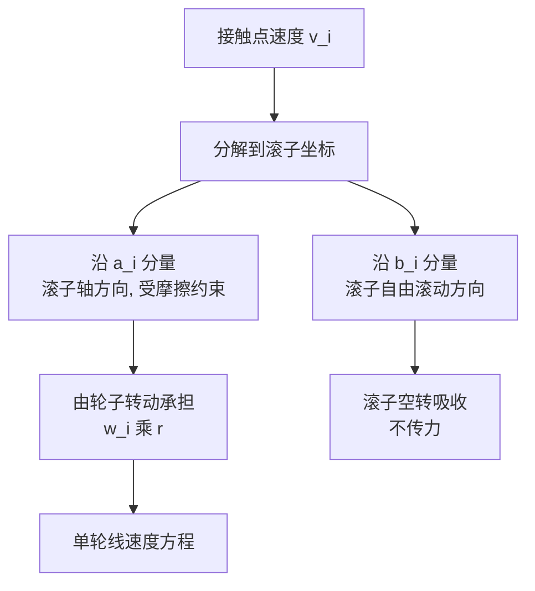
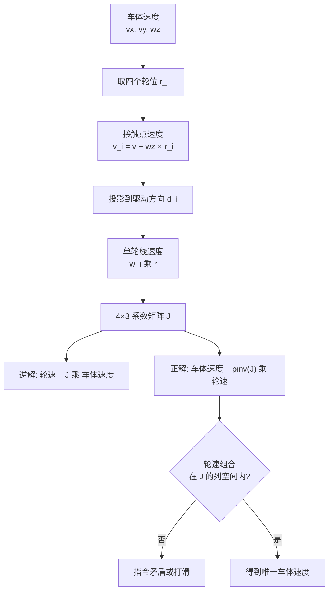

# 麦轮与全向轮的运动约束

底盘在平面上运动只有三个自由度：沿 $x$ 的平移、沿 $y$ 的平移、绕 $z$ 的转动。普通两轮差速底盘只有两个独立控制量（左右轮转速），能合成前进量与自转量，无法在不改变朝向的前提下横向平移。全向底盘把横向平移补上，代价是轮子结构变复杂。

补上第三个自由度的关键是滚子。滚子在接触点定义一个只允许空转的方向，轮子转动只负责另一个方向，于是每个轮子成为一条约束方程。四个麦轮给出四个方程、三个未知量，逆解因此没有选择余地，正解则要用伪逆。全向底盘的轮地接触约束对应底盘板 `ControlCenterTask.cpp` 里的四个目标轮速求解入口，源码位置见后文。

## 平面运动只有三个自由度

全向轮分两类，区别在滚子相对轮平面的夹角：

| 类型 | 滚子轴方向 | 单轮可驱动方向 | 自由方向 | 典型布置 |
| --- | --- | --- | --- | --- |
| 普通轮 | 无滚子 | 轮平面内 | 无 | 两轮差速 |
| 全向轮（omni） | 垂直轮平面 | 轮平面内 | 沿轮轴平移 | 三轮互成 120° |
| 麦轮（mecanum） | 与轮平面成 45° | 与轮平面成 45° | 与驱动方向垂直 | 四轮角布置 |

本工程是四个麦轮，轮子平面沿车体 $x$ 方向，四个轮子平面的中垂线都过车体中心（`ControlCenterTask.cpp`）。这种布置下每个轮子的接触点速度都能写成车体平移量与自转量的线性组合，逆解因此是一个 $4 \times 3$ 的常系数矩阵。

## 滚子把可驱动方向转到 45 度

推导采用机器人学通用约定：$x$ 指车体前方，$y$ 指车体左方，$z$ 指地平面法向朝上；$w_z$ 逆时针为正。$v_x$、$v_y$ 单位 m/s，$w_z$ 单位 rad/s。四轮位置取

$$r_1=(L,-W),\quad r_2=(L,W),\quad r_3=(-L,W),\quad r_4=(-L,-W)$$

编号按 `ControlCenterTask.cpp` 的注释：1 右前、2 左前、3 左后、4 右后。$L$ 是轮心到车体中心的纵向距离，$W$ 是横向距离，两者都是长度，单位 m。代码注释把它们写成“底盘长度/2”和“底盘宽度/2”（`ControlCenterTask.cpp`），实际应取轮心到中心的距离，属待现场测量确认。

麦轮轮缘上有一圈滚子，滚子轴与轮平面成 45°。接触点处可以定义两个单位方向：滚子轴方向 $a_i$ 受摩擦约束，轮子转动必须在这里提供对应的速度分量；垂直于 $a_i$ 的自由滚动方向 $b_i$ 由滚子绕自身轴空转吸收，与电机转速无关。45° 布置下 $a_i=\tfrac{1}{\sqrt{2}}\,(1,\pm 1)$，于是 $a_{i,x}=1/\sqrt{2}$。



## 接触点速度的两项分解

刚体平面运动里，位于 $r_i=(l_{ix},l_{iy})$ 的接触点速度为

$$v_i = v + w_z\,\hat{z}\times r_i = \begin{bmatrix} v_x - w_z\,l_{iy} \\ v_y + w_z\,l_{ix} \end{bmatrix}$$

平移量 $(v_x,v_y)$ 对所有轮子相同，自转量 $w_z\,\hat{z}\times r_i$ 随位置变化。四个轮位的第二项如下：

| 轮 | $r_i$ | $\hat{z}\times r_i$ | $v_i$ |
| --- | --- | --- | --- |
| 1 右前 | $(L,-W)$ | $(W,\ L)$ | $(v_x+w_z W,\ v_y+w_z L)$ |
| 2 左前 | $(L,W)$ | $(-W,\ L)$ | $(v_x-w_z W,\ v_y+w_z L)$ |
| 3 左后 | $(-L,W)$ | $(-W,\ -L)$ | $(v_x-w_z W,\ v_y-w_z L)$ |
| 4 右后 | $(-L,-W)$ | $(W,\ -L)$ | $(v_x+w_z W,\ v_y-w_z L)$ |

从表里能看出自转项的结构：左右两列的 $x$ 分量符号相反，前后两行的 $y$ 分量符号相反。这个形状在后面判断代码实现是否合法时会直接用到。

## 轮子转动在接触点产生什么速度

轮子转动在接触点产生的速度沿车体 $x$ 方向，大小为 $w_i r$，其中 $r$ 是轮子有效半径。沿 $a_i$ 的分量必须与轮子转动投影抵消：

$$v_i\cdot a_i - w_i r\,a_{i,x} = 0 \;\Longrightarrow\; w_i r = \frac{v_i\cdot a_i}{a_{i,x}}$$

代入 $a_{i,x}=1/\sqrt{2}$，定义方向向量

$$d_i = \sqrt{2}\,a_i = (1,\pm 1)$$

得到

$$w_i r = v_i\cdot d_i$$

$\sqrt{2}$ 被折进 $d_i$ 的模长，这样 $v_x$ 的系数归一为 1，与常见教科书形式一致。$d_i$ 的具体正负由滚子的 X 形安装方向决定，本工程未在源码里给出安装方向，属按标准 X 布置推断，待现场确认。

## 四轮系数矩阵

把接触点速度代入单轮方程，逐个展开：

| 轮 | 位置 | $d_i$ | $w_i r = v_i\cdot d_i$ |
| --- | --- | --- | --- |
| 1 右前 | $(L,-W)$ | $(1,1)$ | $v_x+v_y+(L+W)w_z$ |
| 2 左前 | $(L,W)$ | $(1,-1)$ | $v_x-v_y-(L+W)w_z$ |
| 3 左后 | $(-L,W)$ | $(1,1)$ | $v_x+v_y-(L+W)w_z$ |
| 4 右后 | $(-L,-W)$ | $(1,-1)$ | $v_x-v_y+(L+W)w_z$ |

写成矩阵形式：

$$\begin{bmatrix} w_1 r \\ w_2 r \\ w_3 r \\ w_4 r \end{bmatrix} = \underbrace{\begin{bmatrix} 1 & 1 & L+W \\ 1 & -1 & -(L+W) \\ 1 & 1 & -(L+W) \\ 1 & -1 & L+W \end{bmatrix}}_{J} \begin{bmatrix} v_x \\ v_y \\ w_z \end{bmatrix}$$

读法：每一行对应一个轮子，前两列说明 $v_x$、$v_y$ 从哪个方向影响它，第三列是它对自转的贡献——$L+W$ 越大，越靠外侧的轮子在自转时被要求跑得越快。

$J$ 的量纲：前两列无量纲，第三列是长度。因此 $J$ 与 $[v_x,\,v_y,\,w_z]^T$ 相乘后每一项都是 m/s，正好是轮子线速度。这一点是后面判断代码系数是否正确的依据。

## 正解与秩的冗余

$J$ 是 $4\times 3$，秩为 3。给车体速度算轮速时，四个轮速被唯一确定（逆解）。反过来给四个轮速求车体速度时，只有落在 $J$ 的列空间里的轮速组合才有解，否则说明四个轮速指令相互矛盾，或者轮子发生了打滑。正解用伪逆：

$$\begin{bmatrix} v_x \\ v_y \\ w_z \end{bmatrix} = (J^T J)^{-1} J^T \begin{bmatrix} w_1 r \\ w_2 r \\ w_3 r \\ w_4 r \end{bmatrix}$$

秩为 3 而不是 4，是因为三个车体速度分量只能生成三维的轮速子空间；四个轮速落在四维空间里，多出来的一个维度对应滚子空转与打滑那类不产生车体运动的组合。这一冗余关系也是停车判断的依据：四个目标轮速同时为零意味着 $(v_x,v_y,w_z)$ 同时为零。



## 落到代码里的三处偏离

轮序写在求解函数上方的注释里，对应 `ControlCenterTask.cpp`：

```cpp
//本车底盘为全向轮底盘（即四个轮子平面的中垂线为车体中心）
//电机1右前轮
// 电机2左前轮
// 电机3左后轮
// 电机4右后轮
```

四个目标轮速是全局 `float` 变量，定义在 `ControlCenterTask.cpp`，初值 0；车体速度的两个分量 `chassis_vx_in_GimbalXYZ`、`chassis_vy_in_GimbalXYZ` 定义在 `ControlCenterTask.cpp`。这四个量在 `ChassisTask.cpp` 被 `extern` 引用后送给速度环。

约束方程落在 `ControlCenterTask.cpp`。RC 模式与跟随模式走同一分支：

```cpp
float factor = 1;
if (control_target.control_mode!=control_target.MODE_AI) {
    chassis_vx_in_GimbalXYZ=  control_target.chassis_vx*cos(...)-control_target.chassis_vy*sin(...);
    chassis_vy_in_GimbalXYZ=  control_target.chassis_vx*sin(...)+control_target.chassis_vy*cos(...);
    Target_chassis_speed_motor_1 = chassis_vx_in_GimbalXYZ - chassis_vy_in_GimbalXYZ + factor * control_target.chassis_wz;
    Target_chassis_speed_motor_2 = -chassis_vx_in_GimbalXYZ - chassis_vy_in_GimbalXYZ + factor * control_target.chassis_wz;
    Target_chassis_speed_motor_3 = -chassis_vx_in_GimbalXYZ + chassis_vy_in_GimbalXYZ + factor * control_target.chassis_wz;
    Target_chassis_speed_motor_4 = chassis_vx_in_GimbalXYZ + chassis_vy_in_GimbalXYZ + factor * control_target.chassis_wz;
}
```

这段代码与上面的矩阵逐项对比有三处偏离：第三列系数是 `factor = 1` 而不是 $(L+W)$；轮 2、3 的 $v_x$ 取了负号；四轮的 $w_z$ 项全部同号。

| 偏离 | 正确形式 | 代码 | 后果 |
| --- | --- | --- | --- |
| 自转系数 | $(L+W)w_z$ | $1\cdot w_z$ | 量纲错，自转与平移不成比例 |
| $v_x$ 列 | 四轮同号 | $+,-,-,+$ | 直行时左右轮目标相反 |
| $w_z$ 列 | 对角同号、相邻反号 | 四轮同号 | 无法产生纯自转 |

旋转层在投影之前执行（`ControlCenterTask.cpp`）：

$$\begin{bmatrix} v_x^{g} \\ v_y^{g} \end{bmatrix} = \begin{bmatrix} \cos\theta & -\sin\theta \\ \sin\theta & \cos\theta \end{bmatrix} \begin{bmatrix} v_x \\ v_y \end{bmatrix},\quad \theta=\Delta-\theta_{init}$$

这一步不改变约束方程的结构，只是换了一组输入分量；$w_z$ 是绕 $z$ 轴的标量，不参与旋转。四个目标轮速被 `ChassisTask` 的速度环消费，输出电流经 `bsp_can2_djimotorcmd` 下发（`ControlCenterTask.cpp`）。逆解本身不涉及 CAN 报文，报文格式见已完成文档 `docs/03-CAN 与电机/02-DJI3508/`。

## 读约束方程时容易弄错的地方

| # | 易错点 | 现象 | 对应位置 |
| --- | --- | --- | --- |
| 1 | 认为麦轮能任意分配四轮速度 | 四个轮速只有 3 个独立分量，多余组合对应打滑 | 正解与秩的冗余，$J$ 的秩为 3 |
| 2 | 把 $L$、$W$ 当成整车长宽 | 系数偏大一倍，$w_z$ 缩放错 | `ControlCenterTask.cpp` 注释 |
| 3 | 忘记 $(L+W)$ 的量纲是长度 | $w_z$ 项与 $v_x$ 项量纲不同 | `ControlCenterTask.cpp` |
| 4 | 认为滚子方向与轮平面一致 | 约束投错方向，逆解整体错 | 滚子把可驱动方向转到 45 度 |
| 5 | 忽略冗余关系 | 停车判断只查单轮，漏掉速度分量非零的组合 | `ChassisTask.cpp` |
| 6 | 把正解当逆解的转置 | 少了 $(J^T J)^{-1}$ | 正解与秩的冗余 |
| 7 | 认为 $L$ 与 $W$ 可以互换 | $v_y$ 列的力臂错，横移与自转耦合 | `ControlCenterTask.cpp` |

第 6 条的具体后果：$J^T$ 是 $3\times 4$，直接用它做正解会得到一个未归一化的结果，$w_z$ 的估计被 $(L+W)$ 放大。伪逆里的 $(J^T J)^{-1}$ 正是补这个归一化。

## 小结

### 核心概念

- 平面运动 3 自由度，麦轮用 45° 滚子把差速底盘的 2 自由度补到 3。
- 接触点速度 $v_i=v+w_z\hat{z}\times r_i$，平移项对所有轮相同，自转项随轮位变化。
- 滚子只有两个方向：轴方向受摩擦约束由电机承担，自由方向由滚子空转吸收。
- 单轮线速度 $w_i r = v_i\cdot d_i$，$d_i=(1,\pm 1)$ 由 X 形安装决定。
- 逆解是 $4\times 3$ 常系数矩阵 $J$，第三列是长度 $L+W$，秩 3。
- 正解要用伪逆；轮速组合不在列空间内意味着打滑或指令矛盾。
- 底盘板的生效代码有三处偏离：系数为 1、$v_x$ 列左右反号、$w_z$ 列四轮同号。

### 设计权衡

| 决策 | 选择 | 收益 | 代价 |
| --- | --- | --- | --- |
| 轮子类型 | 麦轮四轮角布置 | 结构紧凑，能斜向平移 | 滚子磨损大，效率低于普通轮 |
| 驱动方向约定 | X 形 | 逆解系数简洁 | 安装方向错一个轮就整体失效 |
| 几何系数 | 用 $(L+W)$ 显式表示 | 量纲正确，便于标定 | 必须实测 $L$、$W$ |
| 正解算法 | 伪逆 | 对任意轮速给最小二乘解 | 计算量大于直接取平均 |
| 冗余处理 | 不显式使用 | 逆解最简 | 无法检测打滑 |

## 练习

### 基础题

1. 用接触点速度的表达式写出四个轮位对应的 $v_i$，并核对系数矩阵表里的 $v_x$ 系数都为 1。
2. 验证 $J$ 的秩为 3，并说明为什么不是 4。
3. 取 $v_x=0,\ v_y=0,\ w_z=1$，写出四个轮速，判断车体是顺时针还是逆时针自转。

### 挑战题

4. 把四轮位置改为 $(L,0),(0,W),(-L,0),(0,-W)$，重新推导 $J$，说明此时是否仍是有效全向底盘。
5. 若某个滚子卡死（无法空转），该轮在约束方程里应如何改写，对可解的车体速度集合有什么影响。
6. 由 $J$ 的列空间条件推导四轮轮速必须满足的兼容方程，并说明它在打滑检测里的用法。

### 附：本页引用的固件路径

| 路径 | 用途 |
| --- | --- |
| `/home/wyx/rm/2026SentriOmeniChassis/2026OmniSentryChassis/Task/Src/ControlCenterTask.cpp` | 轮序注释、逆解入口与变量定义 |
| `/home/wyx/rm/2026SentriOmeniChassis/2026OmniSentryChassis/Task/Src/ChassisTask.cpp` | 速度环消费四个目标轮速 |
| `/home/wyx/rm/2026SentriOmeniChassis/2026OmniSentryChassis/BSP/Src/bsp_can.cpp` | 电流下发与电机反馈 |
