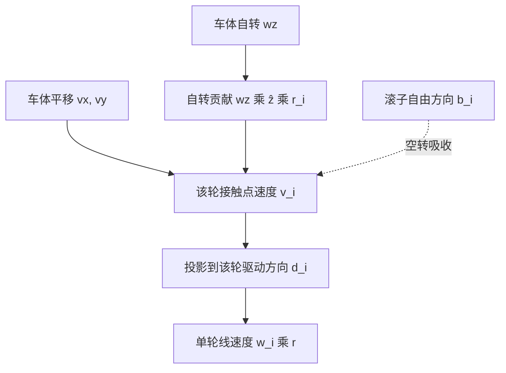
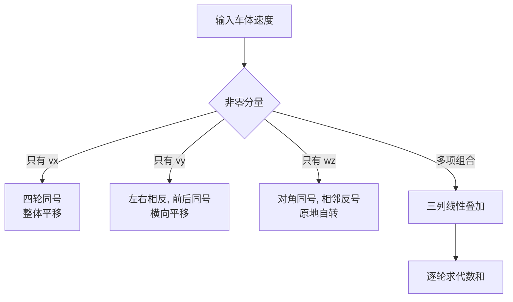

# 单轮速度合成

整车的逆解可以看成四件互不相关的事：每个轮子只关心自己接触点处的速度。接触点速度由车体平移与车体自转叠加得到，再用该轮滚子的驱动方向做一次投影，就得到这个轮子的线速度。四轮用的是同一个式子，只是轮位坐标与驱动方向不同。

约束矩阵拆到单个轮子后，逐项对应底盘板 `ControlCenterTask.cpp` 的四个轮速赋值。需要回答的是：为什么自转项在接触点处是 $w_z W$ 与 $w_z L$ 两项、投影后怎么会合并成 $(L+W)$；三种纯工况的符号模式长什么样；代码里的四行与推导差在哪里。

## 单轮合成只有两步

接触点速度由两部分叠加：

| 来源 | 表达式 | 与轮位的关系 |
| --- | --- | --- |
| 车体平移 | $(v_x,\ v_y)$ | 与轮位无关，四轮相同 |
| 车体自转 | $w_z\,\hat{z}\times r_i$ | 与轮位坐标线性相关 |

两部分相加得到接触点速度 $v_i$，再投影到该轮滚子的驱动方向 $d_i$，得到单轮线速度 $w_i r$。合成顺序是：先叠加平移与自转，后投影。投影是线性映射，先分别投影再相加也能得到同样结果，但先合成更直观，更容易与代码逐行核对。

## 接触点速度的两项

轮心位置 $r_i=(l_{ix},l_{iy})$，接触点速度：

$$v_i = \begin{bmatrix} v_x \\ v_y \end{bmatrix} + w_z\begin{bmatrix} -l_{iy} \\ l_{ix} \end{bmatrix}$$

第二项是 $\hat{z}\times r_i$。四个轮位对应的第二项如下：

| 轮 | $r_i$ | $\hat{z}\times r_i$ | $v_i$ |
| --- | --- | --- | --- |
| 1 右前 | $(L,-W)$ | $(W,\ L)$ | $(v_x+w_z W,\ v_y+w_z L)$ |
| 2 左前 | $(L,W)$ | $(-W,\ L)$ | $(v_x-w_z W,\ v_y+w_z L)$ |
| 3 左后 | $(-L,W)$ | $(-W,\ -L)$ | $(v_x-w_z W,\ v_y-w_z L)$ |
| 4 右后 | $(-L,-W)$ | $(W,\ -L)$ | $(v_x+w_z W,\ v_y-w_z L)$ |

从表里可以直接看出自转项的结构：左右两列的 $x$ 分量符号相反，前后两行的 $y$ 分量符号相反。也就是说，自转在接触点处同时产生一个横向分量和一个纵向分量，两个分量的大小分别是 $w_z W$ 与 $w_z L$。

## 自转项为什么同时有 W 和 L

自转是绕车体中心的转动，接触点相对中心的位移 $r_i$ 与角速度叉乘得到线速度。位移在纵向与横向各有一个分量，叉乘把纵向分量转到横向、横向分量转到纵向，所以接触点速度的两个分量里各出现一项自转贡献：$x$ 分量带 $w_z W$，$y$ 分量带 $w_z L$。

这也解释了自转的力臂为什么是 $(L+W)$ 而不是某一个坐标：麦轮的驱动方向同时含有 $x$、$y$ 两个方向的分量，两项自转贡献在投影时落到同一个车轮上。若驱动方向是纯 $x$ 或纯 $y$，力臂就只会是其中一个坐标。

## 投影到驱动方向

麦轮只能沿 $d_i=(1,\pm 1)$ 方向驱动，单轮线速度是 $v_i$ 在这个方向上的投影：

$$w_i r = v_i\cdot d_i = v_{ix}\,d_{ix} + v_{iy}\,d_{iy}$$

把上面表里的 $v_i$ 逐项代入，得到四个轮子的展开式：

| 轮 | $d_i$ | $v_i\cdot d_i$ | 化简 |
| --- | --- | --- | --- |
| 1 右前 | $(1,1)$ | $(v_x+w_z W)+(v_y+w_z L)$ | $v_x+v_y+(L+W)w_z$ |
| 2 左前 | $(1,-1)$ | $(v_x-w_z W)-(v_y+w_z L)$ | $v_x-v_y-(L+W)w_z$ |
| 3 左后 | $(1,1)$ | $(v_x-w_z W)+(v_y-w_z L)$ | $v_x+v_y-(L+W)w_z$ |
| 4 右后 | $(1,-1)$ | $(v_x+w_z W)-(v_y-w_z L)$ | $v_x-v_y+(L+W)w_z$ |

自转项的 $W$ 与 $L$ 在这里合并成 $(L+W)$。原因是左前与右后的自转贡献在投影里同时出现且符号一致，两个轮位坐标被加在了一起。合并只发生在投影之后：在接触点处，$w_z W$ 与 $w_z L$ 是两个不同方向的分量，量纲都是 m/s，但物理意义不同。



## 三种纯工况的符号模式

线性叠加的好处是可以单独看每一列的符号：



| 工况 | 轮 1 右前 | 轮 2 左前 | 轮 3 左后 | 轮 4 右后 |
| --- | --- | --- | --- | --- |
| $v_x$ | $+$ | $+$ | $+$ | $+$ |
| $v_y$ | $+$ | $-$ | $+$ | $-$ |
| $w_z$ | $+$ | $-$ | $-$ | $+$ |

这张表是后面核对代码符号的直接工具。任何一组自洽的逆解，三列的符号模式必须与它一致（允许整列取反，对应电机正方向定义不同）。三条形状要求分别是：$v_x$ 列四轮同号；$v_y$ 列左右反号、前后同号；$w_z$ 列对角同号、相邻反号。

## 数值算例

取一组示意几何：$L=W=0.15$ m，即 $L+W=0.30$ m。这组数值只用于说明计算过程，不是本机实测值。输入 $v_x=1.0$ m/s、$v_y=0.5$ m/s、$w_z=1.0$ rad/s。

先算自转项：

$$w_z W = 0.15\ \text{m/s},\qquad w_z L = 0.15\ \text{m/s}$$

再算接触点速度与投影：

| 轮 | $v_i$ | $d_i$ | $v_i\cdot d_i$ | 轮线速度 |
| --- | --- | --- | --- | --- |
| 1 右前 | $(1.15,\ 0.65)$ | $(1,1)$ | $1.80$ | $1.80$ m/s |
| 2 左前 | $(0.85,\ 0.65)$ | $(1,-1)$ | $0.20$ | $0.20$ m/s |
| 3 左后 | $(0.85,\ 0.35)$ | $(1,1)$ | $1.20$ | $1.20$ m/s |
| 4 右后 | $(1.15,\ 0.35)$ | $(1,-1)$ | $0.80$ | $0.80$ m/s |

量纲核对：$v_i$ 的两项都是 m/s，$w_z W$ 是 $\text{rad/s}\times\text{m}$，弧度无量纲，仍是 m/s。投影不引入额外量纲。四个轮速中右前最大、左前最小，差值来自 $v_y$ 与 $w_z$ 两列在同一轮上的符号叠加。

算例里四个轮速的均值是 1.0 m/s，正好等于 $v_x$。原因是 $v_y$ 与 $w_z$ 两列在四轮上的符号各占两个正两个负，求和为零，均值里只剩平移主导项。这个性质可以当作逆解自洽的粗略检查。

## 代码里的四行赋值

底盘板把接触点叠加与投影写成了四行赋值，整块代码在 `ControlCenterTask.cpp`： 是“计算各轮线速度（m/s）”的注释，四行赋值在 。以右前轮为例：

```cpp
Target_chassis_speed_motor_1 = chassis_vx_in_GimbalXYZ - chassis_vy_in_GimbalXYZ + factor * control_target.chassis_wz;  // 右前轮
```

对照展开式 $v_x+v_y+(L+W)w_z$：$v_y$ 的符号相反，$w_z$ 的系数是 `factor` 而不是 $(L+W)$。这不是笔误层面的差别，$v_y$ 符号决定横移方向，$(L+W)$ 决定自转的力矩臂。完整的三列对照见 `03-逆解公式推导.md`。

## 旋转与投影的顺序可以交换

代码在投影之前先做了坐标系旋转（`ControlCenterTask.cpp`）：

$$v^{g} = R(\theta)\,v,\qquad R(\theta)=\begin{bmatrix}\cos\theta & -\sin\theta \\ \sin\theta & \cos\theta\end{bmatrix}$$

对单轮合成而言，旋转与投影都是线性映射，顺序可交换：$(R v)\cdot d_i = v\cdot(R^T d_i)$。代码选择先旋转输入，等价于把四个驱动方向一起转过同样的角度，也就是让平移方向以云台朝向为基准。$w_z$ 是绕 $z$ 轴的标量，绕 $z$ 旋转不改变它，因此 `chassis_wz` 没有参与这次旋转。

顺序可交换这一条只在旋转是纯旋转时成立。如果中间还有缩放或非正交的变换，交换就不一定成立，因此判断依据是变换矩阵是否正交。

## 从线速度到转子转速的缺口

代码注释把四个目标量写成“计算各轮线速度（m/s）”（`ControlCenterTask.cpp`），而 `ChassisTask` 把它们直接与 `chassis_motor_N.rotor_speed` 比较（`ChassisTask.cpp`）。`rotor_speed` 是 CAN 反馈里的 `int16_t` 原始值（`BSP/Inc/bsp_can.h`），单位是转子转速而不是轮子线速度。两者之间缺一个换算：

$$w_{rotor} = \frac{w_i r}{r_{wheel}}\cdot i_{gear}\cdot\frac{60}{2\pi}$$

式中 $r_{wheel}$ 是轮子有效半径，$i_{gear}$ 是减速比。代码里没有这个换算，属按代码推导的量纲缺口，待现场确认实际闭环效果。相关讨论见 `03-逆解公式推导.md` 与 `05-易错点与调试.md`。

## 合成顺序错了会怎样

| # | 易错点 | 现象 | 对应位置 |
| --- | --- | --- | --- |
| 1 | 先分别投影再合并自转与平移 | 投影是线性的，结果相同，但容易漏掉某一项 | 单轮合成只有两步 |
| 2 | 自转项少乘轮位坐标 | 四个轮速变成同一值，无法自转 | 接触点速度的两项 |
| 3 | 把 $w_z W$ 与 $w_z L$ 写成 $w_z(L+W)$ 提前合并 | 单轮接触点速度的两项不同，合并只在投影后成立 | 投影到驱动方向 |
| 4 | 横移时用前后分组 | 麦轮的 $v_y$ 是左右分组 | 三种纯工况的符号模式 |
| 5 | 把自转当所有轮同向 | 相邻轮反号才对 | 三种纯工况的符号模式 |
| 6 | 线速度直接给转子速度环 | 缺轮径与减速比换算 | `ChassisTask.cpp` |
| 7 | 认为旋转顺序会影响结果 | 线性映射可交换 | 旋转与投影的顺序可以交换 |

第 3 条的判别方法：看自转项是否单独出现在 $v_i$ 的两个分量里。接触点处 $x$ 分量带 $w_z W$、$y$ 分量带 $w_z L$，只有投影到 $(1,\pm 1)$ 之后两者才相加。

## 小结

### 核心概念

- 接触点速度 $v_i=v+w_z\hat{z}\times r_i$，平移项与轮位无关，自转项与轮位线性相关。
- 自转项在接触点处是 $w_z(-l_{iy},\,l_{ix})$，左右 $x$ 分量反号，前后 $y$ 分量反号。
- 单轮线速度 $w_i r=v_i\cdot d_i=(v_{ix}+v_{iy})$ 或 $(v_{ix}-v_{iy})$，取决于滚子安装方向。
- $v_x$ 列四轮同号，$v_y$ 列左右反号前后同号，$w_z$ 列对角同号相邻反号。
- 自转项的 $(L+W)$ 是投影后合并的结果，量纲为 m/s。
- 逆解输出是轮子线速度，进入速度环前需要轮径与减速比换算。

### 设计权衡

| 决策 | 选择 | 收益 | 代价 |
| --- | --- | --- | --- |
| 合成顺序 | 先叠加后投影 | 与物理过程一致，便于逐项核对 | 每个轮子单独算一次 |
| 坐标系旋转位置 | 投影前旋转输入 | 与逆解写成一次矩阵乘法 | 旋转角依赖云台编码器 |
| 目标量单位 | 注释写 m/s | 与物理量对应 | 代码未换算到转子转速 |
| 输入缩放 | 遥控通道乘 5 | 实现简单 | 无物理量纲，需实测标定 |

## 练习

### 基础题

1. 用接触点速度的表达式算出 $v_x=0,\ v_y=1,\ w_z=0$ 时四个轮子的驱动方向投影，核对符号表。
2. 取 $L=0.2$ m、$W=0.15$ m、$w_z=2$ rad/s，计算四个轮子自转项的投影值。
3. 说明 $w_z W$ 与 $w_z L$ 的单位为什么是 m/s。

### 挑战题

4. 把算例改成 $w_z=-1.0$ rad/s，重算四轮速度，并说明与 $w_z=1.0$ 时相比哪些轮改变了符号。
5. 若四个轮子安装在同一高度但 $L\ne W$，说明 $(L+W)$ 是否仍能合并，并给出合并的条件。
6. 推导从轮子线速度到 3508 转子转速的完整换算，说明需要哪些实测参数。

### 附：本页引用的固件路径

| 路径 | 用途 |
| --- | --- |
| `/home/wyx/rm/2026SentriOmeniChassis/2026OmniSentryChassis/Task/Src/ControlCenterTask.cpp` | 单轮合成四行赋值与旋转 |
| `/home/wyx/rm/2026SentriOmeniChassis/2026OmniSentryChassis/Task/Src/ChassisTask.cpp` | 目标轮速进入速度环 |
| `/home/wyx/rm/2026SentriOmeniChassis/2026OmniSentryChassis/BSP/Inc/bsp_can.h` | `rotor_speed` 字段定义 |
