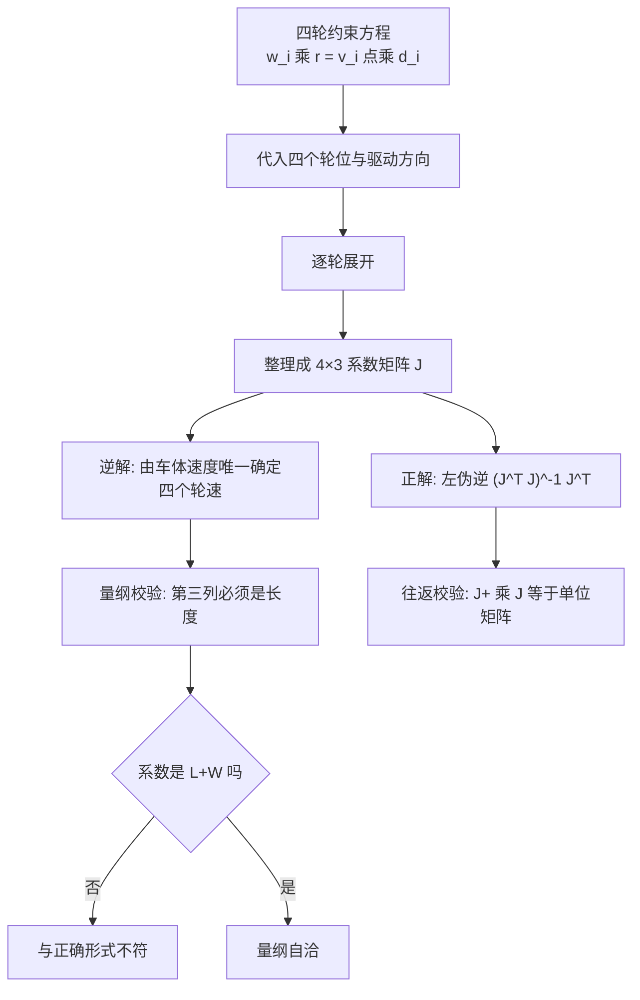
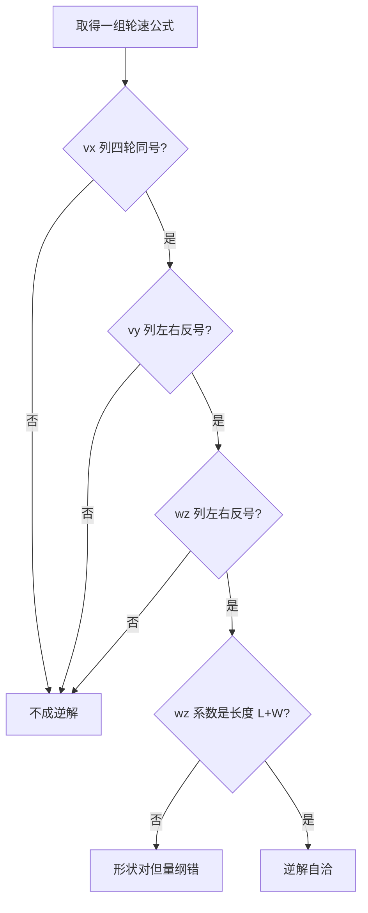

# 逆解公式推导

逆解指由车体速度 $(v_x,v_y,w_z)$ 求四个轮子的目标速度，正解反之。四轮麦轮的逆解不需要矩阵求逆，四个轮子各自独立：每个轮子的线速度就是接触点速度在滚子驱动方向上的投影。矩阵形式 $w r = J\,[v_x,v_y,w_z]^T$ 只是把四个投影写成一次乘法。

需要矩阵求逆的是正解。$J$ 是 $4\times 3$，不能直接求逆，要用左伪逆 $(J^T J)^{-1}J^T$，结果是一个 $3\times 4$ 矩阵。左伪逆的完整推导与量纲校验逐项对照底盘板 `ControlCenterTask.cpp:95-122` 里的注释公式与生效代码。正解只作为校验手段。

## 逆解不需要矩阵求逆

| 方向 | 输入 | 输出 | 解的结构 |
| --- | --- | --- | --- |
| 逆解 | 车体速度 3 个分量 | 四轮线速度 | 唯一，无需求逆 |
| 正解 | 四轮线速度 | 车体速度 3 个分量 | 伪逆，且要求轮速自洽 |

逆解唯一的依据是每个轮子的约束方程只含自己那一个未知量。四个方程互不耦合，因此可以逐个解出；写成矩阵只是为了紧凑。正解要处理四个轮速之间的冗余，必须用伪逆，而且只有当轮速落在 $J$ 的列空间里才有精确解。

## 四个轮位与驱动方向

沿用通用约定：$x$ 前、$y$ 左、$w_z$ 逆时针为正，四轮位置 $r_1=(L,-W)$、$r_2=(L,W)$、$r_3=(-L,W)$、$r_4=(-L,-W)$，驱动方向 $d_1=(1,1)$、$d_2=(1,-1)$、$d_3=(1,1)$、$d_4=(1,-1)$。四个轮的约束是同一个式子的四次代入：

$$w_i r = \left(v + w_z\,\hat{z}\times r_i\right)\cdot d_i,\qquad i=1,2,3,4$$

$L$ 与 $W$ 都是轮心到车体中心的距离，单位 m。代码注释把它们写成“底盘长度/2”和“底盘宽度/2”，属待现场测量确认。

## 逐轮投影

先写出 $\hat z\times r_i$：

$$\hat z\times r_1=(W,L),\quad \hat z\times r_2=(-W,L),\quad \hat z\times r_3=(-W,-L),\quad \hat z\times r_4=(W,-L)$$

逐个计算投影：

- 右前轮：$v_1=(v_x+w_z W,\ v_y+w_z L)$，
  $$w_1 r = (v_x+w_z W)\cdot 1 + (v_y+w_z L)\cdot 1 = v_x+v_y+(L+W)w_z$$
- 左前轮：$v_2=(v_x-w_z W,\ v_y+w_z L)$，$d_2=(1,-1)$，
  $$w_2 r = (v_x-w_z W) - (v_y+w_z L) = v_x-v_y-(L+W)w_z$$
- 左后轮：$v_3=(v_x-w_z W,\ v_y-w_z L)$，$d_3=(1,1)$，
  $$w_3 r = (v_x-w_z W) + (v_y-w_z L) = v_x+v_y-(L+W)w_z$$
- 右后轮：$v_4=(v_x+w_z W,\ v_y-w_z L)$，$d_4=(1,-1)$，
  $$w_4 r = (v_x+w_z W) - (v_y-w_z L) = v_x-v_y+(L+W)w_z$$

四式合起来的系数矩阵：

$$J=\begin{bmatrix} 1 & 1 & L+W \\ 1 & -1 & -(L+W) \\ 1 & 1 & -(L+W) \\ 1 & -1 & L+W \end{bmatrix}$$

## 左伪逆与往返校验

左伪逆给出正解：

$$J^{+}=(J^T J)^{-1}J^T=\frac{1}{4}\begin{bmatrix} 1 & 1 & 1 & 1 \\ 1 & -1 & 1 & -1 \\ \tfrac{1}{L+W} & -\tfrac{1}{L+W} & -\tfrac{1}{L+W} & \tfrac{1}{L+W} \end{bmatrix}$$

用上面的四式反代可以验证 $J^+J=I_3$。把正解作用到数值算例的轮速上，应回到原输入；这个往返校验在 `05-易错点与调试.md` 里作为排查手段。伪逆的第三行带 $1/(L+W)$，正好把逆解里的力臂除回去，两处互为逆运算。

## 量纲校验

逆解每一项都必须是长度除以时间。逐项看：

| 项 | 表达式 | 量纲 |
| --- | --- | --- |
| $v_x$ 项 | $v_x$ | m/s |
| $v_y$ 项 | $v_y$ | m/s |
| 自转项（正确） | $(L+W)\,w_z$ | m × rad/s = m/s |
| 自转项（`factor = 1`） | $1\cdot w_z$ | rad/s |

$(L+W)$ 的量纲是长度，是把角速度换成线速度的力臂。把系数取成 1 之后，$w_z$ 项与 $v_x$、$v_y$ 无法相加。这条判据不依赖任何符号约定，只要输出标的单位是 m/s，系数就必须是长度。

还有一处更隐蔽的量纲问题在输出侧：四个目标量的注释写 m/s（`ControlCenterTask.cpp:111`），但 `ChassisTask` 直接拿它们与 `rotor_speed` 比较（`ChassisTask.cpp:89-92`）。`rotor_speed` 是 CAN 反馈的 `int16_t` 原始值（`BSP/Inc/bsp_can.h:12`），不是轮子线速度。逆解输出到速度环之间缺轮径与减速比换算，属按代码推导的量纲缺口。输入侧也类似：`dbus.ch[n]*5.0f` 与 `cmd.speed.vx*2000` 都是没有物理量纲的缩放，量纲一致性只在注释层面成立。



## 注释公式与正确形式只差正方向

`ControlCenterTask.cpp:95-100` 写了一套公式：

```cpp
// 麦克纳姆轮运动学公式：
// wheel1 (右前) = vx - vy - (L+W)*wz
// wheel2 (左前) = vx + vy + (L+W)*wz
// wheel3 (左后) = vx - vy + (L+W)*wz
// wheel4 (右后) = vx + vy - (L+W)*wz
// 其中：L = 底盘长度/2, W = 底盘宽度/2
```

把正确形式里的 $v_y$ 与 $w_z$ 同时取反，就得到这四行。也就是说注释公式是完整的麦轮逆解，只是取了另一套正方向：$v_y$ 以车体右侧为正，$w_z$ 以顺时针为正。这与 `ControlCenterTask.cpp:70-71` 的通道注释（vy 正值向右、wz 正值右转）一致。注意 `ControlCenterTask.cpp:69` 又写 vx 负值向前，与注释公式隐含的 vx 前正不一致，属注释之间的另一处冲突。

| 轮 | 注释公式（`:96-99`） | 生效代码（`:112-115`） | 正确形式 |
| --- | --- | --- | --- |
| 1 右前 | $v_x-v_y-(L+W)w_z$ | $v_x-v_y+w_z$ | $v_x+v_y+(L+W)w_z$ |
| 2 左前 | $v_x+v_y+(L+W)w_z$ | $-v_x-v_y+w_z$ | $v_x-v_y-(L+W)w_z$ |
| 3 左后 | $v_x-v_y+(L+W)w_z$ | $-v_x+v_y+w_z$ | $v_x+v_y-(L+W)w_z$ |
| 4 右后 | $v_x+v_y-(L+W)w_z$ | $v_x+v_y+w_z$ | $v_x-v_y+(L+W)w_z$ |

三列的差别分三层：系数层，注释与正确形式的自转项都是 $(L+W)w_z$，生效代码是 $1\cdot w_z$；符号层，注释与正确形式只在 $v_y$、$w_z$ 的正方向上不同，是约定差异，生效代码与两者的符号模式都不同；结构层，下面用符号模式单独判断。

## 生效代码的三层偏离

生效分支在 `ControlCenterTask.cpp:103、108-116`：

```cpp
float factor = 1;
if (control_target.control_mode!=control_target.MODE_AI) {
    chassis_vx_in_GimbalXYZ = ... ;
    chassis_vy_in_GimbalXYZ = ... ;
    Target_chassis_speed_motor_1 =  chassis_vx_in_GimbalXYZ - chassis_vy_in_GimbalXYZ + factor * control_target.chassis_wz;
    Target_chassis_speed_motor_2 = -chassis_vx_in_GimbalXYZ - chassis_vy_in_GimbalXYZ + factor * control_target.chassis_wz;
    Target_chassis_speed_motor_3 = -chassis_vx_in_GimbalXYZ + chassis_vy_in_GimbalXYZ + factor * control_target.chassis_wz;
    Target_chassis_speed_motor_4 =  chassis_vx_in_GimbalXYZ + chassis_vy_in_GimbalXYZ + factor * control_target.chassis_wz;
}
```

三层偏离依次是：自转系数为 1，量纲与平移项不一致；$v_x$ 列变成 $+,-,-,+$，四轮不再同号；$w_z$ 列四轮同号，缺少左右差分。第三点最严重，因为左右差分是产生自转力矩的唯一来源。

## 结构判据不看符号约定

对四轮麦轮，系数矩阵的三列各有一条与符号约定无关的形状要求（允许整列取反，对应电机正方向定义不同）：

| 列 | 合法形状 | 注释公式 | 生效代码 |
| --- | --- | --- | --- |
| $v_x$ | 四轮同号 | $+,+,+,+$ 合法 | $+,-,-,+$ 不合法 |
| $v_y$ | 左右反号，前后同号 | $-,+,-,+$ 合法 | $-,-,+,+$ 不合法 |
| $w_z$ | 左右反号，对角同号 | $-,+,+,-$ 合法 | $+,+,+,+$ 不合法 |

生效代码里，$v_y$ 列在左右两组上完全相同（右前、右后为 $-,-$，左前、左后为 $+,+$），$w_z$ 列四轮同号。按代码推导，这两列无法产生左右差分，也就在几何上无法单独产生横移与自转；能产生左右差分的只剩 $v_x$ 列，而 $v_x$ 列本该四轮同号。这就是生效代码不是逆解的实质。

另有一种可能：左侧两个电机在机械上镜像安装，代码里的负号用来抵消镜像。若如此，把左前、左后两轮的符号整体取反后，三列形状全部变合法。镜像与否取决于硬件安装，源码里没有记录，属待现场确认。即便按镜像解释，$w_z$ 列的符号与注释公式仍是整体相反的，$1$ 与 $(L+W)$ 的系数差也依然存在。



## AI 模式分支的支撑集

AI 模式分支在 `ControlCenterTask.cpp:117-122`：

```cpp
Target_chassis_speed_motor_1 = -control_target.chassis_vx+ factor * control_target.chassis_wz;
Target_chassis_speed_motor_2 =  -control_target.chassis_vy + factor * control_target.chassis_wz;
Target_chassis_speed_motor_3 = control_target.chassis_vx + factor * control_target.chassis_wz;
Target_chassis_speed_motor_4 = control_target.chassis_vy  + factor * control_target.chassis_wz;
```

它的符号支撑很稀疏：

| 列 | 轮 1 | 轮 2 | 轮 3 | 轮 4 | 合法形状 | 判定 |
| --- | --- | --- | --- | --- | --- | --- |
| $v_x$ | $-$ | $0$ | $+$ | $0$ | 四轮同号 | 不合法 |
| $v_y$ | $0$ | $-$ | $0$ | $+$ | 左右反号 | 不合法 |
| $w_z$ | $+$ | $+$ | $+$ | $+$ | 左右反号 | 不合法 |

$v_x$ 只进入 1、3 两轮，$v_y$ 只进入 2、4 两轮，任意改变四个电机的正方向都无法让支撑集变成四轮或左右分组。按代码推导，这一分支不是麦克纳姆逆解，更像占位实现。是否为占位待现场确认。

## 推导里容易读错的几步

| # | 易错点 | 现象 | 对应位置 |
| --- | --- | --- | --- |
| 1 | 直接对 $4\times 3$ 的 $J$ 求逆 | 矩阵非方阵，求逆无定义 | 左伪逆与往返校验 |
| 2 | 自转项不乘力臂 | 量纲与 $v_x$ 项不同 | `ControlCenterTask.cpp:103` |
| 3 | 以为符号差异都是 bug | 注释与正确形式只差正方向约定 | 注释公式与正确形式只差正方向 |
| 4 | 只看单个轮子对不对 | 四轮符号模式要整体合法 | 结构判据不看符号约定 |
| 5 | 把 AI 分支当同一套逆解 | $v_x$、$v_y$ 的支撑集不同 | AI 模式分支的支撑集 |
| 6 | 输出线速度直接进转子速度环 | 缺轮径与减速比换算 | `ChassisTask.cpp:89-92` |
| 7 | 忽略左侧电机的机械镜像 | 同一个符号在不同侧含义不同 | 结构判据不看符号约定 |

第 3 条与第 4 条要一起看：注释公式与正确形式的差别只是正方向约定，不构成缺陷；生效代码的差别里有结构问题，即使按镜像解释也修不掉系数为 1 那一处。

## 小结

### 核心概念

- 逆解是四次独立投影，不需要矩阵求逆；矩阵形式只是紧凑写法。
- $J$ 的第三列必须是长度 $(L+W)$，把 $w_z$ 换成线速度。
- 正解用左伪逆 $(J^T J)^{-1}J^T$，可用于往返校验。
- 注释公式与正确形式是同一组表达式，只在 $v_y$、$w_z$ 的正方向约定上不同。
- 生效代码的自转项系数是 1，且 $v_y$、$w_z$ 两列缺少左右差分，结构上不满足逆解。
- AI 模式分支的 $v_x$、$v_y$ 支撑集各占两个轮，任意电机正方向约定都无法补成逆解。
- 输出侧的线速度到转子转速换算在生效代码里缺失。

### 设计权衡

| 决策 | 选择 | 收益 | 代价 |
| --- | --- | --- | --- |
| 逆解形式 | 四行直接展开 | 运行时无矩阵运算 | 系数分散在四行，改动易漏 |
| 几何系数 | 代码用 `factor = 1` | 省去标定步骤 | 量纲错，$w_z$ 缩放无意义 |
| 求解分支 | 按模式分两套 | AI 模式可独立试验 | 两套公式只有一套接近逆解 |
| 输入缩放 | 模式相关增益 | 适配遥控与上位机 | 两套增益都无物理量纲 |
| 正方向约定 | 注释与实现各一套 | 便于分别调参 | 跨分支对比时需要先统一符号 |

## 练习

### 基础题

1. 把逐轮投影的四式写成矩阵，验证 $J$ 的第三列符号模式是 $(+,-,-,+)$。
2. 用 $J^+$ 作用到 $v_x=1,v_y=0,w_z=0$ 产生的轮速上，验证返回原输入。
3. 说明为什么 $J$ 的秩是 3，并写出对应的一条兼容方程。

### 挑战题

4. 取 $L+W=0.3$ m、$v_x=1.0$、$v_y=0.5$、$w_z=1.0$，分别用注释公式、生效代码与正确形式算四轮速度，列出三组结果的差值。
5. 假设左侧两个电机镜像安装，写出把生效代码还原成物理轮速的符号矩阵，判断还原后的 $w_z$ 列与正确形式差多少。
6. 补全从逆解输出到 3508 转子转速的换算，写出所需实测参数与推导步骤。

### 附：本页引用的固件路径

| 路径 | 用途 |
| --- | --- |
| `/home/wyx/rm/2026SentriOmeniChassis/2026OmniSentryChassis/Task/Src/ControlCenterTask.cpp` | 注释公式、生效代码与 AI 分支（`:95-122`） |
| `/home/wyx/rm/2026SentriOmeniChassis/2026OmniSentryChassis/Task/Src/ChassisTask.cpp` | 目标轮速进入速度环、线速度与转子速度比较（`:89-92`） |
| `/home/wyx/rm/2026SentriOmeniChassis/2026OmniSentryChassis/BSP/Inc/bsp_can.h` | `rotor_speed` 字段定义（`:12`） |
