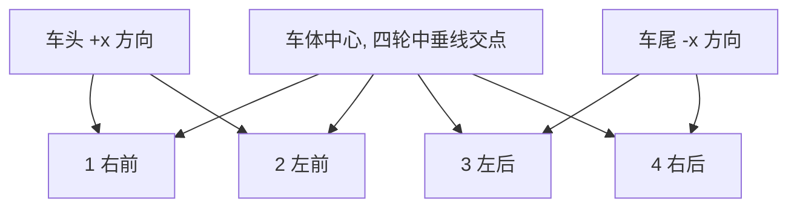
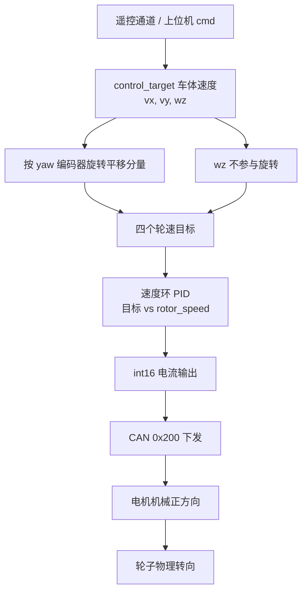

# 本项目轮序与符号

同一组轮速公式，换一种轮序或正方向定义就会整体变号。四轮麦轮涉及三类可能混淆的约定：轮序、车体速度正方向、电机机械正方向。三者互相独立，排查时按这三层依次确认，比直接怀疑公式更有效。

固定底盘板 `ControlCenterTask.cpp` 的轮序与正方向口径，供本领域其余各篇与调试时统一引用。读完要能回答：同一组代码里的两套 vx 约定分别出现在哪里；旋转层为什么不改变 $w_z$；为什么符号问题会在镜像安装与约定差异之间互相掩盖。

## 三套约定互相独立

| 约定 | 作用范围 | 本项目取值 |
| --- | --- | --- |
| 轮序 | 电机编号与物理位置的对应 | 1 右前、2 左前、3 左后、4 右后 |
| 车体速度正方向 | $v_x$、$v_y$、$w_z$ 的正负含义 | 代码注释与注释公式各写一套 |
| 电机正方向 | 电流为正时转子的转向 | 由机械安装决定，源码未记录 |

轮序决定“第几个式子”，正方向决定“每一项的符号”，机械安装决定“最后一个负号”。三者任意一个错，现象都可能是车体走偏，因此需要分层判据，不能一次改多处。

## 轮序与轮位

轮序写在 `ControlCenterTask.cpp:72-76`：

```cpp
//本车底盘为全向轮底盘（即四个轮子平面的中垂线为车体中心）
//电机1右前轮
// 电机2左前轮
// 电机3左后轮
// 电机4右后轮
```



四个目标轮速在 `ControlCenterTask.cpp:20-23` 定义为 `float`，初值 0。这四个名字是整条链路的唯一口径：逆解写入它们，`ChassisTask` 读取它们。若轮序在别处被重排，逆解与速度环就会错位。

| 编号 | 中文名 | 轮位 $(l_{ix},l_{iy})$ | 驱动方向 $d_i$ | 速度环对象 |
| --- | --- | --- | --- | --- |
| 1 | 右前 | $(L,-W)$ | $(1,1)$ | `motor_1_PID` |
| 2 | 左前 | $(L,W)$ | $(1,-1)$ | `motor_2_PID` |
| 3 | 左后 | $(-L,W)$ | $(1,1)$ | `motor_3_PID` |
| 4 | 右后 | $(-L,-W)$ | $(1,-1)$ | `motor_4_PID` |

驱动方向的左右分配是 X 形安装的结果，属按标准布置推断，待现场确认。

## 三套正方向约定

| 量 | 通道注释（`:69-71`） | 注释公式隐含（`:96-99`） | 标准约定 |
| --- | --- | --- | --- |
| $v_x$ | 负值向前，正值向后 | 向前为正 | 向前为正 |
| $v_y$ | 负值向左，正值向右 | 向右为正 | 向左为正 |
| $w_z$ | 负值左转，正值右转 | 顺时针为正 | 逆时针为正 |

`:69` 与 `:96-99` 对 $v_x$ 的约定相反。生效代码里的 $v_x$ 来自 `dbus.ch[3]*5`（`:88`），其符号取决于 DBUS 通道定义，源码内没有进一步说明，属待现场确认。生效代码的 $v_y$ 来自 `ch[2]`、$w_z$ 来自 `ch[4]`，而通道注释只列到 `ch[3]`（`:14-19`），$w_z$ 的通道没有注释。通道到速度的完整映射见 `03-底盘指令映射/01-遥控器通道到速度指令.md`。

三套约定里只有标准约定是从物理正方向推出来的，另外两套都是代码或注释的自定义。核对代码时先确定用哪一套，再看符号，否则会把约定差异误判成缺陷。

## 车体系与云台系的旋转

本工程有一个绕车体 $z$ 轴的旋转层，把车体系速度表达成云台朝向下的速度：

$$\Delta = \left(C_{init}-C_{yaw}\right)\cdot\frac{2\pi}{8192},\qquad C_{init}=\text{yaw_motor_5.total_angle}(t=0)$$

$C_{yaw}$ 是云台 yaw 电机的编码器累计值，8192 计数每圈（`ControlCenterTask.cpp:93-94`）。旋转角在逆解里再减去一个机械零点偏置（`ControlCenterTask.cpp:51`）：

$$\theta = \Delta - \theta_{init},\qquad \theta_{init}=\left(C_{init}-3100\right)\cdot\frac{2\pi}{8192}$$

3100 是源码里的魔数，含义待现场确认。旋转本身是绕 $z$ 轴操作，只作用在 $(v_x,v_y)$ 上（`:109-110`），$w_z$ 不变。



## 电机正方向与镜像安装

逆解输出的符号要在物理上落地，还差一层机械安装关系。3508 的 `rotor_speed` 是带符号的转子速度（`BSP/Inc/bsp_can.h:12`），同为正数时，左右两侧电机的物理转向是否一致由安装方式决定。两种情形对应的 $v_x$ 符号要求：

| 轮 | 注释公式 $v_x$ 符号 | 生效代码 $v_x$ 符号 | 无镜像安装所需符号 | 镜像安装所需符号 |
| --- | --- | --- | --- | --- |
| 1 右前 | $+$ | $+$ | $+$ | $+$ |
| 2 左前 | $+$ | $-$ | $+$ | $-$ |
| 3 左后 | $+$ | $-$ | $+$ | $-$ |
| 4 右后 | $+$ | $+$ | $+$ | $+$ |

生效代码的 $v_x$ 符号模式与“镜像安装”一列一致，注释公式与“无镜像安装”一列一致。也就是说，生效代码的左右符号差异只有在左侧电机镜像安装时才成立；源码里没有记录安装方式，这一条属待现场确认。$v_y$ 与 $w_z$ 两列同理，镜像解释能让它们的形状变合法，但 $w_z$ 列与注释公式仍然整体反号。

## 变量定义与类型不一致

| 符号 | 定义位置 | 引用位置 | 类型 |
| --- | --- | --- | --- |
| `Target_chassis_speed_motor_1..4` | `ControlCenterTask.cpp:20-23` | `ChassisTask.cpp:21-24` `extern` | `float` |
| `chassis_vx_in_GimbalXYZ`、`chassis_vy_in_GimbalXYZ` | `ControlCenterTask.cpp:24` | 同文件逆解 | `float` |
| `chassis_output_motor_1..4` | `ChassisTask.cpp:15-18` | `ControlCenterTask.cpp:25-28` `extern` | `int16_t` 与 `uint16_t` 不一致 |
| `yaw_motor_5` | `BSP/Src/bsp_can.cpp` 反馈 | `ControlCenterTask.cpp:29、50、93` | `DJI_motor_info` |

第三行的类型不一致要单独说明：`ChassisTask.cpp:15-18` 把四个输出定义为 `int16_t`，而 `ControlCenterTask.cpp:25-28` 用 `extern uint16_t` 引用。同一个符号在两处声明类型不同属于未定义行为；按代码推导，速度环算出的负电流经 `uint16_t` 读到会变成很大的正数，正反转指令被破坏。这条与符号直接相关，详细排查见 `05-易错点与调试.md`。

## 模式与速度来源

`ControlCenterTask.cpp:78-90` 按模式选输入：

| 模式 | 判据 | $v_x$、$v_y$、$w_z$ 来源 | 增益 |
| --- | --- | --- | --- |
| `MODE_AI` | `dbus.s1 == 3` | `cmd.speed.vx/vy/wz` | 2000.0 |
| RC / 跟随 | 其他 | `dbus.ch[3]、ch[2]、ch[4]` | 5.0 |

跟随模式额外用云台 yaw 环的 `wz_output` 覆盖 $w_z$（`:105-107`），`wz_output` 由 `ChassisTask` 的 `follow` 环算出（`ChassisTask.cpp:54、93`）。两个分支的增益不同，符号约定也可能不同，跨分支比较前要先统一。

## 调试时的最小核对集

| 核对面 | 方法 | 期望 |
| --- | --- | --- |
| 轮序 | 逐个给单轮目标速度，观察哪个轮转 | 与 `:73-76` 一致 |
| $v_x$ 符号 | 只给 $v_x$，看车体前后方向 | 与遥控推杆方向一致 |
| $v_y$ 符号 | 只给 $v_y$，看横移方向 | 左右分组正确 |
| $w_z$ 符号 | 只给 $w_z$，看转向 | 与通道注释一致 |
| 电机正方向 | 给四个轮同一目标，看是否同向平移 | 无镜像时四轮同向 |

五项核对里前两项不用上电，后三项需要把轮子架空或托起。顺序上先核对轮序，再核对符号，最后核对机械正方向，避免同时改变多个变量。

## 符号问题为什么会互相掩盖

| # | 易错点 | 现象 | 对应位置 |
| --- | --- | --- | --- |
| 1 | 轮序记成顺时针 1-2-3-4 | 相邻轮符号配错，车体斜向窜动 | `ControlCenterTask.cpp:73-76` |
| 2 | 把 vx 的“负值向前”当通用约定 | 与注释公式冲突 | `:69` 与 `:96-99` |
| 3 | 忽略 $v_y$ 有两套方向定义 | 横移方向相反 | 三套正方向约定 |
| 4 | 认为 $w_z$ 也要旋转 | 旋转层只作用平移分量 | `:109-110` |
| 5 | 用云台 IMU 的 yaw 代替电机编码器 | 角度来源不同，零点不同 | `:50-51、93-94` |
| 6 | 把 3100 当确定零点 | 源码无说明 | `:51` |
| 7 | `extern` 类型与定义不符 | 负电流被读成大正数 | `ControlCenterTask.cpp:25-28` |
| 8 | 忽略左侧电机镜像 | 左右符号含义不同 | 电机正方向与镜像安装 |
| 9 | 用 `ch[1]` 当 vx | 代码实际取 `ch[3]` | `:88` |

第 2、3、8 条会互相掩盖：镜像安装要求 $v_x$ 有左右符号差，而约定差异也要求符号不同，两件事叠加时，一个错误的约定可能被镜像“修好”，反之亦然。可操作的做法是固定一组标准约定，把镜像当作独立的符号矩阵单独确认。

## 小结

### 核心概念

- 轮序固定为 1 右前、2 左前、3 左后、4 右后，四个目标轮速是唯一口径。
- 通道注释、注释公式与标准约定是三套正方向，$v_x$ 在注释内部就有冲突。
- 旋转层 $\theta=\Delta-\theta_{init}$ 只作用于 $(v_x,v_y)$，$w_z$ 是绕 $z$ 标量不参与。
- 8192 计数每圈把 yaw 编码器累计值换成弧度，3100 是待确认的机械零点。
- 电机正方向由机械安装决定；生效代码的左右符号差异对应镜像安装，源码未记录。
- 四个输出变量的 `extern` 类型与定义不一致，会破坏负电流的符号。

### 设计权衡

| 决策 | 选择 | 收益 | 代价 |
| --- | --- | --- | --- |
| 轮序定义 | 右前起逆时针 | 与常见麦轮图一致 | 必须与电机 ID 一一核对 |
| 坐标系基准 | 云台朝向 | 平移方向不随云台转动 | 依赖 yaw 编码器可用 |
| 正方向记录 | 分散在注释 | 不占代码 | 三套约定互相冲突 |
| 镜像处理 | 交给机械安装 | 代码简单 | 约定不落地在源码里 |
| 零点偏置 | 魔数 3100 | 调参方便 | 含义不可查 |

## 练习

### 基础题

1. 写出四个轮位坐标与驱动方向，并说明轮序注释在哪一行。
2. 对比通道注释与注释公式的 $v_x$、$v_y$、$w_z$ 约定，指出哪一处在源码内部就冲突。
3. 说明旋转层为什么只作用在 $(v_x,v_y)$ 上。

### 挑战题

4. 若实测发现横移方向与遥控相反，列出只用一次改动能修正的候选位置，并说明各自的影响范围。
5. 设计一个判断左侧电机是否镜像安装的步骤，只使用四个目标轮速与 `rotor_speed` 反馈。
6. 把三套正方向统一成标准约定后，写出注释公式与生效代码需要修改的每一行。

### 附：本页引用的固件路径

| 路径 | 用途 |
| --- | --- |
| `/home/wyx/rm/2026SentriOmeniChassis/2026OmniSentryChassis/Task/Src/ControlCenterTask.cpp` | 缺陷 1 至 6 与观测变量（`:20-28`、`:51`、`:96-122`） |
| `/home/wyx/rm/2026SentriOmeniChassis/2026OmniSentryChassis/Task/Src/ChassisTask.cpp` | 速度环、输出定义与相邻缺陷（`:15-24`、`:57-60`、`:70-94`） |
| `/home/wyx/rm/2026OmniSentryChassis/BSP/Inc/bsp_can.h` | `rotor_speed` 字段定义（`:12`） |
