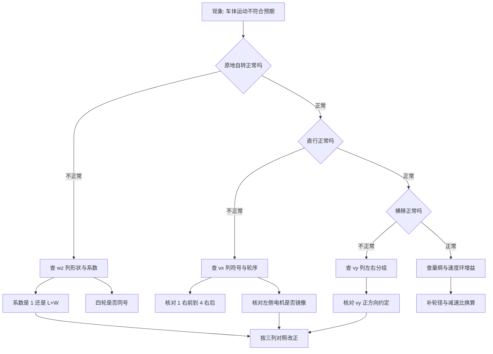
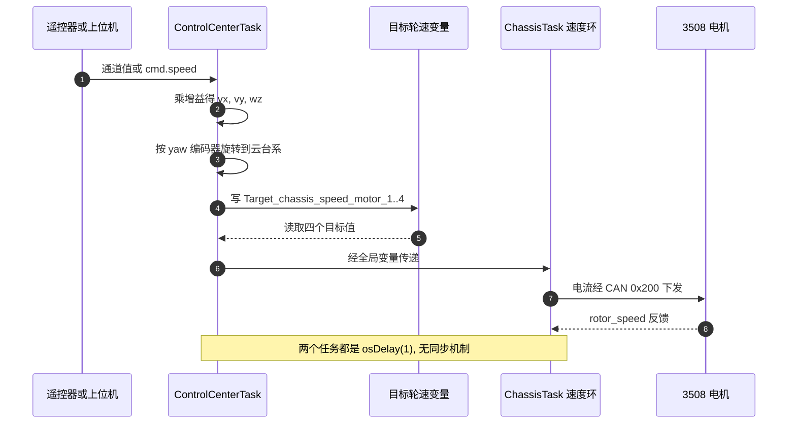

# 易错点与调试

全向轮解算出错时，现象往往只是一句“车体走偏”，但原因可能落在五层中的任意一层：轮序、符号、系数、量纲、正反转。按层排查比直接改公式有效，因为每层都有与符号约定无关的判据，能在不看电机的情况下先判断公式对不对。

本单元的真实缺陷与排查方法汇总成一张清单，源码位置集中在底盘板 `ControlCenterTask.cpp` 与 `Task/Src/ChassisTask.cpp`。需要回答的是：五层的判据分别是什么、哪些只看公式就能判；缺陷清单里哪些属于本单元、哪些属于相邻单元；调试时能直接观察哪三个量。

## 五层归属

| 层 | 内容 | 出错后的典型现象 |
| --- | --- | --- |
| 轮序 | 电机编号与物理位置对应 | 相邻轮反向，斜向窜动 |
| 符号 | $v_x$、$v_y$、$w_z$ 与非零项的符号 | 某个方向整体反了 |
| 系数 | 自转项的力臂 $(L+W)$ | 自转速度与平移速度不成比例 |
| 量纲 | m/s 与 rad/s、转子转速 | 速度环目标与反馈数量级不符 |
| 正反转 | 电机机械安装与电流符号 | 四轮不同向，原地打转 |

五层的顺序与耦合程度不同：轮序与符号是离散错误，一改就全变；系数与量纲是数值错误，通常表现为比例不对；正反转只在机械层面，与公式无关。

现象与层的对应不是一一的：斜向窜动既可能是轮序错，也可能是 $v_x$ 与 $v_y$ 符号叠加错。区分方法是分别给单轴输入，看每一列能否单独产生正确动作。

## 分层判据

| 层 | 判据 | 与约定有关吗 |
| --- | --- | --- |
| 系数 | 自转项必须是长度乘角速度，量纲 m/s | 无关 |
| 结构 | $v_x$ 列四轮同号；$v_y$、$w_z$ 列左右反号 | 允许整列取反 |
| 符号 | 纯 $v_x$ 时四轮同向，纯 $v_y$ 时左右分组，纯 $w_z$ 时对角分组 | 允许整列取反 |
| 量纲 | 逆解输出与速度环反馈单位一致 | 无关 |
| 正反转 | 四轮同目标速度时车体平移而非自转 | 与机械安装有关 |

前两条只看公式就能判，第三条需要给单一输入实测，第四条看数值范围，第五条上电试。按这个顺序推进，可以保证在动电机之前先排除公式问题。

## 排查流程

流程的入口是现象分类，不是代码位置。原地自转、直行、横移三类现象分别对应 $w_z$、$v_x$、$v_y$ 三列，因此从最直观的动作开始排查，能很快把范围缩到一列。

## 三列速查

| 轮 | 注释公式 | 生效代码 | 正确形式（标准约定） |
| --- | --- | --- | --- |
| 1 右前 | $v_x-v_y-(L+W)w_z$ | $v_x-v_y+w_z$ | $v_x+v_y+(L+W)w_z$ |
| 2 左前 | $v_x+v_y+(L+W)w_z$ | $-v_x-v_y+w_z$ | $v_x-v_y-(L+W)w_z$ |
| 3 左后 | $v_x-v_y+(L+W)w_z$ | $-v_x+v_y+w_z$ | $v_x+v_y-(L+W)w_z$ |
| 4 右后 | $v_x+v_y-(L+W)w_z$ | $v_x+v_y+w_z$ | $v_x-v_y+(L+W)w_z$ |

对照时按三列分别看形状，不要逐轮比较。完整的推导与结构判据见 `03-逆解公式推导.md`。

## 观测点与时序

调试时能直接看到的量只有三类：`Target_chassis_speed_motor_1..4`（逆解输出）、`chassis_motor_N.rotor_speed`（CAN 反馈）、`chassis_output_motor_1..4`（速度环输出电流）。三者的时序如下。

隔离方法分四步：

1. 固定 $(v_x,v_y,w_z)$ 只留一个非零，观察四个 `Target` 变量的符号与比例，与三列速查核对。
2. 单轴输入时若四个目标值符号不符合该列的合法形状，说明结构层已错，先不要看电机。
3. 结构正确后再上电，给四个轮相同目标，车体应平移。若自转，说明至少一个电机的机械正方向相反。
4. 自转方向反了，只需把 $w_z$ 整体取反，不要动 $v_x$、$v_y$。

## 缺陷清单

| # | 缺陷 | 位置 | 性质 | 判据 | 状态 |
| --- | --- | --- | --- | --- | --- |
| 1 | 自转项系数 `factor = 1` | `ControlCenterTask.cpp` | 量纲错 | 第三列应为长度 $(L+W)$ | 已核实 |
| 2 | 注释公式与生效代码不一致 | — | 符号与系数 | 三列对照 | 已核实 |
| 3 | 生效代码 $v_x$ 列左右反号、$v_y$ 与 $w_z$ 列无左右差分 | — | 结构不成逆解 | 结构判据 | 按代码推导 |
| 4 | AI 分支不成逆解 | — | 结构不成逆解 | 支撑集各占两轮 | 按代码推导 |
| 5 | 逆解输出未换算到转子转速 | `ChassisTask.cpp` | 量纲缺口 | 目标单位与 `rotor_speed` 不同 | 按代码推导 |
| 6 | 输出变量 `extern` 类型不一致 | `ChassisTask.cpp` | 符号破坏 | `uint16_t` 对 `int16_t` | 按代码推导 |
| 7 | 机械零点魔数 3100 | — | 待确认 | 源码无说明 | 待现场确认 |
| 8 | `gimbal_yaw_radians` 算了不用 | — | 死代码 | 全文件无引用 | 已核实 |
| 9 | 左侧电机镜像与否未记录 | — | 待确认 | 影响 $v_x$、$w_z$ 符号解释 | 待现场确认 |

缺陷 3 与 9 相关：若左侧电机镜像安装，$v_x$ 与 $v_y$ 列的符号形状会变合法，$w_z$ 列仍与注释公式反号，系数也仍是 1。也就是说镜像只能解释一部分现象，不能把缺陷 1 消掉。

## 相邻缺陷与归属

以下问题出现在本单元链路上，但归属其它单元：

| 缺陷 | 位置 | 归属单元 |
| --- | --- | --- |
| 斜坡只限制减速，加速直接到目标 | `ChassisTask.cpp` | `03-底盘指令映射/03-斜坡与停车处理.md` |
| `dt = 0.01` 与 `osDelay(1)` 不一致 | `ChassisTask.cpp、94` | `03-底盘指令映射/04-全链路时序与频率.md` |
| `follow` 环用 `fmodf` 做角度差，跨界不连续 | `ChassisTask.cpp` | `02-正逆运动学/03-跟随模式与场地系解算.md` |
| 停车判断只查四轮同零 | `ChassisTask.cpp` | `03-底盘指令映射/03-斜坡与停车处理.md` |

归属的意义在于：排查到这些位置时，本单元的结论不再适用，要转到对应单元看完整分析。例如 `dt` 与 `osDelay(1)` 不一致会影响积分项，但那属于时序单元的范围。

这四项都在本单元链路上，因此排查本单元缺陷时也会遇到它们。看到现象与公式不符时，先确认是不是这四项在上游改了输入。

## 观测变量与声明

四个目标轮速是 `float`（`ControlCenterTask.cpp`），在 `ChassisTask.cpp` 以 `extern float` 引用，类型一致，可以直接在调试器里观察。四个电流输出是 `int16_t`（`ChassisTask.cpp`），却在 `ControlCenterTask.cpp` 以 `extern uint16_t` 引用。按代码推导，负电流会在该声明下读成大正数；调试时若用 `ControlCenterTask.cpp` 的视角观察这四个量，负值不可见。

旋转层只作用在 $(v_x,v_y)$ 上，观察 $w_z$ 时不需要跟着旋转角一起看。逆解输出与 `rotor_speed` 的量纲不同（ 对 `ChassisTask.cpp`），因此目标值与反馈值不能直接比大小。

## 从现象到层的对应

| # | 易错点 | 现象 | 对应位置 |
| --- | --- | --- | --- |
| 1 | 只看单个轮子对不对 | 四轮局部正确、整体不成逆解 | 分层判据 |
| 2 | 把注释公式当生效公式 | 按 m/s 与 $(L+W)$ 估算，与实际不符 | — |
| 3 | 忽略 `factor = 1` 的量纲后果 | 自转项与平移项数量级失控 | — |
| 4 | 用同一套符号约定读两个分支 | AI 分支与 RC 分支结构不同 | — |
| 5 | 把正反转问题当公式问题 | 反复改公式，问题在机械安装 | 观测点与时序 |
| 6 | 用 `uint16_t` 观察电流 | 负值显示为大正数 | — |
| 7 | 认为旋转层会改变 $w_z$ | 旋转只作用平移分量 | — |
| 8 | 忘记四个轮速只有 3 个独立分量 | 用四个独立目标速度做标定 | 分层判据 |
| 9 | 把 3100 当确定零点直接使用 | 初始朝向偏置错 | — |
| 10 | 只改一处符号就上电验证 | 镜像与约定互相掩盖 | 排查流程 |

第 10 条是本单元最实际的教训：符号问题至少有镜像与约定两个来源，一次只改一个位置，改完立即用单轴输入验证，才能知道是哪一个起了作用。

## 小结

### 核心概念

- 排查顺序是系数、结构、符号、量纲、正反转，前两层只看公式。
- 系数层的判据是量纲：自转项必须是长度乘角速度。
- 结构层的判据与符号约定无关：$v_x$ 列四轮同号，$v_y$、$w_z$ 列左右反号。
- 生效代码三处偏离：`factor = 1`、$v_x$ 列左右反号、$v_y$ 与 $w_z$ 列缺左右差分。
- AI 分支的 $v_x$、$v_y$ 各只占两个轮，任意电机正方向约定都补不成逆解。
- 逆解输出到速度环缺轮径与减速比换算；输出变量 `extern` 类型不一致会破坏负电流。

### 设计权衡

| 决策 | 选择 | 收益 | 代价 |
| --- | --- | --- | --- |
| 调试入口 | 先看目标轮速变量 | 不依赖硬件，能先判公式 | 看不到机械正方向问题 |
| 系数处理 | 保留 `factor` 便于调整 | 可快速改比例 | 默认值 1 掩盖量纲错误 |
| 分支策略 | RC 与 AI 各一套公式 | 便于分别试验 | 只有一套接近逆解 |
| 观测点 | 直接读全局变量 | 无需额外接口 | 类型错误会误导观察 |
| 镜像处理 | 交给机械安装 | 代码简单 | 约定不落地在源码里 |

## 练习

### 基础题

1. 按分层判据，判断注释公式与生效代码各自通过哪几条。
2. 给出一组 $v_x$、$v_y$、$w_z$，使生效代码的四轮目标全部为正，并说明此时车体实际会怎样运动。
3. 说明纯 $w_z$ 输入时，生效代码四个轮速都带同一符号的原因。

### 挑战题

4. 设计一次不依赖遥控器的调试：在 `ChassisTask` 里注入固定目标速度，逐步验证三列。
5. 用 CAN 反馈的 `rotor_speed` 反推轮子线速度，写出换算式并评估用哪些实测参数。
6. 把 `factor = 1` 改成 $(L+W)$ 后，为保持同样的 $w_z$ 响应，通道增益需要怎样调整。

### 附：本页引用的固件路径

| 路径 | 用途 |
| --- | --- |
| `/home/wyx/rm/2026SentriOmeniChassis/2026OmniSentryChassis/Task/Src/ControlCenterTask.cpp` | 缺陷 1 至 6 与观测变量 |
| `/home/wyx/rm/2026SentriOmeniChassis/2026OmniSentryChassis/Task/Src/ChassisTask.cpp` | 速度环、输出定义与相邻缺陷 |
| `/home/wyx/rm/2026SentriOmeniChassis/2026OmniSentryChassis/BSP/Inc/bsp_can.h` | `rotor_speed` 字段定义 |
