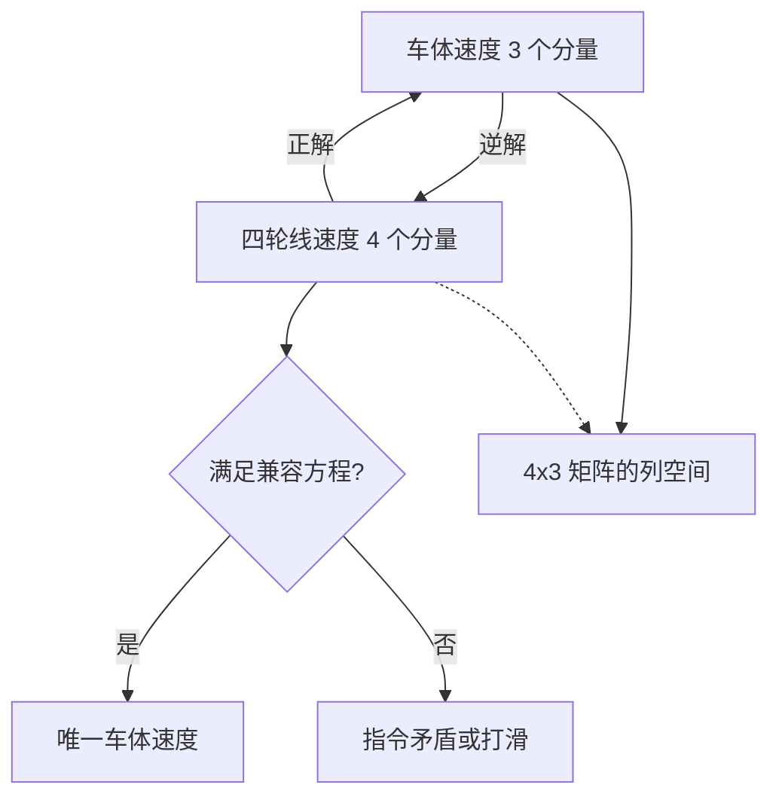
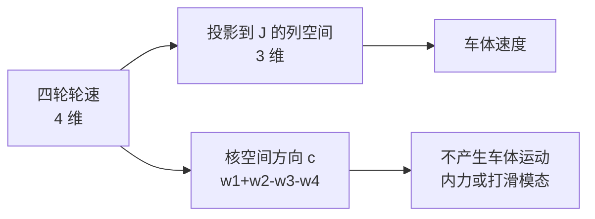

> 底盘运动学的两个方向是车体速度到四轮速度的逆解、四轮速度到车体速度的正解，以及四轮三自由度带来的超定与兼容方程。源码对象是底盘板 `Task/Src/ControlCenterTask.cpp` 的逆解分支，引用行号见第 7 节。

平面上的麦轮底盘只有三个自由度，四个轮子却能各自独立下发转速。数字上多出的一维既是冗余的来源，也是打滑检测的入口。两个方向的方程个数、逐轮推导出的矩阵、矩阵的秩与兼容方程，以及底盘固件实际使用的矩阵与它缺掉的正解，按这个顺序核对。

## 1. 两个方向的方程个数不同

运动学解决轮速与车体速度之间的换算。平面上车体只有三个自由度 $(v_x, v_y, w_z)$，而麦轮底盘有四个可以独立下发的轮速，两个方向的方程个数不同。

| 方向 | 输入 | 输出 | 方程规模 | 解的情况 | 本工程状态 |
| --- | --- | --- | --- | --- | --- |
| 逆解 | 车体速度 $(v_x,v_y,w_z)$ | 四轮线速度 $(w_1r,\dots,w_4r)$ | 4 | 唯一 | 已实现 |
| 正解 | 四轮线速度 | 车体速度 $(v_x,v_y,w_z)$ | 3 | 超定，需伪逆 | 未实现 |

逆解从三个数算出四个数，四个轮速被唯一确定，不存在分配自由度。正解从四个数反推三个数，四个轮速不一定自洽：只有满足一条线性兼容方程的组合才对应一个真实的车体速度，否则说明轮速指令相互矛盾或轮子发生了打滑。兼容方程来自系数矩阵的秩只有 3。



正解的用途是把四个轮子的编码器反馈还原成车体位移，即里程计。逆解用于控制，正解用于估计，两者共用同一个系数矩阵。

方向不能反过来推：逆解存在唯一结果不代表四个轮速可以任意组合出任意车体速度。四个轮速张成的空间是三维超平面，落在超平面之外的点没有对应车体速度，这一点在第 3 节用兼容方程写清。

## 2. 单轮方程到逆解矩阵

轮心位置取 $r_1=(L,-W)$、$r_2=(L,W)$、$r_3=(-L,W)$、$r_4=(-L,-W)$，编号 1 右前、2 左前、3 左后、4 右后，符号约定 $x$ 向前、$y$ 向左、$w_z$ 逆时针为正，与 `01-全向轮解算` 单元一致。$L$ 是轮心到车体中心的纵向距离，$W$ 是横向距离，两者单位都是 m。单轮线速度是接触点速度在驱动方向 $d_i=(1,\pm1)$ 上的投影，逐轮展开后写成矩阵：

$$\begin{bmatrix} w_1 r \\ w_2 r \\ w_3 r \\ w_4 r \end{bmatrix} = J \begin{bmatrix} v_x \\ v_y \\ w_z \end{bmatrix},\qquad J=\begin{bmatrix} 1 & 1 & k \\ 1 & -1 & -k \\ 1 & 1 & -k \\ 1 & -1 & k \end{bmatrix},\quad k=L+W$$

$k$ 的量纲是长度，前两列无量纲，所以乘积的每一项都是 m/s。逐轮推导见 `01-全向轮解算/03-逆解公式推导.md`。

第一列全是 1，对应纯前向平移时四轮同向；第二列是 $+1,-1,+1,-1$，对应纯横向平移时前后轮反向；第三列是 $+,-,-,+$，对应纯自转时对角的两个轮子同号。三列的符号模式是麦轮底盘几何的直接产物。

## 3. 秩为 3 与兼容方程

$J$ 是 $4\times3$，秩为 3。四个行向量里存在一个线性相关的组合，即存在非零向量 $c$ 使 $c^T J=0$。对上面的 $J$，解出

$$c=(1,\ 1,\ -1,\ -1)^T \;\Longrightarrow\; w_1 r + w_2 r - w_3 r - w_4 r = 0$$

这条等式就是四个轮速的兼容方程。满足它的轮速组合对应唯一的车体速度；不满足时不存在精确解，最小二乘解落在列空间上，残差就是打滑或指令冲突的量度。把任意倍数 $\alpha c$ 加到一组可行轮速上，车体速度不变，这组增量对应四个轮子互相较劲的内力模态，控制器不会产生它，模型也无法从车体速度观测到它。



核空间方向还有一层工程含义：它给出一个天然的残差量。把四个轮速按 $c$ 组合，结果应当恒为零；不为零时，绝对值就是打滑或指令冲突的强度，不需要额外建模。这条残差在代码里没有实现，第 8 节会说明原因。

## 4. 列正交与伪逆正解

$J^T J$ 的列两两正交：

$$J^T J = \begin{bmatrix} 4 & 0 & 0 \\ 0 & 4 & 0 \\ 0 & 0 & 4k^2 \end{bmatrix}$$

于是最小二乘解可以直接写出：

$$\begin{bmatrix} v_x \\ v_y \\ w_z \end{bmatrix} = (J^T J)^{-1} J^T \begin{bmatrix} w_1 r \\ w_2 r \\ w_3 r \\ w_4 r \end{bmatrix} = \begin{bmatrix} \frac{1}{4}(w_1+w_2+w_3+w_4) \\ \frac{1}{4}(w_1-w_2+w_3-w_4) \\ \frac{1}{4k}(w_1-w_2-w_3+w_4) \end{bmatrix}$$

三个分量分别是四轮轮速的均值组合、左右差分组合、对角差分组合。兼容方程对应的方向与这三个组合正交，所以四个轮速张成的空间里多出来的那一维不参与车体运动。

列正交是关键前提：它让 $(J^T J)^{-1}$ 退化成对角阵，正解只需要四次加减与一次除法，不需要完整的矩阵求逆。若换一套轮序约定导致列不正交，伪逆仍存在，但计算量会上升，且每个分量不再对应单一的物理组合。

## 5. 代码矩阵 A 与它的正解

代码的逆解矩阵与上面的 $J$ 不同，四轮的 $w_z$ 系数全部同号，且轮 2、3 的 $v_x$ 取了负号（完整符号对照见 `01-全向轮解算/04-本项目轮序与符号.md`）。记实际矩阵

$$A=\begin{bmatrix} 1 & -1 & f \\ -1 & -1 & f \\ -1 & 1 & f \\ 1 & 1 & f \end{bmatrix},\quad f=\text{factor}=1$$

它的列同样两两正交，$A^T A$ 是对角阵：

$$A^T A=\begin{bmatrix} 4 & 0 & 0 \\ 0 & 4 & 0 \\ 0 & 0 & 4f^2 \end{bmatrix}$$

因此按同一套伪逆公式得到

$$\begin{bmatrix} v_x \\ v_y \\ w_z \end{bmatrix} = \begin{bmatrix} \frac{1}{4}(w_1-w_2-w_3+w_4) \\ \frac{1}{4}(-w_1-w_2+w_3+w_4) \\ \frac{1}{4f}(w_1+w_2+w_3+w_4) \end{bmatrix}$$

$A$ 的核空间方向是 $c_A=(1,-1,1,-1)^T$，兼容方程 $w_1-w_2+w_3-w_4=0$。与 $J$ 的核方向不同，说明两组矩阵描述的是不同的轮子极性约定，正解与打滑检测必须在同一套约定里做。

两个矩阵的差别只体现在轮序与符号上，正交性与秩都相同。这也意味着第 4 节的推导结构可以直接搬到 $A$ 上，换的只是组合方式与归一化系数。

## 6. 正解用于里程计的三步

里程计在每个控制周期做三步：

1. 把四个轮子的反馈换算成轮子线速度 $w_i r$，需要轮子有效半径与减速比。
2. 用正解得到车体速度 $(v_x,v_y,w_z)$。
3. 在车体系里积分成位姿，再把每一段的位移按当时的航向旋到世界系。

$$x_{k+1}=x_k+\left(v_x\cos\theta_k-v_y\sin\theta_k\right)\Delta t,\quad y_{k+1}=y_k+\left(v_x\sin\theta_k+v_y\cos\theta_k\right)\Delta t,\quad \theta_{k+1}=\theta_k+w_z\Delta t$$

积分周期必须与真实采样周期一致。若反馈单位是转子转速 rpm，先做 $\pi/30$、减速比与轮径的换算，否则位移整体差一个常系数。

三步里第二步最容易出错：正解输出的是车体系速度，第三步才旋到世界系。若把正解结果直接当世界系速度积分，直线会变成弧线，且航向误差与位移误差耦合在一起。

## 7. 逆解在底盘固件里的位置与形状

逆解在 `Task/Src/ControlCenterTask.cpp`，RC 模式与跟随模式共用同一分支。四个目标轮速是全局 `float`，定义在 ，由 `Task/Src/ChassisTask.cpp` 引用后送给速度环。

```cpp
float factor = 1;
if (control_target.control_mode != control_target.MODE_AI) {
    chassis_vx_in_GimbalXYZ = control_target.chassis_vx*std::cos(delta_angel-Init_yaw_angle) - control_target.chassis_vy*std::sin(delta_angel-Init_yaw_angle);
    chassis_vy_in_GimbalXYZ = control_target.chassis_vx*std::sin(delta_angel-Init_yaw_angle) + control_target.chassis_vy*std::cos(delta_angel-Init_yaw_angle);
    Target_chassis_speed_motor_1 =  chassis_vx_in_GimbalXYZ - chassis_vy_in_GimbalXYZ + factor * control_target.chassis_wz;
    Target_chassis_speed_motor_2 = -chassis_vx_in_GimbalXYZ - chassis_vy_in_GimbalXYZ + factor * control_target.chassis_wz;
    Target_chassis_speed_motor_3 = -chassis_vx_in_GimbalXYZ + chassis_vy_in_GimbalXYZ + factor * control_target.chassis_wz;
    Target_chassis_speed_motor_4 =  chassis_vx_in_GimbalXYZ + chassis_vy_in_GimbalXYZ + factor * control_target.chassis_wz;
}
```

四行赋值对应第 5 节的 $A$。轮 1、4 与轮 2、3 的 $v_x$ 符号相反，四轮 $w_z$ 同号，$f$ 取 1 而不是 $(L+W)$。

`factor` 的这一处取值把长度因子丢掉了，与第 4 节的归一化系数 $4k^2$ 也不再对应。量纲问题在 `04-几何参数与量纲.md` 展开，这里只标注它与伪逆公式的差异。

## 8. 底盘固件里没有正解

底盘固件里没有里程计或正解的任何调用点：`Task/`、`Algorithm/`、`BSP/` 三个目录都搜不到 odom 或里程相关的符号，四个轮子的 `rotor_speed` 只被速度环当作反馈使用（`ChassisTask.cpp`，字段定义 `BSP/Inc/bsp_can.h`）。第 7 节的 $A$ 只被当成逆解使用。把第 5 节的三行写成函数是接入里程计的第一步，属设计建议，未在本工程实现。

缺少正解的直接后果是无法估计位姿：底盘只能按指令开环运动，也没有可用的打滑残差。第 3 节给出的兼容方程是现成的检测量，接入它比接入完整里程计的工作量小，可以分两步做。

## 9. 目标轮速与转子转速同轴

逆解输出写在全局 `float` 上，速度环把它与 `chassis_motor_N.rotor_speed` 相减（`ChassisTask.cpp`）。`rotor_speed` 是 CAN 反馈的 `int16_t` 原始值，单位是转子转速而不是轮子线速度；代码里没有轮径与减速比换算。第 3 节到第 5 节里以 $w_i r$ 写出的量，在代码里实际与转子转速同轴同量级，正解的物理量纲在实现中并不成立。这一处属按代码推导的缺口，待现场确认。

量纲不成立不影响当前闭环收敛，因为速度环是比例主导，增益可以吸收缺失的系数。它的代价是参数不可解释：换轮径或减速比之后要重新试凑，也无法从指令反推理论轮速。

## 10. 四轮同时为零的停车判据

`ChassisTask.cpp` 用四个目标轮速是否同时为零判断停车。按第 3 节，四轮同时为零确实是车体速度为零的充分条件；反过来车体速度为零并不要求单个轮速为零，只要求它们的组合为零，差速原地打滑就是这种情况。停车判断采用更严的充分条件，代价是漏掉部分零速工况，收益是实现简单。

判据的这一取舍与第 3 节的兼容方程是同一件事的两面：组合为零才等价于车体静止，逐个为零只是它的充分条件。若后续接入正解，停车判断可以直接改用正解输出的模长。

## 11. 易错点

| # | 易错点 | 现象 | 对应位置 |
| --- | --- | --- | --- |
| 1 | 把正解当成逆解矩阵的转置 | 少了 $(J^T J)^{-1}$，量级与量纲都不对 | 第 4 节 |
| 2 | 认为四个轮速可以任意独立下发 | 只有 3 个独立分量，核方向的分量只产生内力 | 第 3 节 |
| 3 | 用逆解矩阵直接反解而不检查兼容方程 | 打滑时输出看似合理的假速度 | 第 3 节 |
| 4 | 混用 $J$ 与代码矩阵 $A$ 的核方向 | 打滑检测阈值与符号全错 | 第 3 节、第 5 节 |
| 5 | 正解输出直接当 m/s 积分 | 反馈是转子转速，缺轮径与减速比 | `ChassisTask.cpp` |
| 6 | 积分周期用 `dt` 而不是循环真实周期 | 位移整体缩放 | `ChassisTask.cpp` |
| 7 | 认为兼容方程可以省掉 | 四条方程只有三条独立，硬解会得到矛盾结果 | 第 3 节 |

## 12. 小结

### 核心概念

- 逆解 3 个数求 4 个数，唯一；正解 4 个数求 3 个数，超定。
- 设计矩阵 $J$ 与代码矩阵 $A$ 都是 $4\times3$、秩 3，列两两正交。
- $J^T J$ 是对角阵，正解就是三个均值或差分组合。
- 核空间方向给出兼容方程：$J$ 对应 $w_1+w_2-w_3-w_4=0$，$A$ 对应 $w_1-w_2+w_3-w_4=0$。
- 核方向上的轮速增量不产生车体运动，是内力或打滑模态。
- 本工程只实现逆解，正解与里程计没有调用点，轮速反馈也没有换算到 m/s。

### 设计权衡

| 决策 | 选择 | 收益 | 代价 |
| --- | --- | --- | --- |
| 求解方向 | 只做逆解 | 控制链最短 | 无里程计，无法估计位姿 |
| 正解算法 | 伪逆（若实现） | 对任意轮速给最小二乘解 | 计算量与对称性都高于直接取平均 |
| 冗余处理 | 停车用四轮同时为零 | 判据简单 | 漏掉组合为零的工况 |
| 量纲处理 | 目标轮速与转子转速同轴 | 省去换算，参数少 | 物理量纲不成立，参数不可解释 |
| 几何系数 | 直接取 1 | 无标定需求 | $w_z$ 项与 $v_x$、$v_y$ 同量级 |

## 13. 练习

### 基础题

1. 验证 $c=(1,1,-1,-1)^T$ 满足 $c^T J=0$，并写出对应的兼容方程。
2. 用第 4 节的公式，从 $w_1 r=w_2 r=w_3 r=w_4 r=1$ 求车体速度。
3. 对代码矩阵 $A$，验证它的核方向是 $(1,-1,1,-1)^T$。

### 挑战题

4. 从 $A^T A$ 出发推导第 5 节的三行正解，并说明 $f=1$ 时 $w_z$ 的数值意义。
5. 设计一个里程计函数接口：输入四个轮速反馈与 $\Delta t$，输出车体位移，说明需要哪些标定参数，以及航向从哪里取。
6. 用最小二乘残差构造一个打滑检测指标，说明阈值如何标定，以及它与单轮电流异常检测的分工。

## 附：本页引用的固件路径

| 路径 | 用途 |
| --- | --- |
| `/home/wyx/rm/2026SentriOmeniChassis/2026OmniSentryChassis/Task/Src/ControlCenterTask.cpp` | 逆解矩阵与变量定义 |
| `/home/wyx/rm/2026SentriOmeniChassis/2026OmniSentryChassis/Task/Src/ChassisTask.cpp` | 轮速进入速度环、停车判断与周期 |
| `/home/wyx/rm/2026SentriOmeniChassis/2026OmniSentryChassis/BSP/Inc/bsp_can.h` | `rotor_angle`、`rotor_speed` 字段类型 |
| `/home/wyx/rm/2026SentriOmeniChassis/2026OmniSentryChassis/BSP/Src/bsp_can.cpp` | 四轮反馈解析与标识符 |
