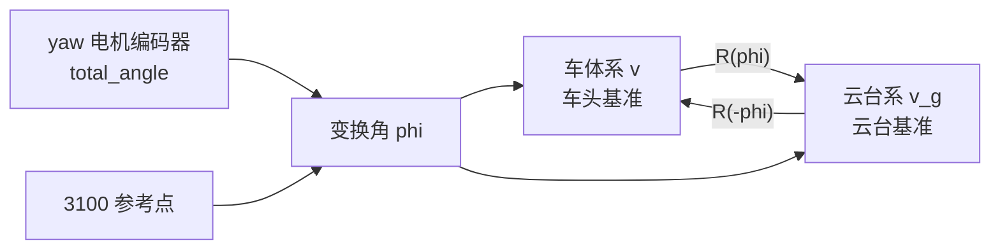
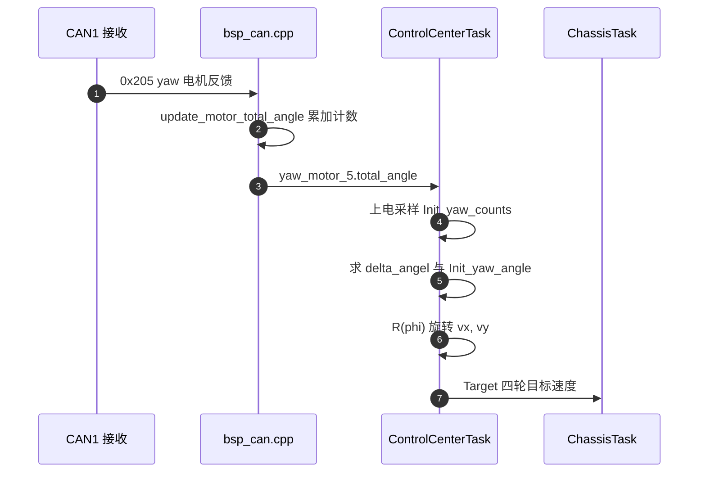

> 从二维旋转矩阵出发，底盘板把车体系速度指令旋到云台朝向的做法，重点在变换角 `delta_angel - Init_yaw_angle` 的来源、3100 参考点，以及主动旋转与坐标变换的区别。源码行号见第 8 节。

两块板各自维护一套角度：底盘板用 yaw 电机的编码器计数，云台板用 IMU 的偏航总角度。底盘要按云台朝向驱动平移时，必须先把遥控器给的平移量从车体系旋到云台系。

## 1. 三套坐标系与一个角度参数

| 坐标系 | 原点 | x 轴 | y 轴 | 本工程来源 |
| --- | --- | --- | --- | --- |
| 车体系 | 车体中心 | 车头指向前方 | 车身左方 | 轮序注释 `ControlCenterTask.cpp:72-76` |
| 云台系 | 车体中心 | 云台 yaw 指向 | 云台左方 | yaw 电机编码器 |
| 场地系 | 场地固定点 | 场地固定方向 | 与 x 垂直 | 底盘固件未使用 |

平移量在三套坐标系里的模长相同，只有方向分量不同。两个共原点的二维坐标系之间只差一个角度参数，换算写成矩阵就是旋转矩阵。

共原点是这条简化成立的前提：车体系与云台系的原点都在车体中心，因此两个坐标系之间没有平移项，只有旋转项。若原点不重合，换算还要补一个平移向量，本工程不存在这种情况。



## 2. 二维旋转矩阵的推导

固定坐标系里有一组标准基 $e_x=(1,0)$、$e_y=(0,1)$。把整个坐标系绕原点逆时针转过 $\varphi$，两根基的像分别是

$$R e_x = \begin{bmatrix} \cos\varphi \\ \sin\varphi \end{bmatrix},\qquad R e_y = \begin{bmatrix} -\sin\varphi \\ \cos\varphi \end{bmatrix}$$

矩阵的列就是基向量的像，因此

$$R(\varphi)=\begin{bmatrix} \cos\varphi & -\sin\varphi \\ \sin\varphi & \cos\varphi \end{bmatrix}$$

同一个 $\varphi$ 在代码里由编码器增量换算得到，见第 6 节。

推导的起点是“矩阵的列是基向量的像”，不是记住矩阵的样子。记住这一点之后，判断某个代码片段用的是 $R(\varphi)$ 还是 $R(-\varphi)$，只需看它把哪个轴映射到了哪里。

## 3. 旋转矩阵的五条性质

| 性质 | 表达式 | 含义 |
| --- | --- | --- |
| 正交 | $R^T R = I$ | 列向量两两正交且模长为 1 |
| 行列式 | $\det R = 1$ | 保面积、保手性 |
| 可逆 | $R^{-1}=R^T=R(-\varphi)$ | 反向旋转 |
| 合成 | $R(\varphi_1)R(\varphi_2)=R(\varphi_1+\varphi_2)$ | 多次旋转等价于角度相加 |
| 保内积 | $(Rv)\cdot(Rw)=v\cdot w$ | 平移量的模长不随坐标系改变 |

保内积这一条决定了三个自由度的物理含义：把 $(v_x,v_y)$ 旋转只改变平移方向，不改变平移速度大小；$w_z$ 是绕法向的标量，绕法向旋转不改变它，所以代码里 $w_z$ 没有参与这次变换。

性质之间可以互相推出：正交与行列式为 1 一起说明矩阵是纯旋转而不含镜像，可逆与合成说明这套变换构成一个角度可加的群。工程上只需要记住两点：反向变换就是把角度取负，旋转不改变模长。

## 4. 主动旋转与坐标变换只差符号

同一个矩阵乘以同一个向量，有两种读法：

| 名称 | 操作 | 矩阵 | 本工程是否采用 |
| --- | --- | --- | --- |
| 主动旋转 | 在固定坐标系里把向量转一个角 | $R(\varphi)$ | 代码的写法 |
| 坐标变换 | 同一个向量换到转过一个角的坐标系里表示 | $R(-\varphi)=R^T$ | 语义上等价 |

两种读法只差角度的符号，物理结果相同。判断代码按哪种理解，取决于 $\varphi$ 的符号定义与编码器计数方向，不能只从矩阵形式判断。这一点在第 7 节单列。

混淆两种读法的后果是方向镜像：本该用 $R$ 的地方用了 $R^T$（或反之），平移指令会朝反方向解算，跟随时表现为越跟越偏。这类错误不会报错，只能靠实车方向验证发现。

## 5. 代码两行就是一次矩阵乘法

`ControlCenterTask.cpp:109-110` 的两行

```cpp
chassis_vx_in_GimbalXYZ = control_target.chassis_vx*std::cos(delta_angel-Init_yaw_angle) - control_target.chassis_vy*std::sin(delta_angel-Init_yaw_angle);
chassis_vy_in_GimbalXYZ = control_target.chassis_vx*std::sin(delta_angel-Init_yaw_angle) + control_target.chassis_vy*std::cos(delta_angel-Init_yaw_angle);
```

逐项对照第 2 节的矩阵，第一行是 $\cos\varphi \cdot v_x - \sin\varphi \cdot v_y$，第二行是 $\sin\varphi \cdot v_x + \cos\varphi \cdot v_y$，正好是

$$\begin{bmatrix} v_x^{g} \\ v_y^{g} \end{bmatrix} = R(\varphi)\begin{bmatrix} v_x \\ v_y \end{bmatrix},\qquad \varphi=\text{delta\_angel}-\text{Init\_yaw\_angle}$$

没有省略任何一项，也没有把角度用错位置。

代码把角度表达式直接写进两个三角函数调用，没有构造中间矩阵与向量。这种写法的栈占用更小，代价是同一个表达式重复四次，角度符号散落在表达式里，改动时容易只改一行。

## 6. 变换角的来源与 3100 参考点

编码器计数到角度的换算是 $k=\frac{2\pi}{8192}$，因为 yaw 电机一圈 8192 个计数。代码在 `:93-94` 和 `:50-51` 分别定义

$$\Delta = (N_{init} - N_{cur})\cdot k,\qquad \theta_{init} = (N_{init} - 3100)\cdot k$$

其中 $N_{init}=$ `Init_yaw_counts` 是上电采样值（`:50`），$N_{cur}=$ `yaw_motor_5.total_angle` 是当前累计计数（`:93`）。变换角是两者之差：

$$\varphi=\Delta-\theta_{init}=(N_{init}-N_{cur})k-(N_{init}-3100)k=(3100-N_{cur})k$$

$N_{init}$ 在这一步被消掉，变换角只与当前计数和常数 3100 有关。上电瞬间 $N_{cur}=N_{init}$，所以

$$\varphi_0=(3100-N_{init})k=-\theta_{init}$$

3100 的物理含义是使 $\varphi=0$ 的编码器计数，也就是代码选定的机械零点。它是否对应云台与车头对齐的实际位置，源码里没有注释，属待现场确认。该计数折合约 $136.2^{\circ}$，是一个非对称的中间值，更像来自标定而不是某个天然的象限点。

$N_{init}$ 被消掉这一点有实用价值：变换角与上电姿态无关，只与当前计数有关。也就是说，跟随时底盘的对齐目标不随上电位置变化，变化的是上电瞬间的偏置量 $\varphi_0$。

## 7. 旋转方向由计数方向与安装方向共同决定

$\varphi=(3100-N_{cur})k$ 说明计数增大时 $\varphi$ 减小。代码按 $R(+\varphi)$ 施加旋转，因此从云台系到车体系的最终转向由两件事共同决定：编码器计数方向，以及电机安装时转子正转对应的车体转向。源码里没有这两条约定，只有 `:104` 的一句注释

```cpp
gimbal_yaw_radians = -gimbal_yaw_angle * M_PI / 180.0;//转为弧度制并且变为顺时针为正
```

它把 gimbal 传来的角度取负并声明按顺时针为正，但 `gimbal_yaw_radians` 在文件里没有后续使用（`:33` 定义、`:104` 赋值），所以这条约定没有被变换使用。转向是否正确要在车上用一条已知方向的平移指令验证，属待实测。

验证的判据是二值的：推杆向前，看底盘朝云台朝向走还是朝反方向走。走反时先排除摇杆通道符号，再检查 $\varphi$ 是否应取负，不要与增益符号一起改。



## 8. 角度量的定义与上电采样

| 变量 | 定义位置 | 类型 | 含义 |
| --- | --- | --- | --- |
| `Init_yaw_counts` | `ControlCenterTask.cpp:34`、`:50` | `int16_t` | 上电后延时 100 ms 采样的编码器计数 |
| `Init_yaw_angle` | `ControlCenterTask.cpp:35`、`:51` | `float` | 上电姿态相对 3100 的角度 |
| `delta_angel` | `ControlCenterTask.cpp:36`、`:93-94` | `float` | 当前计数相对上电计数的角度增量 |
| `total_angle` | `BSP/Inc/bsp_can.h:17` | `int16_t` | 电机累计计数，由 `update_motor_total_angle` 维护 |

延时 100 ms（`:49`）是为了等电机反馈更新。如果这段时间内收不到 0x205，`total_angle` 仍是初值 0，`Init_yaw_counts` 会采到 0，第 6 节的推导仍然成立，但 3100 参考点会整体偏移。

采样只在上电后做一次，模式切换不会重新采样。因此运行中切换遥控开关不会重置角度基准，$\varphi$ 仍相对同一次上电姿态计算。

## 9. 累计计数的更新方式

`BSP/Src/bsp_can.cpp:520-548` 维护累计计数：每圈 8192 个计数，差值绝对值超过 4096 就认为跨了半圈，圈数加一或减一，再把圈数与计数合成 `total_angle`（`:544`）。0x205 的处理在 `:597-606`，累加在 `:602`。

`total_angle` 的声明是 `int16_t`（`BSP/Inc/bsp_can.h:17`），而赋给它的是 `round_count*8192 + new_ecd` 这样的 `int32` 表达式（`:544`）。按代码推导，超过 $\pm32768$ 个计数（约 $\pm4$ 圈）后会发生截断回绕，变换角随之跳变。云台 yaw 在结构上通常不会转满四圈，但这一处属于按代码推导的隐患，待现场确认。同类问题在 `docs/03-CAN 与电机` 单元已记录。

半圈判据（4096）是这套累加的关键：它假设相邻两次反馈之间的转角不超过半圈，因此在 1 kHz 的反馈周期下不会误判。若采样间隔被拉长或电机转速极高，跨圈判断可能出错，累计计数随之偏移。

## 10. 0x302 那一路角度没有参与变换

底盘还通过 CAN1 的 0x302 收到云台板发来的 `gimbal_yaw_angle`（`BSP/Src/bsp_can.cpp:614-632`，赋值在 `:631`），它是云台的目标 yaw 角度，单位为度。底盘把它换算成 `gimbal_yaw_radians`（`ControlCenterTask.cpp:104`）后没有使用。因此第 5 节的变换只依赖本板的 yaw 电机编码器，不依赖 0x302 这一路数据。

`case 0x301`（`:608-613`）末尾没有 `break`，会落穿到 `case 0x302`，把 0x301 的遥控通道数据同时按 0x302 解析一遍。这一处是真实缺陷，见 `docs/09-嵌入式软件架构` 的跨板数据流。

两路角度的来源不同：本板编码器是实测值，0x302 是云台侧的目标值。拿目标值做坐标变换会把“期望方向”当成“实际方向”，跟随误差被抵消，看似正常但没有形成闭环。

## 11. 易错点

| # | 易错点 | 现象 | 对应位置 |
| --- | --- | --- | --- |
| 1 | 把 3100 当成理论零点 | 变换角常偏移一个固定值，直线指令走斜 | `ControlCenterTask.cpp:51` |
| 2 | 认为 $N_{init}$ 还留在变换角里 | 多算一项，角度零点随上电姿态漂移 | 第 6 节 |
| 3 | 混淆主动旋转与坐标变换 | 矩阵转了 $R$ 而不是 $R^T$，行进方向镜像 | 第 4 节 |
| 4 | 忘记 $w_z$ 不参与旋转 | 对 $w_z$ 也乘旋转矩阵，自转量被投影 | 第 3 节 |
| 5 | 认为 0x302 的云台角度参与变换 | 追错数据源，改动无效 | `ControlCenterTask.cpp:104` |
| 6 | 忽略 `total_angle` 的 `int16_t` 截断 | 数圈后变换角跳变 | `BSP/Inc/bsp_can.h:17`、`bsp_can.cpp:544` |
| 7 | 把 `gimbal_yaw_radians` 当成已使用 | 它算了不用，改它不影响行为 | `ControlCenterTask.cpp:33`、`:104` |

## 12. 小结

### 核心概念

- 二维旋转矩阵 $R(\varphi)$ 的两列是标准基旋转后的像，正交且行列式为 1。
- 代码 `:109-110` 的两行与 $R(\varphi)$ 逐项一致，$\varphi$ 是车体系到云台系的旋转角。
- $R(\varphi)^{-1}=R(-\varphi)$，主动旋转与坐标变换只差角度符号。
- 变换角 $\varphi=(3100-N_{cur})k$，上电计数 $N_{init}$ 在化简中消掉。
- 3100 是使 $\varphi=0$ 的编码器参考点，实际机械含义待现场确认。
- 0x302 的 `gimbal_yaw_angle` 被换算后未使用，变换只依赖本板 yaw 编码器。

### 设计权衡

| 决策 | 选择 | 收益 | 代价 |
| --- | --- | --- | --- |
| 变换实现 | 直接展开两行三角函数 | 无中间对象，栈占用小 | 角度符号散落在表达式里 |
| 角度基准 | 硬编码 3100 | 免去运行时标定接口 | 换车或换电机后要改源码 |
| 角度来源 | 本板 yaw 编码器 | 不依赖跨板报文到达 | 受 `int16_t` 回绕影响 |
| 云台角度 | 0x302 收到但不用 | 预留了接口 | 造成数据源混淆 |

## 13. 练习

### 基础题

1. 写出 $\varphi=30^{\circ}$、$(v_x,v_y)=(1,0)$ 时的 $(v_x^{g},v_y^{g})$，并验证模长不变。
2. 验证 $R(\varphi_1)R(\varphi_2)=R(\varphi_1+\varphi_2)$，用矩阵乘法展开。
3. 用 $\varphi=(3100-N_{cur})k$ 计算 $N_{cur}=3100$、$N_{cur}=0$、$N_{cur}=8192$ 三个点的变换角（弧度）。

### 挑战题

4. 若 3100 的真实机械零点应为 $N_0$，写出新的变换角表达式，并说明它对第 5 节两行代码的修改量。
5. 设计一个标定流程，用一次直线平移指令反推 3100 与编码器转向，列出需要记录的量。
6. 分析 `total_angle` 从 $+32767$ 回绕到 $-32768$ 时 $\varphi$ 的跳变量，说明它会让跟随环产生多大的角度误差。

## 附：本页引用的固件路径

| 路径 | 用途 |
| --- | --- |
| `/home/wyx/rm/2026SentriOmeniChassis/2026OmniSentryChassis/Task/Src/ControlCenterTask.cpp` | 旋转两行、角度变量与 3100（`:33-36`、`:49-51`、`:93-94`、`:104`、`:109-110`） |
| `/home/wyx/rm/2026SentriOmeniChassis/2026OmniSentryChassis/BSP/Inc/bsp_can.h` | `total_angle` 字段类型（`:10-20`） |
| `/home/wyx/rm/2026SentriOmeniChassis/2026OmniSentryChassis/BSP/Src/bsp_can.cpp` | 累计角度更新与 0x205、0x301、0x302 解析（`:520-548`、`:597-632`） |
