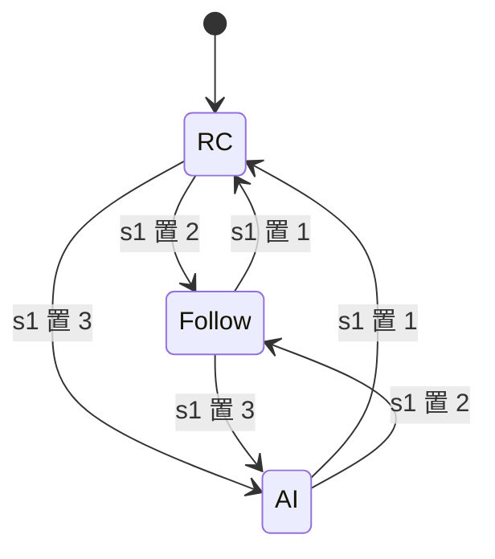
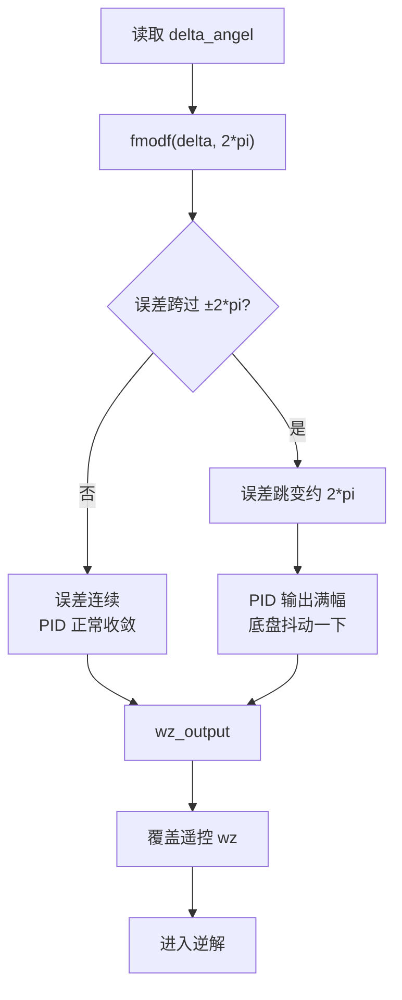
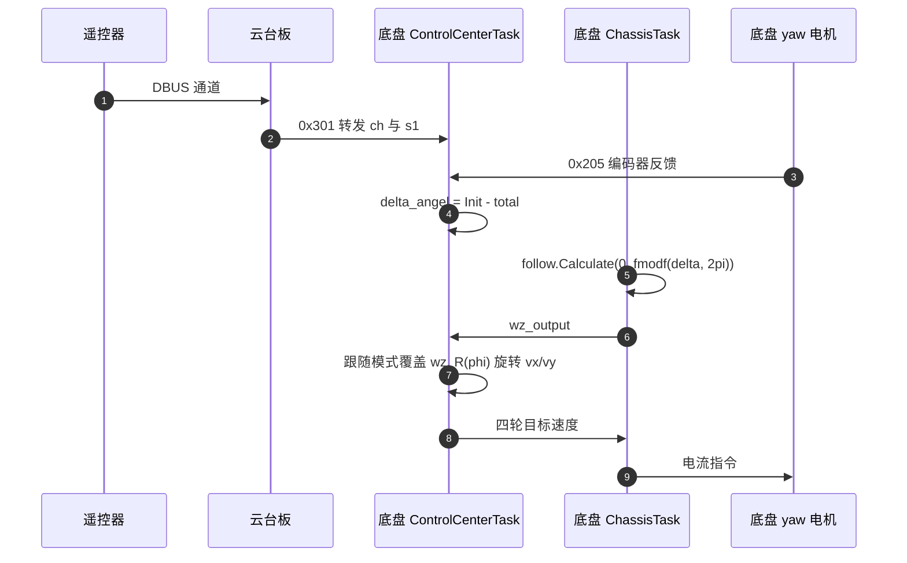

> 底盘跟随云台的链路是：模式切换来自遥控器开关，跟随环用 yaw 电机编码器误差驱动 `wz`，平移指令再按云台朝向旋转。源码涉及底盘板 `ControlCenterTask.cpp` 与 `ChassisTask.cpp`，行号见第 7 节。

遥控器开关 `s1` 有三个位置，对应三种底盘控制模式。跟随模式的目的是让操作者只关心云台指向：yaw 通道转动云台，底盘自动转到与云台一致的方向，平移指令按云台朝向来解。这样云台始终对着目标，底盘像一个可以横移的自稳平台。

## 1. 三种模式与它们的数据来源

| 模式 | 枚举值 | 速度来源 | 旋转来源 | 平移基准 |
| --- | --- | --- | --- | --- |
| `MODE_RC` | 0 | 遥控通道 | 遥控通道 `ch[4]` | 车体系 |
| `MODE_RC_follow` | 1 | 遥控通道 | 跟随环输出 `wz_output` | 云台系 |
| `MODE_AI` | 2 | USB 上位机 `cmd.speed` | 上位机 | 另有一套式子 |

三个模式共用一份逆解输出变量，差别集中在 `wz` 的来源与平移基准。前两个模式的平移量都从遥控器取，AI 模式改从 USB 数据包取，并且不走第 4 节的旋转。



状态图的转移条件都来自同一个开关量，没有自动转移。`s1` 不是 1、2、3 时模式保持不变，这一条让遥控信号丢失时底盘不会因为模式跳变而突发动作。

## 2. 跟随环的误差定义与比例输出

跟随环的目标是把 yaw 电机相对上电位置的角度增量 $\Delta$ 拉回 0。误差取

$$e=\text{fmodf}(\Delta,\ 2\pi),\qquad \Delta=(N_{init}-N_{cur})k,\quad k=\frac{2\pi}{8192}$$

`follow` 环按 $e$ 计算出 `wz_output`，该值在跟随模式下覆盖遥控器给的 `wz`。当 $\Delta$ 为正时 $e$ 为正，PID 输出与之一致，底盘朝减小 $\Delta$ 的方向转，直到 $e\to0$。控制器是纯比例环（`KP=800`，`KI=KD=0`），输出限幅 $\pm10000$。

纯比例环的稳态特性决定了这套跟随的精度：没有积分项，稳态误差与负载力矩成正比。底盘在平地静止时误差小，快速自转或地面阻力大时会留下一个固定偏差，这一点在调参时要与第 3 节的抖动量区分开。

## 3. fmodf 在正负两圈处的不连续

`fmodf(x, 2\pi)` 保留被除数的符号，值域是 $(-2\pi,\ 2\pi)$。它的作用是把任意大的角度折到一圈以内，避免误差随圈数无限增长。代价是在 $\pm2\pi$ 处出现跳变：

| $\Delta$ | $e=\text{fmodf}(\Delta,2\pi)$ | 物理上离零点 |
| --- | --- | --- |
| $+0.01$ | $+0.01$ | 近 |
| $-0.01$ | $-0.01$ | 近 |
| $2\pi-0.01$ | $+6.273$ | 近 |
| $-2\pi+0.01$ | $-6.273$ | 近 |

$\Delta$ 从略小于 $2\pi$ 增到略大于 $2\pi$ 时，$e$ 从 $+6.273$ 跳到 $\approx0$；反方向从略大于 $-2\pi$ 减到略小于 $-2\pi$ 时，$e$ 从 $-6.273$ 跳到 $\approx0$。两种情况下控制器都会看到很大的误差并输出满幅自转，表现为过零附近的一次抖动。把折角范围改成 $(-\pi,\pi]$ 可以消除这次跳变，当前实现用的是 $(-2\pi,2\pi)$。

跳变的幅度是 $2\pi$ 而不是无穷大，因此表现为一次抖动而不是持续振荡。要复现它，需要让底盘相对上电位置转过接近一整圈再回到原位，属需要专门构造的工况。



## 4. 平移按云台朝向旋转的两步

跟随模式下的平移分两步。先按遥控器取车体系分量 $(v_x,v_y)$，再按云台朝向旋转：

$$\begin{bmatrix} v_x^{g} \\ v_y^{g} \end{bmatrix} = R(\varphi)\begin{bmatrix} v_x \\ v_y \end{bmatrix},\qquad \varphi=(3100-N_{cur})k$$

旋转后的分量作为逆解的输入，进入四轮赋值。旋转角与第 2 节的误差共享同一个 $N_{cur}$，因此跟随环把底盘转到某个角度时，平移基准也跟着转。跟随环收敛后 $N_{cur}\to N_{init}$，此时 $\varphi$ 锁定在

$$\varphi_{lock}=(3100-N_{init})k=-\theta_{init}$$

也就是说，跟随锁定时平移方向相对车头有一个固定的角度偏置，等于上电时云台相对 3100 参考点的角度。若上电姿态恰好使 $N_{init}=3100$，偏置为零。这一点由代数推出，实际偏置量待现场测量。

旋转与跟随共用同一个编码器量有一个副作用：平移方向在跟随过程中会随之变化。操作者推杆向前时，底盘的瞬时行进方向跟着车体一起转，直到跟随收敛。这是“按云台朝向平移”的定义决定的，不是缺陷。

## 5. 跟随数据的跨板链路

跟随模式的数据经过两块板：遥控器由云台板接收，通过 0x301 转发给底盘（`BSP/Src/bsp_can.cpp`）；底盘另从 0x302 收到云台目标角度，但后者未参与跟随。跟随用的 yaw 电机反馈走 CAN1 的 0x205。



链路上有两处跨板：遥控通道与开关量走 0x301，yaw 电机反馈走 CAN1 的 0x205。前者到达失败时模式保持不变，后者到达失败时 $N_{cur}$ 停在旧值，跟随环会朝一个不变的方向持续输出。

## 6. 模式判断与覆盖点

模式在 `ControlCenterTask.cpp` 由 `dbus.s1` 的值决定，初值是 `MODE_RC`。`s1` 不是 1、2、3 时模式保持不变。

```cpp
if (dbus.s1 == 1) {
    control_target.control_mode = ControlTarget::MODE_RC;
} else if (dbus.s1 == 2) {
    control_target.control_mode = ControlTarget::MODE_RC_follow;
} else if (dbus.s1 == 3) {
    control_target.control_mode = ControlTarget::MODE_AI;
}
```

跟随环在 `Task/Src/ChassisTask.cpp`：比例参数在 ，计算在 ：

```cpp
wz_output = follow.Calculate(0, fmodf(delta_angel, M_PI*2.0f), dt);
```

它在 `ControlCenterTask.cpp` 覆盖遥控速度：

```cpp
if (control_target.control_mode == control_target.MODE_RC_follow) {
    control_target.chassis_wz = wz_output;
}
```

覆盖发生在逆解之前，所以跟随模式的 `wz` 不再来自遥控器。平移量仍在  的 `else` 分支从遥控器取，随后在  被旋转。

覆盖写在两个文件里是这条链路上的一处结构性风险：若 `ChassisTask` 未运行或 `wz_output` 未更新，覆盖仍会发生，`wz` 会停在旧值而不是回落到遥控值。

## 7. 跟随环的周期与 dt 的影响

`ChassisTask` 的 `dt` 写死为 0.01（`ChassisTask.cpp`），循环体末尾是 `osDelay(1)`，实际周期约 1 ms。速度环的 `Calculate` 里 `dt` 只进入积分与微分两项：积分增量是 `Ki*error*dt`，微分是 `(error-prevError)/dt`（`PID/Src/speed_pid.cpp`）。代入 10 倍于真实值的 `dt` 让积分快约 10 倍、微分小约 10 倍；跟随环的 `KI`、`KD` 都是 0，输出只有比例项，因此这一处对跟随环本身没有影响。详细推导见 `docs/06-PID 控制`。另一处相关缺陷是斜坡函数只限制减速（`ChassisTask.cpp`），加速直接跳到目标，归 `03-底盘指令映射` 单元。

`dt` 对比例项没有影响这一点让跟随环免于这一处缺陷，但也说明不能靠跟随环的行为反推周期是否正确。要验证周期，只能测任务实际执行间隔。

## 8. 底盘没有实现的场地系位姿

底盘固件里没有世界坐标系的位姿估计，也没有把速度积分到场地系的代码。第 4 节所说的场地系解算，实际只做到用云台朝向给平移指令定向，即把操作者意图从云台系送到逆解。完整的场地系里程计需要 01 单元的正解与航向积分，属未实现部分。

三套坐标系里只有车体系与云台系在代码里有对应实现，场地系完全缺位。缺位的直接后果是底盘没有绝对定位，长时间运行后位姿只能靠外部视觉或操作者修正。

## 9. 易错点

| # | 易错点 | 现象 | 对应位置 |
| --- | --- | --- | --- |
| 1 | 用 0x302 的云台角度做跟随 | 改错数据源，跟随不生效 | `ControlCenterTask.cpp` |
| 2 | 认为 fmodf 后误差连续 | $\pm2\pi$ 附近一次抖动 | `ChassisTask.cpp` |
| 3 | 把折角范围当成 $(-\pi,\pi]$ | 误差可以到 $2\pi$，收敛慢 | 第 3 节 |
| 4 | 忽略跟随锁定后的固定偏置 | 平移方向与上电姿态有关 | 第 4 节 |
| 5 | 认为 `dt` 不影响跟随环 | 跟随环只有比例项，受影响的是轮速环的积分与微分 | `ChassisTask.cpp` |
| 6 | 认为模式切换会重置角度 | `Init_yaw_counts` 只在上电采一次 | `ControlCenterTask.cpp` |
| 7 | 在 AI 模式套用跟随旋转 | AI 分支另有一套式子，不走旋转 | `ControlCenterTask.cpp` |

## 10. 小结

### 核心概念

- `s1`=1/2/3 对应 `MODE_RC`、`MODE_RC_follow`、`MODE_AI`。
- 跟随环目标 0，误差 `fmodf(delta_angel, 2pi)`，纯比例输出 `wz_output` 覆盖遥控 `wz`。
- `fmodf` 的值域是 $(-2\pi,2\pi)$，在 $\pm2\pi$ 处不连续，收敛应折到 $(-\pi,\pi]$。
- 平移指令按 $R(\varphi)$ 旋转到云台系，$\varphi$ 与跟随误差共用同一个编码器量。
- 跟随锁定后 $\varphi$ 固定为 $(3100-N_{init})k$，是否为零取决于上电姿态。
- 底盘固件没有场地系位姿估计，当前只做到按云台朝向定向平移。

### 设计权衡

| 决策 | 选择 | 收益 | 代价 |
| --- | --- | --- | --- |
| 跟随误差范围 | 折到 $2\pi$ | 限制误差幅值 | 过零处不连续 |
| 平移基准 | 云台朝向 | 操作者只关心云台 | 依赖编码器零点标定 |
| 模式数据源 | 遥控通道加跟随覆盖 | 结构简单 | `wz` 来源随模式变化，不易追 |
| 场地系 | 未实现 | 控制链短 | 无绝对定位能力 |

## 11. 练习

### 基础题

1. 写出 `s1`=2 时的速度数据来源表：`vx`、`vy`、`wz` 各来自哪里。
2. 计算 $\Delta=\pi$、$\Delta=3.5\pi$、$\Delta=-3.5\pi$ 时的 `fmodf` 结果。
3. 用第 4 节的表达式计算 $N_{init}=3100$ 与 $N_{init}=4096$ 时跟随锁定后的 $\varphi$（弧度）。

### 挑战题

4. 把折角改成 $(-\pi,\pi]$，写出新的误差表达式，并分析它在过零附近与当前实现的行为差别。
5. 若要求平移始终相对场地系而不是云台系，需要增加哪些状态量，跟随环与旋转角如何改。
6. 跟随环加入 `KI` 后，$\pm2\pi$ 跳变会产生什么后果，给出一个既能消抖又不损失稳态精度的修正方案。

## 附：本页引用的固件路径

| 路径 | 用途 |
| --- | --- |
| `/home/wyx/rm/2026SentriOmeniChassis/2026OmniSentryChassis/Task/Src/ControlCenterTask.cpp` | 模式判断、跟随覆盖、旋转与逆解 |
| `/home/wyx/rm/2026SentriOmeniChassis/2026OmniSentryChassis/Task/Src/ChassisTask.cpp` | 跟随环实例、计算与周期 |
| `/home/wyx/rm/2026SentriOmeniChassis/2026OmniSentryChassis/BSP/Src/bsp_can.cpp` | 0x205、0x301、0x302 报文解析 |
| `/home/wyx/rm/2026SentriOmeniChassis/2026OmniSentryChassis/Message_Bus/message_bus.h` | 控制模式枚举与速度字段 |
