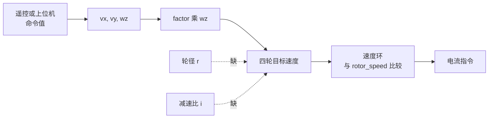
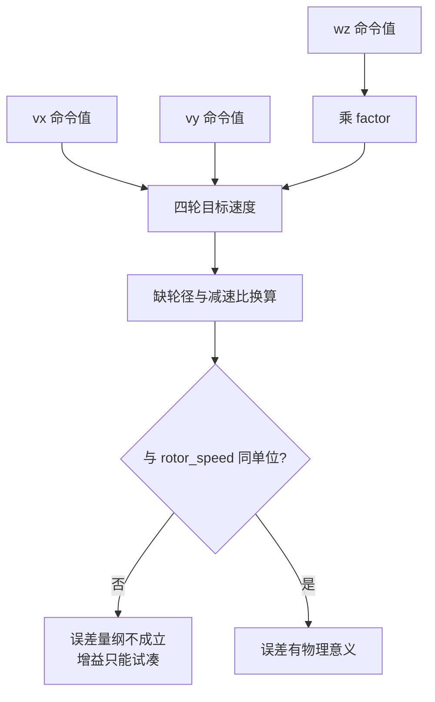

> 逆解公式里的几何系数与单位逐项拆开：$L$、$W$ 是什么，$factor=1$ 破坏了哪一条量纲关系，轮子线速度到转子转速还缺哪些换算。源码对象是底盘板 `ControlCenterTask.cpp` 与 `ChassisTask.cpp`，行号见第 6 节。

逆解把三个车体速度分量合成到每个轮子上，三个分量必须落到同一种单位，否则相加没有意义。涉及的量分两类：几何参数与单位换算系数。

## 1. 逆解涉及的两类量

| 符号 | 含义 | 正确单位 | 代码中的取值 |
| --- | --- | --- | --- |
| $L$ | 轮心到车体中心的纵向距离 | m | 未在代码中定义 |
| $W$ | 轮心到车体中心的横向距离 | m | 未在代码中定义 |
| $L+W$ | 自转项的力臂 | m | 注释提及，代码用 `factor=1` 代替 |
| $r$ | 轮子有效半径 | m | 未在代码中定义 |
| $i$ | 电机减速比 | 无量纲 | 未在代码中定义 |
| $factor$ | 自转项系数 | m | 1 |
| $v_x, v_y$ | 车体平移速度 | m/s | 遥控或上位机缩放的命令值 |
| $w_z$ | 车体自转角速度 | rad/s | 遥控或上位机缩放的命令值 |
| $n_{rotor}$ | 转子转速 | rpm | `rotor_speed` 反馈（`bsp_can.h`） |

两类量的作用不同：几何参数决定三个分量之间的比例，单位换算系数决定整条链路与反馈能不能直接相减。前者错了表现为方向与旋转强度不对，后者错了表现为增益必须试凑。



## 2. 自转项的量纲

单轮方程的结构是

$$w_i r = v_x + \sigma_i v_y + \tau_i (L+W) w_z,\qquad \sigma_i,\tau_i\in\{+1,-1\}$$

逐项核对单位：

| 项 | 表达式 | 单位 | 是否成立 |
| --- | --- | --- | --- |
| 平移 | $v_x$、$v_y$ | m/s | 是 |
| 自转 | $(L+W)w_z$ | m $\cdot$ rad/s = m/s | 是，弧度无量纲 |
| 代码自转 | $f \cdot w_z$，$f=1$ | 与 $w_z$ 同单位 | 仅当 $f$ 带长度单位才成立 |

$(L+W)$ 是把角速度换成线速度的力臂。去掉它之后，$w_z$ 以角速度的身份直接加到线速度上，量纲不闭合。$L$、$W$ 取轮心到车体中心的距离，不是整车长宽；代码注释写成“底盘长度/2”和“底盘宽度/2”（`ControlCenterTask.cpp`），与轮心距离可能不一致，属待现场测量。

弧度无量纲这一点是量纲检查的关键：$w_z$ 的单位是 rad/s，乘上长度之后变成 m/s，与平移项可加。若把 $w_z$ 当成“每秒多少度”而不换算，数值上会差一个 $\pi/180$。

## 3. 从轮线速度到转子转速的换算链

假设四轮目标速度已经是有物理意义的轮线速度，还要经过减速比与轮径才能与 `rotor_speed` 比较：

$$\omega_{wheel}=\frac{v_w}{r},\qquad \omega_{rotor}=i\,\omega_{wheel},\qquad n_{rotor}=\omega_{rotor}\cdot\frac{60}{2\pi}$$

合并成一条系数：

$$n_{rotor}=\frac{60\,i}{2\pi r}\,v_w=\frac{30\,i}{\pi r}\,v_w$$

反过来从反馈回到轮线速度是

$$v_w=\frac{\pi r}{30\,i}\,n_{rotor}$$

以一组示意参数 $r=0.06$ m、$i=19.2$ 代入，$v_w=1$ m/s 对应 $n_{rotor}\approx3056$ rpm。这组数值只用于说明计算过程，不是本机实测值。代码里没有这条换算，`ChassisTask.cpp` 直接把目标量与 `rotor_speed` 相减。

换算链的顺序不能颠倒：先除轮径得到轮子角速度，再乘减速比得到转子角速度，最后乘 $60/2\pi$ 换成 rpm。三项里任意一项缺失，整条链就只剩一个任意系数。

## 4. factor=1 的数值后果

遥控模式下 $v_x$ 与 $w_z$ 来自同一增益：$v_x=ch[3]\times5$、$w_z=ch[4]\times5$（`ControlCenterTask.cpp`）。两个通道行程相同，因此同样的摇杆偏移下，加进轮速的自转项与平移项数值相等。

按物理公式，若期望平移为 $v_x=1$ m/s、自转为 $w_z=1$ rad/s、力臂取示意值 $L+W=0.3$ m，正确的自转贡献是 $0.3$ m/s，代码给的是 $1$，放大约 3.3 倍。换个角度看，要让自转项与 $1$ m/s 的平移相当，物理上的 $w_z$ 应达到约 3.3 rad/s，而代码把 1 rad/s 的数值当成了等效量。旋转响应因此偏强，且倍率随实际力臂变化。这组结论依赖假设的 $L$、$W$，属按代码与示意几何推导，待实测。

倍率不是常数这一点比偏强本身更麻烦：换一块底盘、换一种轮子布局，等效倍率都会变，因此不能用一次试凑的增益覆盖多台车。

## 5. 三条目标量必须同单位

速度环的反馈是转子转速，误差 $e=target-rotor\_speed$ 只有在两者同单位时才有物理意义。逆解的三条目标量最终是 $v_x$、$v_y$、$w_z$ 的线性组合，因此这三者必须先换算到同一个单位。

| 组合方式 | $v_x,v_y$ 单位 | $w_z$ 单位 | 目标量单位 | 与 rpm 反馈是否一致 |
| --- | --- | --- | --- | --- |
| 物理正确 | m/s | rad/s，乘 $L+W$ | m/s，再乘 $\frac{30i}{\pi r}$ | 一致 |
| 代码现状 | 命令值 | 命令值，乘 1 | 命令值 | 不一致，系数任意 |

代码的闭环可以工作，是因为速度环是比例主导、命令值与反馈值同轴同量级，增益吸收了缺失的系数。代价是参数不可解释：改轮径、改减速比、改 $L$、$W$ 都要重新试凑增益，也无法从指令反推理论轮速。



## 6. 注释里的几何参数

`ControlCenterTask.cpp` 的注释给出理想公式并定义参数：

```cpp
// wheel1 (右前) = vx - vy - (L+W)*wz
// wheel2 (左前) = vx + vy + (L+W)*wz
// wheel3 (左后) = vx - vy + (L+W)*wz
// wheel4 (右后) = vx + vy - (L+W)*wz
// 其中：L = 底盘长度/2, W = 底盘宽度/2
```

注释里 $(L+W)$ 出现四次，说明作者知道自转项需要力臂。生效代码在  把它换成 `float factor = 1;`，并在  使用。整个底盘仓库搜不到 $L$、$W$、轮径、减速比任何一个常量或宏，也就是说几何参数从未落到代码里。

注释与代码并存还有一层影响：后来读代码的人容易按注释理解行为。核对任何一处符号或系数时，以生效代码为准，注释只提供推导思路。

## 7. 生效公式与注释的三处差异

| 项 | 注释 | 代码 |
| --- | --- | --- |
| $v_x$ 系数 | 四轮同为 $+1$ | 轮 1、4 为 $+1$，轮 2、3 为 $-1$ |
| $v_y$ 系数 | 轮 1、3 为 $-1$，轮 2、4 为 $+1$ | 四轮同为 $-1$（轮 3、4 为 $+1$） |
| $w_z$ 系数 | 轮 1、4 为 $-(L+W)$，轮 2、3 为 $+(L+W)$ | 四轮同为 $+factor$ |
| 量纲 | m/s | 三项同量级，无长度因子 |

差异不止在 $factor$：符号模式也变了。符号问题归 `01-全向轮解算/04-本项目轮序与符号.md`，只把量纲缺口写清。

三处差异可以分开验证：$v_x$ 与 $v_y$ 的符号靠直线与横移指令验证，$w_z$ 的系数靠自转响应强度验证。一次只查一处，避免多个错误互相掩盖。

## 8. 目标量与反馈量的单位

`ChassisTask.cpp` 把 `motor_N_target` 与 `chassis_motor_N.rotor_speed` 相减。`rotor_speed` 在 `BSP/Inc/bsp_can.h` 定义，由 `BSP/Src/bsp_can.cpp` 从 CAN 反馈解析。代码注释在 `ControlCenterTask.cpp` 写“计算各轮线速度（m/s）”，但没有任何一处做 m/s 到转子转速的换算，也没有定义轮径与减速比。第 3 节的系数 $\frac{30i}{\pi r}$ 在代码里完全缺失。

注释与实现不一致的后果是误读：按注释理解，目标量是 m/s，反馈是 rpm，两者相减没有意义；按实现理解，目标是任意命令值，反馈是原始整数，相减只在数值层面成立。

## 9. 可以标定但尚未标定的量

`bsp_can.h` 的 `rotor_angle`、`rotor_speed` 都是 `int16_t`，直接来自反馈。若要在代码里补上第 3 节的换算，需要新增三个常量：$r$、$i$ 与 $L+W$。这三个量分别对应机械尺寸、电机手册参数与装配距离，其中 $L$、$W$ 要在车上量轮心位置，不能沿用整车长宽。这一处是后续把参数从试凑改成标定的前置工作。

三个常量里 $i$ 最容易拿到，来自电机型号手册；$r$ 要量实际滚动半径，与轮胎压缩量有关；$L+W$ 要在装配后量轮心坐标。按这个顺序补参数，可以先把量纲理顺，再逐步精化数值。

## 10. 易错点

| # | 易错点 | 现象 | 对应位置 |
| --- | --- | --- | --- |
| 1 | 把 $L$、$W$ 当整车长宽 | 力臂偏大一倍，自转增益错 | `ControlCenterTask.cpp` |
| 2 | 认为 $factor=1$ 只是简化 | 量纲不闭合，旋转倍率随几何漂移 | `ControlCenterTask.cpp` |
| 3 | 把目标速度直接当 m/s | 反馈是转子转速，差值无物理意义 | `ChassisTask.cpp` |
| 4 | 漏掉减速比或轮径任一项 | 换算系数整体错一个常系数 | 第 3 节 |
| 5 | 用整车质量或轮距代替 $L+W$ | 力臂定义错 | 第 2 节 |
| 6 | 认为 $w_z$ 无量纲 | 角速度加在线速度上，量纲不闭合 | 第 2 节 |
| 7 | 标定增益而不改几何常量 | 换轮径后要重标 | 第 5 节 |

## 11. 小结

### 核心概念

- 自转项 $(L+W)w_z$ 的量纲是 m/s，$L+W$ 是轮心到中心的力臂。
- $L$、$W$ 是轮心距离，注释写的整车长宽是另一种口径，两者不一定相等。
- 代码用 `factor=1`，自转项失去长度因子，与 $v_x$、$v_y$ 同量级。
- 轮线速度到转子转速要乘 $\frac{30i}{\pi r}$，代码中没有这条换算。
- 速度环的反馈是 rpm，逆解三条目标量必须先统一到 rpm 才有物理意义。
- 底盘仓库没有 $L$、$W$、$r$、$i$ 任何一个常量，几何参数全部待标定。

### 设计权衡

| 决策 | 选择 | 收益 | 代价 |
| --- | --- | --- | --- |
| 几何系数 | 取 1 | 无标定工作量 | 旋转倍率不可解释 |
| 单位链 | 命令值与 rpm 同轴 | 省去换算 | 换硬件要重调增益 |
| 参数来源 | 注释里写 $(L+W)$，代码不定义 | 保留了推导痕迹 | 注释与代码长期不一致 |
| 反馈解析 | 直接取 CAN 原始 `int16_t` | 链路短 | 物理量换算缺位 |

## 12. 练习

### 基础题

1. 写出 $v_x+v_y+(L+W)w_z$ 中每一项的单位，验证相加成立。
2. 取 $L=0.15$ m、$W=0.12$ m，计算 $w_z=2$ rad/s 时四个轮子的自转项，并与 `factor=1` 的结果比较。
3. 用 $\frac{30i}{\pi r}$ 计算 $i=19.2$、$r=0.06$ m、$v_w=0.5$ m/s 对应的 $n_{rotor}$。

### 挑战题

4. 设计一组常量与换算函数，把 $v_x$、$v_y$、$w_z$ 统一换算到转子转速，写出调用点在逆解前后各需要改哪几行。
5. 用一次纯自转指令测量实际转向角速度，反推等效力臂 $L+W$，写出测量步骤与数据处理方法。
6. 若把速度环反馈改成轮子线速度，逆解、PID 参数与限幅各需要怎么调整，列出改动清单。

## 附：本页引用的固件路径

| 路径 | 用途 |
| --- | --- |
| `/home/wyx/rm/2026SentriOmeniChassis/2026OmniSentryChassis/Task/Src/ControlCenterTask.cpp` | 注释几何公式、`factor` 与生效四行、缩放增益 |
| `/home/wyx/rm/2026SentriOmeniChassis/2026OmniSentryChassis/Task/Src/ChassisTask.cpp` | 目标量与 `rotor_speed` 相减 |
| `/home/wyx/rm/2026SentriOmeniChassis/2026OmniSentryChassis/BSP/Inc/bsp_can.h` | `rotor_angle`、`rotor_speed` 类型 |
| `/home/wyx/rm/2026SentriOmeniChassis/2026OmniSentryChassis/BSP/Src/bsp_can.cpp` | 四轮反馈解析 |
