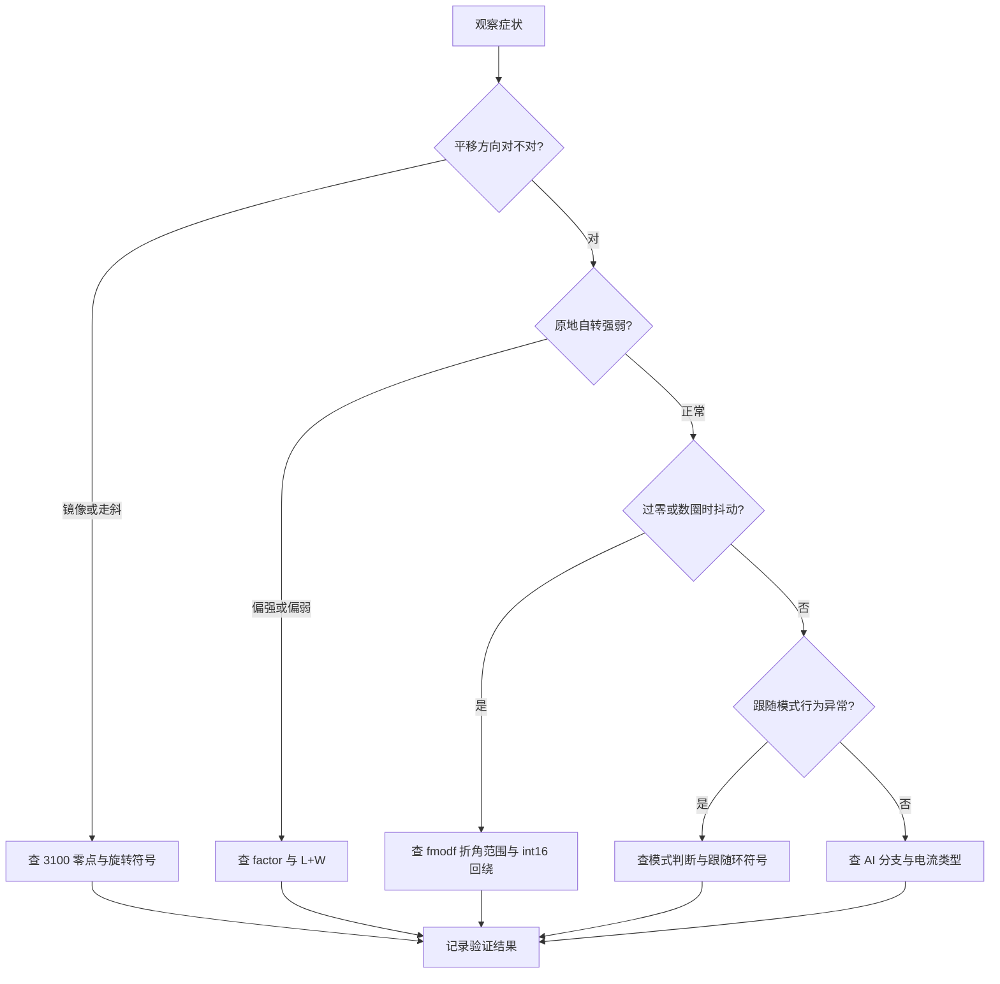
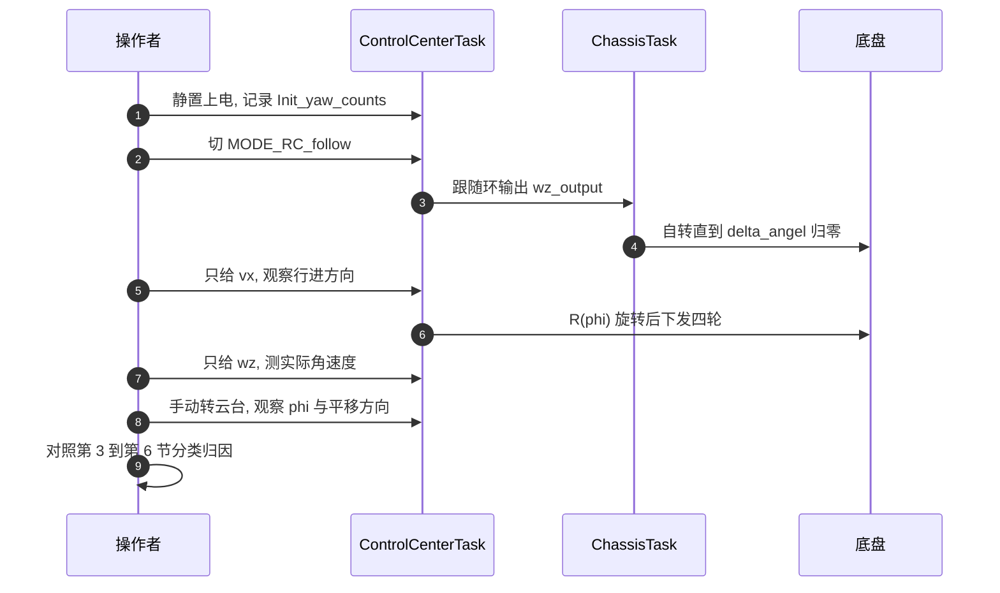

> 本单元前面几页里分散的缺陷收进一张排查表：从可观察的症状出发，定位到角度零点、旋转方向、几何系数、单位与离散化四类原因，再给出源码位置与验证动作。行号以底盘板固件为准。

运动学链路上的错误分成四类，每类的症状和检查手段不同。排查的基本原则是先确认数据来源，再看数值关系，最后才调增益。增益能掩盖量纲错误，先调增益会把问题藏得更深。

## 1. 四类故障与检查对象

| 类别 | 典型症状 | 检查对象 | 相关页 |
| --- | --- | --- | --- |
| 角度零点 | 直线走斜、平移方向随上电姿态变化 | 3100 与 `Init_yaw_counts` | 02、03 |
| 旋转方向 | 平移方向镜像、跟随时越跟越偏 | 编码器计数方向与 $R$ 的符号 | 02、03 |
| 几何与单位 | 自转偏强、误差量纲对不上、换轮子后要重调 | `factor`、轮径与减速比 | 04 |
| 离散化 | 过零抖动、数圈后跳变、控制周期与 `dt` 不符 | `fmodf`、`dt`、`int16_t` 回绕 | 03、04 |

四类问题的检查对象完全不同：前两类看角度与符号，第三类看系数与量纲，第四类看类型与周期。判据也不一样，因此一次只查一类，能避免把两处错误互相抵消。

## 2. 症状到原因的排查分叉



分叉的顺序按症状的可见程度排列：平移方向最容易观察，自转强弱需要一点经验，过零抖动要构造特定工况，模式差异要来回切换开关。按这个顺序走，多数问题能在前两步定位。

## 3. 角度零点的验证方法

变换角化简后是 $\varphi=(3100-N_{cur})k$（见 02 单元第 6 节），其中 3100 是硬编码参考点。如果实际机械零点不是 3100，$\varphi$ 会带一个固定偏置，表现为所有平移方向整体偏一个角，且这个角随上电姿态（也就是 $N_{init}$）变化。

验证方法：静止上电，记录 `Init_yaw_counts` 与 `Init_yaw_angle`，然后手动把云台转到与车头对齐的位置，读 `yaw_motor_5.total_angle`。两者相差多少，3100 就偏多少。$\varphi_0=-\theta_{init}=(3100-N_{init})k$ 给出上电时的偏置量，可以直接用来核对。

核对时要注意方向：$\varphi_0$ 是上电姿态相对 3100 的角度，不是相对车头的角度。若云台与车头本来就不对齐，这个量里同时包含装配偏差与零点偏差，要分开测量。

## 4. 旋转方向的验证方法

$\varphi$ 随计数增大而减小，代码按 $R(+\varphi)$ 施加旋转。最终转向由编码器计数方向与电机安装方向共同决定，源码里没有这两条约定。验证方法：只给一个 $v_x$ 指令，把摇杆推向前，看底盘是否朝云台朝向走。若走反，先排除摇杆通道符号，再检查 $\varphi$ 是否应取负。不要把增益符号和旋转符号一起改，否则两个错误互相抵消，换模式又会暴露。

验证要在跟随模式下做，且先让跟随环收敛。在 RC 模式下平移基准是车体系，看不到云台朝向的影响；跟随环未收敛时 $\varphi$ 还在变化，方向判据不稳定。

## 5. 单位混用的表现与验证

速度环的反馈 `rotor_speed` 是 CAN 原始整数值（rpm），逆解三条目标量是命令单位的线性组合，两者之间缺 $\frac{30i}{\pi r}$ 的换算（见 04 单元第 3 节）。`factor=1` 又让自转项失去长度因子。表现是闭环能收敛但参数没有物理解释：改轮径、改减速比、改底盘尺寸都要重新试凑，且换一块底盘后表现不同。验证方法：固定指令，测四轮实际转速，与 `rotor_speed` 反馈对齐，反推缺失系数。

反推得到的系数应当接近 $\frac{30i}{\pi r}$ 的数量级。若差得很远，说明指令通道的缩放增益也在参与吸收系数，要先把增益与换算分开再判。

## 6. 三处离散化问题

三处离散化问题集中在跟随环与累计角度上：

| 问题 | 表达式 | 后果 |
| --- | --- | --- |
| `fmodf` 折到 $2\pi$ | `fmodf(delta_angel, 2pi)` | $\pm2\pi$ 附近误差跳变约 $2\pi$ |
| `dt` 与实际周期不符 | `dt=0.01`，`osDelay(1)` | 轮速环积分快约 10 倍、微分小约 10 倍 |
| `total_angle` 为 `int16_t` | 赋 `int32` 表达式 | 约 $\pm4$ 圈后回绕，$\varphi$ 跳变 |

`fmodf` 的修正是把折角范围改成 $(-\pi,\pi]$（见 03 单元第 3 节）。`dt` 的修正归 `06-PID 控制`。`int16_t` 的修正是把字段类型改成 `int32_t`，同时确认云台 yaw 的实际行程是否可能超过四圈。

三处的可复现难度不同：`dt` 的影响在阶跃响应里就能看出来，`fmodf` 需要转到接近一圈，`int16_t` 回绕需要累计计数超过 $\pm32768$。按可复现难度安排验证顺序。

## 7. 按顺序执行的调试步骤



六步里前两步建立基准，中间三步分别激励平移、自转与跟随，最后一步归因。每一步都记录观测量，避免同一现象被重复归因到不同类别。

## 8. 已确认的缺陷清单

| # | 缺陷 | 代码位置 | 影响 |
| --- | --- | --- | --- |
| 1 | `factor=1`，几何系数缺失 | `ControlCenterTask.cpp` | 自转项量纲与 $v_x$ 同级 |
| 2 | 注释公式与生效代码符号、系数都不同 | — | 按注释改会得到另一套行为 |
| 3 | AI 分支不是麦轮逆解 | — | vx 只分给 1、3 轮，vy 只分给 2、4 轮 |
| 4 | 3100 魔数 | — | 零点偏移，待现场确认 |
| 5 | `dt=0.01` 与 `osDelay(1)` 不符 | `ChassisTask.cpp` | 轮速环积分与微分项相差 10 倍 |
| 6 | 斜坡只限制减速 | `ChassisTask.cpp` | 加速直接跳到目标 |
| 7 | `gimbal_yaw_radians` 算了不用 | `ControlCenterTask.cpp` | 数据源混淆 |
| 8 | `fmodf` 折到 $2\pi$ | `ChassisTask.cpp` | 过零抖动 |
| 9 | `extern uint16_t` 与 `int16_t` 定义不一致 | `ControlCenterTask.cpp` 对 `ChassisTask.cpp` | 类型不匹配，负电流处理依赖实现 |
| 10 | `total_angle` 为 `int16_t` | `bsp_can.h`、`bsp_can.cpp` | 约 $\pm4$ 圈回绕 |
| 11 | 0x301 缺 `break` | `bsp_can.cpp` | 遥控数据被按 0x302 再解析一遍 |
| 12 | 目标量与 `rotor_speed` 不同单位 | `ChassisTask.cpp` | 误差无物理量纲 |

第 9 条的声明类型与定义类型不一致是确定的代码缺陷；负电流是否会保持符号，取决于无符号到有符号转换的实现定义行为。在 GCC/ARM 上该转换按模回绕，负值可能碰巧正确，换工具链或开启链接期优化后不保证，属按工具链推导，待实测。第 3 条按代码可观察行为记为缺陷，是否为占位实现待确认。

清单里 12 条按“是否影响运动学”排序，第 5、6、9 条严格说不属于运动学，但它们的现象会与运动学问题混在一起，因此一并列出以便区分。

## 9. AI 分支与前八条缺陷的关系

`ControlCenterTask.cpp` 在 `MODE_AI` 下用的是另一组式子：

```cpp
Target_chassis_speed_motor_1 = -control_target.chassis_vx + factor * control_target.chassis_wz;  // 右前轮
Target_chassis_speed_motor_2 = -control_target.chassis_vy + factor * control_target.chassis_wz;  // 左前轮
Target_chassis_speed_motor_3 =  control_target.chassis_vx + factor * control_target.chassis_wz;  // 左后轮
Target_chassis_speed_motor_4 =  control_target.chassis_vy + factor * control_target.chassis_wz;  // 右后轮
```

它把 $v_x$ 只分给 1、3 轮，$v_y$ 只分给 2、4 轮，没有横向合成，也不走  的旋转。按结构它不是麦轮逆解。上位机速度指令的完整链路归 `03-底盘指令映射` 单元，只标注它与前八条缺陷的关系：切换模式后行为差异可能来自这里，而不是来自几何参数。

判断某次异常来自哪一支的办法是看当前模式：`s1`=3 时走 AI 分支，前八条里的 1、2、8 条都作用在另一支上。先确认模式，再决定查哪一组公式。

## 10. 排查时先用到的观测点

| 观测量 | 位置 | 用途 |
| --- | --- | --- |
| `Init_yaw_counts`、`Init_yaw_angle` | `ControlCenterTask.cpp` | 核对零点 |
| `delta_angel` | `ControlCenterTask.cpp` | 核对跟随误差与旋转角 |
| `wz_output` | `ChassisTask.cpp` | 核对跟随环是否在工作 |
| 四个 `Target_chassis_speed_motor_N` | `ControlCenterTask.cpp` | 核对逆解输出 |
| 四个 `chassis_motor_N.rotor_speed` | `bsp_can.cpp` | 核对反馈 |
| `gimbal_yaw_angle` | `bsp_can.cpp` | 确认 0x302 数据的实际值 |

观测点按“输入—中间量—输出”排列：先看角度量，再看跟随输出，最后看四轮目标与反馈。这样任何一处不更新都能立刻定位在哪一段。

## 11. 易错点

| # | 易错点 | 现象 | 对应位置 |
| --- | --- | --- | --- |
| 1 | 先调增益再查量纲 | 参数越调越偏，换硬件失效 | `ChassisTask.cpp` |
| 2 | 把注释公式当成生效公式 | 改动后行为与预期不符 | `ControlCenterTask.cpp` |
| 3 | 认为 3100 是理论零点 | 平移方向带上电偏置 | — |
| 4 | 旋转符号与摇杆符号一起改 | 两个错误抵消，换模式复现 | — |
| 5 | 把 `fmodf` 当连续 | $\pm2\pi$ 处抖一下 | `ChassisTask.cpp` |
| 6 | 用 `dt` 标称值解释积分响应 | 积分项相差 10 倍 | `ChassisTask.cpp` |
| 7 | 追 0x302 的云台角度 | 改它不影响变换 | `ControlCenterTask.cpp` |
| 8 | 把 AI 分支当跟随分支 | 模式切换后行为突变 | `ControlCenterTask.cpp` |
| 9 | 忽略 `int16_t` 回绕 | 数圈后角度与方向跳变 | `bsp_can.h` |
| 10 | 混用两条角度来源 | 云台 IMU 角度与电机计数对不上 | `bsp_can.cpp` |

## 12. 小结

### 核心概念

- 角度零点、旋转方向、几何与单位、离散化四类问题各有不同的症状与检查点。
- 3100 决定变换角零点，实际机械含义待现场确认。
- 旋转最终方向由编码器计数方向与电机安装方向共同决定，需在车上验证。
- `factor=1` 与缺失的轮径、减速比换算都让参数失去物理量纲。
- `fmodf(delta, 2pi)` 在 $\pm2\pi$ 不连续，应折到 $(-\pi,\pi]$。
- `dt`、`total_angle` 类型与电流类型三处不一致都是已确认的代码缺陷。

### 设计权衡

| 决策 | 选择 | 收益 | 代价 |
| --- | --- | --- | --- |
| 参数处理 | 用增益吸收几何与单位系数 | 不动源码即可跑 | 参数不可解释，硬件相关 |
| 折角范围 | 保留 $2\pi$ | 改动最小 | 过零抖动 |
| 角度存储 | `int16_t` | 省 2 字节 | 数圈回绕 |
| 模式实现 | AI 分支单独一套式子 | 快速接入上位机 | 与逆解不一致，需分别验证 |

## 13. 练习

### 基础题

1. 按第 3 节的方法，写出从 `Init_yaw_counts` 与 `Init_yaw_angle` 反推 3100 偏移量的式子。
2. 列举只给 $v_x$ 时，若平移方向镜像，可能的三个原因，并按排查顺序排列。
3. 计算 `fmodf` 折到 $2\pi$ 时 $\Delta=2\pi^{-}$ 与 $\Delta=2\pi^{+}$ 的误差跳变量。

### 挑战题

4. 设计一个上电自检流程，自动判断旋转符号与 3100 零点是否正确，列出所需传感器与判据。
5. 把 `total_angle` 改成 `int32_t` 后，检查从写入到使用的所有引用点，列出需要同步修改的类型声明。
6. 给出把 `dt`、轮径、减速比、$L+W$ 一起标定的实验方案，说明每个参数用哪种激励信号测量最灵敏。

## 附：本页引用的固件路径

| 路径 | 用途 |
| --- | --- |
| `/home/wyx/rm/2026SentriOmeniChassis/2026OmniSentryChassis/Task/Src/ControlCenterTask.cpp` | 角度变量、零点、逆解与 AI 分支、电流声明 |
| `/home/wyx/rm/2026SentriOmeniChassis/2026OmniSentryChassis/Task/Src/ChassisTask.cpp` | `dt`、斜坡、速度环与跟随环、电流定义 |
| `/home/wyx/rm/2026SentriOmeniChassis/2026OmniSentryChassis/BSP/Inc/bsp_can.h` | `total_angle` 与反馈字段类型 |
| `/home/wyx/rm/2026SentriOmeniChassis/2026OmniSentryChassis/BSP/Src/bsp_can.cpp` | 累计角度、0x205 与 0x301/0x302 解析 |
