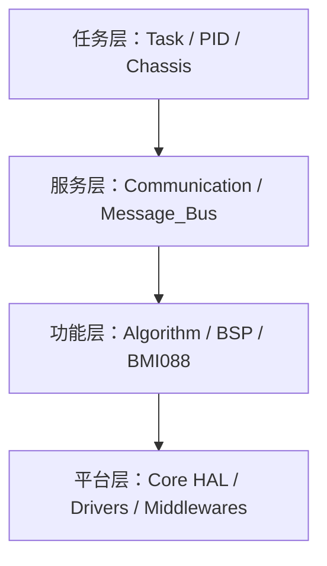
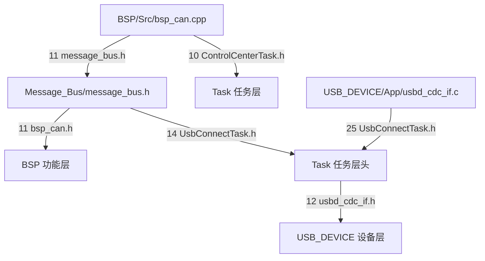

# 分层的目标与依赖方向

底盘板（`/home/wyx/rm/2026SentriOmeniChassis/2026OmniSentryChassis`）与云台板（`/home/wyx/rm/2026SentriOmeniGimbal/2026OmniSentryGimbal`）顶层并列着 BSP、Algorithm、Communication、Task、Message_Bus、Core 等目录。两块板的目录名几乎一样，代码是否真的分层却要靠头文件包含方向来判定。目录可以随手新建，包含边不会跟着目录名走：把一个任务层的头文件放进 BSP 目录，或者让数据层的头文件包含任务层的头，目录结构看起来没有任何变化，依赖图已经不再单向。

> 未加板名前缀的路径默认指底盘板；两板差异单独标注。

## 1. 为什么要分层

分层把抽象层级固化成编译期约束：上层可以包含下层，下层不得包含上层。它解决的是改动扩散问题，某个电机协议变化时，只应改动承载该协议的层，其余层的源文件不应跟着重新编译。

目录名只说明作者打算怎么分，头文件包含边才说明编译器实际看到什么。反例见第 8 节的反向边清单：数据层包含任务头文件、驱动包含 PID 头文件，都是下层依赖上层；这类边存在时，改动会沿环扩散回起点。

## 2. 源码入口

| 文件 | 作用 |
| --- | --- |
| `Message_Bus/message_bus.h` | 数据层对外头，第 11 至 14 行包含四个头文件 |
| `Task/Inc/UsbConnectTask.h` | 任务层头，第 12 行包含 USB 设备层头，第 64 行附近定义 USB 协议结构体 |
| `BSP/Src/bsp_can.cpp` | BSP 实现，第 10 至 11 行两条反向包含，第 22 行定义全局量 |
| `USB_DEVICE/App/usbd_cdc_if.c` | USB 设备层源文件，第 25 行用相对路径包含任务层头 |
| `BMI088/Inc/ImuTempControl.h` | 温控驱动头，第 8 行包含 PID 头 |
| `Communication/Src/usart_decode.cpp` | 串口解帧，第 10 行包含数据总线 |
| `Task/Src/ControlCenterTask.cpp` | 任务实现，第 30 行用 extern 取 BSP 全局量 |
| `CMakeLists.txt` | include 目录配置与源文件清单 |

## 3. 判定分层用的三条 include 判据

三种常见的代码组织方式在依赖约束上差别很大：

| 组织方式 | 划分依据 | 依赖约束 | 失控时的表现 |
| --- | --- | --- | --- |
| 平铺目录 | 功能名词 | 无 | 头文件互引，改一个驱动触发全量重编 |
| 分层 | 抽象层级 | 上层单向包含下层 | 下层头文件里出现上层 include |
| 分层加接口 | 抽象层级与依赖倒置 | 下层依赖抽象接口 | 需要回调或虚函数，调用链变长 |

判断一份代码是否满足分层，用三条独立判据。三条都过才算闭合：

| 判据 | 检查动作 | 通过条件 |
| --- | --- | --- |
| 单向 | 列出下层目录每个头文件包含的工程内头文件 | 不含任何上层目录的头文件 |
| 可替换 | 把某层实现换成桩 | 上层源文件不需要修改 |
| 可独立编译 | 单独编译某层源文件 | 只需要该层及下层的头文件与 include 目录 |

- 单向不过：下层目录的头文件里出现了上层 include。
- 可替换不过：换成桩实现后，上层源文件需要改动。
- 可独立编译不过：单独编译时缺少 include 路径，目录一挪就断。

第一条只约束头文件文本，第二条约束层间传递的类型，第三条约束编译命令里的 include 搜索路径。只满足第一条而第二条不过，说明层间还传来传去具体类型，这种代码仍会随实现变化而重编；只满足第一、二条而第三条不过，说明包含关系靠的是全局 include 目录兜底，目录一挪就断。后面的核对以第一条为主线，后两条在遇到具体文件时补充判断。

三条判据互不蕴含，用一个例子能看清边界。假设功能层头文件里不再包含任务层头，第一条通过；但它的结构体成员类型写成了任务层定义的 `ControlTarget`，上层构造参数时要先拿到任务层头，第二条不过。再假设头文件与类型都干净，源文件却用 `../../Task/Inc/...` 这种相对路径取上层声明，第一条的检查范围只覆盖本目录内的头文件，第三条在完整编译时才失败。把三条分开执行，越界点才不会被第一条的表面通过掩盖。

## 4. 四层的职责边界

按本工程的命名，四层从高到低的任务边界如下：

| 层 | 主要输入 | 主要输出 | 允许依赖 |
| --- | --- | --- | --- |
| 任务层 | 服务层解出的数据、下层反馈 | 电机指令、共享控制目标 | 服务层、功能层、平台层 |
| 服务层 | 原始字节流 | 结构化帧与共享数据 | 功能层、平台层 |
| 功能层 | 寄存器与原始量 | 电机反馈、算法结果 | 平台层 |
| 平台层 | HAL 句柄与中断 | 外设寄存器访问 | HAL 与 CMSIS |

这张表只给出允许的边，不等于实现里的边。职责边界要看输入输出落在谁身上：服务电机与外设寄存器的是功能层，服务协议帧与共享数据的是服务层，服务任务流程与调度节奏的是任务层，被 CubeMX 生成的是平台层。同一目录里如果有源文件既读寄存器又做状态判断，它同时踩了两层的职责，判定时按职责而不是按目录归属。

四层的顺序不是任意的：把下层删掉时上层必须无法编译，这才说明依赖是真实的。反过来，如果某个下层文件只被同层引用，它可能只是命名放错了位置，从依赖图上看不出它属于哪一层。

## 5. 把包含关系写成有向图

把每个目录看作顶点，若 A 的文件包含 B 的头文件，或 A 引用了 B 定义的符号，就连一条有向边 A 到 B，方向指向被依赖方。分层成立等价于这张图无环，并且存在一个层级函数，使每条边都从高层指向低层。图中有环时不存在这样的函数，任何一处改动都会沿环传播回起点。

把包含关系写成邻接矩阵，行是依赖方、列是被依赖方，顺序为任务、服务、功能、平台：

$$A=\begin{bmatrix}0&1&1&1\\0&0&1&1\\0&0&0&1\\0&0&0&0\end{bmatrix}$$

矩阵严格上三角，说明该图无环。任何一条反向包含都会在矩阵下三角位置写入 1：服务层的 Message_Bus 包含任务层的头文件，就在第 2 行第 1 列填入 1，上三角结构被破坏。矩阵的这一性质可以用一个简单办法验证：把所有行按层级从上到下排列，再检查每一行的 1 是否都出现在对角线右侧。

矩阵里的一项对应一条包含边，但包含边不等于函数调用链。上层包含下层头文件后，可以沿调用链一路向下；下层若反过来包含上层头，就形成模块环，编译顺序与初始化顺序都被这个环绑住。

判定成环时要按包含关系的传递闭包看，不能只看直接边。`BSP/Src/bsp_can.cpp:11` 直接指向的是同单元内的数据层头文件，看上去只在服务层内部打转；这个头文件在第 14 行又包含任务层头，传递两步之后功能层仍然指向了任务层。逐文件核对时，只有把每条包含边展开到最底层的工程头，才能发现这类两步反向边。传递闭包一旦含环，层级函数就不存在，后续任何“把 A 目录当上层”的说法都失去依据。

## 6. 底盘板各层承载的文件

底盘板各层承载的目录与代表头文件如下，行号为实际核对结果。

| 层 | 目录 | 代表文件与行号 | 该层职责 |
| --- | --- | --- | --- |
| 任务层 | `Task/`、`PID/`、`Chassis/` | `Task/TaskBase.h:11`、`Task/Inc/ControlCenterTask.h:12` | FreeRTOS 任务循环与串级控制 |
| 服务层 | `Communication/`、`Message_Bus/` | `Communication/Inc/dbus.h:38`、`Message_Bus/message_bus.h:16` | 协议解帧与共享数据 |
| 功能层 | `Algorithm/`、`BSP/`、`BMI088/` | `BSP/Inc/bsp_can.h:60` | 纯算法与板级驱动 |
| 平台层 | `Core/`、`Drivers/`、`Middlewares/` | `Core/Inc/main.h`、`Core/Src/can.c` | CubeMX 生成物与 HAL |

按 include 边核对后，下面几条边方向与上表相反：

- `Message_Bus/message_bus.h:14` 包含 `UsbConnectTask.h`，属任务层头文件；第 11 行 `bsp_can.h` 属功能层，第 12 至 13 行 `dbus.h`、`referee_decode.h` 属服务层。
- `BSP/Src/bsp_can.cpp:10` 包含 `ControlCenterTask.h`，功能层直接指向任务层；该 include 在文件内没有被使用。
- `BSP/Src/bsp_can.cpp:11` 包含 `message_bus.h`，经其第 14 行又间接拉进任务层。
- `USB_DEVICE/App/usbd_cdc_if.c:25` 以相对路径 `../../Task/Inc/UsbConnectTask.h` 包含任务层头文件。
- `Task/Inc/UsbConnectTask.h:12` 包含 `usbd_cdc_if.h`，与上一条互为反向边，任务层与 USB 设备层构成两顶点环。
- `BMI088/Inc/ImuTempControl.h:8` 包含 `temp_pid.h`，温控驱动反过来依赖 PID 控制层。
- `Communication/Src/usart_decode.cpp:10` 包含 `message_bus.h`，服务层内部也走到第 14 行这条反向边。

把这几条边单独画出来，环的形状就很清楚：

图中从 `message_bus.h` 出发经 `UsbConnectTask.h` 到 `usbd_cdc_if.h` 的三条边构成一个环，`BSP/Src/bsp_can.cpp:11` 再把这个环接进功能层。只要有源文件包含 `message_bus.h`，它就必须同时能找到功能层、服务层、任务层与 USB 设备层的头文件，这就是反向包含的编译期代价。

## 7. 云台板与底盘板的分歧点

云台板的 include 图与底盘板大体一致，差异集中在 `Message_Bus/message_bus.h`：云台板这个头只包含 `bsp_can.h`、`dbus.h` 两个头文件，没有把任务层头文件拉进数据层。云台板另有 `Communication/Inc/usb_protocol.h`、`usb_decode.h`，USB 协议解析归属服务层；底盘板缺这两个文件，USB 协议结构体直接定义在 `Task/Inc/UsbConnectTask.h:64` 附近。

| 对比项 | 底盘板 | 云台板 |
| --- | --- | --- |
| `message_bus.h` 包含的工程头数量 | 4 | 2 |
| 是否包含任务层头 | 是，第 14 行 | 否 |
| USB 协议归属 | 任务层 `UsbConnectTask.h` | 服务层 `usb_protocol.h` |
| 数据层对外依赖 | 功能层、服务层、任务层、USB 设备层 | 功能层、服务层 |

两板的目录名相同，依赖图不同。核对分层时按板名分开记录，不能用一板的结论代替另一板。

## 8. 反向边清单

| 反向边 | 现象 | 对应位置 |
| --- | --- | --- |
| 用目录名当分层结论 | 认为建了 BSP 目录就是分层，未查 include 方向 | `BSP/Src/bsp_can.cpp:10` |
| 数据层包含任务头文件 | 任何包含 message_bus.h 的源文件都要能看到 Task 与 USB 头文件 | `Message_Bus/message_bus.h:11-14` |
| 未使用的 include 长期保留 | 反向边存在但编译不报错，审查时被当成历史遗留 | `BSP/Src/bsp_can.cpp:10` |
| 相对路径跨层包含 | `../../Task/Inc/...` 绕过统一 include 目录，目录移动即断 | `USB_DEVICE/App/usbd_cdc_if.c:25` |
| 驱动依赖控制层 | 温控驱动包含 PID 头文件，替换驱动器要连控制层一起改 | `BMI088/Inc/ImuTempControl.h:8` |
| 只看头文件忽略符号引用 | 头文件方向正确，源文件仍用 extern 取另一层的全局量 | `Task/Src/ControlCenterTask.cpp:30` |
| 服务层复用数据总线 | 服务层解帧文件包含数据总线，反向边扩散到更多层 | `Communication/Src/usart_decode.cpp:10` |

最后一行与前面几行性质不同，它属于符号级的反向依赖。`Task/Src/ControlCenterTask.cpp:30` 的 `extern float gimbal_yaw_angle;` 对应 `BSP/Src/bsp_can.cpp:22` 的定义，头文件里看不到这条边，只有链接符号能暴露它。头文件包含图只能覆盖第一类越界，符号引用要靠链接结果或全局量搜索补上。

## 9. 清理反向边的操作顺序

核对出一条反向边之后，处理的顺序会直接影响改动范围。可按下面的步骤推进：

1. 先确定这条边是否被实际使用。`BSP/Src/bsp_can.cpp:10` 这类未使用的 include 可以直接删除，编译不报错即证明它没有被引用。
2. 再判断被包含的头提供了什么。`Message_Bus/message_bus.h:14` 通过 `UsbConnectTask.h` 间接引入 `TaskBase.h`、`usbd_cdc_if.h`、`CRC16.h`，删除这一行前要确认数据层没有用到这三者提供的类型。
3. 类型确实要被下层使用时，把类型下移到服务层或功能层的公共头，而不是保留下层对上层头的包含。
4. 符号级反向边单独处理。`Task/Src/ControlCenterTask.cpp:30` 用 extern 取功能层全局量，删除 include 不会消除这条依赖，要先把全局量搬到它该在的层。
5. 每改一步重新编译并核对 include 清单，避免用新的反向边替换旧反向边。

顺序反过来做，容易先删掉被间接依赖的头文件，再花时间从编译错误里反推到底谁在用。

## 10. 小结

### 核心概念

- 分层的硬判据是编译期包含方向单向，目录名不构成证据。
- 依赖图无环等价于存在层级函数，严格上三角邻接矩阵是它的代数表达。
- 未使用的反向 include 同样破坏分层，它只是暂时不产生编译错误。
- 符号引用与头文件包含是两类边，extern 全局量会绕过头文件方向检查。
- 两板的差异集中在 Message_Bus 与 USB 协议的归属，判定时按板名分开核对。

### 设计权衡

| 决策 | 选择 | 收益 | 代价 |
| --- | --- | --- | --- |
| 是否允许下层包含上层 | 本工程出现此类边 | 类型直接可见，改动快 | 依赖图成环，替换与单测受限 |
| 数据层放哪些头文件 | 底盘板放了任务层头文件 | 结构体与协议类型集中在同一处 | 引入任务层与 USB 设备层依赖 |
| 是否用相对路径跨层 | USB 设备层使用相对路径 | 不依赖 include 目录配置 | 目录移动即断裂 |

## 11. 练习

### 基础题

1. 打开 `Message_Bus/message_bus.h`，写出它直接与间接包含的全部工程内头文件，并标注每个所属层。
2. 对 `Task/Inc/UsbConnectTask.h` 做一次单向检查，列出它包含的非任务层头文件及对应行号。

### 挑战题

1. 把 `BSP/Src/bsp_can.cpp:10` 的 `ControlCenterTask.h` 删除后重新编译，记录是否出现未声明符号。据结果写出从功能层清理反向 include 的顺序。

## 附：本页引用的固件路径

| 路径 | 用途 |
| --- | --- |
| `/home/wyx/rm/2026SentriOmeniChassis/2026OmniSentryChassis` | 底盘板根目录 |
| `/home/wyx/rm/2026SentriOmeniGimbal/2026OmniSentryGimbal` | 云台板根目录 |
| `Message_Bus/message_bus.h` | 共享数据层头文件，第 11 至 14 行反向包含 |
| `BSP/Src/bsp_can.cpp` | BSP 实现，第 10 至 11 行反向包含，第 22 行全局量定义 |
| `USB_DEVICE/App/usbd_cdc_if.c` | USB 设备应用，第 25 行相对路径包含任务头 |
| `Task/Inc/UsbConnectTask.h` | 任务层头文件，第 12 行包含设备层头 |
| `BMI088/Inc/ImuTempControl.h` | 温控驱动，第 8 行包含 PID 头 |
| `Task/Src/ControlCenterTask.cpp` | 任务实现，第 30 行 extern 取 BSP 全局量 |
