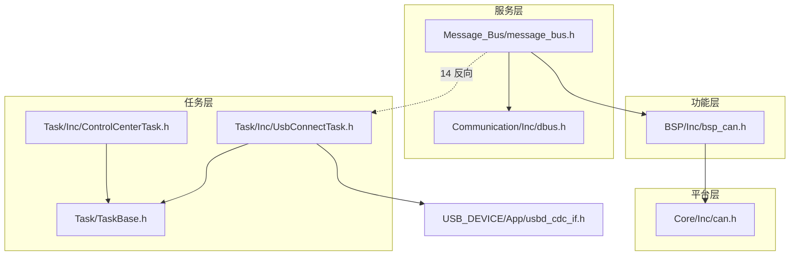
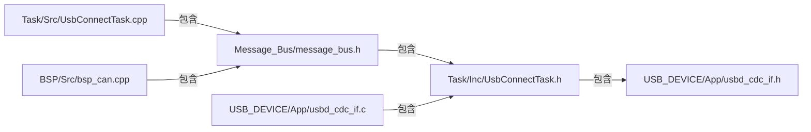
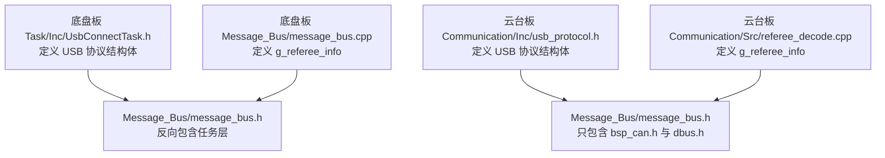

# 各层落到哪些文件

单向包含的判定规则要落到文件上才有用：每一层由哪些头文件对外、哪些源文件实现、边界在哪个文件上被越过。目录清点只能说明作者打算怎么分，文件清点才能说明编译器实际编译了什么。两块的差别也大多体现在这一层，底盘板的 `Message_Bus/message_bus.h` 反向包含任务层头文件，是两板依赖图不一样的主要来源。

层的接口与目录的关系先交代清楚，然后按文件清点底盘板各层，逐行展开 `message_bus.h` 的四行包含，最后追踪模块环的闭合路径。读完可以回答：某个文件属于哪一层、包含 `message_bus.h` 的源文件实际会编译进哪些层的内容、清点时哪些文件容易被当成已完成的层。

> 未加板名前缀的路径默认指底盘板；两板差异单独标注。

## 1. 层由对外头文件集合定义

层由对外可见的一组头文件定义，目录只是它的存放位置。同层的源文件可以互相包含，跨层只允许上层包含下层的对外头文件。一个目录里既有对外头又有实现头时，只有前者算这一层的接口，后者仍属实现细节。

| 边界类型 | 允许 | 禁止 | 越界后果 |
| --- | --- | --- | --- |
| 同层内部 | 源文件包含同层私有头 | 把内部头当接口暴露给上层 | 上层编译依赖实现细节 |
| 跨层下行 | 上层包含下层公开头 | 重复定义下层已有类型 | 类型不一致，链接冲突 |
| 跨层上行 | 无 | 下层包含上层头 | 模块环，单测无法独立 |
| 跨层符号 | 上层调用下层函数 | 下层 extern 上层全局量 | 依赖方向与头文件不符 |

判断某个文件属哪一层，看它对外的类型声明服务谁：服务电机与外设寄存器的是功能层，服务协议帧与服务数据的是服务层，服务任务流程的是任务层。

文件级的包含比目录级的组织更容易失控，原因是预处理会展开整条包含链。设头文件 H(A) 包含 H(B)，那么任何包含 H(A) 的源文件都要先完整解析 H(B) 及其全部依赖。数据层多写一行任务层头文件，所有消费数据层的源文件都会被迫看到任务层与 USB 设备层的头；目录上只多了一行，编译依赖的规模按消费者数量放大。

对外头与实现头的区分没有语法标记，靠的是使用方式。一个头文件如果只被同层源文件包含，它属于实现头；被上层包含过的，它就是这一层的对外头。判断时以实际的包含方为准，而不是以文件名的前缀或所在子目录为准。

## 2. 清点一层的接口，而不是数文件

判断一层是否成立，不要数目录里有多少文件，而要问：这层对外暴露哪些头文件、谁包含它们、它们声明了哪些类型。空文件与只有注释的文件照样会让清单看起来完整——本工程的 `Chassis/Inc/Motor.h` 就是这种空壳。下表是本工程的清点结果，作为例证；换项目时列名不变、内容替换。

表的读法：先看「对外接口」一列判断这层声明了什么，再看代表文件确认实现落在哪里；头/源计数只作规模参考。

| 层 | 目录 | 头/源 | 代表文件 | 对外接口 |
| --- | --- | --- | --- | --- |
| 任务层 | `Task/` | 7/5 | `Task/Inc/*.h`、`Task/TaskBase.h` | `Start*Task_Init()` |
| 任务层 | `PID/` | 5/4 | `PID/PidBase.h` | PID 类 |
| 任务层 | `Chassis/` | 1/1 | `Chassis/Inc/Motor.h` | 空文件，未定义接口 |
| 服务层 | `Communication/` | 6/6 | `Communication/Inc/dbus.h`、`usart_decode.h` | 解帧函数与全局 `dbus` |
| 服务层 | `Message_Bus/` | 1/1 | `Message_Bus/message_bus.h` | 三个结构体与全局实例 |
| 功能层 | `BSP/` | 5/3 | `BSP/Inc/bsp_can.h` | `bsp_can` 类与 C 接口 |
| 功能层 | `Algorithm/` | 3/3 | `Algorithm/Inc/CRC16.h`、`CRC8.h`、`MahonyAHRS.h` | 纯函数 |
| 功能层 | `BMI088/` | 3/2 | `BMI088/Inc/BMI088.h`、`ImuTempControl.h` | IMU 驱动 |
| 平台层 | `Core/` | 12/16 | `Core/Inc/main.h`、`Core/Src/freertos.c` | CubeMX 生成 |
| 未归类 | `referee/` | 1/1 | `referee/Inc/RefereeReading.h` | 热量与弹速计数 |

表里有两个目录需要单独说明。`Chassis/Inc/Motor.h` 是 0 行空文件，`Chassis/Src/Motor.cpp` 只有 3 行注释，这一层实际没有接口，清点时按 1/1 计会让人以为抽象已经完成。`referee/` 目录既不在 CMake 的层命名里，也不在依赖链的下层，`Task/Src/ControlCenterTask.cpp` 直接包含它，属于职责未归位：它被任务层使用，却不属于任务层，也不属于任何已定义的下层。

清点方法本身也影响结论。头/源计数按目录内文件数统计，空文件与只有注释的文件同样计入；如果要判断某层是否可用，还要看这些文件是否声明了对外类型，只数文件数量不够。

目录归属与编译归属是两回事。编译时决定可见范围的是 include 目录列表与包含边，某个目录有没有被写进列表，要单独查构建脚本；反过来，即使目录被写进列表，也不表示这一层成立。清点时把这两件事分开记录：一层先记目录里有什么，再记哪些文件被别的层包含。

## 3. 一行反向包含的放大效应（逐行展开）

一条 include 的影响范围不按目录数算，而按消费者数量算：数据层多写一行上层头文件，所有包含数据层的源文件都要跟着看到上层的整条依赖链。下面用本工程的 `message_bus.h` 逐行展开这个过程。

`Message_Bus/message_bus.h` 的四行反向包含按顺序展开如下：

- `bsp_can.h`：功能层头，引入 `can.h` 与电机反馈结构体。
- `dbus.h`：服务层头，引入 `DBUS_t` 与全局 `dbus`。
- `referee_decode.h`：服务层头，引入 `RefereeInfo`。
- `UsbConnectTask.h`：任务层头，引入 `TaskBase.h`、`usbd_cdc_if.h`、`CRC16.h`。

包含闭包的范围可以直接数出来。任何包含 `message_bus.h` 的源文件，预处理后至少要能看到功能层的 `can.h`、服务层的 `DBUS_t` 与 `RefereeInfo`、任务层的 `TaskBase.h`、设备层的 `usbd_cdc_if.h`，以及 `CRC16.h`。`Communication/Src/usart_decode.cpp` 与 `BSP/Src/bsp_can.cpp` 都包含这个头，于是服务层与功能层的源文件也进入了任务层的可见范围。一行包含边的影响范围按消费者数量放大，不按目录数量计算。

前两行属于数据层对功能层、服务层的正常下行包含，第 13 行仍是同层的服务层头。第 14 行是唯一的反向边，它让 `message_bus.h` 成为任务层头文件的消费者。四行里只有一行越界，但这一行把 `TaskBase.h`、`usbd_cdc_if.h`、`CRC16.h` 三个头文件带进了数据层的包含闭包。

把这四条包含原样写出来（简化，只保留 include 与所属层）：

```cpp
// Message_Bus/message_bus.h
#include "bsp_can.h"          // 功能层
#include "dbus.h"             // 服务层
#include "referee_decode.h"   // 服务层
#include "UsbConnectTask.h"   // 任务层 ← 唯一的反向边
```



图中虚线边来自 `message_bus.h` 里那条反向包含，指向任务层 `UsbConnectTask.h`。实线部分是正常的下行依赖，从数据层到功能层再到平台层的 `Core/Inc/can.h`；虚线边是数据层唯一的上行依赖，模块环由它闭合。

## 4. 模块环的闭合路径

仅有 `message_bus.h` 包含 `UsbConnectTask.h` 这一点，还只算一条单向的反向边，闭环需要第二个方向。`Task/Src/UsbConnectTask.cpp` 又包含 `message_bus.h`，任务层与数据层两个模块互为依赖，环在此闭合。`BSP/Src/bsp_can.cpp` 包含 `message_bus.h` 后，功能层也进入同一个环；`USB_DEVICE/App/usbd_cdc_if.c` 用相对路径包含任务层头，设备层同样被拉进来。

环的两条边在代码里各是一行 include（示意）：

```cpp
// Message_Bus/message_bus.h
#include "UsbConnectTask.h"    // 数据层 → 任务层

// Task/Src/UsbConnectTask.cpp
#include "message_bus.h"       // 任务层 → 数据层，环在这里闭合
```



环上出现的模块有四个：数据层、任务层、功能层、USB 设备层。边数比顶点数多一条，说明环里有一段分叉：数据层同时被任务层源文件与功能层源文件包含，两条路径各自回到 `UsbConnectTask.h`。环里任何一处类型改动都可能需要重新编译其余三个，模块也没法单独做单元测试，因为测试桩要同时提供另外三个模块的头文件。判断闭环时看的是方向，不是顶点数量：两个顶点互相包含就已经成环，`message_bus.h` 与 `UsbConnectTask.h` 这一对就够。

环闭合之后，包含边的传递闭包就不再是单向的。数据层的消费者能看到任务层类型，任务层的消费者又包含数据层，两个方向同时存在，任何一侧的类型改动都会触发另一侧重新编译。要判断是否闭环，只需确认存在一条从低层回到高层的包含路径，环上有多少条边不影响结论。

## 5. 同一批类型放在哪一层，决定依赖图

类型定义放在哪一层是架构决策：谁定义类型，谁就成为别的层的编译期依赖，这与它被几个源文件引用无关。下面是本工程两板对同一批 USB 协议类型的不同放法，用来对照第 4 节的闭合路径。



| 项目 | 底盘板 | 云台板 |
| --- | --- | --- |
| message_bus.h 的 include 数 | 4，含任务层 | 2，仅 bsp_can.h、dbus.h |
| USB 协议归属 | 任务层 `Task/Inc/UsbConnectTask.h` | 服务层 `Communication/Inc/usb_protocol.h` |
| 裁判信息全局量定义 | `Message_Bus/message_bus.cpp` | `Communication/Src/referee_decode.cpp` |
| referee 顶层目录 | 有 | 无 |

云台板把 USB 协议解析放进服务层，`Task/Src/UsbConnectTask.cpp` 通过 `usb_decode.h` 使用；底盘板把同一批结构体放在任务层头文件里，因此数据层无法摆脱任务层。两板差异的根因是结构体的定义位置，不是引用它的源文件数量：底盘板只要把 `UsbConnectTask.h` 里的协议结构体搬到服务层，`message_bus.h` 那条反向包含就有机会去掉。同一批类型放的位置不同，两板数据层的对外依赖就不同，核对分层结论时必须按板名分开记录，跨板直接套用会得出错误结论。

## 6. 逐文件判断归属的操作步骤

清单里的目录归属是作者的意图，单个文件到底属于哪一层要按它提供的内容判断。下面这套步骤对每个文件执行一遍，得出的结果才和依赖图一致：

1. 列出文件对外声明的类型、函数与全局量，不含只在内部使用的 static 符号。
2. 判断这些声明服务的对象。直接读写外设寄存器或把原始量换算成物理量的，归功能层。
3. 判断是否承载协议帧。解析字节流、拼装报文的结构体与函数归服务层，即使它调用了功能层的收发接口。
4. 判断是否携带任务上下文。参数里出现任务句柄、内部调用 `osDelay` 或依赖调度周期的，归任务层。
5. 判断是否由 CubeMX 生成。生成物归平台层，手写回调放在 USER CODE 段内仍算边界上的内容。
6. 全部判断都不成立时标记为未归类，先不下结论，等依赖链补齐后再定。

按这套步骤看 `referee/Inc/RefereeReading.h`，它声明的是热量与弹速计数，服务对象是裁判系统协议，更接近服务层；它现在被 `Task/Src/ControlCenterTask.cpp` 直接包含，只说明调用点在哪里，不说明它属于任务层。归属判断与调用点判断分开做，才不会被包含关系带着走。

同一批类型在两板归入不同层时，先记下归属差异，再分别判断各自是否合规，不要用一板的结论去改另一板的文件。分层结论按板维护，跨板的类型移动属于架构改动，需要两边同时改。

## 7. 清点文件时容易看漏的六种形态

下面六种情况在任何分层代码里都会让清点结论失真：空目录被当成已完成的抽象、数据层包含上层头、同一批类型放错层、全局量归属因板而异、目录不在依赖链里、只查头文件不查源文件。表里的位置是本工程的例子，检查动作可以照搬。

| 位置 | 现象 | 对应文件 |
| --- | --- | --- |
| 把空目录当已完成的层 | Chassis 看似有 Motor 抽象，实为空 | `Chassis/Inc/Motor.h` |
| 数据层包含上层头 | 包含数据总线即拉入任务与设备依赖 | `Message_Bus/message_bus.h` 的反向包含 |
| 同批类型放错层 | 底盘板 USB 协议结构体在任务层，服务层无法复用 | `Task/Inc/UsbConnectTask.h` 的结构体定义 |
| 全局量归属因板而异 | 同一 `g_referee_info` 两板定义位置不同 | `Message_Bus/message_bus.cpp` 与云台板同名文件 |
| 目录不在依赖链中 | referee 被任务直接包含，层级无法判定 | `Task/Src/ControlCenterTask.cpp` 的包含 |
| 只改头文件不查源文件 | 头文件方向正确，源文件仍产生反向边 | `Task/Src/UsbConnectTask.cpp` 的包含 |

## 8. 小结

### 核心概念

- 层的对外接口是头文件集合，源文件内部的包含不构成对外边界。
- 模块环只看一个源文件包含上层头即可形成，与类型是否被使用无关。
- 底盘板 Message_Bus 反向包含任务层，使数据层依赖任务层与 USB 设备层。
- 两板差异体现在 USB 协议与裁判全局量的归属，云台板的划分更接近单向。
- 目录存在不等于层存在，`Chassis/` 与 `referee/` 属于未归位。

### 设计权衡

| 决策 | 选择 | 收益 | 代价 |
| --- | --- | --- | --- |
| USB 协议放任务层还是服务层 | 底盘板放任务层 | 结构体与任务同处一文件 | 服务层无法复用，数据层被牵连 |
| 裁判全局量定义位置 | 底盘板放 Message_Bus | 数据总线集中在同一处 | 与云台板不一致，跨板引用口径混用 |
| 是否保留空 Chassis 层 | 保留空文件 | 目录结构完整 | 读者误判为已抽象 |

## 9. 练习

清点结果可以直接拿去对照上一页的邻接矩阵：这里的目录清单提供顶点，包含边提供矩阵元素，两者对不上时以包含边为准。

### 基础题

1. 按上表的文件清单，独立统计底盘板 `Task/` 与 `Communication/` 的头文件、源文件数，与表中数字核对。
2. 写出 `Message_Bus/message_bus.h` 包含的全部工程头文件，逐行标注所属层。

### 挑战题

1. 设计一个改动方案，使底盘板 `message_bus.h` 不再包含任务层头文件，同时保持 `extern ControlTarget` 等实例可用。写出需要移动的类型与受影响文件。

## 附：本页引用的固件路径

| 路径 | 用途 |
| --- | --- |
| `/home/wyx/rm/2026SentriOmeniChassis/2026OmniSentryChassis` | 底盘板根目录 |
| `/home/wyx/rm/2026SentriOmeniGimbal/2026OmniSentryGimbal` | 云台板根目录 |
| `Message_Bus/message_bus.h` | 数据层头，四条包含里有一条反向依赖任务层 |
| `Task/Inc/UsbConnectTask.h` | 任务层头，包含设备层头并定义 USB 协议结构体 |
| `USB_DEVICE/App/usbd_cdc_if.c` | 设备层源文件，用相对路径包含任务层头 |
| `Communication/Inc/usb_protocol.h` | 云台板 USB 协议头 |
| `Communication/Src/referee_decode.cpp` | 云台板 g_referee_info 定义位置 |
| `referee/Inc/RefereeReading.h` | 未归类目录的对外头 |
