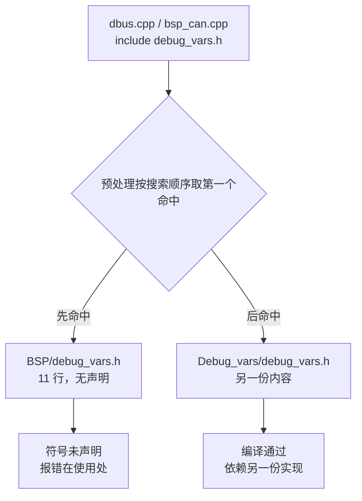
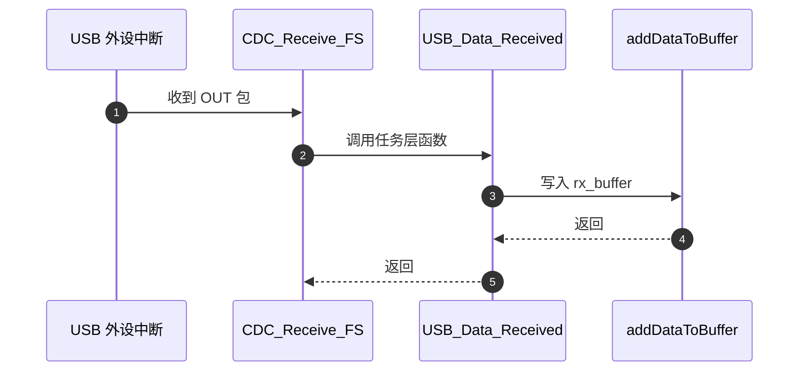
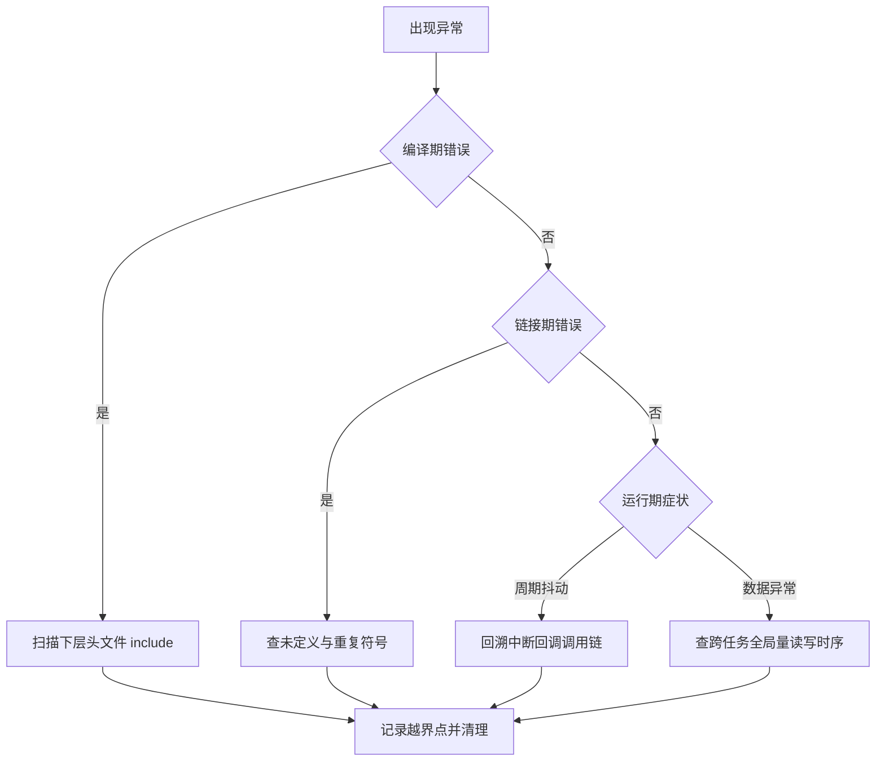

# 易错点与调试

越界之后如何定位：编译期症状、链接期症状、运行期症状分别指向哪一类问题，每一类的定位入口在哪里。案例取自底盘板与云台板固件，位置以函数与分支为锚点。

定位的顺序是先定时机，再选手段，最后记录越界点。把症状出现的时机判断错，后面的搜索方向就会完全跑偏，例如把链接期的未定义符号当成头文件丢失去查 include 路径，或者把运行期的数据异常当成编译问题去翻 CMake 配置。下面把四类越界与三种定位手段排成一张对应表，再逐类展开机制与实例。

> 未加板名前缀的路径默认指底盘板。

## 1. 越界按发生时机分成四类

越界的表现形式与它被发现的时机绑定在一起。头文件方向的问题在预处理阶段就能看到；符号级的反向依赖要等链接器解析符号才暴露；中断上下文里调用上层函数只有运行期才表现为周期抖动或数据半更新；生成物边界的问题则要等下一次 CubeMX 重新生成代码才出现。

| 类别 | 越界形式 | 主要症状 | 定位入口 |
| --- | --- | --- | --- |
| 头文件交叉包含 | 下层包含上层头，或同名头碰撞 | 编译报未声明类型，或静默使用错误头 | 扫描 include，查 include 目录顺序 |
| ISR 调用上层 | 中断回调直接调用任务层函数 | 中断服务时间变长，偶发丢帧 | 中断向量表到回调的调用链 |
| 业务逻辑写进 BSP | 驱动文件承载状态判断与控制 | 驱动无法替换，改业务需重编 BSP | 驱动源文件里的全局量与分支 |
| 生成物边界 | 在 CubeMX 生成文件的手写区外改动 | 重新生成后改动丢失 | USER CODE 标记的位置 |

调试顺序与类别无关：先确认症状出现在编译、链接还是运行期，再沿上表的定位入口缩小范围。常用的三种手段及产出如下：

| 手段 | 作用范围 | 产出 |
| --- | --- | --- |
| 扫描 include | 头文件图 | 反向包含清单 |
| 查编译命令中的 include 目录 | 预处理命中顺序 | 同名头文件实际路径 |
| 回溯中断回调 | 运行期调用链 | 中断内执行的上层函数 |

三种手段都不需要接调试器，产出物是越界点清单。清单按类别记录，每条包含位置、症状与所属层，后续修哪一处、留哪一处可以分开决定。

四类划分覆盖的是“哪一层的约束被破坏”，不覆盖“破坏由谁引入”。同一条越界边可能由上层写错包含引起，也可能由下层放错类型引起，记录时把边和责任人分开：边是位置与方向，责任人是引入这条边的改动。两者混在一起，后面的清理方案容易改错文件。

清单每条至少记四项内容：

1. 位置，精确到文件与所在函数或分支。
2. 症状，说明它在哪个时机以什么形式出现。
3. 方向，指出被依赖方属于哪一层。
4. 是否被使用，用于判断能否直接删除。

## 2. 编译期：同名头文件的命中顺序

编译期问题来自头文件图。头文件包含是文本替换，重复包含靠 include guard 或 `#pragma once` 消除；两个目录存在同名头文件时，预处理按包含文件所在目录、`-iquote`、`-I` 的顺序取第一个命中。取错通常不报错，直到类型不匹配才暴露。

底盘板同时存在 `BSP/debug_vars.h` 与 `Debug_vars/debug_vars.h`，两者同 basename、内容不同，且所在目录都被 CMake 放进 include 目录（`CMakeLists.txt` 分别列出了 BSP 与 Debug_vars）。`Communication/Src/dbus.cpp` 与 `BSP/Src/bsp_can.cpp` 都写 `#include "debug_vars.h"`。`BSP/debug_vars.h` 仅 11 行且没有声明，按包含顺序命中哪个文件属推断，待现场编译确认。

两个同名文件带来的直接后果是声明来源不确定。若被命中那个只有 11 行的空文件，`debug_vars.h` 里的符号声明缺失，报错位置出现在使用处而不是包含处；若被命中另一个文件，编译通过但依赖的是另一个目录的实现。

两个同名头文件的包含写法与搜索目录（简化）：

```cpp
// Communication/Src/dbus.cpp 与 BSP/Src/bsp_can.cpp 都写同一行
#include "debug_vars.h"

// 编译命令里两个目录都进了搜索路径，谁在前谁先命中
// -I BSP  -I Debug_vars
```

`-I` 是给编译器追加头文件搜索目录的选项，`#include "..."` 按「当前文件所在目录 → `-iquote` 目录 → `-I` 目录」的顺序查找，所以同名头文件不会报错，只会静默取到第一个命中的那份。定位这类问题不能只看源文件里的 include 行，要拿到预处理后的结果或编译命令中的 `-I` 顺序，确认第一个命中。

可复现的做法是对出问题的源文件单独跑一次预处理，查看 `debug_vars.h` 被展开成哪一份内容；也可以核对编译命令里 `-I` 参数出现的先后，两个目录谁在前谁先被命中。两种做法都只读不写，改代码之前先确认命中结果。



## 3. 链接期：符号与 include guard 冲突

链接期问题来自符号。下层用 `extern` 声明上层定义的全局量时，头文件方向可能正确，符号仍构成反向依赖。多个头文件复用同一个 include guard 宏，会让其中一个被整体跳过，随后报未声明的符号。

两类问题的表现相似，来源不同。符号反向依赖是链接成功但方向错了，程序能跑，架构上仍是下层依赖上层；guard 冲突是链接失败或类型缺失，属于预处理阶段被跳过。区分办法是看编译是否报未声明符号：报未声明符号先查 guard，编译通过但依赖方向可疑时查 extern 声明与定义的位置。

排查顺序上，先看未定义符号表，再回到声明它的头文件确认 guard 宏名，最后检查该头文件的包含方有没有出现反向边。

guard 宏名冲突的典型特征是同一个头文件在某些源文件里有效、在另一些源文件里被整体跳过。确认方法是在预处理结果里搜索该宏：宏已经定义过，整个头文件的内容就不会再出现。

include guard 的写法与撞名后的效果（示意）：

```cpp
// BSP/debug_vars.h
#ifndef DEBUG_VARS_H
#define DEBUG_VARS_H
// ... 声明 ...
#endif

// Debug_vars/debug_vars.h
#ifndef DEBUG_VARS_H   // 宏名与上一份完全相同
#define DEBUG_VARS_H
// ... 另一份声明 ...
#endif
```

include guard 用一个宏标记「这个头已经展开过」，保证同一翻译单元里只展开一次；宏名撞车时，后展开的那份会被整体跳过，症状是符号未声明而不是文件找不到。两个 debug_vars.h 的宏名是否相同，决定 `dbus.cpp` 与 `BSP/Src/bsp_can.cpp` 会不会取到同一个头。

相对路径跨层包含是同一个问题的另一种形式。`USB_DEVICE/App/usbd_cdc_if.c` 用 `../../Task/Inc/UsbConnectTask.h` 取任务层头，同一关系在 `Task/Inc/UsbConnectTask.h` 里反向出现，两条边互为反向，目录移动或改名都会让其中一条断掉。`Task/Src/ControlCenterTask.cpp` 的 `extern float gimbal_yaw_angle;` 属于第一类，它的定义在 `BSP/Src/bsp_can.cpp`，头文件里看不到这条依赖。

## 4. 运行期：中断上下文里执行了什么

运行期问题来自调用上下文。中断上下文只能调用可重入、无阻塞的函数。若 ISR 回调进入任务层，任务层可能调用 `osDelay` 或操作非原子全局量，表现为周期抖动或数据半更新。中断允许的执行时间由最紧的一条时间约束界定：

$$T_{isr} \le T_{budget} - T_{push} - T_{sched}$$

$T_{budget}$ 取系统里要求最严的那条响应上限，$T_{push}$ 是入栈与现场保存，$T_{sched}$ 是调度开销。任一 ISR 超过这个差值，同级与更低优先级中断都要等待。式子里没有“这条链有多长”这一项，链长通过执行时间进入右边，所以判断越界不能只数函数调用层数，要看这条链在中止里执行了多久。

USB 侧的调用链如下：



`CDC_Receive_FS` 位于 `USB_DEVICE/App/usbd_cdc_if.c`，收到 OUT 包后调用任务层函数 `USB_Data_Received`，后者在 `Task/Src/UsbConnectTask.cpp` 实现，继续写入对象缓冲区。这条链在 USB 中断上下文里执行，属中断调用上层。

中断里这段调用的形状（简化）：

```c
static int8_t CDC_Receive_FS(uint8_t *Buf, uint32_t *Len) {
    USB_Data_Received(Buf, *Len);   // 中断上下文里直接进任务层
    return USBD_OK;
}
```

中断服务程序（ISR）由硬件事件触发、打断当前任务执行，因此必须可重入且不能阻塞；把任务层的耗时逻辑放在这里，会直接拉长中断时间并挤占同级与更低优先级的中断。CAN 侧类似：`Core/Src/stm32f4xx_it.c` 的 `CAN1_RX0_IRQHandler` 进入 `HAL_CAN_IRQHandler`，最终调用 `BSP/Src/bsp_can.cpp` 的 `HAL_CAN_RxFifo0MsgPendingCallback`。

## 5. 串口中断进入服务层属于正常下行

串口中断也进入服务层，路径比 USB 短：

- `Core/Src/stm32f4xx_it.c` 的 `USART3_IRQHandler` 调用服务层的 `Uart_IRQHandler`。
- `Communication/Src/usart_dma.cpp` 是该函数的 C 接口，在串口空闲中断里执行解码，再按 DMA 缓冲区分别回调。
- 回调最终进入 `Communication/Src/dbus.cpp` 的 `DBUS_Decode`，写全局 `dbus`。这条链停留在服务层，未越界。

同样是中断里执行解码，串口这条链不构成越界，判断标准是链的终点落在哪一层。中断从平台层进入服务层属于正常下行调用；一旦跨过服务层进入任务层，就出现了上层依赖。记录越界点时同时记下终点所在层，只写“中断里执行了解码”无法区分这两种情况。

同一批中断里还有 DMA 完成回调与空闲中断两类入口，它们的执行时间差异来自回调里做了什么，与入口本身无关。判断是否需要整改时看回调链终点的层，不看它由哪个中断向量触发。

## 6. 业务逻辑下沉与生成物边界

业务逻辑写进 BSP 的证据在 `BSP/Src/bsp_can.cpp`：文件里定义全局 `gimbal_yaw_angle`，由收到的 `0x302` 帧赋值；该全局量被任务层用 `extern` 取用（`Task/Src/ControlCenterTask.cpp`）。同一文件的 `0x301` 分支直接改写服务层的 `dbus.ch[]`，把服务层状态混入驱动。

这段越界在代码里的样子（简化）：

```c
// BSP/Src/bsp_can.cpp
float gimbal_yaw_angle;              // 功能层持有控制状态

case 0x302:
    gimbal_yaw_angle = temp;         // 收帧即更新
    break;
case 0x301:
    dbus.ch[2] = (RxData[0] << 8) | RxData[1];   // 功能层直接改服务层全局量
    break;
```前者让任务层依赖功能层的符号，后者让功能层依赖服务层的全局量，两个方向都不符合层级假设。

生成物边界方面，`Core/` 与 `cmake/stm32cubemx/` 由 CubeMX 产出。手写内容放在 USER CODE 段内：`Core/Src/main.c` 的 include 区、两个 UART 解码回调与 `Uart_Init` 调用都写在这里，`Core/Src/freertos.c` 的任务头包含与任务创建同理。段外内容在重新生成时按模板覆盖。

CubeMX 靠这些标记划出手写区（简化）：

```c
/* USER CODE BEGIN 2 */
Uart_Init(&huart3, MyUartCallbackFun);
Uart_Init(&huart6, RefereeUartCallback);
/* USER CODE END 2 */
```

`USER CODE BEGIN/END` 是 CubeMX 生成代码时识别的注释标记：重新生成只保留标记之间的内容，段外的改动会被模板覆盖。

生成物边界问题的排查不靠编译错误，靠重新生成前后的差异。记录手写内容所在的段与函数，重新生成后比对这些位置是否还在。放到段外的代码不会立即出错，会在下一次生成时消失。

生成物边界的检查可以固定成一个动作：重新生成后对比 `git diff`，只保留 USER CODE 段内的改动。段外出现差异说明上一次有内容写错了位置，把差异内容回填到标记段内即可。

## 7. 从症状出发的分诊流程



分诊表的分支只按症状出现的时机划分，不按越界类别划分，原因是同一类越界可能在不同时机暴露。头文件交叉包含多数在编译期出现，同名头文件碰撞也可能一直不报错，直到某个类型不匹配才在编译期暴露；符号反向依赖在链接期出现，若两边恰好都定义了同名符号则不报错，运行期表现为取到另一份数据。先定时机，再回到第 1 节的四类表选定位入口，顺序不会重复。

分诊的每一步都要留下可复核的证据，否则容易停在猜测上。编译期留预处理结果，链接期留未定义符号表，运行期留中断回调链与测量数据。证据齐了之后再决定是否整改，避免把正常的跨层调用当成越界。

## 8. 四类越界的实例对照

下面把四类越界各配一个本工程实例，用来练习「从症状反推类别、再选定位手段」；最后一行是判断口径的提醒——中断进入服务层不算越界。实例的位置可替换成自己项目里的对应处。

| 越界点 | 现象 | 对应位置 |
| --- | --- | --- |
| 同名头文件分散两个目录 | 预期声明缺失或取到空头 | `BSP/debug_vars.h` 与 `Debug_vars/debug_vars.h` |
| 相对路径跨层包含 | 目录调整后编译失败 | `USB_DEVICE/App/usbd_cdc_if.c` 的跨层包含 |
| 中断回调调用任务层 | USB 收包在中断上下文进入任务对象 | `usbd_cdc_if.c` 的 `CDC_Receive_FS`、`UsbConnectTask.cpp` 的接收函数 |
| 驱动里放控制全局量 | 任务层用 extern 取驱动变量 | `BSP/Src/bsp_can.cpp` 的 `gimbal_yaw_angle` |
| 驱动分支改写服务层状态 | CAN 收帧直接改 dbus | `BSP/Src/bsp_can.cpp` 的 `0x301` 分支 |
| 生成文件手写区外改动 | 重新生成后代码丢失 | `Core/Src/main.c` 的 USER CODE 段 |
| include guard 名冲突 | 一个头被整体跳过，符号未声明 | 两个 debug_vars.h 的宏名 |
| 把服务层回调当成越界 | 串口空闲中断进 DBUS 解码属正常下行调用 | `usart_dma.cpp` 的 C 接口、`dbus.cpp` 的 `DBUS_Decode` |

清单最后一行用来提醒判断口径：中断进入服务层不算越界，记录时不要和服务层进入任务层混在一起。

## 9. 小结

### 核心概念

- 越界按编译、链接、运行三个时机分类，先定时机再选定位手段。
- 同名头文件的命中结果由包含搜索顺序决定，取错不报编译错误。
- 中断上下文调用任务层，会放大中断执行时间并可能触发非原子读写。
- 中断进入服务层解码属于正常下行调用，进入任务层才算越界。
- 驱动文件里的全局量与控制分支是业务逻辑下沉的证据。
- CubeMX 生成物的可改范围由 USER CODE 标记界定，段外改动不保留。

### 设计权衡

| 决策 | 选择 | 收益 | 代价 |
| --- | --- | --- | --- |
| 中断里直接处理数据还是投递队列 | 本工程直接调用任务函数 | 延迟低，实现简单 | 中断时间随上层逻辑增长 |
| 驱动是否持有控制状态 | BSP 持有 `gimbal_yaw_angle` | 收帧即更新，链路短 | 驱动与任务互相依赖 |
| 生成文件里是否写业务 | 仅在 USER CODE 段写回调 | 重新生成不丢 | 逻辑分散在生成的骨架里 |

## 10. 练习

### 基础题

1. 从 `Core/Src/stm32f4xx_it.c` 的 `USART3_IRQHandler` 出发，写出到 `Communication/Src/dbus.cpp` 的完整调用链与各段所在函数。
2. 列出 `BSP/debug_vars.h` 与 `Debug_vars/debug_vars.h` 的 include guard 宏名与文件规模，判断哪个文件会被 `dbus.cpp` 取到。

### 挑战题

1. 把 `BSP/Src/bsp_can.cpp` 的 `0x301` 分支改写为向任务层投递队列，再让任务层写 `dbus`。写出需要新增的队列句柄、投递点与接收点，并说明中断时间的变化方向。
2. 给 `BSP/Src/bsp_can.cpp` 的 `gimbal_yaw_angle` 找一个归属层，写出迁移后需要修改的声明、定义与引用文件。

## 附：本页引用的固件路径

| 路径 | 用途 |
| --- | --- |
| `/home/wyx/rm/2026SentriOmeniChassis/2026OmniSentryChassis` | 底盘板根目录 |
| `/home/wyx/rm/2026SentriOmeniGimbal/2026OmniSentryGimbal` | 云台板根目录 |
| `Core/Src/stm32f4xx_it.c` | 中断向量与 HAL 回调入口 |
| `USB_DEVICE/App/usbd_cdc_if.c` | USB CDC 回调，在 `CDC_Receive_FS` 里调用任务层 |
| `Task/Src/UsbConnectTask.cpp` | 任务层 USB 实现，接收函数写入对象缓冲区 |
| `Communication/Src/usart_dma.cpp`、`Communication/Src/dbus.cpp` | 串口空闲中断与服务层解码 |
| `BSP/Src/bsp_can.cpp` | 驱动实现，含全局量、CAN 回调与两个收帧分支 |
| `CMakeLists.txt` | include 目录顺序（含两个同名 debug_vars 目录） |
