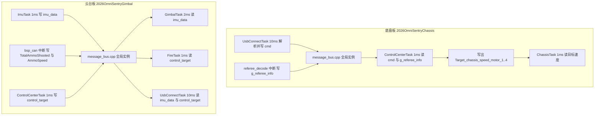
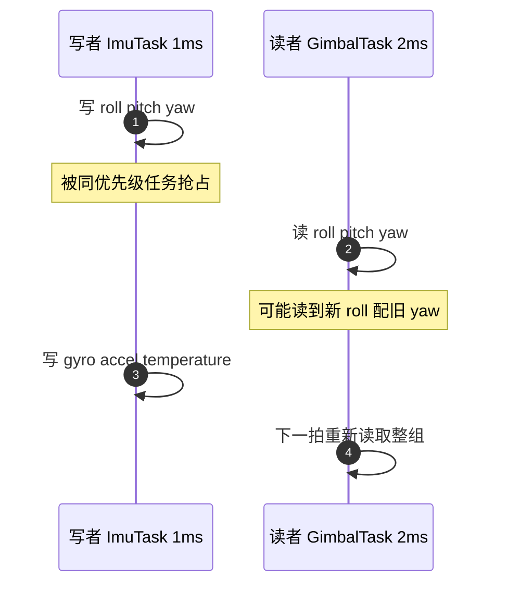

# Message_Bus 全局数据交换的取舍与结构

两块固件的任务之间没有通过队列传控制量。姿态解算的结果、控制中心算出的目标、电机输出电流都写在 `Message_Bus` 下的全局结构体里，谁需要就包含 `message_bus.h` 后直接读。这套做法把写点与读点分开，双方不需要互相包含任务头文件，代价是没有任何显式的同步机制。

对象是两板固件的 `Message_Bus/message_bus.h` 与 `message_bus.cpp`。路径前缀 `2026OmniSentryChassis/` 与 `2026OmniSentryGimbal/` 分别指底盘板与云台板仓库根。不选队列和锁的理由、结构体字段与全局实例的定义位置、最新值语义对应的周期比，以及组合字段更新的时间窗口估计，都从这两份文件出发。

## 1. 该看哪几类位置

取舍分析不依赖具体文件名，要看的只有四类位置：每个共享量的写点、读点、实例定义处，以及调度配置。下表把它们对应到本工程的文件，作为例证。

| 文件 | 作用 |
| --- | --- |
| `Message_Bus/message_bus.h` | 三个结构体与全局实例的 extern 声明 |
| `Message_Bus/message_bus.cpp` | 全局实例定义 |
| `Task/Src/ImuTask.cpp` | `imu_data` 写点，云台板 1 ms 周期 |
| `Task/Src/ControlCenterTask.cpp` | `control_target` 写点与部分读点 |
| `Communication/Src/referee_decode.cpp` | 裁判数据写点，云台板同时是定义位置 |
| `BSP/Src/bsp_can.cpp` | CAN 中断写弹量与弹速 |
| `Core/Inc/FreeRTOSConfig.h` | tick 频率与调度开关 |

## 2. 用全局结构体做交换的取舍依据

Message_Bus 是一组定义在头文件里的结构体加全局实例。任何任务包含 `message_bus.h` 后直接读写这些实例，就完成了数据交换。选它之前，几种可选机制在两板上的适用性对比如下：

| 机制 | 提供的能力 | 运行期成本 | 本工程 |
| --- | --- | --- | --- |
| 全局结构体 | 最新值可见，无排队 | 无内核对象、无阻塞 | 使用 |
| FreeRTOS 队列 | 逐条传递，带背压 | 一次拷贝加调度 | 仅 USB 字节流使用（云台板） |
| 互斥锁 | 组合字段整体一致 | 加解锁、优先级继承 | 未使用 |
| 事件与信号量 | 通知而非数据 | 还须另建数据通路 | 未使用 |

选全局结构体的直接理由有三点。控制回路只关心最新值：底盘速度环在 1 ms 周期里取一次目标速度，错过上一拍的值没有意义，排队反而引入固定相位滞后。写者通常是单一任务，写点集中在一个函数里，读点分散但都只读。结构体定义在头文件中，两块板可以直接共用同一份数据布局，不需要序列化。

代价是显式同步为零。一致性依赖写者更新序列不被打断这一隐含前提，第 5 节把这个前提对应的时间窗口算出来。只要读者能在写序列中间取值，它拿到的就是新旧字段混合的一组数据，而这组数据不满足任何一致性约定。

## 3. 三个结构体分别装什么

三个结构体按生产侧划分职责，这样每个量只有一类写者，最新值语义才成立：

| 结构体 | 生产角色 | 主要内容 |
| --- | --- | --- |
| `LocalImuData` | 姿态解算 | 三轴欧拉角、陀螺、加计、温度 |
| `ControlTarget` | 控制中心 | 底盘速度、云台角度、发射就绪、模式 |
| `MotorOutputData` | 电机输出 | 拨弹电流、左右摩擦轮电流 |

底盘板 `Message_Bus/message_bus.h` 里的 `LocalImuData` 共 9 个 `float`；云台板同名结构体多一个 `gimbal_yaw_total_angle`，由云台板 `Task/Src/ImuTask.cpp` 写入，是 Yaw 轴闭环的反馈量。

`Message_Bus/message_bus.h` 里两板共有的 `ControlTarget`，字段与语义如下：

| 字段 | 类型 | 语义 | 实际状态 |
| --- | --- | --- | --- |
| `chassis_vx` `chassis_vy` `chassis_wz` | `float` | 底盘三轴速度指令 | 底盘板使用，云台板只初始化 |
| `gimbal_yaw_angle` | `float` | Yaw 目标总角度 | 两板使用 |
| `gimbal_yaw_angle_single` | `float` | Yaw 单圈角度 | 两板均无引用 |
| `gimbal_pitch_angle` | `float` | Pitch 目标角度 | 两板使用 |
| `friction_ready` | `float` | 摩擦轮就绪 | 当布尔使用 |
| `feeder_ready` | `int` | 拨弹盘就绪 | 当布尔使用 |
| `control_mode` | 内嵌枚举 | `MODE_RC=0`、`MODE_RC_follow=1`、`MODE_AI=2` | 两板使用 |
| `emergency_stop` | `bool` | 急停标志 | 只被初始化，无读取点 |

表里有两个字段的类型与语义不一致：`friction_ready` 用 `float` 表布尔，`feeder_ready` 用 `int` 表布尔。两种写法都能工作，因为写点只赋 0 与 1，读点的判据也是与 0 或 1 比较；类型上没有阻止把速度值写进就绪字段。

两个结构体的字段口径写成代码（示意，与上文表一致）：

```cpp
// 两板共有的控制目标
struct ControlTarget {
    float chassis_vx, chassis_vy, chassis_wz;   // 底盘三轴速度指令（底盘板使用）
    float gimbal_yaw_angle;                     // Yaw 目标总角度（两板使用）
    float gimbal_yaw_angle_single;              // Yaw 单圈角度（两板均无引用）
    float gimbal_pitch_angle;                   // Pitch 目标角度（两板使用）
    float friction_ready;                       // 布尔语义却用 float
    int   feeder_ready;                         // 布尔语义却用 int
    enum { MODE_RC = 0, MODE_RC_follow = 1, MODE_AI = 2 } control_mode;
    bool  emergency_stop;                       // 只被初始化，无读取点
};

// 电机输出，当前两板都没有读写点
struct MotorOutputData {
    int16_t feeder_current, friction_left, friction_right;
};
```

`MotorOutputData` 含 `feeder_current`、`friction_left`、`friction_right` 三个 `int16_t`。两板全仓没有对该实例的读写，属预留字段。

## 4. 最新值语义与周期比

把结构体看成一个状态量 $x$。写者在时刻 $t_k$ 把 $x$ 更新为 $x_k$，读者在任意时刻取到的是某个 $x_j$，其中 $j \le k$。没有队列时读者拿到哪一拍取决于调度相位。设写周期为 $T_w$、读周期为 $T_r$，读者相邻两次采样跨过的写次数为

$$n = \frac{T_r}{T_w}$$

当 $n \ge 1$ 时读者不会漏掉状态变化，但可能一次跨过多拍，看到跳变而非连续变化。$n$ 越大，读者对瞬态的分辨力越低。底盘速度环 1 ms 取一次、控制中心 1 ms 写一次，$n=1$，读者不会漏拍；云台板 `UsbConnectTask` 10 ms 读 `imu_data`，$n=10$，它看到的是这 10 拍中的最后一拍。

$$n_{\text{USB-IMU}} = \frac{10\ \text{ms}}{1\ \text{ms}} = 10$$

这个数说明上行帧里的姿态值是抽样结果，不能用来重建 1 ms 级别的角速度波形。选择最新值语义换来的收益是读点不需要阻塞等待，代价是读者对过程量的分辨力由周期比决定。

## 5. 单字段原子与组合字段非原子的边界

Cortex-M4 上对齐的 32 位 `float` 与 `int` 读写是一条 `LDR` 或 `STR` 指令，中断不会把它切成两半，单个标量字段不会撕裂。

「原子」指一个操作在执行过程中不会被打断，外部只能看到它完成前或完成后的状态；多条语句组成的写序列不具备这个性质，读者可能取到新旧混合的字段。结构体的赋值序列不满足这一点：

```cpp
imu_data.roll  = roll_out;
imu_data.pitch = pitch_out;
imu_data.yaw   = yaw_out;
```

三条语句之间可能插入中断或同优先级任务的调度。读者在这段窗口内取值，会拿到新的 `roll` 配旧的 `yaw`。写序列长度 $L$ 条存储指令对应的时间窗口按 $T_w \approx (L+2)/f$ 估计，取 $L=3$、$f=168\ \text{MHz}$，窗口约 30 ns。这个组合状态不满足任何一致性约定，属按代码推导的风险，待实测确认其在实际调度下的出现概率。

$$T_{c} \approx \frac{L+2}{f} = \frac{5}{168\ \text{MHz}} \approx 29.8\ \text{ns}$$

分子取 $L+2$ 是为了把循环开销与地址计算也算进去，30 ns 是量级估计，不是实测值。需要判断的是这个窗口与调度节拍的关系：1 tick 等于 1 ms，tick 中断落进 30 ns 窗口的概率按窗口与周期之比估计，量级约 $3\times10^{-5}$。

## 6. 实例定义放在哪里，决定代码能不能整段搬移

单一定义规则要求每个全局实例只有一处定义，而定义落在哪个文件是接口决策：它决定同一份代码能否在另一个工程里直接复用。下面是两板的定义位置对照，差异本身就是例证。

底盘板 `Message_Bus/message_bus.cpp` 定义六个实例，云台板对应文件只有 15 行。两板对照：

| 实例 | 底盘板定义点 | 云台板定义点 | 云台板差异 |
| --- | --- | --- | --- |
| `imu_data` | `message_bus.cpp` | `message_bus.cpp` | 多 `gimbal_yaw_total_angle` |
| `control_target` | `message_bus.cpp` | `message_bus.cpp` | 一致 |
| `motor_output` | `message_bus.cpp` | `message_bus.cpp` | 一致 |
| `g_referee_info` | `message_bus.cpp` | `Communication/Src/referee_decode.cpp` | 定义落在通信层 |
| `cmd` | `message_bus.cpp` | 无 | 云台板改用 `vision_data` |
| `TotalAmmoShooted` | `message_bus.cpp` | `message_bus.cpp` | 定义在文件内位置不同 |
| `AmmoSpeed` | 无 | `message_bus.cpp` | 仅云台板 |

同一份头文件在两块板上的 extern 列表并不相同，第 3 篇再展开这一点。定义位置跨板不同带来的直接后果是源码不能整段搬移：底盘板 `Communication/Src/referee_decode.cpp` 写的是 `extern`，云台板同一文件里是定义。

分层上的依赖方向同样有差异。底盘板 `Message_Bus/message_bus.h` 包含 `bsp_can.h`、`dbus.h`、`referee_decode.h`、`UsbConnectTask.h`；云台板同名头只包含前两个。底盘板把 `UsbConnectTask.h` 拉进数据层，使 `Message_Bus` 反向依赖 `Task`；数据层原则上只应依赖底层类型。

## 7. 两板的写者与读者关系

下图按板分组标出共享量的生产与消费路径。



图里每条边都对应下一节的源码写点或读点。底盘板的 `g_referee_info` 与云台板的 `TotalAmmoShooted` 由中断服务函数写入，读者任务的优先级对它们没有隔离作用。



读者要拿到一致的整组值，只能在写序列之外采样；而采样时机由调度决定，代码里没有任何地方约束它。

## 8. 全局交换方案的已知代价

| 代价 | 现象 | 对应位置 |
| --- | --- | --- |
| 把全局实例当队列用 | 期望读到每一拍，实际只拿到最新值 | 两板 `Message_Bus/message_bus.h` 的 extern 实例列表 |
| 组合字段非原子 | 读者拿到新旧字段混合的一组值 | `2026OmniSentryGimbal/Task/Src/ImuTask.cpp` 的三字段写序列 |
| 中断写共享量 | CAN 回调直接写全局，任务侧无屏蔽 | `2026OmniSentryGimbal/BSP/Src/bsp_can.cpp` 的 CAN 收帧分支 |
| 预留字段被当已实现 | `motor_output` 与 `emergency_stop` 无读写仍被引用 | 两板 `Message_Bus/message_bus.h` 里的 `motor_output` 与 `emergency_stop` |
| 假定两板 extern 列表一致 | 在一块板上引用另一块才有的实例 | 两板 `Message_Bus/message_bus.h` 的 extern 实例列表 |
| 数据层反向依赖 Task | 改任务头文件会连带重编数据层 | 底盘板 `Message_Bus/message_bus.h` 的跨层包含 |

## 9. 小结

### 核心概念

- Message_Bus 提供最新值可见语义，不提供逐条传递与背压。
- 写点集中在单任务、读点分散，是选择全局结构体的前提。
- 对齐的 32 位标量读写不可分割，结构体多字段更新序列可分割。
- 中断服务函数也是生产者，其写点对任务读者的隔离性最差。
- 两板的 `message_bus.h` 不共用同一份实例布局。
- `MotorOutputData` 当前无读写点，属预留。

### 设计权衡

| 决策 | 选择 | 收益 | 代价 |
| --- | --- | --- | --- |
| 交换机制 | 全局结构体 | 零运行期开销、无阻塞 | 无一致性保证 |
| 数据粒度 | 结构体多字段 | 读写直观 | 组合状态可半更新 |
| 可见性 | 最新值 | 无相位滞后 | 无法回溯历史 |
| 分层 | 头文件集中声明 | 两板可共用布局 | 包含关系跨层 |

## 10. 练习

### 基础题

1. 数出 `message_bus.h` 中三个结构体的字段总数，并指出哪些字段在两板之间不一致。
2. 找到 `g_referee_info` 在两块板上的定义位置，说明同一份头文件为何都能编译通过。
3. 写出 `ControlTarget` 从写者赋值到读者取值的完整语句序列，标出可被打断的位置。

### 挑战题

1. 把 `imu_data` 的十次赋值改成一个整体结构体赋值，分析 M4 上需要多少条指令，以及是否仍可能被中断打断。
2. 为 `control_target` 设计一个不引入锁的版本号方案，说明读者如何检测半更新。

## 附：本页引用的固件路径

| 路径 | 用途 |
| --- | --- |
| `/home/wyx/rm/2026SentriOmeniChassis/2026OmniSentryChassis/Message_Bus/message_bus.h` | 底盘板结构体与实例声明 |
| `/home/wyx/rm/2026SentriOmeniChassis/2026OmniSentryChassis/Message_Bus/message_bus.cpp` | 底盘板实例定义 |
| `/home/wyx/rm/2026SentriOmeniGimbal/2026OmniSentryGimbal/Message_Bus/message_bus.h` | 云台板结构体与实例声明 |
| `/home/wyx/rm/2026SentriOmeniGimbal/2026OmniSentryGimbal/Message_Bus/message_bus.cpp` | 云台板实例定义 |
| `/home/wyx/rm/2026SentriOmeniGimbal/2026OmniSentryGimbal/Task/Src/ImuTask.cpp` | 云台板 IMU 写点 |
| `/home/wyx/rm/2026SentriOmeniGimbal/2026OmniSentryGimbal/BSP/Src/bsp_can.cpp` | 云台板 CAN 中断写弹速与弹量 |
