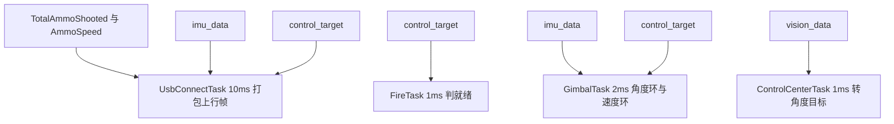
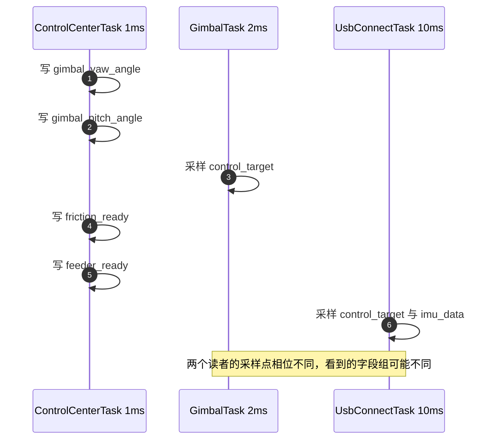
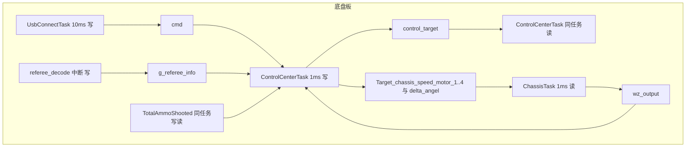
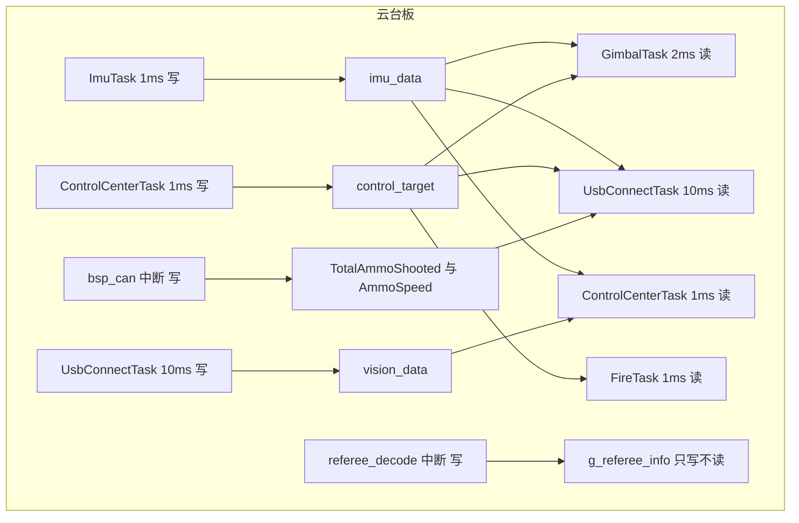

# 生产者与消费者矩阵

全局结构体的取舍与字段口径在上一页，这里把这些字段对应到具体的写点与读点。生产者是写入共享量的执行体，消费者是读取它的执行体；把两者按共享量排成矩阵之后，谁在什么时候写、谁在什么时候读、读者实际能看到哪一拍就都能算出来。

矩阵还要覆盖总线之外的数据通路。底盘板的 `Target_chassis_speed_motor_1..4`、`wz_output` 与云台板的 `vision_data` 都是任务之间的直接全局量，不写在 `message_bus.h` 里，只查总线会漏掉实际的耦合边。路径沿用上一页的口径，两板分别标前缀。

## 1. 矩阵要覆盖的范围

参与交换的量分三类：`Message_Bus` 头文件里声明的全局实例、总线之外的任务间全局量、中断服务函数写入的共享标量。第三类容易被漏掉，因为它的写点不在任务函数里，而在 CAN 或 USB 回调里。

| 生产形态 | 含义 | 风险 |
| --- | --- | --- |
| 单写者 | 只有一个任务写 | 字段之间仍可半更新 |
| 多写者 | 任务与中断都写 | 更新顺序无法约定 |
| 无写者 | 只有初始化 | 读者永远拿到初值 |
| 无读者 | 没有人消费 | 写点与字段属冗余 |

判定某个量的生产形态时，按写点的执行上下文分类：任务函数里写属单写者，中断回调里写属额外生产者，任务启动函数里只赋一次初值属无写者。读者一侧只需统计读取点数与读取周期，不区分它在哪个分支里读。

统计写点时逐个写点确认，不要按字段名全局搜索后就下结论。同一个字段可能在初始化、运行期更新、异常处理三处被写，三处的执行上下文不同，生产形态也不同。统计读点时要区分读取与写入同一字段的语句，`delta_angel` 这类双向交换的量两边都出现，按方向拆开记才不会把写点当读点。

## 2. 调度参数与周期比口径

调度参数在两块板上一致。`configTICK_RATE_HZ` 为 1000，`configUSE_PREEMPTION` 为 1，`configMAX_PRIORITIES` 为 7（两板 `Core/Inc/FreeRTOSConfig.h`）。`configUSE_TIME_SLICING` 未在配置文件中定义，按 FreeRTOS 默认值为 1（见 `Middlewares/Third_Party/FreeRTOS/Source/include/FreeRTOS.h`），同优先级任务按 tick 轮转。所有任务都用 `osPriorityNormal`，映射到 FreeRTOS 优先级 3。

这几个参数在配置头里的写法（真实宏名与取值）：

```c
// Core/Inc/FreeRTOSConfig.h（两板一致）
#define configTICK_RATE_HZ   1000   // 节拍：每 1 ms 触发一次 tick 中断
#define configUSE_PREEMPTION 1      // 抢占式调度
#define configMAX_PRIORITIES 7      // 优先级档数
```

tick 是内核的周期节拍中断，这里 1 ms 一次；`configUSE_TIME_SLICING` 开启时，同优先级任务在每个 tick 轮转一次，`osDelay` 的实参也就是 tick 数。

设写者周期 $T_w$、读者周期 $T_r$、写序列占用的时间窗口 $T_c$。读者每次采样跨过的写次数为

$$n = \frac{T_r}{T_w}$$

当读者与写者同周期时 $n=1$，采样点与更新点的相对相位由就绪表顺序决定，不随时间漂移；当 $n>1$ 时读者只看得到 $n$ 拍中的最后一拍。同优先级任务按 tick 轮转，就绪表顺序本身也可能随阻塞点变化，所以 $n=1$ 的情形只能按最坏情况处理，不能假设固定相位。

读者落入写窗口的概率只有在相位会遍历时才可用相位近似均匀估计：

$$p \approx \frac{T_c}{T_r}$$

该式的适用范围是读周期与写周期互质，或调度抖动足以让相位在一段时间内遍历整个读周期。本工程的两组读者是 $n=2$（2 ms 读者）与 $n=10$（10 ms 读者），都是整数倍比：写点由 tick 对齐，读点相对写序列的位置每个周期都落在同一处，不随时间漂移，因此这个式子不适用。整数倍比下的最坏情况取 $p=1$（读点长期落在写窗口内），最好情况取 $p=0$（读点长期避开写窗口），取值由就绪顺序决定，无法用 $T_c/T_r$ 缩小。若相位遍历条件成立，取写窗口 $T_c \approx 30\ \text{ns}$（上一页的三字段估计）可得 2 ms 读者 $p \approx 1.5 \times 10^{-5}$、10 ms 读者更小，但这两个值在本工程的整数倍比下只能当参考上界。以上属按代码与调度推导，待实测。

## 3. 周期与优先级决定数据新鲜度

读者能看到哪一拍由周期比 $n = T_r/T_w$ 决定，而相位是否可预测取决于优先级配置：优先级相同意味着采样点落在写序列中间的概率无法事先约定。所以建矩阵之前先把每个读写者的周期与优先级列出来。下表是两板的任务实例，作为后续矩阵的输入。

| 板 | 任务 | 优先级 | 周期 | 创建位置 |
| --- | --- | --- | --- | --- |
| 底盘 | `ControlCenterTask` | `osPriorityNormal` | 1 ms | `Task/Src/ControlCenterTask.cpp` 的初始化与循环 |
| 底盘 | `ChassisTask` | `osPriorityNormal` | 1 ms | `Task/Src/ChassisTask.cpp` 的循环与初始化 |
| 底盘 | `UsbConnectTask` | `osPriorityNormal` | 10 ms | `Task/Src/UsbConnectTask.cpp` 的循环与初始化 |
| 底盘 | `ImuTask` | 未启动 | 声明 1 ms | `2026OmniSentryChassis/Task/Src/ImuTask.cpp`；`Core/Src/freertos.c` 里的启动调用已注释 |
| 云台 | `ImuTask` | `osPriorityNormal` | 1 ms | `Task/Src/ImuTask.cpp` 的循环与初始化 |
| 云台 | `ControlCenterTask` | `osPriorityNormal` | 1 ms | `Task/Src/ControlCenterTask.cpp` 的循环与初始化 |
| 云台 | `FireTask` | `osPriorityNormal` | 1 ms | `Task/Src/FireTask.cpp` 的循环与初始化 |
| 云台 | `GimbalTask` | `osPriorityNormal` | 2 ms | `Task/Src/GimbalTask.cpp` 的循环与初始化 |
| 云台 | `UsbConnectTask` | `osPriorityNormal` | 10 ms | `Task/Src/UsbConnectTask.cpp` 的循环与初始化 |

任务的注册形状（示意，节拍语句写在各自任务循环里）：

```c
// Core/Src/freertos.c
StartImuTask_Init();            // 1 ms
StartFireTask_Init();           // 1 ms
StartGimbalTask_Init();         // 2 ms
StartControlCenterTask_Init();  // 1 ms
StartUsbConnectTask_Init();     // 10 ms
// 底盘板：StartImuTask_Init(); 被注释，该任务不参与运行期交换
```

底盘与云台的 `ImuTask` 用 `DWT_Delay_ms(1)` 忙等而非 `osDelay`，只在被 tick 抢占时让出 CPU（见两板各自的 `Task/Src/ImuTask.cpp`）。忙等意味着它在自己的周期里一直占着 CPU，被抢占的时机只由 tick 决定，写序列被打断的概率比主动阻塞的任务更高。底盘板 `ImuTask` 的启动调用被注释，它的写点不参与运行期交换。

优先级全部相同这一点对矩阵有直接影响。若读者优先级高于写者，读者一就绪就能抢占并拿到完整的新值；优先级相同时读者只能等 tick 轮转或写者阻塞，采样点落在写序列中间的概率上升。两板都没有用优先级制造顺序，分析可见性只能按最坏情况，不能假设读者总在写完之后执行。

## 4. 矩阵的建法与底盘板结果

矩阵的建法是通用的：每个共享量一行，分别记生产者、消费者与生产节奏；生产者按写点的执行上下文分类（任务函数、中断回调、只初始化），读者只统计读取点与周期。下面这张表是本工程底盘板的结果，可当作模板替换内容。

| 共享量 | 生产者 | 消费者 | 生产节奏 |
| --- | --- | --- | --- |
| `imu_data` | `Task/Src/ImuTask.cpp` 的写序列 | 无 | 任务未启动 |
| `control_target` | `Task/Src/ControlCenterTask.cpp` 的初始化与更新分支 | 同任务自身 | 1 ms |
| `cmd` | `Task/Src/UsbConnectTask.cpp` 的解析分支 | `Task/Src/ControlCenterTask.cpp` 的读取分支 | 事件驱动 |
| `g_referee_info` | `Communication/Src/referee_decode.cpp` 的解析函数 | `Task/Src/ControlCenterTask.cpp` 的读取点 | 事件驱动 |
| `TotalAmmoShooted` | `Task/Src/ControlCenterTask.cpp` 的写入点 | 同文件读取点 | 1 ms |
| `motor_output` | 无 | 无 | 无 |
| `Target_chassis_speed_motor_1..4` | `Task/Src/ControlCenterTask.cpp` 的运动学输出 | `Task/Src/ChassisTask.cpp` 的读取点 | 1 ms |
| `wz_output` | `Task/Src/ChassisTask.cpp` 的写入点 | `Task/Src/ControlCenterTask.cpp` 的读取点 | 1 ms |
| `delta_angel` | `Task/Src/ControlCenterTask.cpp` 的写入点 | `Task/Src/ChassisTask.cpp` 的读取点 | 1 ms |

底盘板的 `control_target` 由 `ControlCenterTask` 写完后又在本任务内用于运动学解算，写读在同一执行流内，不构成跨任务风险。跨任务的边是 `Target_chassis_speed_motor_1..4`、`wz_output` 与 `delta_angel` 这三组。`delta_angel` 的名字与 `wz_output` 相近，但它们是两个独立的全局量，写读点分别在两个任务里，属于双向交换：控制中心写 `delta_angel` 给底盘任务，底盘任务写 `wz_output` 给控制中心。

底盘板的 `TotalAmmoShooted` 写点与读点都在 `ControlCenterTask` 内，写读之间没有其他任务参与，属于同一任务内的自读，不构成跨任务边。矩阵保留这一行是为了和云台板对照：云台板同一个量由 `bsp_can` 中断写、由 `UsbConnectTask` 读，那才是跨执行体的交换。

## 5. 云台板结果与两板差异

同一套建法用在云台板上：读点更分散，还多了中断生产者这一路；对照两板能看清同一个量在哪些执行体之间真正耦合。下表是本工程云台板的结果。

| 共享量 | 生产者 | 消费者 | 生产节奏 |
| --- | --- | --- | --- |
| `imu_data` | `Task/Src/ImuTask.cpp` 的三字段写序列 | `Task/Src/GimbalTask.cpp`、`Task/Src/UsbConnectTask.cpp`、`Task/Src/ControlCenterTask.cpp` 各自的读取点 | 1 ms |
| `control_target` | `Task/Src/ControlCenterTask.cpp` 的初始化与更新分支 | `Task/Src/GimbalTask.cpp`、`Task/Src/FireTask.cpp`、`Task/Src/UsbConnectTask.cpp` 各自的读取点 | 1 ms |
| `vision_data` | `Task/Src/UsbConnectTask.cpp` 的解析分支 | `Task/Src/ControlCenterTask.cpp` 的读取点 | 10 ms |
| `TotalAmmoShooted` | `BSP/Src/bsp_can.cpp` 的 CAN 收帧分支 | `Task/Src/UsbConnectTask.cpp` 的上行打包点 | 事件驱动 |
| `AmmoSpeed` | `BSP/Src/bsp_can.cpp` 的 CAN 收帧分支 | `Task/Src/UsbConnectTask.cpp` 的上行打包点 | 事件驱动 |
| `motor_output` | 无 | 无 | 无 |
| `g_referee_info` | `Communication/Src/referee_decode.cpp` 的解析函数 | 无 | 事件驱动 |

云台板的 `control_target.chassis_vx`、`chassis_vy`、`chassis_wz` 只在 `Task/Src/ControlCenterTask.cpp` 里被初始化，无更新点也无读取点；底盘速度改由 CAN 帧下发。`g_referee_info` 在云台板上只写不读。

`imu_data` 在云台板上有三个消费者，周期分别是 1 ms、2 ms、10 ms，$n$ 分别为 1、2、10。三个读者在同一时刻看到的内容不一定相同：1 ms 的读者与写者同周期，采样相位由就绪顺序决定；10 ms 的读者跨越 10 拍，只取每批的最后一拍。

## 6. 采样相位与半更新窗口





时序图只画出两个读者的采样点相对写序列的位置，不指定谁命中写窗口。2 ms 读者与 1 ms 写者是整数倍比，采样位置相对写序列固定，落在写窗口内还是避开由就绪顺序决定，需按第 2 节的最坏情况单独判断；10 ms 读者跨过 10 次写序列，情况同理，不能套用 2 ms 读者的结论。两个读者的结论不能互相套用：同一个共享量、同一个写者，采样相位由各自的周期与就绪顺序决定。

底盘板：



云台板：



两张图按板分开，节点名带板名，两板之间没有同名共享量：`cmd` 与 `g_referee_info` 的读点在底盘板，`TotalAmmoShooted` 与 `AmmoSpeed` 的写点在云台板。核对具体某条边时要回到第 4、5 节的表里按板确认。

## 7. 矩阵容易漏掉的口径

| 口径问题 | 现象 | 对应位置 |
| --- | --- | --- |
| 只查总线，漏掉总线外的共享量 | 修改后仍出现耦合，查不到写点 | `Task/Src/ChassisTask.cpp` 与 `Task/Src/UsbConnectTask.cpp` 的总线外全局量 |
| 认为未启动任务仍在写 | 读到 `imu_data` 的初值 | `Core/Src/freertos.c` 里被注释的启动调用 |
| 忽略中断生产者 | 按任务优先级分析可见性，结论失效 | `BSP/Src/bsp_can.cpp` 的 CAN 收帧分支 |
| 同周期读者被当成独立采样 | 半更新概率估成零 | 全部任务 `osPriorityNormal` |
| 把忙等当主动让出 | 估算 CPU 占用偏低 | `2026OmniSentryChassis/Task/Src/ImuTask.cpp` 的 `DWT_Delay_ms` |
| 认为云台板也消费裁判数据 | 找不到读取点 | `Communication/Src/referee_decode.cpp` 的写点 |

## 8. 小结

### 核心概念

- 单写者对多读者是两板的基本形态，多写者出现在中断路径。
- 周期比 $n=T_r/T_w$ 决定读者能看到几拍，同周期时相位由 tick 对齐。
- 半更新概率按写窗口与读周期之比估计，同周期情形退化为最坏情况。
- 总线之外仍有任务间全局量，矩阵必须覆盖。
- 云台板任务全部同优先级，调度顺序由就绪表与 tick 轮转决定。
- 未启动任务的写点等价于无写点。

### 设计权衡

| 决策 | 选择 | 收益 | 代价 |
| --- | --- | --- | --- |
| 写者数量 | 单任务集中写 | 更新顺序可控 | 该任务周期成为数据新鲜度上限 |
| 读者数量 | 多读者无阻塞 | 各任务独立取用 | 无法通知变化，只能轮询 |
| 优先级 | 全部相同 | 配置简单 | 相位不可预测，实时性无保证 |
| 数据通路 | 总线加直接全局量 | 迁移成本低 | 耦合边分散，矩阵易漏 |

## 9. 练习

### 基础题

1. 按第 4 节找出底盘板上所有跨任务写读对，标出哪些不在 `message_bus` 中。
2. 给定写者 1 ms、读者 10 ms，计算 $n$ 并说明读者会看到什么。
3. 说明为什么云台板上 `imu_data` 的三个读者可能在不同拍上采样。

### 挑战题

1. 把 `control_target` 的两个就绪标志合成一个位域，重新评估半更新窗口。
2. 给云台板设计一个周期与优先级分配，使 `imu_data` 的相位对读者可预测，说明需要改动的源码位置。

## 附：本页引用的固件路径

| 路径 | 用途 |
| --- | --- |
| `/home/wyx/rm/2026SentriOmeniChassis/2026OmniSentryChassis/Message_Bus/message_bus.h` | 共享结构体声明 |
| `/home/wyx/rm/2026SentriOmeniChassis/2026OmniSentryChassis/Task/Src/ControlCenterTask.cpp` | 底盘板写点与运动学解算 |
| `/home/wyx/rm/2026SentriOmeniChassis/2026OmniSentryChassis/Task/Src/ChassisTask.cpp` | 底盘板目标速度消费者 |
| `/home/wyx/rm/2026SentriOmeniChassis/2026OmniSentryChassis/Core/Src/freertos.c` | 底盘板任务创建与注释状态 |
| `/home/wyx/rm/2026SentriOmeniGimbal/2026OmniSentryGimbal/Task/Src/UsbConnectTask.cpp` | 云台板视觉数据生产者与上行消费者 |
| `/home/wyx/rm/2026SentriOmeniGimbal/2026OmniSentryGimbal/BSP/Src/bsp_can.cpp` | 云台板中断生产者 |
| `/home/wyx/rm/2026SentriOmeniGimbal/2026OmniSentryGimbal/Core/Inc/FreeRTOSConfig.h` | 调度参数 |
