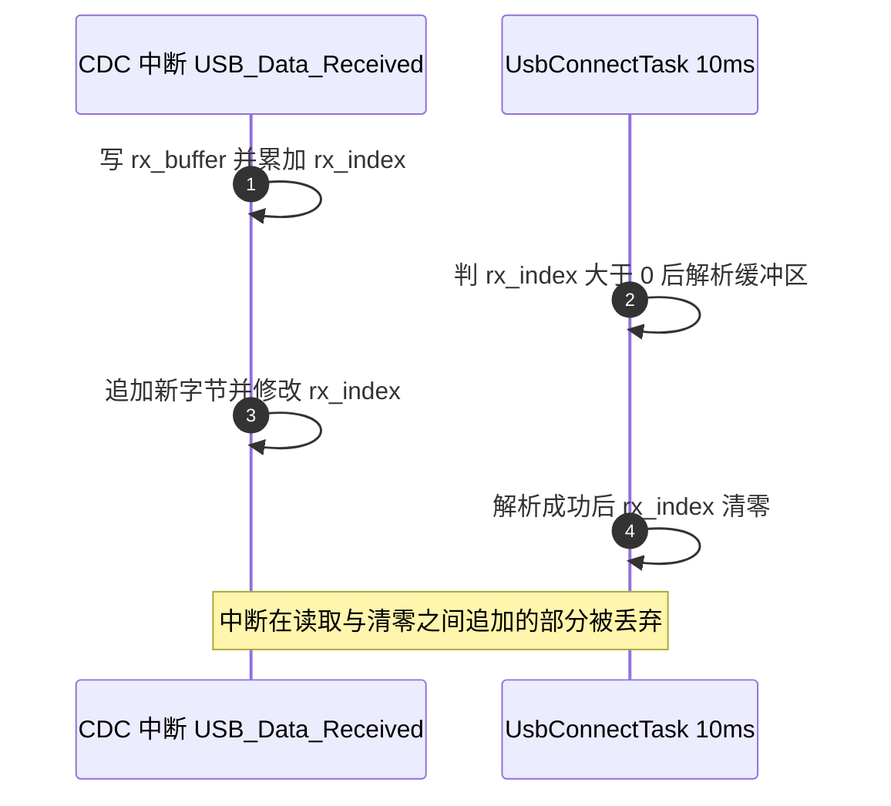
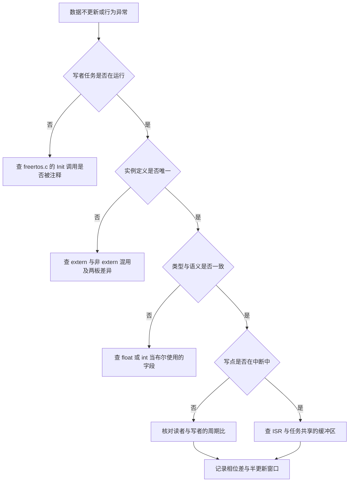

# Message_Bus 易错点与调试

已核对的问题集中在下面，并说明怎么把它们查出来。全局数据交换的问题不集中在读写逻辑本身，而集中在几条隐式约定被违反：字段类型与使用语义不一致、同一个实例在两块板上定义位置不同、写者没有运行或读者没有消费、中断与任务共用一块缓冲区。

这些问题的共同点是编译器不报错。声明齐全、类型能隐式转换、未使用的实例不触发警告，都要靠人工核对才能发现。下面逐类说明机制，再给出已核对清单、现成观测点与排查顺序。

> 路径前缀沿用第 1、2 篇的结构与矩阵口径，两板仓库根。

## 1. 四类隐式约定

| 类别 | 约定 | 违反后的表现 |
| --- | --- | --- |
| 类型语义 | 字段类型与使用语义一致 | 比较失败、赋值截断 |
| 定义位置 | 每个实例全仓只有一个非 extern 定义 | 重复定义或多份互不相干的副本 |
| 可见性 | 写者有运行、读者有消费 | 读到初值或字段无人使用 |
| 并发 | 写序列不被打断 | 组合状态半更新、缓冲字节丢失 |

四类约定的检查方式不同。类型语义要逐个字段看写点赋什么、读点拿什么比较；定义位置要用链接结果或全仓搜索确认；可见性要把任务的启动状态与读写点数出来；并发要盯中断与任务之间的共享对象。四类都过一遍之后，剩下的问题才需要按逻辑错误继续查。

排查顺序上先做可见性，再做类型语义，最后做并发。可见性问题会让现象一直存在且稳定，容易先被排除；并发问题只在特定相位出现，需要先确认其他三类没有问题，否则现象容易归因错误。

四类划分覆盖的是约定被违反的方式，不覆盖违反的严重程度。类型语义不一致可以一直不影响功能，也可以在字段被赋进新语义之后变成错误；两者在清单里都只记一条。核对时只记录约定与位置，严重程度留给整改阶段评估。

## 2. 布尔字段写成 float 与 int 的代价

`friction_ready` 声明为 `float`（`Message_Bus/message_bus.h:33`），写点赋 `true` 或 `false`，读点写作 `if (control_target.friction_ready)` 或 `== true`。`bool` 转 `float` 后取值只有 $1.0f$ 与 $0.0f$，`!= 0.0f` 的判据成立，因此功能上可用。脆弱之处在于该字段语义上是布尔，类型上是浮点：任何把速度写进去的改动都不会被编译器拦住。

`feeder_ready` 声明为 `int`（`:36`），同样赋 `true` 与 `false`（即 `1` 与 `0`），读点写作 `== true`。整数与布尔的隐式转换同样不报错。

$$b_{\text{friction}} \in \{0.0f,\ 1.0f\}, \qquad b_{\text{feeder}} \in \{0,\ 1\}$$

判据若写成 `== 1.0f` 或 `== 1` 也能工作，但与写点的符号不一致，改动时更容易失配。类型语义不一致本身不产生错误，它降低的是后续改动的安全边界：同一个字段在不同文件里被当作两种类型使用，谁改谁都要先确认另一侧的写法。

## 3. 单一定义规则与两板的定义差异

C++ 的单一定义规则要求每个全局变量只有一个翻译单元给出定义，其余用 `extern`。两块板的处理不同：底盘板把 `g_referee_info` 定义在 `Message_Bus/message_bus.cpp:13`，`Communication/Src/referee_decode.cpp:9` 只写 `extern`；云台板把定义放在 `Communication/Src/referee_decode.cpp:9`，`message_bus.h` 里没有它的 extern 声明。`Communication/Inc/referee_decode.h:501` 在两板上都提供 `extern` 声明。

只要全仓只有一处非 extern 定义，链接期就没有问题。风险在两块板的源码被当成同一份来改：在一个仓库里把定义挪走或删掉 `extern` 关键字，会直接产生重复定义或未定义符号。核对办法是把两板的定义点与 extern 点各列一份，确认每块板上恰好一次非 extern 定义。

两板各自的链接结果只能证明各自没有问题，不能证明两份源码可以互换。合并或迁移前要按实例逐个对照定义点，`g_referee_info` 与 `TotalAmmoShooted` 在两板的定义文件与行号都不同，正是这类差异的位置。

## 4. 中断直写缓冲区与队列两种做法

底盘板的 USB 接收路径是中断直写缓冲：`USB_DEVICE/App/usbd_cdc_if.c:271` 在 CDC 接收中断里调用 `USB_Data_Received`，后者在 `Task/Src/UsbConnectTask.cpp:222-226` 转调 `addDataToBuffer`，由 `:191-198` 修改 `rx_buffer` 与 `rx_index`。任务侧在 `:164-168` 读缓冲区、解析成功后把 `rx_index` 清零。中断可在任务的判断与清零之间追加数据，这部分字节会被随后清零丢弃。

云台板在同一位置改用了队列：`Core/Src/freertos.c:114` 创建 `usbRxQueue`，中断里 `xQueueSendFromISR`（`usbd_cdc_if.c:271`），任务里 `xQueueReceive`（`Task/Src/UsbConnectTask.cpp:83`）。队列把中断与任务的接触面缩到一次入队，入队与出队由内核保证原子，字节不会因为清零动作被杀掉。

两种做法的差别不在中断里执行了多少代码，而在共享对象有没有被原子化。直写缓冲共享的是普通数组与下标，队列共享的是内核对象，后者的并发由内核负责。

判断一段中断代码是否需要改队列，先看它在中断里改了几个共享变量。只改一个对齐标量时撕裂不会发生；同时改数组内容与下标两个量时，任务侧没有临界区就会丢数据。底盘板这一处改的是两个量，云台板已经用队列替代。

## 5. 已核对问题清单

| 问题 | 位置 | 判据 | 性质 |
| --- | --- | --- | --- |
| `friction_ready` 用 `float` 表布尔 | 两板 `message_bus.h:33` | 写 `true`，读 `if(...)` 与 `== true` | 类型语义不一致 |
| `feeder_ready` 用 `int` 表布尔 | 两板 `message_bus.h:36` | 写 `true` 与 `false`（即 `1` 与 `0`），读 `== true` | 类型语义不一致 |
| `g_referee_info` 定义位置跨板不同 | 底盘 `message_bus.cpp:13`；云台 `Communication/Src/referee_decode.cpp:9` | 底盘该文件 `:9` 为 `extern` | 跨板差异 |
| 两板 extern 实例集合不同 | 底盘 `message_bus.h:57-62`；云台 `:57-61` | 云台无 `cmd` 与 `g_referee_info`，多 `AmmoSpeed` | 跨板差异 |
| 底盘 `ImuTask` 未启动 | `Core/Src/freertos.c:100` | `StartImuTask_Init()` 被注释 | 无写者 |
| `motor_output` 无读写 | 两板 `message_bus.h:59`、`message_bus.cpp:12` | 全仓只有声明与定义 | 预留 |
| `emergency_stop` 无读取点 | 两板 `message_bus.h:46` | 只有初始化赋值 | 预留 |
| `gimbal_yaw_angle_single` 无引用 | 两板 `message_bus.h:29` | 只有声明 | 预留 |
| `updated` 只写不读 | `Communication/Src/referee_decode.cpp:44`、`:71`、`:91`、`:110`、`:128`、`:148` | 六个写点，无读取点 | 死标志 |
| 底盘接收缓冲无保护 | `Task/Src/UsbConnectTask.cpp:191-198` 与 `:164-168` | 中断写、任务读并清零 | 并发 |
| 云台 `control_mode` 恒为 `MODE_AI` | `Task/Src/ControlCenterTask.cpp:46`、`:108` | 每轮把 `dbus.s1` 置 3，分支只命中 `:52` | 分支不可达 |
| 断连无超时处理 | 底盘 `Task/Src/UsbConnectTask.cpp:134`、`:156` | `last_receive_time` 只赋值，无比较点 | 缺保护 |

按清单核对时建议分三步走：

1. 先对每个实例数一遍定义点，确认非 extern 定义恰好一处。
2. 再对每个字段列出写点与读点，写点为零或读点为零的都标出来。
3. 最后只看写点落在中断里、读点在任务里的那些字段，逐对判断共享对象是否需要原子化。

清单里前三类问题可以通过代码搜索确认，`updated` 与断连超时需要把写点与读点都数完才能下结论：六个写点对应零个读点，`last_receive_time` 只有赋值没有比较。

## 6. 观测手段与现成观测点

| 手段 | 能回答的问题 | 限制 |
| --- | --- | --- |
| CAN 抓包 | 已发出字段的值与刷新节奏 | 只有被发出的量可见 |
| 调试器挂起读实例 | 某一时刻的完整结构体 | 会暂停全部任务 |
| 局部快照 | 一段读写区间内的字段组合 | 快照本身仍可能跨越写序列 |
| 串口打印 | 数值变化的时间顺序 | 底盘板的打印语句当前被注释 |

观测前先写下要回答的问题，再选手段。

观测点的选择决定能回答什么问题。抓包看到的是生产者已经写好的值，无法区分字段是旧值还是更新中；挂起读实例能拿到一致的整组值，但会改变调度，只能用于静态核对。

两板的 `Debug_vars/debug_vars.h` 导出声明全部处于注释状态（`:14-23`），没有现成的可观察变量。可用观测点有两处：云台板 `Task/Src/ControlCenterTask.cpp:110` 把 `imu_data.yaw` 经 CAN 发出，底盘板 `Task/Src/ControlCenterTask.cpp:127` 把 `TotalAmmoShooted` 与 `g_referee_info.bullet_speed` 发出，都能在总线上抓取。底盘 `Task/Src/UsbConnectTask.cpp:201` 留有一处被注释的 `printf`。更直接的做法是调试器挂起后直接读实例地址，或把结构体整体拷到局部副本再打印，避免逐字段取值时被写者改动。后两种做法属建议，未在本工程实测。

观测点要选在生产者与消费者之间，不要选在写序列中间。云台板 `Task/Src/ControlCenterTask.cpp:110` 的发送点在控制中心任务末尾，它在读完 `imu_data` 之后才发出，抓到的值已经是消费者视角的抽样结果。

## 7. 观测数据的判读口径

拿到一段观测数据之后，判读的口径要提前定好，否则同一组数字可以支持互相矛盾的结论。下面四条是本工程核对时会用到的口径：

1. 抓包得到的值是生产者最后一次写入的结果，无法判断它是新值还是旧值，只能用刷新节奏推断写者是否在运行。
2. 挂起调试器读到的是某一时刻的整组字段，一致但不代表运行期一致，运行期仍可能半更新。
3. 局部快照跨越写序列时同样可能半更新，要把快照长度与写窗口比较后才下结论。
4. 逐字段打印会把一次不一致的读数固化下来，判读时不能用它反推写序列的顺序。

四条的差别在于观测动作本身有没有改变被观测对象。挂起会改变调度，打印会改变时序，抓包不改时序但看不到未发出的量。

## 8. 从数据不更新出发的排查顺序

分诊的前四步按代码静态核对就能完成，后两步需要接观测手段。数据完全不更新几乎都落在前四步；数值偶发异常才会走到中断与相位分支。把分支顺序固定下来，可以避免在数据恒为初值时就去接调试器测相位。

分支里每一问都尽量用静态核对回答。写者是否在运行看启动函数的调用状态，定义是否唯一看链接结果，类型是否一致看字段声明与读写点，写点是否在中断看它所在的函数。只有最后一问必须接观测手段，前四问都能在代码里得出结论。

## 9. 排查时容易漏掉的位置

| 易错点 | 现象 | 对应位置 |
| --- | --- | --- |
| 按字段逐个读共享结构体 | 打印出的组合状态自相矛盾 | `2026OmniSentryGimbal/Task/Src/UsbConnectTask.cpp:129-137` |
| 把 `extern` 声明当定义 | 改动后出现重复定义或未定义符号 | 两板 `Communication/Inc/referee_decode.h:501` |
| 用一块板的头文件推断另一块 | 引用不存在的 `cmd` 或 `g_referee_info` | 两板 `message_bus.h:57-62` 与 `:57-61` |
| 忽略被注释的 Init 调用 | 期望周期性数据，实际恒为初值 | `Core/Src/freertos.c:100` |
| 把死字段当有效信号 | 逻辑永远走到同一分支 | `message_bus.h:29`、`:46` |
| 依赖 `updated` 判断新帧 | 判据永远为上一次写入值 | `Communication/Src/referee_decode.cpp:44-148` |

## 10. 小结

### 核心概念

- 编译器不拦截类型语义不一致、未使用实例与跨板差异，需人工核对。
- 单一定义规则下，定义位置可以跨文件，但两板并不对称。
- 中断生产者与任务读者的共享缓冲需要队列或临界区。
- 只写不读的字段是重构信号，不是可用的状态位。
- 未启动任务的写点等于没有写点。
- 调试优先取快照，再分析；逐字段读会引入观察者自身的不一致。

### 设计权衡

| 决策 | 选择 | 收益 | 代价 |
| --- | --- | --- | --- |
| 布尔字段类型 | 沿用 `float` 与 `int` | 不改动已有读写点 | 类型不表达语义 |
| 裁判数据定义 | 跨板放在不同文件 | 各板包含关系最小 | 迁移与合并时易错 |
| USB 接收 | 底盘直写缓冲，云台用队列 | 云台实现更安全 | 两板行为不一致 |
| 调试导出 | 注释掉 `Debug_vars` | 避免未使用符号被回收 | 缺少现成观测量 |

四类问题的整改顺序建议是先补可见性，再统一类型，最后处理并发。可见性整改会改变哪些字段真的有读写点，先做这一步可以缩小后面两步的范围。

## 11. 练习

### 基础题

1. 列出 `message_bus.h` 中类型与语义不一致的字段，写出各自的读写点行号。
2. 说明底盘板与云台板 `g_referee_info` 的定义差异，并给出统一后的改法。
3. 找出底盘板接收缓冲竞争的两个参与方，指出丢失字节发生的位置。

### 挑战题

1. 把 `friction_ready` 与 `feeder_ready` 改为 `bool`，列出所有需要同步修改的读写点并评估影响。
2. 为 `g_referee_info` 增加超时判据，设计时间戳字段与更新点，说明如何避免中断侧写入与任务侧读取的时间戳撕裂。

## 附：本页引用的固件路径

| 路径 | 用途 |
| --- | --- |
| `/home/wyx/rm/2026SentriOmeniChassis/2026OmniSentryChassis/Message_Bus/message_bus.h` | 字段类型与实例声明 |
| `/home/wyx/rm/2026SentriOmeniChassis/2026OmniSentryChassis/Message_Bus/message_bus.cpp` | 底盘板实例定义 |
| `/home/wyx/rm/2026SentriOmeniChassis/2026OmniSentryChassis/Task/Src/UsbConnectTask.cpp` | 底盘板接收缓冲与 `cmd` 写点 |
| `/home/wyx/rm/2026SentriOmeniChassis/2026OmniSentryChassis/USB_DEVICE/App/usbd_cdc_if.c` | CDC 中断入口 |
| `/home/wyx/rm/2026SentriOmeniChassis/2026OmniSentryChassis/Core/Src/freertos.c` | 任务创建与注释状态 |
| `/home/wyx/rm/2026SentriOmeniGimbal/2026OmniSentryGimbal/Communication/Src/referee_decode.cpp` | 云台板裁判数据定义与写点 |
| `/home/wyx/rm/2026SentriOmeniGimbal/2026OmniSentryGimbal/Task/Src/ControlCenterTask.cpp` | 云台板模式分支与观测点 |
