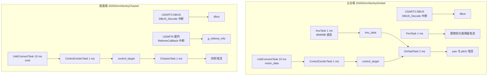
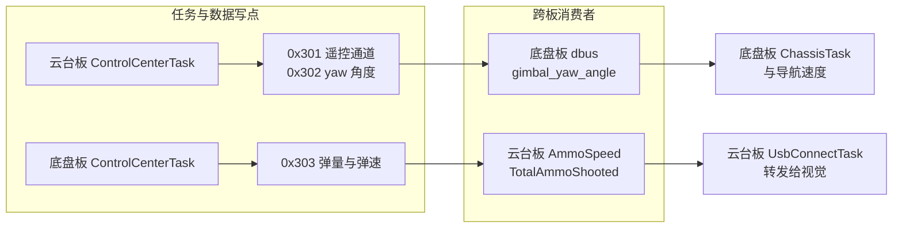

# 两板职责划分

哨兵主控是两块独立的 STM32F407 板，各自烧录一份固件、各自跑一个 FreeRTOS 调度器。哪块板负责什么，判据是任务实例清单、外设接收通道与执行器挂载位置；CAN 外设寄存器与过滤器配置不在这里展开。

> 云台板源码根 `/home/wyx/rm/2026SentriOmeniGimbal/2026OmniSentryGimbal`，底盘板 `/home/wyx/rm/2026SentriOmeniChassis/2026OmniSentryChassis`。下文相对路径都相对这两个根目录，未加板名前缀的默认指底盘板。总线分段、标识符分配与波特率见 `docs/03-CAN 与电机/05-拓扑与波特率/`，本单元不重复推导。

## 1. 判断依据

两块板的分工依据是执行器挂在哪一段总线上，以及外设的接收中断注册在哪块板的工程里。硬件上没有共享内存，唯一的板间通道是 CAN1 共享段上的一组标准帧。

判断职责归属有三个可以独立核对的证据层：任务实例清单说明哪块板上有执行体，外设注册位置说明哪块板能收到哪类报文，执行器写点说明电流指令由哪块板算出。三层证据互相印证时结论可靠；只凭目录名或注释判断，容易把源码里存在但未启动的功能算成职责。

核对某项功能归属时按固定顺序走一遍：

1. 在 `MX_FREERTOS_Init` 里找调用点，确认有任务在跑。
2. 在 `main.c` 里找外设回调注册，确认数据能进来。
3. 在中断向量表里找入口函数，确认中断有处理体。
4. 在任务目录里找执行器写点，确认指令由本板发出。

四步全过的功能才算这块板的职责；中间任何一步断掉，源码存在也只是一段未启用的实现。

| 维度 | 云台板 | 底盘板 |
| --- | --- | --- |
| 姿态传感器 | BMI088，ImuTask 以 1 ms 读取并解算 | BMI088 驱动存在，但启动函数被注释 |
| 遥控接收 | USART3 加 DMA，直接解 DBUS | 同款接收代码在 main 里注册，是否接接收机待现场确认 |
| 裁判系统 | USART6 中断体为空，无接收通路 | USART6 加 RefereeCallback，维护 g_referee_info |
| 云台执行器 | yaw GM6020、pitch LK、两个摩擦轮、拨弹盘 | 无 |
| 底盘执行器 | 无 | 四路 M3508 全向轮 |
| USB 对端 | 视觉小电脑，产出 vision_data | 小电脑导航，产出 cmd |
| 板间发送帧 | 0x301、0x302 | 0x303 |
| 板间接收帧 | 0x303 | 0x301、0x302 |

这张表决定了两条控制闭环的归属：云台角度闭环的反馈来自本板 BMI088，执行器也挂在本板一侧的总线上；底盘速度闭环的反馈来自本板 CAN2，执行器同样在本板。跨板流动的只是目标量，反馈量留在各自板上。

执行器挂载位置同时决定了谁承担安全责任。云台板一旦不再运行，摩擦轮与拨弹盘失去控制；底盘板一旦不再运行，四轮失去控制。两块板都没有对方的使能信号，所以停板表现为对应执行器保持最后一条指令，不会自动失能。

## 2. 任务实例是职责的第一层证据

FreeRTOS 启动时按 `MX_FREERTOS_Init` 里的注册顺序创建任务，注册了才有执行体，注释掉的就是没有运行。这条判据与项目无关：判断某个功能是否真的在跑，看启动调用有没有被执行，而不是看源码文件是否存在。云台板注册 5 个任务，底盘板注册 3 个，两板都有 ControlCenterTask 与 UsbConnectTask，这是职责重叠的部分。

| 板 | 任务 | 循环周期 | 主要职责 | 源码 |
| --- | --- | --- | --- | --- |
| 云台板 | ImuTask | 1 ms | 读 BMI088、FusionAHRS、写 imu_data | `Task/Src/ImuTask.cpp` |
| 云台板 | FireTask | 1 ms | 摩擦轮与拨弹盘速度环 | `Task/Src/FireTask.cpp` |
| 云台板 | GimbalTask | 2 ms | yaw 串级角度环、pitch 串级、发 0x141 | `Task/Src/GimbalTask.cpp` |
| 云台板 | ControlCenterTask | 1 ms | 意图解析、写 control_target、发 0x1FF/0x301/0x302 | `Task/Src/ControlCenterTask.cpp` |
| 云台板 | UsbConnectTask | 10 ms | 视觉协议收发、转发弹速与弹量 | `Task/Src/UsbConnectTask.cpp` |
| 底盘板 | ControlCenterTask | 1 ms | 底盘运动学、发 0x200/0x303 | `Task/Src/ControlCenterTask.cpp` |
| 底盘板 | ChassisTask | 1 ms | 四轮速度环与跟随环 | `Task/Src/ChassisTask.cpp` |
| 底盘板 | UsbConnectTask | 10 ms | 导航协议收发、回传云台角度 | `Task/Src/UsbConnectTask.cpp` |

注册在 `MX_FREERTOS_Init` 里的调用形状（简化）：

```c
// Core/Src/freertos.c
// 云台板：5 个任务
StartImuTask_Init();
StartFireTask_Init();
StartGimbalTask_Init();
StartControlCenterTask_Init();
StartUsbConnectTask_Init();

// 底盘板：3 个任务，ImuTask 的启动被注释
// StartImuTask_Init();
StartControlCenterTask_Init();
StartChassisTask_Init();
StartUsbConnectTask_Init();
```

底盘板的 ImuTask 启动调用位于 `Core/Src/freertos.c` 并被注释，所以它虽有 BMI088 源码与 `Task/Src/ImuTask.cpp` 里的调试串口初始化，上电后都不执行。把源码文件数当任务数，会把底盘板算成有 4 个任务。

注册顺序本身不影响职责判断，但影响启动后的第一轮执行顺序。两板都在 `MX_FREERTOS_Init` 里先建队列再建任务，任务创建完由调度器按优先级挑选，而所有任务优先级相同，实际从就绪表头部开始跑。核对某个任务是否存在，看它有没有被 `StartXxxTask_Init()` 调用，不看头文件里有没有声明。



第二层证据是执行器写点落在哪个文件。云台板的 yaw、pitch、摩擦轮、拨弹盘电流都在云台板任务里算出，底盘板的四轮电流只在底盘板任务里算出。两块板各自持有一半的执行器，任何一板停机都不会让另一板的执行器停摆，只会让跨越板边界的目标量失效。

## 3. 外设注册决定谁收到什么

云台板 `Core/Src/main.c` 只注册一路串口回调 `Uart_Init(&huart3, MyUartCallbackFun)`；底盘板注册两路，第二路是 `Uart_Init(&huart6, RefereeUartCallback)`。中断向量侧同样：两板的 `Core/Src/stm32f4xx_it.c` 都调用 `Uart_IRQHandler(&huart3)`，底盘板额外调用 `Uart_IRQHandler(&huart6)`，云台板的 `USART6_IRQHandler` 是空函数。裁判系统只进底盘板。

注册位置决定了任务能不能等到数据。

两板在 `Core/Src/main.c` 里注册串口回调的形状（简化）：

```c
// 云台板：只注册 USART3（DBUS）
Uart_Init(&huart3, MyUartCallbackFun);

// 底盘板：多注册一路 USART6（裁判系统）
Uart_Init(&huart3, MyUartCallbackFun);
Uart_Init(&huart6, RefereeUartCallback);
```

中断向量表是「中断号 → 处理函数」的入口表，`USART6_IRQHandler` 这类函数就是它在代码里的落点；表里有入口但回调没注册，数据仍然进不到业务全局量。云台板没有 USART6 的接收通路，本板上 `g_referee_info` 不会被更新；底盘板注册了两路串口，USART3 与 USART6 的中断都会写各自的全局量。核对某块板是否具备某项能力时，先看它在 `main.c` 里注册了哪些回调，再看中断向量里有没有对应的入口函数。

两个条件缺一不可。中断向量存在而回调没注册，中断会进入 HAL 的默认处理路径，数据不会落到业务全局量里；回调注册了而向量被别处覆盖，回调不会被调用。云台板 USART6 属于第一种情形，中断入口是空的，即使未来接上裁判接收机也收不到数据。

## 4. 同名结构体各写一半字段

共享头文件只保证两边的字段列表一致，不保证字段语义一致；两边的实例各自在自己板子的内存里，写者也不同。读代码时要先确认实例属于哪个执行体，再判断某个字段有没有被写过——这条在单板项目里同样适用。

ControlTarget 这个结构体两板都定义，但字段的实际写入者不同。云台板写 `gimbal_yaw_angle`、`gimbal_pitch_angle`、`friction_ready`、`feeder_ready`；底盘板写 `chassis_vx`、`chassis_vy`、`chassis_wz`。云台板把 `chassis_vx/vy/wz` 初始化后不再更新，底盘板把 `gimbal_yaw_angle` 初始化后同样不再更新（都在两板各自的 `Task/Src/ControlCenterTask.cpp` 里）。同名结构体在两块板上只各用一半字段。

结构体定义放在共享头文件里，编译期两板看到同一份字段列表；运行期两个实例各在自己的内存里，互不可见。读代码时看到 `control_target.gimbal_pitch_angle`，要先确认当前文件出自哪块板，才能判断这个字段有没有被写过。

## 5. 板间接口压到三帧

跨板接口每多一帧，两端就多一处协议版本与丢帧语义要对齐；把业务量压到最少帧数是这类双板架构的通用取舍，代价是扩展要改协议。本工程的做法是：

板间数据只走 CAN1 的 0x301、0x302、0x303 三帧，没有第二路串口或共享内存。云台板发 0x301 与 0x302 的位置是 `Task/Src/ControlCenterTask.cpp` 的循环末尾，底盘板收这两帧的位置是 `BSP/Src/bsp_can.cpp` 的 CAN 收帧分支；底盘板发 0x303 的位置是 `Task/Src/ControlCenterTask.cpp`，云台板收 0x303 的位置是 `BSP/Src/bsp_can.cpp`。这三帧的具体载荷在后一篇展开。

三帧的发送点（简化，只保留函数名与帧标识符）：

```c
// 云台板 ControlCenterTask：同一个 1 ms 循环里相邻发出
BSP_CAN1_SendRemoteControlCmd(...);   // 0x301：三个遥控通道与 s1
BSP_CAN1_SendImuData(...);            // 0x302：imu_data.yaw

// 底盘板 ControlCenterTask：反方向一帧
BSP_CAN1_SendReferee(...);            // 0x303：弹量与弹速
```

标准帧指用 11 位标识符的 CAN 数据帧（扩展帧为 29 位），`DLC` 表示数据场长度；这里三帧都是标准帧、DLC 为 8。



三帧都在共享段上，与 yaw、拨弹盘、pitch 电机的反馈帧混在一起。目标量没有独立的优先级或专用段，总线负载增加时它和电机帧一样排队。

三帧的接收侧都落在中断里，写入的全局量随后被本板任务读取。分工边界上没有引入队列或双缓冲，跨板数据与本板数据在访问方式上没有区别，区别只在数据来源是哪个节点发出。

## 6. 两套 USB 链路的差异

两块板各自对接不同上位机，协议与并发模型都不同；这类「同名不同实现」最容易被人在排查时当成一套来看。本工程的对照如下。

云台板的 USB 走云台串口协议，帧头为 0x53 0x50，视觉到云台 29 字节、云台到视觉 43 字节（见 `Task/Inc/UsbConnectTask.h`），解析器是 `usb_decode`，字节经由 `usbRxQueue` 送进任务（`Task/Src/UsbConnectTask.cpp`）。底盘板走另一套，帧头 0x5A，包 ID 0x01 的 RobotCmd 经 `memcpy` 直接落进 `cmd`（同为 `Task/Src/UsbConnectTask.cpp`）。两套协议结构、长度与包 ID 都不同，USB 端口对端也不同，不能互换。

两种收包方式在代码上的差别（简化）：

```c
// 云台板：字节进队列，任务逐字节取出解析
xQueueSendFromISR(usbRxQueue, Buf, NULL);

// 底盘板：中断里直接把整包拷进 cmd
memcpy(&cmd, &rx_pkt.data, sizeof(cmd));
```

`memcpy` 是按字节整块复制的库函数，这里一次把收到的数据搬进全局结构体；它不具备同步语义，因此中断与任务同时访问同一块缓冲区时仍需要队列或临界区。

各数据对象的写者与消费者可按板归类：

| 数据对象 | 写入者 | 读点 | 是否跨板 |
| --- | --- | --- | --- |
| `imu_data` | 云台板 ImuTask | 云台板 GimbalTask、UsbConnectTask | 否 |
| `control_target` | 两板各自的 ControlCenterTask | 本板任务 | 否，同名不同实例 |
| `dbus` | 云台板 USART3 中断；底盘板 USART3 中断与 0x301 中断 | 本板 ControlCenterTask | 是，0x301 的落点之一 |
| `AmmoSpeed` | 云台板 CAN 中断解 0x303 | 云台板 UsbConnectTask | 是，底盘板到云台板 |
| `gimbal_yaw_angle` | 底盘板 CAN 中断解 0x302 | 底盘板 ControlCenterTask | 是，云台板到底盘板 |
| `cmd` | 底盘板 UsbConnectTask | 底盘板 ControlCenterTask | 否 |
| `vision_data` | 云台板 UsbConnectTask | 云台板 ControlCenterTask | 否 |

表里标跨板的两行是分工边界的实际载体：`dbus` 被 0x301 与本地 USART3 两路中断写，`AmmoSpeed` 与 `gimbal_yaw_angle` 各只由一帧更新。

两套 USB 链路的差异不止协议本身，还包括接收路径：云台板把 USB 字节送进 `usbRxQueue` 由任务逐字节取出，底盘板在中断回调里直接把整包 `memcpy` 进 `cmd`。同一条“USB 收包”描述在两块板上对应两种并发模型，排查丢包时要按板分别看。

## 7. 分工相关的常见误判

| 误判 | 现象 | 对应位置 |
| --- | --- | --- |
| 以为两板都跑 IMU | 在底盘板找姿态解算的写点，找不到 | `Core/Src/freertos.c` 里注释了启动 |
| 以为两块板的任务集相同 | 按云台板的 5 个任务去核对底盘板调度 | 底盘板注册 3 个，见 `Core/Src/freertos.c` |
| 把 `control_target` 当两板共享 | 在一块板上读另一块板从未写的字段 | 两板各自定义实例，见 `Message_Bus/message_bus.cpp` |
| 以为裁判系统两板都有 | 在云台板上等 `g_referee_info` 更新 | 云台板 `Core/Src/stm32f4xx_it.c` 的 USART6 中断体为空 |
| 忽略底盘板也注册了 DBUS | 认为底盘板的遥控通道全部来自 0x301 | 底盘板 `Core/Src/main.c` 也注册了 huart3 |
| 把 USB 对象当共用 | 用 `cmd` 去读云台板的视觉数据 | 云台板用 `vision_data`，底盘板用 `cmd` |

表里六条误判的共同来源是把源码树当成运行状态。判断职责时以上电后的注册与中断体为准，源码注释与目录名只作线索。

## 8. 小结

### 核心概念

- 分工按执行器挂载位置切，云台执行器归云台板，底盘执行器归底盘板。
- 两板任务集不同：云台板 5 个，底盘板 3 个，底盘板 ImuTask 启动被注释。
- 裁判系统只在底盘板，云台板无接收通路。
- 同名 ControlTarget 在两块板上各写一半字段，实例不共享。
- 板间唯一通道是 CAN1 上的 0x301、0x302、0x303。

### 设计权衡

| 决策 | 选择 | 收益 | 代价 |
| --- | --- | --- | --- |
| 主控数量 | 两块 F407 | 云台与底盘解耦，各自实时性独立 | 需要一套板间协议与两套固件维护 |
| 反馈归属 | 各板用本板传感器 | 板上闭环，不依赖总线时延 | 两板无法互知对方的姿态与轮速 |
| 目标传递 | 复用 CAN1 三帧 | 不增加线束与收发器 | 目标量带宽与电机帧共享 |
| 结构体复用 | 两板共享头文件布局 | 一份定义两处编译 | 字段语义按板不同，读代码易误判 |

## 9. 练习

### 基础题

1. 分别数出两板在 `MX_FREERTOS_Init` 里注册的任务数量与任务名，指出哪一个是未启动的。
2. 说明云台板为什么收不到裁判系统的数据，给出一条源码证据。
3. 写出 0x301、0x302、0x303 三帧的方向与各自的组装函数名。

### 挑战题

4. 设计一个板间心跳，使两板都能判断对方是否在运行。给出帧标识符、发送周期、接收侧判据与失效后的降级动作，并说明为什么不复用现有的三帧。

---

## 附：本页引用的固件路径

| 路径 | 用途 |
| --- | --- |
| `/home/wyx/rm/2026SentriOmeniGimbal/2026OmniSentryGimbal/Core/Src/freertos.c` | 云台板 5 个任务的注册 |
| `/home/wyx/rm/2026SentriOmeniChassis/2026OmniSentryChassis/Core/Src/freertos.c` | 底盘板任务注册与 ImuTask 启动被注释 |
| `/home/wyx/rm/2026SentriOmeniGimbal/2026OmniSentryGimbal/Core/Src/main.c` | 云台板串口回调注册 |
| `/home/wyx/rm/2026SentriOmeniChassis/2026OmniSentryChassis/Core/Src/main.c` | 底盘板串口回调注册 |
| `/home/wyx/rm/2026SentriOmeniGimbal/2026OmniSentryGimbal/Task/Src/ControlCenterTask.cpp` | 云台板意图解析与板间发送 |
| `/home/wyx/rm/2026SentriOmeniChassis/2026OmniSentryChassis/Task/Src/ControlCenterTask.cpp` | 底盘板运动学与板间发送 |
| `/home/wyx/rm/2026SentriOmeniChassis/2026OmniSentryChassis/BSP/Src/bsp_can.cpp` | 底盘板接收 0x301 与 0x302 的收帧分支 |
| `/home/wyx/rm/2026SentriOmeniGimbal/2026OmniSentryGimbal/BSP/Src/bsp_can.cpp` | 云台板接收 0x303 与发送 0x301 的收发分支 |
