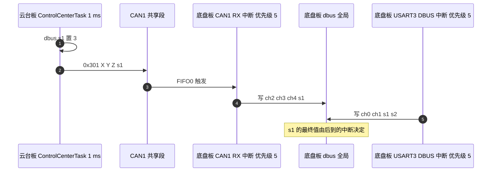
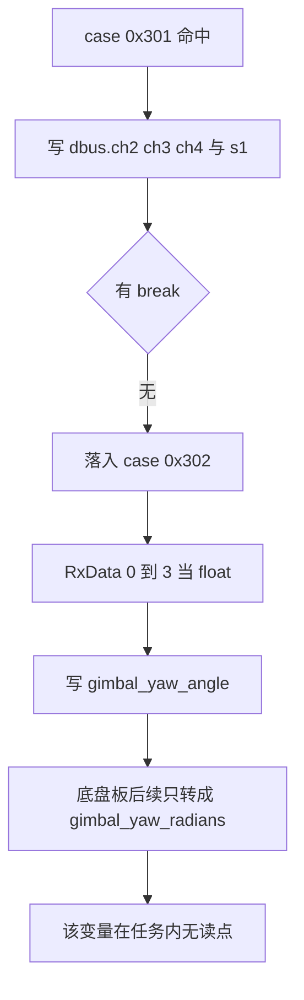

# 0x301 遥控帧与跨板数据流

两块板之间的业务数据只有三帧标准帧，其中 0x301 承担遥控通道的搬运。三帧的字节布局、发送与接收的源码位置、数据落到哪个全局量，以及底盘板接收分支里的落穿问题，都在下面。

> 路径取自云台板 `2026OmniSentryGimbal` 与底盘板 `2026OmniSentryChassis` 两棵源码树。CAN 外设配置与过滤器已由 `docs/03-CAN 与电机/01-CAN外设与过滤器/` 覆盖，这里不重复。

## 1. 三帧的分工与载荷

板间报文的划分依据是数据流向与载荷类型，与 CAN 标识符段无关。三帧都是标准帧、DLC 8、数据区最多用到 7 字节。把跨板业务量压到最少的帧数，是这类双板架构的通用取舍：接口小，时序与故障分析都简单，代价是扩展要动协议。

| 帧 | 方向 | 载荷 | 组装者 | 解析者 |
| --- | --- | --- | --- | --- |
| 0x301 | 云台板到底盘板 | 三个遥控通道与 s1 | 云台板 `BSP_CAN1_SendRemoteControlCmd` | 底盘板 `case 0x301` |
| 0x302 | 云台板到底盘板 | imu_data.yaw 一个 float | 云台板 `BSP_CAN1_SendImuData` | 底盘板 `case 0x302` |
| 0x303 | 底盘板到云台板 | 累计弹量与弹速 | 底盘板 `BSP_CAN1_SendReferee` | 云台板 `case 0x303` |

0x301 与 0x302 都在云台板 ControlCenterTask 的同一个 1 ms 循环里发出，底盘板在 CAN 中断里解析。0x303 反向，底盘板 ControlCenterTask 发出，云台板 CAN 中断解析。三条帧的接收侧都在中断里，写全局量之后由本板任务读取，中间没有队列。

## 2. 0x301 的字节布局与编码

0x301 用大端序装三个有符号 16 位通道，第 7 字节放开关，第 8 字节没有赋值。

| 字节 | 内容 | 编码 |
| --- | --- | --- |
| 0 到 1 | X，来自 `dbus.ch[2]` | 高字节在前，有符号 16 位 |
| 2 到 3 | Y，来自 `dbus.ch[3]` | 高字节在前，有符号 16 位 |
| 4 到 5 | Z，来自 `dbus.ch[4]` | 高字节在前，有符号 16 位 |
| 6 | s1 | 原始 8 位 |
| 7 | 未赋值 | 未定义，接收侧不解析 |

大端序的写法是先把高字节写在前面，接收侧按同样顺序拼回：

$$X = (RxData[0] \ll 8)\ \vert\ RxData[1]$$

有符号 16 位的范围是 $-32768$ 到 $32767$，遥控通道的原始摇杆量落在该范围内，不会溢出。发送侧的填充语句，云台板与底盘板两份实现完全相同：

```cpp
TxHeader.StdId = 0x301;
TxHeader.DLC = 8;
TxData[0] = X >> 8;
TxData[1] = X;
TxData[2] = Y >> 8;
TxData[3] = Y;
TxData[4] = Z >> 8;
TxData[5] = Z;
TxData[6] = s2;
return HAL_CAN_AddTxMessage(&hcan1, &TxHeader, TxData, &TxMailbox);
```

`TxData[6]` 在函数里由参数 `s2` 赋值，调用点传的是 `dbus.s1`。第 8 字节没有出现在代码里，DLC 仍写 8，接收侧不读它，因此不构成数据问题，只是载荷实际只用了 7 字节。

底盘板只有一份 0x301 的发送实现，位于 `BSP/Src/bsp_can.cpp` 里，但仓内没有调用点；实际发送者是云台板 `BSP/Src/bsp_can.cpp`。

## 3. 强制 s1 与两路 dbus 的竞争

云台板在发 0x301 之前把 `dbus.s1` 写成 3（`Task/Src/ControlCenterTask.cpp`），发送语句紧接着取这个值。底盘板收到后写进 `dbus.s1`（`BSP/Src/bsp_can.cpp`），于是底盘板读到的 s1 恒为 3，对应 `ControlTarget::MODE_AI`。

底盘板自身也在 USART3 上解 DBUS（`Core/Src/main.c` 里注册了回调），`dbus_decode` 会把 18 字节帧里的真实 s1 写进同一个 `dbus.s1`（`Communication/Src/dbus.cpp`）。两个写者一个在 USART3 中断、一个在 CAN1 中断，中断优先级都是 5（见 `Core/Src/usart.c` 与 `Core/Src/can.c`），同优先级不能互相抢占，所以两次写整字节不会撕裂，但最终值取决于最后一个到达的中断。若底盘板接有接收机，实际开关值由接收机的帧决定；若没有，s1 恒为 3。



这张图说明的是分工边界上的一处语义重叠：开关值有两个来源，云台板强制为 3，本板接收机给真实值。判断底盘当前模式时不能只看 s1 的数值，要确认接收机是否在线。

## 4. 底盘板 0x301 分支的落穿

底盘板的 0x301 分支没有 `break`，执行完会直接进入下一个 `case 0x302`：

```cpp
case 0x301: {
    dbus.ch[2] = ((RxData[0] << 8) | RxData[1]);
    dbus.ch[3] = ((RxData[2] << 8) | RxData[3]);
    dbus.ch[4] = ((RxData[4] << 8) | RxData[5]);
    dbus.s1    =   RxData[6];
}
case 0x302: {
    // 把 RxData[0..3] 当 float 还原
    gimbal_yaw_angle = temp;
}
```

于是每收到一帧 0x301，接收中断都会额外把它的前 4 字节按 float 解释并写进 `gimbal_yaw_angle`，得到一个无意义的数。

switch 的 `case` 后面不写 `break` 时，执行流会继续进入下一个 `case` 的语句，这种行为叫落穿（fall-through）；这里正是漏写 `break`，0x301 的载荷被 0x302 的解析代码又处理了一遍。云台板随后发出的 0x302 帧会覆盖这个值；若 0x302 丢帧，污染值保留到下一帧。



落穿与丢帧的叠加效应是排查时容易误判的地方：断点停在接收回调里看到的 `gimbal_yaw_angle` 跳变，来源可能是 0x301 落穿，也可能是 0x302 解码错误，要按帧计数分开确认。

## 5. 0x302 的落点与下游

底盘板 `gimbal_yaw_angle` 定义在 `BSP/Src/bsp_can.cpp`，在 CAN 中断里被写。底盘板唯一的下游使用点是 `Task/Src/ControlCenterTask.cpp` 把角度转成弧度存进 `gimbal_yaw_radians`；该变量在任务内没有后续读点，0x302 的数据实际不参与底盘控制。

云台板的 0x302 组装函数在 `BSP/Src/bsp_can.cpp`，调用点在 `Task/Src/ControlCenterTask.cpp` 的循环里，传入 `imu_data.yaw` 与一个常量。float 按大端装 4 字节，接收侧按同样顺序拼回。由于下游无读点，这一帧目前只起到覆盖落穿污染值的作用。

大端装填的写法（示意，主机是小端时按字节倒序取）：

```c
uint8_t *p = (uint8_t *)&imu_data.yaw;
TxData[0] = p[3]; TxData[1] = p[2]; TxData[2] = p[1]; TxData[3] = p[0];
```

## 6. 0x303 的字节序与落点

底盘板把 `TotalAmmoShooted` 与 `g_referee_info.bullet_speed` 装进 0x303（`BSP/Src/bsp_can.cpp` 的组装函数），弹量用大端 16 位、弹速用本机字节序 32 位，第 6 到 7 字节补 0。云台板解析后写 `TotalAmmoShooted` 与 `AmmoSpeed`（`BSP/Src/bsp_can.cpp` 的收帧分支），再由 UsbConnectTask 转发给视觉（`Task/Src/UsbConnectTask.cpp` 的上行打包点）。弹速的字节序两端一致，弹量按大端装、按大端收。

0x303 的装填形状（示意）：

```c
TxData[0] = (uint8_t)(TotalAmmoShooted >> 8);   // 弹量：大端 16 位
TxData[1] = (uint8_t)(TotalAmmoShooted);
memcpy(&TxData[2], &g_referee_info.bullet_speed, 4);  // 弹速：本机字节序
TxData[6] = 0; TxData[7] = 0;
```

同一帧里两种字节序并存，是按字段逐个定的：弹量有明确的高低位语义，弹速直接按内存布局拷贝。核对数据时要把每个字段的编码单独记，不能按帧统一假设。

## 7. 一条帧链上的三个改动落点

改一条帧协议要同时动三个地方：组装、发送调用、接收解析；漏掉任何一处就会出现「发了但没落对」。下表把三个落点对应到本工程，并列出每处当前的行为特征（例如解析分支缺 `break`）。

| 环节 | 位置 | 说明 |
| --- | --- | --- |
| 0x301 组装 | 云台板 `BSP/Src/bsp_can.cpp` 的发送函数 | 只写 7 字节，DLC 8 |
| 0x301 调用 | 云台板 `Task/Src/ControlCenterTask.cpp` 的循环 | 先改 s1 再发 |
| 0x301 解析 | 底盘板 `BSP/Src/bsp_can.cpp` 的收帧分支 | 缺 break |
| 0x302 组装 | 云台板 `BSP/Src/bsp_can.cpp` 的发送函数 | float 大端 |
| 0x302 调用 | 云台板 `Task/Src/ControlCenterTask.cpp` 的循环 | 传 imu_data.yaw 与 0 |
| 0x302 解析 | 底盘板 `BSP/Src/bsp_can.cpp` 的收帧分支 | 写 gimbal_yaw_angle |
| 0x303 组装 | 底盘板 `BSP/Src/bsp_can.cpp` 的发送函数 | 弹量大端、弹速本机序 |
| 0x303 调用 | 底盘板 `Task/Src/ControlCenterTask.cpp` 的循环 | 传弹量与 `g_referee_info.bullet_speed` |
| 0x303 解析 | 云台板 `BSP/Src/bsp_can.cpp` 的收帧分支 | 写 AmmoSpeed 与 TotalAmmoShooted |
| 发送返回 | 两个调用点都未检查 | mailbox 满时丢帧无记录 |

两板的发送函数返回 `HAL_CAN_AddTxMessage` 的状态，但调用点都按语句直接调用，没有记录返回值。

mailbox 是 bxCAN 外设内部的发送邮箱，硬件只有三个：调用 `HAL_CAN_AddTxMessage` 时若没有空闲邮箱，帧不会进总线，函数返回失败码，所以不检查返回值时这种丢弃不可见。mailbox 满或总线错误导致的丢帧不会留下任何计数，只能靠外部手段观察。三帧中 0x301 与 0x302 相邻发送，mailbox 只有三个，正常负载下够用；总线错误时先丢的也是这两帧。

## 8. 三帧相关的易错点

| 易错点 | 现象 | 对应位置 |
| --- | --- | --- |
| 认为 0x301 有完整 8 字节载荷 | 把第 8 字节当有效数据去解 | 组装处只写 `TxData[0..6]`，见 `bsp_can.cpp` |
| 忽略底盘板的落穿 | 排查 gimbal_yaw_angle 跳变时找不到来源 | `case 0x301` 到 `case 0x302` 之间无 `break`，见 `bsp_can.cpp` |
| 认为 s1 来自云台板遥控器 | 在云台板上找真实开关值 | 云台板 `Task/Src/ControlCenterTask.cpp` 先把它改成 3 |
| 认为底盘板遥控通道全来自 0x301 | 解释不了 ch0 与 ch1 的值 | 0x301 只带 ch2、ch3、ch4，见 `bsp_can.cpp` 的解析分支 |
| 把 0x302 当底盘控制输入 | 在底盘板上找角度闭环 | `gimbal_yaw_radians` 无读点，见 `ControlCenterTask.cpp` |
| 认为两板各有各的 0x301 发送者 | 找底盘板的调用点找不到 | 底盘板实现无调用点，只有云台板在用 |
| 忽略弹速的字节序 | 按大端还原 0x303 的 float | 组装用本机序，见 `bsp_can.cpp` 的组装函数 |

## 9. 小结

### 核心概念

- 板间业务帧三条：0x301 与 0x302 由云台板发往底盘板，0x303 反向。
- 0x301 大端装 ch2、ch3、ch4 与 s1，第 7 字节不赋值。
- 云台板发送前把 s1 改成 3，底盘板默认进入 MODE_AI。
- 底盘板 0x301 分支缺少 break，会落穿到 0x302 污染 gimbal_yaw_angle。
- 底盘板 gimbal_yaw_angle 的下游只有一个无读点的 gimbal_yaw_radians。
- 发送状态无人检查，丢帧不可见。

### 设计权衡

| 决策 | 选择 | 收益 | 代价 |
| --- | --- | --- | --- |
| 遥控搬运 | 用 CAN 复传三个通道 | 底盘板无需接收机 | 通道数固定，扩展要改协议 |
| 开关语义 | 云台板强制 s1 为 3 | 底盘板默认走 AI 模式 | 与真实遥控器值冲突，依赖中断到达顺序 |
| 角度传递 | 单独一帧 0x302 | 载荷类型清晰 | 增加一帧负载，且下游未使用 |
| 弹速编码 | 本机字节序直传 | 组装简单 | 与 0x301 的大端风格不一致 |

## 10. 练习

### 基础题

1. 写出 0x301 第 0 到 6 字节各放什么，说明第 7 字节为什么可以是任意值。
2. 底盘板收到一帧 0x301 时 `gimbal_yaw_angle` 会怎样变化，为什么。
3. 写出 0x303 里弹量与弹速各自的字节序，并指出组装与解析所在的函数。

### 挑战题

4. 为 0x301 与 0x302 的发送点补上返回值检查，设计一个不阻塞发送路径的丢帧计数方案，说明计数放在哪个上下文里、由哪个任务上报。

---

## 附：本页引用的固件路径

| 路径 | 用途 |
| --- | --- |
| `/home/wyx/rm/2026SentriOmeniGimbal/2026OmniSentryGimbal/BSP/Src/bsp_can.cpp` | 0x301 与 0x302 组装、0x303 解析 |
| `/home/wyx/rm/2026SentriOmeniGimbal/2026OmniSentryGimbal/Task/Src/ControlCenterTask.cpp` | s1 置 3 与三帧调用点 |
| `/home/wyx/rm/2026SentriOmeniChassis/2026OmniSentryChassis/BSP/Src/bsp_can.cpp` | 0x301 与 0x302 解析、0x303 组装 |
| `/home/wyx/rm/2026SentriOmeniChassis/2026OmniSentryChassis/Task/Src/ControlCenterTask.cpp` | 0x303 调用点与 gimbal_yaw_radians |
| `/home/wyx/rm/2026SentriOmeniChassis/2026OmniSentryChassis/Communication/Src/dbus.cpp` | DBUS 解码写 dbus |
| `/home/wyx/rm/2026SentriOmeniGimbal/2026OmniSentryGimbal/Task/Src/UsbConnectTask.cpp` | 0x303 数据转发给视觉 |
| `/home/wyx/rm/2026SentriOmeniChassis/2026OmniSentryChassis/Task/Src/UsbConnectTask.cpp` | 底盘板 USB 接收 cmd |
