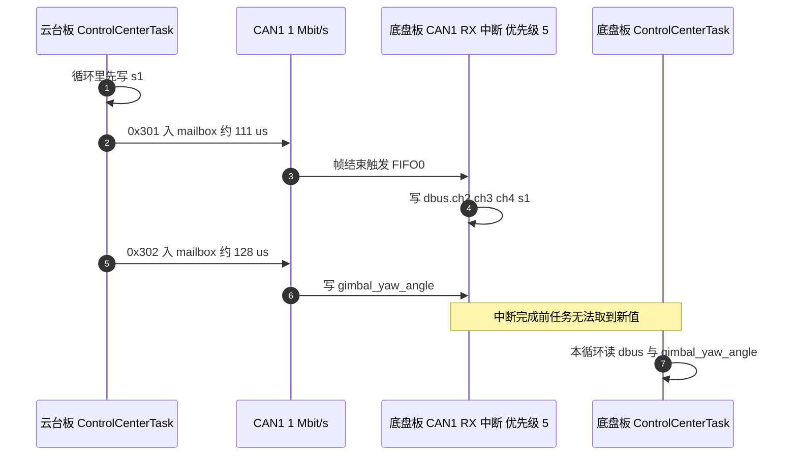
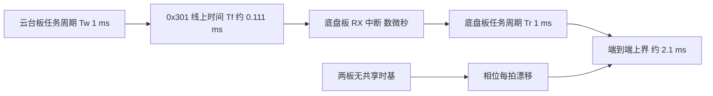

# 跨板控制时序

两块板各有一个独立调度器，没有共享时基。跨板目标量从写出到被另一方读到，要经过任务循环、CAN 仲裁传输与接收中断三段。这三段的时间量级、相位关系与已知的 dt 不一致如下。

> 两板 CAN1 都配置为 1 Mbit/s，位时间与采样点的推导见 `docs/03-CAN 与电机/05-拓扑与波特率/`。路径取自 `2026OmniSentryGimbal` 与 `2026OmniSentryChassis` 两棵源码树。

## 1. 端到端时序由三段合成

跨板时序由三部分合成：生产者的循环周期决定它多久写一次，CAN 传输决定一帧在线上占多久，消费者的循环周期决定它多久取一次。三者相乘才是一次端到端延迟的量级。

| 环节 | 典型耗时 | 决定因素 |
| --- | --- | --- |
| 生产者在循环里执行到发送语句 | 0 到 1 个循环周期 | 任务周期与循环内位置 |
| CAN 仲裁与传输 | 约 111 到 135 us | 帧位数与 1 Mbit/s 位速率 |
| 接收中断写入全局量 | 数微秒 | 中断优先级与帧长度 |
| 消费者执行到读取语句 | 0 到 1 个循环周期 | 任务周期与循环内位置 |

没有时间戳，接收侧无法判断拿到的值是哪一拍写的。跨板延迟的上界等于两个任务周期之和再加一帧传输时间。三段里只有 CAN 传输是确定量，另外两段由调度相位决定，实际延迟在上下界之间波动。

拆成三段的好处是每段都有独立的判据。生产段看发送语句在循环里的位置，传输段看帧位数与位速率，消费段看读取语句与循环末尾的距离。三段里任何一段出现额外等待，都要单独定位，不能只看端到端时间。

每段的核对顺序可以固定下来：

1. 生产段：找发送语句在任务函数里的位置，与循环末尾比较。
2. 传输段：用分析仪量同一标识符两帧之间的间隔。
3. 消费段：在接收中断与读取语句之间下断点，量时间差。

## 2. 定节奏语句与它的抖动

周期不是写完 `osDelay(2)` 就等于严格的 2 ms：延时的语义是「不少于」，唤醒点落在下一个 tick 边界上，抖动为一个 tick。理解这一点，才能解释跨板相位为什么会漂移。

两板的业务任务都由 `osDelay` 或 `DWT_Delay_ms` 定节奏，节拍是 1 ms（见两板 `Core/Inc/FreeRTOSConfig.h`）。任务优先级都取 `osPriorityNormal`，抢占打开、时间片未关闭，同优先级任务在每一个 tick 轮转。

| 板 | 任务 | 周期 | 定节奏语句 | 源码 |
| --- | --- | --- | --- | --- |
| 云台板 | ImuTask | 1 ms | `DWT_Delay_ms(1)` | `Task/Src/ImuTask.cpp` |
| 云台板 | FireTask | 1 ms | `osDelay(1)` | `Task/Src/FireTask.cpp` |
| 云台板 | GimbalTask | 2 ms | `osDelay(2)` | `Task/Src/GimbalTask.cpp` |
| 云台板 | ControlCenterTask | 1 ms | `osDelay(1)` | `Task/Src/ControlCenterTask.cpp` |
| 云台板 | UsbConnectTask | 10 ms | `osDelay(10)` | `Task/Src/UsbConnectTask.cpp` |
| 底盘板 | ControlCenterTask | 1 ms | `osDelay(1)` | `Task/Src/ControlCenterTask.cpp` |
| 底盘板 | ChassisTask | 1 ms | `osDelay(1)` | `Task/Src/ChassisTask.cpp` |
| 底盘板 | UsbConnectTask | 10 ms | `osDelay(10)` | `Task/Src/UsbConnectTask.cpp` |

`osDelay` 的实参是 tick 数，1 ms 节拍下即毫秒。云台板 ControlCenterTask 在同一循环里发 0x301 与 0x302（见 `Task/Src/ControlCenterTask.cpp`），两条语句相邻，所以两帧在同一拍产生，0x301 先入 mailbox。

云台板 ImuTask 用忙等而不是阻塞延时，它在自己的 1 ms 周期里一直占着 CPU，只有 tick 中断与更高优先级中断能让它停下。这一点对时序的影响是：ImuTask 的循环边界不落在阻塞点，采样相位与其它任务不同步。

`osDelay` 的实参在 1 ms 节拍下就是毫秒数，但延时长度只保证“不少于”这个时间，实际唤醒点落在下一个 tick 边界上，误差为 0 到 1 个 tick。写 2 ms 的任务平均周期是 2 ms，单次抖动仍可达 1 ms。

任务循环末尾定节奏的写法（示意）：

```c
osDelay(1);          // 1 个 tick = 1 ms，唤醒点对齐到下一个 tick 边界
DWT_Delay_ms(1);     // 云台板 ImuTask 用忙等，不主动让出 CPU
```

## 3. 中断优先级与抢占关系

接收侧的处理都在中断里。CAN1 RX0 优先级为 5（`Core/Src/can.c`），USART3 的 DBUS 接收同为 5（`Core/Src/usart.c`），DMA 流也配 5（`Core/Src/dma.c`）。FreeRTOS 允许调用中断安全 API 的优先级门槛也是 5（`Core/Inc/FreeRTOSConfig.h`）。

同优先级的这几个中断不能互相抢占：CAN1 中断执行期间到达的 USART3 中断会挂起等待，反之亦然。任务线程模式下任何中断都能抢占任务，所以 CAN 中断写全局量的时刻不受任务调度影响。

接收类中断的配置形状（示意）：

```c
HAL_NVIC_SetPriority(CAN1_RX0_IRQn, 5, 0);
HAL_NVIC_SetPriority(USART3_IRQn, 5, 0);

// FreeRTOSConfig.h：允许在中断里调用内核安全 API 的优先级门槛
#define configLIBRARY_MAX_SYSCALL_INTERRUPT_PRIORITY 5
```

Cortex-M 的中断优先级数值越小越紧急；优先级相同的中断不能互相抢占，只能依次排队执行。



图里 0x301 与 0x302 的线上时间不同，原因在数据场内容导致的填充位差异，两者都在百微秒量级。中断把值写进全局量之后，消费者任务要等下一次被调度才能读到，这段时间由底盘板自己的节拍决定。

中断与任务的关系是单向的：中断能随时打断任务，任务只能在中断返回后继续。所以接收侧数据更新的时间点由帧到达决定，而消费侧读取的时间点由任务节拍决定，两者之间没有握手。

## 4. 帧线上时间与延迟上界

标准帧在 1 Mbit/s 上的传输时间由帧位数除以位速率得到。帧位数包括帧起始、仲裁场、控制场、数据场、CRC 场、应答场与帧结束，数据场 8 字节时总位数在 111 到 135 位之间（按填充位数量变化）：

$$T_f = \frac{N_{bit}}{1\ \text{Mbit/s}}, \qquad 111 \le N_{bit} \le 135$$

$$T_{f,\min} = \frac{111}{10^6} = 0.111\ \text{ms}, \qquad T_{f,\max} = \frac{135}{10^6} = 0.135\ \text{ms}$$

设生产者周期为 $T_w$、消费者周期为 $T_r$、一帧线上时间为 $T_f$。从生产者在某一拍写完载荷，到消费者把它取走，延迟 $d$ 落在

$$0 < d < T_w + T_f + T_r$$

取云台板与底盘板都是 1 ms、$T_f \approx 0.111\ \text{ms}$，上界约 2.1 ms，下界接近 0.14 ms。实际值取决于两个独立调度器的相位，相位差每拍漂移，延迟随相位变化。



两个独立调度器的相位漂移不会收敛。两板的 tick 由各自的晶振产生，频率偏差在百万分之几十的量级，运行几分钟后两板任务相位差可以差出任意值。按一个固定延迟做相位补偿，只在短时间内近似成立。

总线负载还会给传输段加一项等待时间。mailbox 只有三个，若同一拍内要发的帧多于它，后到的帧要等前面发完；仲裁失败时同样要重试。0x301 与 0x302 在同一拍发出，正常情况下两个 mailbox 够用，总线拥塞时这一项会显著大于 0.111 ms。

## 5. dt 与实际周期不一致

PID 的微分与积分项都按调用者传入的 dt 计算，dt 与真实周期不一致会改变等效增益。三处已知不一致：

| 任务 | 传入 dt | 实际周期 | 后果 |
| --- | --- | --- | --- |
| 底盘板 ChassisTask | 0.01 s | 1 ms | 积分与微分按 10 倍时间尺度计算 |
| 云台板 GimbalTask | 0.001 s | 2 ms | 积分与微分按半速计算 |
| 云台板 FireTask | 0.01 s | 1 ms | 积分与微分按 10 倍时间尺度计算 |

底盘板 ChassisTask 与云台板 GimbalTask 的 dt 写在各自 `Task/Src/ChassisTask.cpp` 与 `Task/Src/GimbalTask.cpp` 里。这两处是代码事实，对控制效果的影响属按控制原理的推断，需在整定参数时一并核对。

dt 偏大 10 倍时，积分项的等效增益放大 10 倍，阶跃响应会更快也更容易超调；dt 偏小一半时，积分增益减半，同样的参数下响应变慢。改动任务周期时要同时改 dt，两者是绑定的两个数。

三处不一致里有两处是 10 倍关系，一处在控制中心任务里读起来像是从 10 ms 周期改到 1 ms 时漏改的。核对流程可以固定成：先确认循环的 `osDelay` 实参，再找构造 PID 时传入的 dt，两者不一致就记一条。

dt 是调用者传给 PID 的时间步长，积分与微分都按它计算（示意）：

```cpp
pid.Calculate(target, actual, 0.01f);   // ChassisTask：实际 1 ms，却按 10 ms 算
pid.Calculate(target, actual, 0.001f);  // GimbalTask：实际 2 ms，按 1 ms 算
```

## 6. 两帧的发送顺序与启动相位

云台板先发 0x301 再发 0x302，两条语句相邻。同一条总线上的仲裁按标识符数值决胜，0x301 小于 0x302，即使两帧同时待发也是 0x301 先上总线。

CAN 的仲裁是各节点逐位比较标识符，显性位胜出、标识符数值小的帧先占用总线；这条规则不依赖发送顺序，所以 0x301 的落穿污染总是发生在 0x302 覆盖之前。接收侧因此总是先处理 0x301 再处理 0x302，落穿污染发生在覆盖之前。

底盘板 ControlCenterTask 在进入循环前先延时 100 ms，随后用 `yaw_motor_5.total_angle` 记录初值（均在 `Task/Src/ControlCenterTask.cpp` 的循环入口前）。该结构体由 0x205 的接收中断填充，若 100 ms 内没有收到 yaw 电机的反馈帧，初值取到的是零初始化值。这属于启动相位的推断，是否实际发生取决于上电时电机反馈的到达时刻，待现场确认。

启动相位问题只在第一次进入循环时出现，进入稳态后初值被真实反馈覆盖，所以排查时要看第一拍。

## 7. USB 时基不会成为瓶颈

云台板 UsbConnectTask 用 `HAL_GetTick()` 判断 10 ms 发送间隔（`Task/Src/UsbConnectTask.cpp`），底盘板 UsbConnectTask 直接 `osDelay(10)`（同为 `Task/Src/UsbConnectTask.cpp`）。`HAL_GetTick()` 返回内核启动以来的毫秒计数，用它做减法即可得到时间间隔。两条 USB 链路的节拍都远慢于板间 CAN，不会成为跨板目标量的瓶颈。

需要注意的地方是两条 USB 链路都承载着间接观测跨板数据的能力：云台板把 0x303 的弹速与弹量转发给视觉，底盘板把 yaw 电机角度回传。它们的 10 ms 节拍会限制观测分辨率，判断板间帧是否按 1 ms 到达时不能只看 USB 通路。

两条 USB 通路的对端也是不同的小电脑：云台板对视觉，底盘板对导航。观测跨板数据时优先用 CAN 分析仪直接看共享段，USB 通路只作为业务侧是否收到数据的旁证。

## 8. 时序相关的易错点

| 易错点 | 现象 | 对应位置 |
| --- | --- | --- |
| 把跨板延迟当固定值 | 按 2 ms 补偿相位，现场对不上 | 两个独立调度器，无共享时基 |
| 按 1 ms 估计所有任务 | 漏掉 GimbalTask 的 2 ms 与 USB 的 10 ms | `GimbalTask.cpp` 与 `UsbConnectTask.cpp` 的 `osDelay` 实参 |
| 认为中断会被任务延迟 | 担心任务长时占 CPU 时收不到帧 | 中断优先级 5，可抢占任务 |
| 忽略同优先级中断的串行化 | 以为 CAN 与 DBUS 中断能互相抢占 | 两者优先级都是 5 |
| 用循环注释判断周期 | 把 `1ms控制周期` 的注释当事实 | 以 `osDelay` 实参为准 |
| 忽略 dt 与周期不一致 | PID 整定后现场行为不同 | `ChassisTask.cpp` 与 `GimbalTask.cpp` 里的 dt |
| 认为 0x301 与 0x302 可能乱序 | 分析落穿与覆盖的先后关系时假设错 | 同节点顺序发送，0x301 标识符更小 |

## 9. 小结

### 核心概念

- 跨板延迟由生产周期、帧传输时间与消费周期三段叠加，无共享时基。
- 两板 CAN1 为 1 Mbit/s，8 字节标准帧线上时间约 111 到 135 us。
- 业务任务周期为 1 ms 或 2 ms，USB 任务 10 ms。
- CAN 与 USART 中断优先级都是 5，互相不可抢占，都能抢占任务。
- 端到端延迟上界约 2.1 ms，实际值随相位漂移。
- 三处 PID 传入的 dt 与真实循环周期不一致。

### 设计权衡

| 决策 | 选择 | 收益 | 代价 |
| --- | --- | --- | --- |
| 板间同步 | 不做时间同步 | 实现简单 | 接收侧无法判断数据新鲜度 |
| 周期选择 | 业务任务统一 1 ms | 相位简单 | 与 10 ms 的 USB 任务无整数倍对齐 |
| 中断优先级 | 接收类中断统一为 5 | 无嵌套，行为可预测 | 高负载时 DBUS 与 CAN 互相排队 |
| PID 时基 | 由调用者传 dt | 任务与算法解耦 | 周期改动时容易漏改 dt |

时序问题定位完成后，把结论写成三个数：生产段位置、传输段实测间隔、消费段位置。三个数对应三段，缺一个说明还有一段没有核对。

## 10. 练习

### 基础题

1. 给定标准帧 120 位、位速率 1 Mbit/s，计算线上时间。
2. 写出跨板延迟的上界表达式，并代入两板 1 ms 周期与 0x301 的线上时间求数值。
3. 找出三处 dt 与周期不一致的位置，写出各自的实际周期。

### 挑战题

4. 为 0x301 增加一个 1 字节的发送序号，设计接收侧的收包间隔统计与断流判据，说明序号会如何影响 0x301 的载荷布局与底盘板解析代码。

---

## 附：本页引用的固件路径

| 路径 | 用途 |
| --- | --- |
| `/home/wyx/rm/2026SentriOmeniGimbal/2026OmniSentryGimbal/Task/Src/ControlCenterTask.cpp` | 1 ms 循环与两帧发送 |
| `/home/wyx/rm/2026SentriOmeniGimbal/2026OmniSentryGimbal/Task/Src/GimbalTask.cpp` | 2 ms 循环与 dt |
| `/home/wyx/rm/2026SentriOmeniGimbal/2026OmniSentryGimbal/Task/Src/FireTask.cpp` | 1 ms 循环与 dt |
| `/home/wyx/rm/2026SentriOmeniChassis/2026OmniSentryChassis/Task/Src/ControlCenterTask.cpp` | 1 ms 循环与启动延时 |
| `/home/wyx/rm/2026SentriOmeniChassis/2026OmniSentryChassis/Task/Src/ChassisTask.cpp` | 1 ms 循环与 dt |
| `/home/wyx/rm/2026SentriOmeniGimbal/2026OmniSentryGimbal/Core/Src/can.c` | CAN1 RX0 中断优先级 5 |
| `/home/wyx/rm/2026SentriOmeniChassis/2026OmniSentryChassis/Core/Inc/FreeRTOSConfig.h` | 节拍 1000 Hz 与中断门槛 5 |
