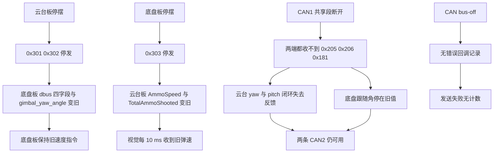
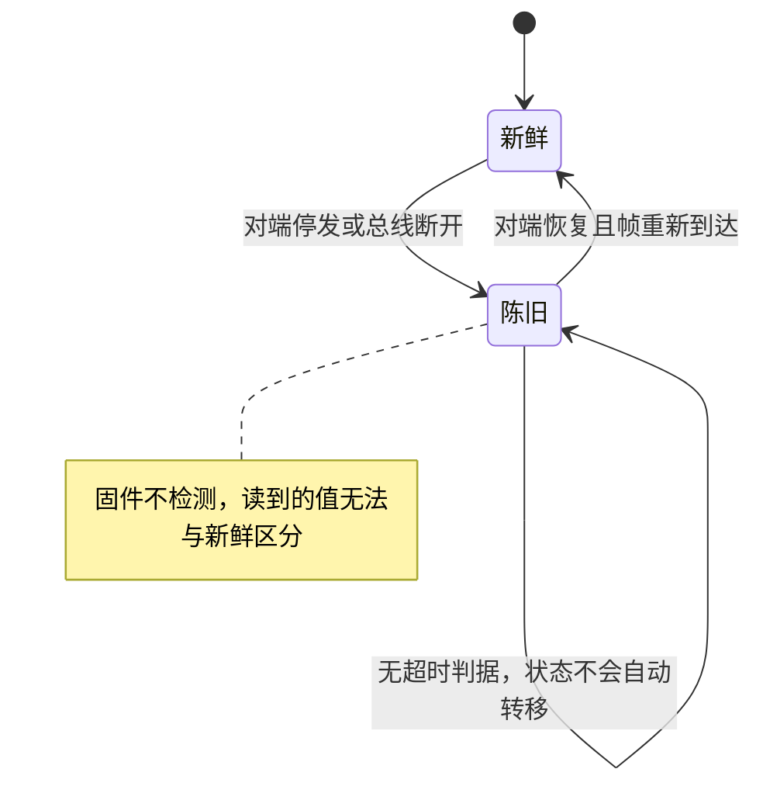

# 单板失效与降级

两块板通过一段共享 CAN1 交换目标量，任何一侧停摆都会让对方读到不再更新的旧值。按失效对象分类之后，每类失效下的数据残留、执行器行为与固件里缺的检测点如下。

> 路径与行号取自 `2026OmniSentryGimbal` 与 `2026OmniSentryChassis` 两棵源码树。总线分段见 `docs/03-CAN 与电机/05-拓扑与波特率/`。

## 1. 三类失效的边界

失效的表现取决于失效点是哪一块板还是整段总线。三类的边界很清晰：单板失效只影响它发出的帧，共享段失效同时切断电机反馈与板间报文。

| 失效对象 | 丢失的帧 | 仍然可用的数据 | 是否有检测 |
| --- | --- | --- | --- |
| 云台板停摆 | 0x301、0x302 | 底盘板本地 DBUS、CAN2 轮速、yaw 电机反馈 | 无 |
| 底盘板停摆 | 0x303 | 云台板本地 IMU、CAN1 电机反馈 | 无 |
| CAN1 共享段断开 | 0x205、0x206、0x181、板间三帧 | 两条 CAN2 各自独立 | 无 |
| CAN 控制器 bus-off | 本控制器的全部收发 | 另一路 CAN 与串口 | 无错误回调 |

没有任何一帧携带序号或时间戳，接收侧拿到的值与它写入的时刻之间没有可比较的信息。因此固件无法区分数据新鲜与陈旧。三类失效在代码层的共同点是：接收分支只做覆盖写，没有到达计数，也没有最后到达时刻。

按失效对象分类而不是按现象分类，是因为同一个现象可能来自不同失效点。底盘不动既可能是云台板停发 0x301，也可能是 CAN1 断开，还可能是底盘板自身任务卡死；先定失效对象，再沿该对象的帧与写点查下去。

## 2. 云台板停摆后底盘读到什么

云台板是 0x301 与 0x302 的唯一发送者。它停摆后，底盘板的接收分支不再被触发，四个字段保持最后一次写入的值：`dbus.ch[2]`、`dbus.ch[3]`、`dbus.ch[4]`、`dbus.s1`，以及被落穿的 `gimbal_yaw_angle`。

底盘板任务继续以 1 ms 循环读这些旧值，速度指令不会归零。若底盘板接有接收机，它的 USART3 中断会继续用真实遥控值覆盖 `dbus` 的同一批字段，此时降级表现为遥控直控；若没有接收机，`dbus.s1` 停在 3，底盘板停在 MODE_AI，改由 USB 的 `cmd.speed` 决定速度。

云台板自身停摆的原因不同，表现也不同：任务卡死时 USB 设备仍可能处于配置状态，视觉侧看不出异常；整板掉电时 USB 会断开，视觉侧能通过枚举状态发现。两种情形在底盘板侧都没有区别，都是 0x301 与 0x302 停止到达。

云台板停摆后仍在本板运行的部分是它的执行器：yaw、pitch、摩擦轮、拨弹盘继续按最后写入的电流指令工作，直到电调自己的超时保护动作。这段时间内底盘板读到的是旧目标，两侧都在按旧值运行。

`vision_data` 在云台板上同样只增不减，视觉断流后 `control_target.gimbal_yaw_angle` 保持最后目标，云台继续指向旧方向。

## 3. 底盘板停摆后云台读到什么

底盘板是 0x303 的唯一发送者。它停摆后云台板的 `TotalAmmoShooted` 与 `AmmoSpeed` 停在最后一次解析值，UsbConnectTask 仍以 10 ms 周期把这两个旧值转发给视觉。

底盘板的停摆不把 yaw 电机从总线上移除，所以云台板侧的 0x205、0x206、0x181 与底盘板侧的 0x205 都照常收发。云台的 yaw、pitch、摩擦轮闭环不受影响，只有弹道相关的反馈变旧。

这里有一处容易混淆的地方：底盘板停摆会让它自己的 0x303 停止，但共享 CAN1 上的电机帧仍由电调发出，与底盘板是否运行无关。判断“底盘板是否活着”不能只看总线上有没有 0x205，要看有没有 0x303，而 0x303 的接收侧在云台板。

## 4. CAN1 共享段断开的范围

CAN1 是两块板与 yaw、拨弹盘、pitch 电机共用的一段。这一段断开后，两端都收不到任何 CAN1 帧：云台板失去 yaw 与拨弹盘的转子反馈，底盘板失去 `yaw_motor_5` 的更新，底盘跟随时用的 `delta_angel` 停在旧值。两条 CAN2 各自独立，四轮速度环与摩擦轮速度环仍能拿到本段反馈。

共享段断开的症状比单板停摆严重，因为它同时切断反馈与目标：云台板的 yaw 闭环失去反馈但仍按旧目标发电流，底盘板的跟随角停在旧值。排查时先看两条 CAN2 是否正常，若 CAN2 正常而 CAN1 无帧，问题在共享段或它的终端电阻。

共享段断开还会让两块板都失去 yaw 电机反馈，这会同时影响云台 yaw 闭环与底盘跟随角。同一条反馈被两个控制器使用，是这段总线被共享的代价。

## 5. bus-off 与错误回调缺失

两颗 bxCAN 的接收完成靠 FIFO0 中断，错误状态没有注册回调。仓内没有 `HAL_CAN_ErrorCallback` 实现（全仓检索无匹配），所以错误计数溢出、进入 error passive 或 bus-off 都不会留下记录。发送侧 `HAL_CAN_AddTxMessage` 的返回值在调用点未检查，mailbox 满时静默丢帧。

bus-off 与普通丢帧的区别在于恢复方式：普通丢帧随下一帧恢复，bus-off 后控制器退出总线，要按手册要求重新初始化才会参加通信。固件里没有恢复路径，所以 bus-off 表现为该控制器此后一直不收发，而外部只能看到“再也没有帧”。

错误回调除了记录还能承担恢复逻辑：在回调里判断错误码是否包含 bus-off，若是则按手册流程重新初始化控制器。当前实现把这一步省掉了，现场只能靠复位整板恢复。

## 6. 陈旧与新鲜的状态划分

固件不区分新鲜与陈旧，下面这张状态图按数据是否仍在更新来划分，用于给排查建立语言，不代表固件实现。

状态图里“陈旧到新鲜”的转移只发生在帧重新到达时，因为判据就是帧本身。要让它自动发生，需要在接收中断里记录到达时刻，再由任务比较时间差，这就是第 7 节列出的检测缺口。

## 7. 固件里缺的检测点

| 失效点 | 关键写点 | 是否有超时或标志 |
| --- | --- | --- |
| 0x301 与 0x302 到达 | 底盘板 `BSP/Src/bsp_can.cpp:608-632` | 无计数、无时间戳 |
| 0x303 到达 | 云台板 `BSP/Src/bsp_can.cpp:673-681` | 无计数、无时间戳 |
| 云台板 USB 在线 | `Task/Src/UsbConnectTask.cpp:105` | 仅看 `USBD_STATE_CONFIGURED` |
| 底盘板 USB 接收时间 | `Task/Src/UsbConnectTask.cpp:134` | 记录 `last_receive_time`，无读取点 |
| 云台板 USB 断连检查 | `Task/Src/ControlCenterTask.cpp:54-57` | 空 if 块，无处理 |
| CAN 错误 | 无 `HAL_CAN_ErrorCallback` | 全仓无实现 |
| 电机超时停转 | 由电调固件决定 | 按手册，未实测 |

底盘板 UsbConnectTask 在收到有效帧时更新 `last_receive_time`（`Task/Src/UsbConnectTask.cpp:134`），但该成员没有任何读取点，所以 USB 断流后 `cmd` 保持最后一份数据包。云台板 ControlCenterTask 里有一段以“检查 usb 是否断连”为注释的空分支（`Task/Src/ControlCenterTask.cpp:54-57`），没有实现。

电机侧的行为属于电调固件范畴，本工程只负责不再发新指令。M3508 与 GM6020 在失去控制帧后的停止时间按厂商手册，具体数值待实测。

检测点缺失的位置与可补的判据：

| 缺口 | 可用的原始信息 | 可能的判据 |
| --- | --- | --- |
| 板间帧无新鲜度 | 0x301、0x302、0x303 的到达时刻 | 记录最后到达 tick，超时后置无效 |
| 云台板 USB 无断流判据 | `hUsbDeviceFS.dev_state` | 结合最后一帧解析时刻判断程序是否存活 |
| 底盘板 USB 无断流判据 | `last_receive_time` 已记录 | 在任务里读该成员并与 `HAL_GetTick()` 比较 |
| CAN 错误无记录 | 无回调 | 注册 `HAL_CAN_ErrorCallback` 并累计错误码 |

这些判据在固件里都没有实现。加上以后，接收侧才能把旧值与新值区分开，进而做限速、归零或切回本地遥控。

## 8. 降级动作的可选范围

检测到失效之后，两块板可做的动作受各自职责限制。底盘板能改的是目标速度：把它归零、限速或切回本地遥控。云台板能改的是目标角度与发射相关标志：把目标角保持当前值或回到中位，把 `friction_ready` 与 `feeder_ready` 置零。

| 检测方 | 失效对象 | 可执行动作 | 不能做的事 |
| --- | --- | --- | --- |
| 底盘板 | 云台板停发 | 目标速度归零或切本地遥控 | 不能停云台电机 |
| 底盘板 | CAN1 断开 | 停止跟随，速度归零 | 不能恢复总线 |
| 云台板 | 底盘板停发 | 停止转发弹道数据 | 不能停四轮 |
| 云台板 | 视觉断流 | 目标角保持或回中 | 不能确认视觉是否恢复 |

表里“不能做的事”说明降级动作只能在本板职责范围内生效。跨板停摆的完整处理需要两侧都做检测，只在一边做会留下另一侧继续按旧值运行。

降级动作还要与状态恢复衔接：对端恢复后，本板需要从安全状态回到正常控制。若没有恢复判据，安全状态会一直保持到复位。设计时把检测与恢复成对考虑，两个判据用的是同一份到达时刻信息。

## 9. 失效相关的易错点

| 易错点 | 现象 | 对应位置 |
| --- | --- | --- |
| 认为停板会自动失能 | 断开一块板后执行器仍保持旧输出 | 无使能握手，发送返回无人检查 |
| 认为底盘板停摆会丢 yaw 反馈 | 排查时以为云台 yaw 闭环失效 | yaw 电机在共享 CAN1 上，与底盘板无关 |
| 认为共享段断开只影响板间报文 | 忽略电机反馈也在同一段 | `case 0x205`、`case 0x206` 都在 CAN1 分支 |
| 依赖 `USBD_STATE_CONFIGURED` 判断视觉存活 | 视觉程序崩了但 USB 仍枚举 | 状态位只表示设备配置完成 |
| 以为 USB 有超时 | 视觉断流后仍按旧目标运动 | `last_receive_time` 无读取点 |
| 把 bus-off 当普通丢帧 | 总线恢复前一直等新帧 | 无错误回调，控制器不自恢复 |
| 用 `dbus.s1` 判断遥控是否在线 | s1 被云台板强制为 3 | 云台板 `ControlCenterTask.cpp:108` |

三类失效里，单板停摆可以靠帧到达时刻发现，共享段断开要靠两条 CAN 的对比发现，bus-off 只能靠错误回调发现。三种判据来源不同，不能互相替代。

## 10. 小结

### 核心概念

- 三类失效：单板停摆、CAN1 共享段断开、控制器 bus-off。
- 单板停摆表现为对端读到旧值，执行器保持最后指令。
- 云台板停摆切断 0x301 与 0x302；底盘板停摆切断 0x303。
- 共享段断开同时切断电机反馈与板间报文。
- 固件无超时、无计数、无错误回调，新鲜度不可判。
- 电机超时停转由电调决定，属手册范畴。

### 设计权衡

| 决策 | 选择 | 收益 | 代价 |
| --- | --- | --- | --- |
| 失效检测 | 不实现 | 代码简单，无额外周期 | 单板失效后无法判新旧 |
| 使能握手 | 无 | 无额外状态机 | 停板不自动失能 |
| CAN 错误处理 | 无回调 | 不使用中断资源 | bus-off 无记录，恢复靠复位 |
| USB 在线判据 | 只看设备状态位 | 一行实现 | 分不清设备在线与程序存活 |

失效分析的产出是一份对照表：失效对象、对端读到的量、本板可做的动作、恢复判据。四项齐了才算分析完整。

## 11. 练习

### 基础题

1. 分别写出云台板停摆与底盘板停摆后，对端会读到哪些不再更新的全局量。
2. 说明 CAN1 共享段断开后两条 CAN2 为什么仍可用。
3. 找出固件里记录 USB 接收时间的成员，说明它为什么不能用于判断断流。

### 挑战题

4. 为两块板各设计一套降级策略：检测到对端停发后在 50 ms 内把本板相关执行器置为安全状态。给出检测点、阈值、动作与需要修改的文件，并说明策略在两板同时失效时的行为。

---

## 附：本页引用的固件路径

| 路径 | 用途 |
| --- | --- |
| `/home/wyx/rm/2026SentriOmeniChassis/2026OmniSentryChassis/BSP/Src/bsp_can.cpp` | 0x301 与 0x302 落点（:608-632） |
| `/home/wyx/rm/2026SentriOmeniGimbal/2026OmniSentryGimbal/BSP/Src/bsp_can.cpp` | 0x303 落点与 CAN1 电机反馈（:673-681、:629-671） |
| `/home/wyx/rm/2026SentriOmeniGimbal/2026OmniSentryGimbal/Task/Src/ControlCenterTask.cpp` | USB 断连空检查与 s1 置 3（:54-57、:108） |
| `/home/wyx/rm/2026SentriOmeniGimbal/2026OmniSentryGimbal/Task/Src/UsbConnectTask.cpp` | USB 设备状态判据（:105） |
| `/home/wyx/rm/2026SentriOmeniChassis/2026OmniSentryChassis/Task/Src/UsbConnectTask.cpp` | last_receive_time 仅写不读（:134） |
| `/home/wyx/rm/2026SentriOmeniChassis/2026OmniSentryChassis/Task/Src/ControlCenterTask.cpp` | 跟随角使用旧值（:93-94、:104） |
