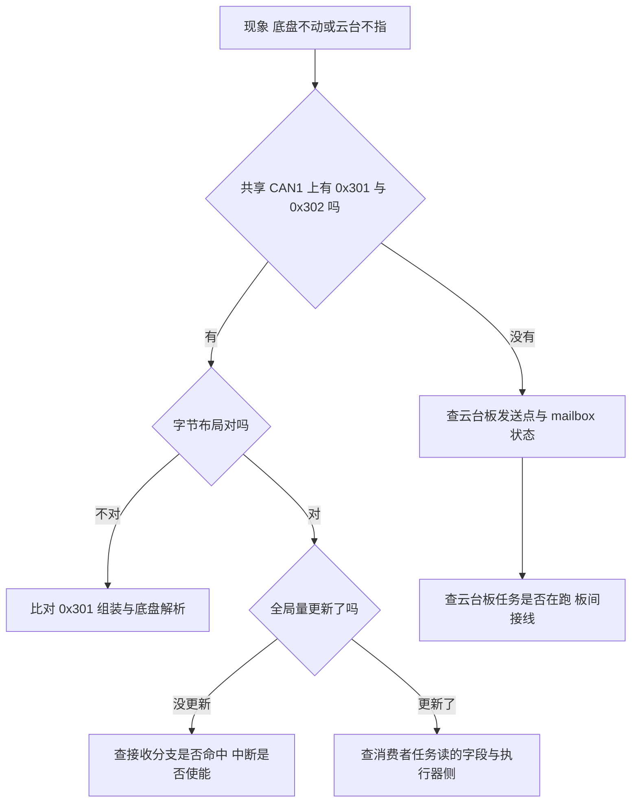
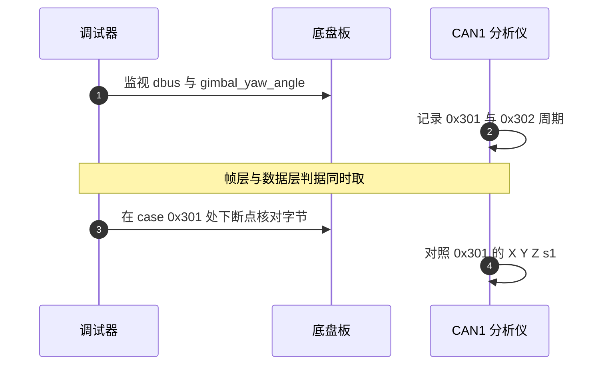

# 易错点与调试

跨板问题的定位要按层隔离：先确认帧是否存在，再确认载荷是否解对，最后确认消费者是否读到。这条顺序、工程内可用的观测手段及其实际可用状态如下，最后把本单元的易错点集中成一张表。

> 路径与行号取自 `2026OmniSentryGimbal` 与 `2026OmniSentryChassis` 两棵源码树。CAN 抓包与示波器类手段属硬件操作，本文只给判据，未实测。

## 1. 三层观测点与判据

跨板故障的观测点分布在三层，从下到上是物理段、帧层与数据层。层与层的判据互相独立，先确定哪一层出问题再往下看。

| 层 | 观测对象 | 可用的手段 | 能排除什么 |
| --- | --- | --- | --- |
| 物理段 | 差分电平与终端电阻 | 示波器、万用表 | 接线断开、短路、终端缺失 |
| 帧层 | 0x301、0x302、0x303 是否在线上 | CAN 分析仪、接收回调计数 | 发送点未执行、mailbox 丢帧 |
| 数据层 | `dbus`、`gimbal_yaw_angle`、`AmmoSpeed` | 调试器监视、转发到上位机 | 解码错位、落穿、消费者未读 |

工程内没有帧计数器，也没有错误回调，帧层的判据只能靠外部分析仪或临时加的计数变量。三层里物理段和数据层的判据在工程内可以直接取到，帧层是缺口最大的一层。

三层判据的作用范围不同：物理段只能排除接线与电平问题，帧层只能确认标识符是否出现，数据层才能确认载荷是否落到正确的全局量。用错层的判据会得到“看起来正常但行为不对”的结论。

## 2. 从下到上的隔离顺序

按单向依赖走：如果帧层收不到，数据层的判断没有意义。顺序如下。

1. 确认对端板在上电且未复位，观察它的心跳表现（本工程无心跳，只能看它发出的电机帧是否还在）。
2. 在共享 CAN1 上抓包，确认 0x301、0x302、0x303 是否出现，以及出现的周期。
3. 帧在线上但数据不对，进接收回调比对字节与全局量。
4. 数据在全局量里正确但行为不对，查消费者任务是否读到、读的是哪个字段。

四步的顺序不能颠倒。先查数据层会看到旧值与正确值混在一起，无法判断是哪一端的问题；先查帧层只要确认帧在不在，判据是二值的。

## 3. 现象到层的对应

把常见现象与最可能的层对应，减少无效抓包：

| 现象 | 优先怀疑的层 | 首个检查点 |
| --- | --- | --- |
| 底盘速度指令不随遥控变化 | 数据层或帧层 | 底盘板 `dbus.ch[2..4]` 是否更新 |
| 底盘 s1 恒为 3 | 数据层 | 云台板 `ControlCenterTask.cpp:108` |
| 云台角度在底盘侧跳变 | 数据层 | 底盘板 `case 0x301` 落穿 |
| 底盘跟随方向错 | 帧层到数据层 | 0x302 的 `gimbal_yaw_angle` 与 `gimbal_yaw_radians` |
| 视觉收到的弹速不变 | 数据层 | 云台板 `AmmoSpeed` 与 0x303 |
| 一块板上电后另一块无反馈 | 物理段 | 该板 CAN1 接线与终端 |

表里六条现象都指向具体的全局量或分支，排查时可以直接在调试器里看这些量，不需要先接分析仪。只有最后一条必须从物理段开始。

现象与层的对应关系不是一一映射，一条现象可能同时涉及两层。以“云台角度在底盘侧跳变”为例，落穿属于数据层，但若 0x302 根本没到，跳变就来自帧层，两者要在同一轮排查里分别确认。

## 4. 临时观测的加计数方法

在接收回调里对每个标识符加一个 32 位计数，是最省事且不改变数据通路的观测方式。本工程 `HAL_CAN_RxFifo0MsgPendingCallback` 的 `switch` 里没有计数变量，需要临时添加；计数变量建议用 `volatile` 并放在 `Debug_vars` 里，便于调试器直接读。

加计数时的两个注意点：计数在中断里自增，调试器读取不受 `volatile` 约束；计数只回答“帧有没有来”，不回答“值对不对”，值仍要在接收分支里逐个字段核对。计数与时间戳可以同时记，时间戳用 `HAL_GetTick()`。

加计数的落地步骤：

1. 在 `Debug_vars` 头文件里补上 `extern volatile uint32_t` 声明。
2. 在接收回调的每个 `case` 里自增对应计数。
3. 在任务里按阈值比较计数变化，判断某帧是否断流。

## 5. Debug_vars 的实际状态

`Debug_vars/debug_vars.cpp` 定义了 9 个 `volatile` 变量，头文件里的声明全部被注释，代码里唯一的引用是 `BSP/Src/bsp_can.cpp:650` 的一句注释。这些变量既没有写点也没有读点，直接拿来做观测点会一直显示初值。

头文件声明被注释还有一层影响：源文件里定义的变量没有对外声明，其它翻译单元即使写了 `extern` 也拿不到类型。要临时使用，先把声明放回头文件，再在接收分支里加写点。

| 变量 | 定义点 | 写点 | 读点 |
| --- | --- | --- | --- |
| `debug_roll` | `Debug_vars/debug_vars.cpp:11` | 无 | 无 |
| `debug_pitch` | `:12` | 无 | 无 |
| `debug_yaw` | `:13` | 无 | 无 |
| `debug_actual_speed` | `:14` | 无 | 无 |
| `debug_angle1` 到 `debug_angle4` | `:15-18` | 无 | 无 |
| `debug_st` | `:19` | 无 | 无 |

## 6. 调试串口的可用状态

`BSP/Src/debug.cpp:11` 的 `DebugUART_Init` 只保存句柄，`SendDebugData` 按格式字符串把混合类型打成一个字节流。全工程只有云台板 `Task/Src/ImuTask.cpp:34` 初始化了这个串口到 `huart1`；底盘板 `Task/Src/ImuTask.cpp:33` 也有同样一句，但该任务未启动（`Core/Src/freertos.c:100`），所以底盘板的调试串口句柄保持为空，`SendDebugData` 会直接返回。

`SendDebugData` 在仓内没有调用点，输出内容需要临时补。它的格式字符含义见 `BSP/Inc/debug.h:29-41`。补调用点时注意它按阻塞方式发送，放到 1 ms 任务里会拉长循环。

## 7. 现成的上位机观测通路

云台板 UsbConnectTask 每 10 ms 把 `AmmoSpeed` 与 `TotalAmmoShooted` 打包发给视觉（`Task/Src/UsbConnectTask.cpp:130-140`），这两项可以作为 0x303 是否到达的间接证据。底盘板 UsbConnectTask 每 10 ms 发一帧云台角度（`Task/Src/UsbConnectTask.cpp:171-172`），其值是 `yaw_motor_5.rotor_angle` 换算而来，可作为 0x205 是否到达的间接证据。两条通路都不能反映 0x301 与 0x302。

两条通路的采样周期都是 10 ms，而板间帧周期是 1 ms，所以它们只能判断“数据还在变”，判断不了帧的到达间隔。用它们做断流初判可以，做时序测量不行。

两条通路的另一处差异是对端不同：云台板对视觉，底盘板对导航。观测某块板的板间收发时，要选对端正确的那条 USB 链路，把云台板的转发当成底盘板的证据属于跨错对端。

## 8. 可直接监视的全局量

用调试器实时监视下列全局量比用 Debug_vars 更有效，它们本来就在数据通路里：

| 观测点 | 板 | 含义 |
| --- | --- | --- |
| `dbus.ch[2..4]` | 底盘板 | 0x301 是否更新 |
| `dbus.s1` | 底盘板 | 0x301 或本地 DBUS 的最后写入 |
| `gimbal_yaw_angle` | 底盘板 | 0x302 与落穿污染的结果 |
| `TotalAmmoShooted` | 云台板 | 0x303 是否到达 |
| `AmmoSpeed` | 云台板 | 0x303 的弹速字段 |
| `control_target.control_mode` | 底盘板 | 由 s1 推出的模式 |

这些量由中断写、任务读，调试器通过内存读取不受 `volatile` 影响。注意断点停在任务里时中断仍在跑，全局量会继续变化。

同时取帧层与数据层的判据，可以在一次抓包里完成定位：分析仪给出帧周期，调试器给出全局量，两者对不上就能直接指到接收分支或消费者。

下断点核对字节时要避开 1 ms 任务的正中间，否则断点命中后系统停留在暂停状态，中断不再更新全局量，读到的值会误导判断。断点更适合核对载荷，实时监视更适合看变化。

## 9. 本单元易错点汇总

| 易错点 | 现象 | 对应位置 |
| --- | --- | --- |
| 拿 Debug_vars 当现成观测点 | 变量一直是初值 | `Debug_vars/debug_vars.cpp:11-19` |
| 以为底盘板有调试串口输出 | `SendDebugData` 无输出 | 底盘板 ImuTask 未启动，`freertos.c:100` |
| 只用 USB 通路判断板间帧 | 0x301 与 0x302 的状态看不到 | USB 只带弹速、弹量与云台角度 |
| 忽略落穿对 gimbal_yaw_angle 的污染 | 断点看到跳变值，误判 0x302 解码错 | `BSP/Src/bsp_can.cpp:608-614` |
| 在任务断点处判断中断数据 | 单步时全局量继续被中断改写 | CAN1 中断优先级 5 |
| 把 s1 当遥控在线指示 | 底盘板 s1 恒为 3 | 云台板 `ControlCenterTask.cpp:108` |
| 抓包只接一端 | 只看到本板发送，看不到对端 | 0x301 与 0x303 方向相反 |
| 把落穿当 0x302 解码错误 | 改 0x302 解析代码后现象不变 | 污染来自 `case 0x301` 落穿 |

## 10. 小结

### 核心概念

- 跨板问题按物理段、帧层、数据层三层隔离，顺序从下到上。
- 工程内没有帧计数与 CAN 错误回调，帧层判据要靠外部分析仪或临时计数。
- Debug_vars 的 9 个变量无读写点，不能直接当观测点。
- 调试串口只在云台板 ImuTask 初始化，且 `SendDebugData` 无调用点。
- USB 通路只能间接反映 0x303 与 0x205，反映不了 0x301 与 0x302。
- 直接监视 `dbus`、`gimbal_yaw_angle`、`AmmoSpeed` 更贴近数据通路。

### 设计权衡

| 决策 | 选择 | 收益 | 代价 |
| --- | --- | --- | --- |
| 调试观测点 | 预留 Debug_vars 但不用 | 调试器里随取随用 | 变量无写点，容易误读 |
| 调试串口 | 保留实现，不调用 | 不占带宽 | 现场要临时补调用 |
| 帧计数 | 不实现 | 中断里少几条指令 | 丢帧不可见 |
| 上位机通路 | 复用视觉与导航 USB | 不改协议 | 只能观测部分量 |

本单元排查动作可以归成四步：接对端、抓共享段、看全局量、核消费者。四步做完还没定位到，再考虑物理段与终端电阻。

## 11. 练习

### 基础题

1. 写出 0x301 的 8 个字节各放什么，指出哪个字节未被赋值，并给出组装与解析两处的源码位置。
2. 底盘板收到一帧 0x301 后 `dbus.s1` 的值是多少，这个值由哪些写者决定，最终值取决于什么？
3. 列出判断 0x303 是否仍在到达云台板所需的最少观测点，并说明每个观测点的源码位置。

### 挑战题

4. 为板间断流设计一个最小改动方案：在底盘板 CAN 中断里为 0x301 与 0x302 各记录到达计数与最后到达 tick，在 ControlCenterTask 里按阈值判定断流，并把底盘切回本地遥控或把目标速度归零。给出改动文件、判据阈值、切换动作，并说明该方案与 `case 0x301` 落穿缺陷的交互。

---

## 附：本页引用的固件路径

| 路径 | 用途 |
| --- | --- |
| `/home/wyx/rm/2026SentriOmeniGimbal/2026OmniSentryGimbal/BSP/Src/bsp_can.cpp` | 接收回调与落穿（:588-704、:650） |
| `/home/wyx/rm/2026SentriOmeniChassis/2026OmniSentryChassis/BSP/Src/bsp_can.cpp` | 0x301 与 0x302 解析（:608-632） |
| `/home/wyx/rm/2026SentriOmeniGimbal/2026OmniSentryGimbal/Debug_vars/debug_vars.cpp` | 调试变量定义（:11-19） |
| `/home/wyx/rm/2026SentriOmeniGimbal/2026OmniSentryGimbal/BSP/Src/debug.cpp` | 调试串口实现（:11、:54） |
| `/home/wyx/rm/2026SentriOmeniGimbal/2026OmniSentryGimbal/Task/Src/ImuTask.cpp` | 调试串口初始化（:34） |
| `/home/wyx/rm/2026SentriOmeniChassis/2026OmniSentryChassis/Task/Src/ImuTask.cpp` | 未启动任务里的调试串口初始化（:33） |
| `/home/wyx/rm/2026SentriOmeniGimbal/2026OmniSentryGimbal/Task/Src/UsbConnectTask.cpp` | 弹速与弹量转发（:130-140） |
| `/home/wyx/rm/2026SentriOmeniChassis/2026OmniSentryChassis/Task/Src/UsbConnectTask.cpp` | 云台角度回传（:171-172） |
