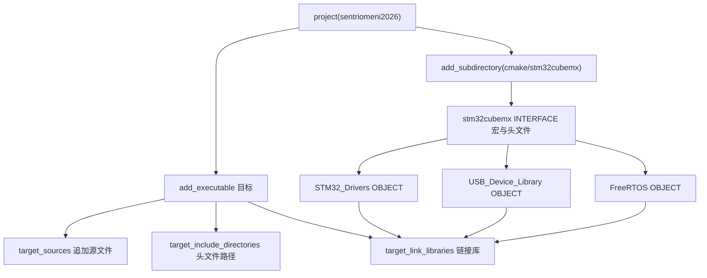
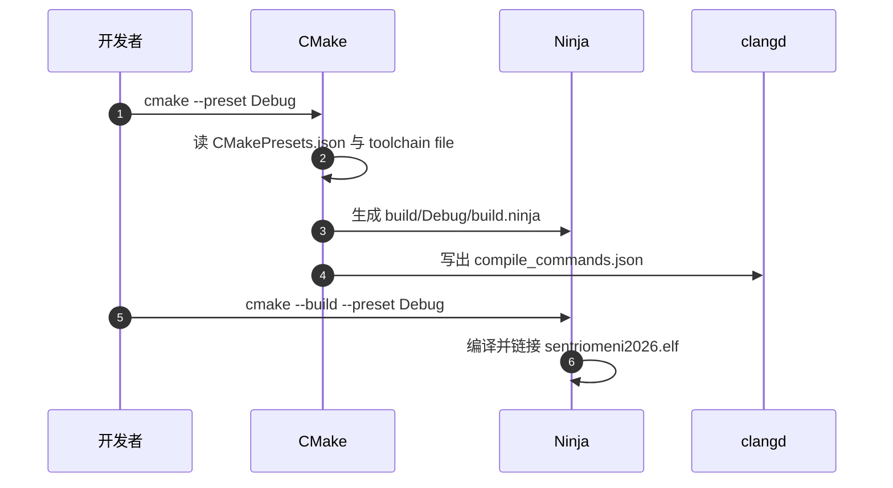

# CMake 工程结构与双板同构

两块板的工程结构几乎一样：顶层一份 `CMakeLists.txt` 维护手工代码，`cmake/stm32cubemx/` 下另一份承载 CubeMX 生成物，工具链文件与链接脚本逐字节相同。差异集中在任务与协议源文件清单上，改一块板时能不能照搬到另一块，取决于这两份清单的差异。

> 依据两板顶层 `CMakeLists.txt`（底盘 157 行、云台 163 行）与 `cmake/stm32cubemx/CMakeLists.txt`（148 行，两板逐字节相同），给出目标图、文件登记规则与两板差异。未加板名前缀的路径默认指底盘板。

## 1. 顶层文件由 CubeMX 只生成一次

CMake 工程的最小闭环是：`project()` 声明语言与工程名，`add_executable()` 声明唯一产物，再用三条 `target_*` 命令把源文件、头文件路径与链接库挂到该目标。CubeMX 生成物体量大且会重生成，本工程把它单独放进 `cmake/stm32cubemx/` 子目录，用 INTERFACE 目标承载头文件与宏，用 OBJECT 库承载驱动源码。

| 目录 | 来源 | 登记位置 |
| --- | --- | --- |
| `Core/`、`Drivers/`、`Middlewares/`、`USB_DEVICE/` | CubeMX 生成 | `cmake/stm32cubemx/CMakeLists.txt` |
| `BSP/`、`Task/`、`PID/`、`Algorithm/`、`Communication/`、`Message_Bus/`、`BMI088/`、`Chassis/`、`Debug_vars/` | 手工维护 | 顶层 `CMakeLists.txt` |
| `referee/`（仅底盘板） | 手工维护 | 底盘 `CMakeLists.txt` |

这段在回答：顶层文件为什么可以手改，而子目录里的文件不行？顶层注释写明这份文件只在首次转换时生成一次（`CMakeLists.txt`），之后由使用者维护：

```cmake
#
# This file is generated only once,
# and is not re-generated if converter is called multiple times.
#
# User is free to modify the file as much as necessary
#
```

这句注释是后续推断的前提：顶层文件的内容不受 `.ioc` 重生成影响，而 `cmake/stm32cubemx/` 下的文件会被覆盖。把新增源文件写进 `cmake/stm32cubemx/CMakeLists.txt`，下一次重新生成就丢；写进顶层则保留。

两板顶层文件的目录清单按同一顺序排列，手写代码先列任务与算法，再列通信与数据层。顺序本身对编译没有影响，但对照两板差异时按同一顺序读，能更快看出哪一块是某板独有的。

## 2. 目标图与命令顺序

这几条命令的先后顺序为什么不能颠倒？配置阶段的顺序不能颠倒。`add_executable` 必须先于 `target_sources`、`target_include_directories`、`target_link_libraries`，否则目标还不存在，命令直接报错。文件里 `project()` 在 ，目标在 ，三条挂载命令分别在 、、。



C 语言标准在  定为 C11，并打开 GNU 扩展。构建类型默认 Debug 的写法是变量为空才赋值，因此命令行传 `-DCMAKE_BUILD_TYPE=Release` 或预设注入 Release 时不会被覆盖。 打开 `CMAKE_EXPORT_COMPILE_COMMANDS`，生成 `compile_commands.json` 供 clangd 使用。

子工程里 `stm32cubemx` 是 INTERFACE 库，只导出 `MX_Include_Dirs` 与 `MX_Defines_Syms` 两组属性。三个 OBJECT 库各自 `target_link_libraries(... PUBLIC stm32cubemx)`（、、），继承同一套宏与包含路径。CubeMX 生成的应用源文件不建库，直接 `target_sources` 加到可执行目标。

OBJECT 库与普通静态库的区别在于链接方式：OBJECT 库的目标文件直接进最终产物，不经过归档，因此它的编译选项与宏会原样作用到 HAL 与 FreeRTOS 源码。这也是把 CubeMX 侧拆成三个 OBJECT 库的原因。

三个库分别对应 STM32 驱动、USB 设备库与 FreeRTOS，拆分依据是它们各有独立的源文件清单与包含路径需求。可执行目标最终只写一个库名，靠 INTERFACE 属性把三者的依赖串起来。

## 3. 从配置到构建的命令链

配置阶段与构建阶段各做了什么？预设与工具链的配合方式决定了构建命令：



配置阶段只做探测与生成，编译发生在构建阶段。两个阶段的错误来源不同：配置阶段报找不到编译器或工具链文件，构建阶段报语法与链接错误。遇到报错先看它出现在哪个阶段，能直接缩小范围。

`compile_commands.json` 只在配置阶段写出，编辑器用它做跳转与补全。改了 `add_executable` 清单之后要重新配置一次，否则索引与真实编译单元不一致，跳转会指向不存在的文件。

## 4. 源文件怎么登记

源文件清单长什么样？底盘板的源文件清单跨 59 行，云台板跨 67 行。清单同时列出 `.h` 与 `.cpp`，头文件只用于 IDE 索引，不参与编译。底盘板节选：

```cmake
add_executable(${CMAKE_PROJECT_NAME}
        BSP/Src/bsp_can.cpp
        Task/Src/ControlCenterTask.cpp
        Task/Src/ChassisTask.cpp
        referee/Src/RefereeReading.cpp
        referee/Inc/RefereeReading.h
)
```

 的 `target_sources` 再次传入一批目录名，如 `PID/Src`、`Algorithm/Src`、`Task/Src`。CMake 的 `target_sources` 参数是源文件路径，目录不是合法源文件；该段是否被生成器忽略、还是与 `add_executable` 的清单重复，按代码推导属冗余写法，待实测确认。决定编译哪些 `.cpp` 的是 `add_executable` 的清单，漏登记会直接表现为未定义引用。

两条命令的语义差别是决定性的：`add_executable` 定义目标时给出的清单构成目标的初始源文件集合，`target_sources` 是在目标存在后追加。追加目录名不会让 CMake 去扫描目录，也不存在隐式收集。

清单里同时出现 `.h` 与 `.cpp` 是为了让 IDE 与 clangd 能索引头文件，CMake 会忽略其中的头文件。判断某个文件有没有进构建，看它是不是 `.cpp` 或 `.c`。

## 5. include 路径与宏来自哪里

宏与包含路径从哪里来？包含路径分两块：顶层  给出工程自建目录，子工程 `cmake/stm32cubemx/CMakeLists.txt` 给出 CubeMX 目录。底盘板的  指向 `referee` 与 `referee/Inc`，云台板  指向 `USB_DEVICE/App`。宏定义在顶层留空，实际宏来自子工程：

```cmake
set(MX_Defines_Syms
    USE_HAL_DRIVER
    STM32F407xx
    $<$<CONFIG:Debug>:DEBUG>
)
```

`$<$<CONFIG:Debug>:DEBUG>` 是生成器表达式，只在 Debug 配置展开为 `DEBUG`。 的 `list(REMOVE_ITEM CMAKE_C_IMPLICIT_LINK_LIBRARIES ob)` 删掉 C 隐式链接库里的 `ob`，避免 C++ 源文件把 `libob.a` 带进链接。最后  只链接 `stm32cubemx` 一个库名，实际展开为三个 OBJECT 库及其继承属性。

宏的可见范围由目标继承关系决定：`USE_HAL_DRIVER` 与 `STM32F407xx` 挂在 INTERFACE 目标上，三个 OBJECT 库和可执行目标都能看到。若某个手写源文件需要 HAL 头文件却报找不到，先查它所属的目标有没有继承这套属性。

顶层留空的宏段不是遗漏，手写代码的宏由子工程统一提供。两板共用同一份子工程，因此两板的宏集合完全相同，差异只可能出现在源文件与 include 清单上。

## 6. 两板的差异清单

两板差异集中在任务与协议实现：

| 维度 | 底盘板 | 云台板 |
| --- | --- | --- |
| 顶层文件行数 | 157 | 163 |
| 专属任务源 | `Task/Src/ChassisTask.cpp` | `Task/Src/GimbalTask.cpp`、`Task/Src/FireTask.cpp` |
| USB 协议 | 无 `usb_decode.cpp` | `Communication/Src/usb_decode.cpp` |
| 姿态算法 | 仅 `Algorithm/Src/MahonyAHRS.c` | 另有 `Algorithm/Src/FusionAHRS.cpp` |
| 裁判系统 | 独立 `referee/Src/RefereeReading.cpp`，全文件 18 行，只有 `check_shoot_times_Speed` 有实现 | 复用 `Communication/Src/referee_protocol.cpp` |
| include 差异 | 多 `referee`、`referee/Inc` | 多 `USB_DEVICE/App` |
| build 预设 | `buildPresets.Debug-1` 指向不存在的 `Debug-1`（`CMakePresets.json`） | `buildPresets.Debug` 指向 `Debug`（`CMakePresets.json`） |

云台板顶层同样列出 `referee_protocol.cpp` 与 `referee_decode.cpp`，但云台仓库没有 `referee/` 目录，这两个文件位于 `Communication/Src/`。两板的 `cmake/gcc-arm-none-eabi.cmake`、`cmake/starm-clang.cmake`、`cmake/stm32cubemx/CMakeLists.txt` 与 `STM32F407XX_FLASH.ld` 经逐字节比对完全相同，工程差异只在任务清单与 include 清单。

预设的差异会直接表现为构建失败。底盘板的构建预设名是 `Debug-1`，而配置预设名是 `Debug`，`cmake --build --preset Debug-1` 找不到对应的配置预设；云台板两侧都叫 `Debug`，命令能正常执行。

两板的预设文件结构相同，只有这一个字段不一致。核对两板差异时把 `CMakePresets.json` 也列进清单，不要只比顶层 `CMakeLists.txt`。

## 7. 双板同构下的易错点

六类里最常见的是清单漂移：新增 `.cpp` 只放进目录、没写进 `add_executable`，直到链接期才报未定义引用。先查这一条，再看预设与缓存。

| 易错点 | 现象 | 对应位置 |
| --- | --- | --- |
| 新增 `.cpp` 只放进目录、没写进 `add_executable` | 链接期报未定义引用 | `CMakeLists.txt` |
| 把 `target_sources` 当成自动收集目录 | 目录参数被忽略或报错，源文件未进构建 | `CMakeLists.txt` |
| 两板 `.ioc`、`.ld`、`CMakeLists.txt` 同名 | 混淆构建目录与产物 | 两板根目录 |
| 删除 `REMOVE_ITEM ... ob` | C++ 源文件链接时带入 `libob.a` | `CMakeLists.txt` |
| 用 `Debug-1` 预设构建底盘板 | 找不到配置预设，构建失败 | `CMakePresets.json` |
| 多个 `cmake-build-*` 目录并存 | 缓存里的工具链与当前 `PATH` 不匹配 | 两板根目录 |

## 8. 小结

### 核心概念

- 顶层 `CMakeLists.txt` 由 CubeMX 只生成一次，之后手工维护；`cmake/stm32cubemx/` 下的文件在重生成时被覆盖。
- 每板只有一个可执行目标 `sentriomeni2026`，工程自建源码靠 `add_executable` 的显式清单登记。
- CubeMX 侧用 INTERFACE 目标 `stm32cubemx` 统一导出宏与 include，三个 OBJECT 库分别承载 HAL、USB 与 FreeRTOS。
- 两板的工具链文件、子工程 CMakeLists 与链接脚本完全相同，差异集中在任务与协议源文件清单。
- 底盘板的 `Debug-1` 构建预设指向不存在的配置预设，云台板没有这个问题。

### 设计权衡

| 决策 | 选择 | 收益 | 代价 |
| --- | --- | --- | --- |
| 生成物如何组织 | CubeMX 输出放子目录、自建目录放顶层 | 重生成不触碰手工源码 | 自建文件要手工登记 |
| 源文件登记方式 | `add_executable` 显式清单 | 依赖关系清晰、可增量 | 增删文件容易漏改 |
| 是否拆分库 | 仅 CubeMX 侧拆 OBJECT 库 | 自建代码零链接配置 | 应用侧无法单独复用 |

工程结构的核对结论可以压缩成三句话：生成物在子目录、手工代码在顶层清单、两板差异在源文件与 include 两处。三句话与本节的三张表一一对应。

## 9. 练习

### 基础题

1. 在底盘板 `CMakeLists.txt` 中找出 `add_executable` 清单与 `target_sources` 参数的重合项，列出后者里所有不是文件的参数。
2. 对照两板顶层文件的 include 路径段，写出底盘板独有与云台板独有的目录，并指出它们所在的段。
3. 打开 `cmake/stm32cubemx/CMakeLists.txt`，说明 `stm32cubemx` 目标的类型以及它导出的两类属性分别由哪条命令给出。

### 挑战题

1. 新增 `Task/Src/DemoTask.cpp` 与对应头文件，写出需要改动的顶层文件与位置；在不动 `add_executable` 清单的情况下验证是否出现未定义引用。
2. 把云台板的 `CMakePresets.json` 改成底盘板的 `Debug-1` 写法，用 `cmake --preset Debug` 与 `cmake --build --preset Debug-1` 分别验证配置与构建阶段的报错差异。

## 附：本页引用的固件路径

| 路径 | 用途 |
| --- | --- |
| `/home/wyx/rm/2026SentriOmeniChassis/2026OmniSentryChassis` | 底盘板根目录 |
| `/home/wyx/rm/2026SentriOmeniGimbal/2026OmniSentryGimbal` | 云台板根目录 |
| `CMakeLists.txt` | 顶层目标、源文件与 include 登记，底盘 157 行、云台 163 行 |
| `cmake/stm32cubemx/CMakeLists.txt` | CubeMX 生成物的 INTERFACE 与 OBJECT 目标，148 行 |
| `CMakePresets.json` | 构建预设，底盘 `Debug-1` 为缺陷项 |
