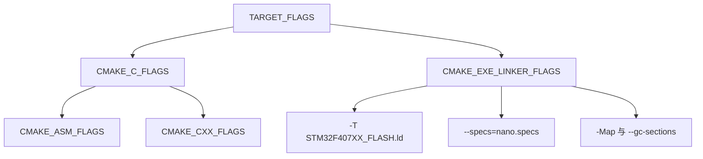
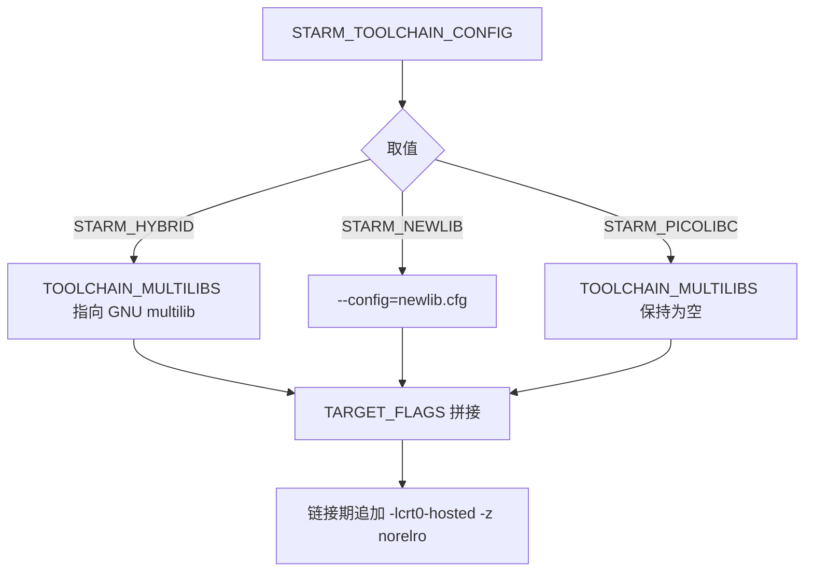

# 交叉编译工具链与编译选项

> `cmake/gcc-arm-none-eabi.cmake`（43 行）与 `cmake/starm-clang.cmake`（65 行）在两板间经逐字节比对完全相同；浮点 ABI 的寄存器行为按 ARM 架构手册描述，标注为按手册。

工程结构与两板差异见同单元 `01-CMake工程结构与双板同构.md`，只讲工具链与编译标志。

## 1. 两份工具链文件与预设的关系

交叉编译是主机编译、目标运行：主机是 x86_64，目标是 Cortex-M4。CMake 用 toolchain file 描述目标系统、编译器前缀与目标专用选项，避免把它们写进业务 `CMakeLists.txt`。本工程准备了两份 toolchain file，仓库里的构建预设只引用 GNU 那份（`CMakePresets.json`）。

| 维度 | `gcc-arm-none-eabi.cmake` | `starm-clang.cmake` |
| --- | --- | --- |
| 编译器 ID | `GNU` | `Clang` |
| 命令前缀 | `arm-none-eabi-` | `starm-` |
| C 与 C++ 编译器 | `arm-none-eabi-gcc` 与 `g++` | `starm-clang` 与 `starm-clang++` |
| 链接器 | `arm-none-eabi-g++` | `starm-clang` |
| 库模式 | 固定 newlib nano | `STARM_HYBRID`、`STARM_NEWLIB`、`STARM_PICOLIBC` |
| 默认库模式 | 不适用 | `STARM_PICOLIBC` |
| 目标选项 | `TARGET_FLAGS` | `TARGET_FLAGS` |
| 链接期库 | `m` | 仅 HYBRID 模式设 `m` |

两份文件都只在配置阶段被读一次，读入之后其中的变量固化进生成器文件。改工具链文件后必须重新配置，只重新构建不会生效。

预设里只挂了 GNU 那份，意味着默认构建路径只有一条被验证过。starm-clang 那份文件的正确性需要额外手工验证，不能假定它与 GNU 那份行为一致。

## 2. Generic 系统名与编译器检测

两份文件都以 `CMAKE_SYSTEM_NAME Generic` 开头，把目标系统名设为 Generic，关闭主机系统的库探测。`CMAKE_TRY_COMPILE_TARGET_TYPE STATIC_LIBRARY`（GNU 、Clang ）让 CMake 的编译器检测只编译成静态库、不做链接，否则交叉环境缺少 startup 与链接脚本时检测会失败。

两份文件还手动写了 `CMAKE_C_COMPILER_ID` 与 `CMAKE_CXX_COMPILER_ID`（GNU 、Clang ）。CMake 通常依据编译器试运行结果自行判定这两个变量，手动赋值与后续检测的先后关系属待确认；无论最终取哪个值，实际生效的是下面各项编译器命令与标志。

系统名设成 Generic 还有一层作用：CMake 不会去寻找目标系统的 `libc` 与 `libm` 路径，所有库都由命令行显式给出。交叉环境的库查找由编译器自带的 sysroot 完成，不由 CMake 的主机路径推导。

`CMAKE_TRY_COMPILE_TARGET_TYPE` 只在检测阶段起作用，正式构建仍按 `.elf` 链接。这两行一起解决的是“交叉环境下 CMake 首次配置就失败”的问题。

## 3. 目标三元组由三个选项锁定

目标能力由三个选项共同确定：

$$ \text{ARMv7E-M} + \text{FPv4-SP} + \text{hard-float} $$

- `-mcpu=cortex-m4`：选择 ARMv7E-M 指令集，启用 Thumb-2、硬件除法与 DSP 扩展。
- `-mfpu=fpv4-sp-d16`：选择单精度浮点单元 FPv4-SP，16 个双精度寄存器（D0-D15），对应 32 个单精度寄存器 S0-S31。
- `-mfloat-abi=hard`：浮点参数用 S0-S15 传递，浮点返回值在 S0，函数调用不为浮点参数占用 r0-r3。`softfp` 使用同样的 FPU 指令但参数走通用寄存器，`soft` 全部用软件模拟。按 ARM 架构手册，`hard` 与 `softfp` 的目标文件在链接时不兼容，会报 ABI 属性不一致。

三个选项必须同时进入 C、C++、汇编与链接。任一翻译单元漏掉 `-mfloat-abi=hard`，它的浮点参数就按通用寄存器传递，与其它单元链接后调用约定不一致，现象可能是参数错值而不是链接错误。

链接期的第三个选项同样重要：链接命令不带 `-mfloat-abi=hard` 时，选到的 libgcc 与 libc 是另一套变体，即使所有目标文件都用 hard 编译，链接结果仍可能与预期不符。

从仓库内已有的构建产物 `build/Debug/sentriomeni2026.map` 可见，链接器选取的库路径带 `thumb/v7e-m+fp/hard` 后缀，与上面的三元组一致（该结论来自历史 map，属构建产物观察）。

## 4. 标志的传播路径



`starm-clang.cmake` 的传播路径相同，差别在多一步库模式选择：



目标标志进入四组变量，库模式进入链接标志。两处的差别在于作用范围：`TARGET_FLAGS` 影响每个编译单元，库模式只影响链接期选哪套 libc。

## 5. 优化级别与段粒度

优化级别与调试信息成对设置。GNU 侧 Debug 为 `-O0 -g3`，Release 为 `-Os -g0`；starm-clang 侧 Debug 为 `-Og -g3`，Release 为 `-Oz -g0`。两套 C++ 选项一致：`-fno-rtti -fno-exceptions -fno-threadsafe-statics`（GNU 、Clang ），`-Wall -fdata-sections -ffunction-sections` 也一致（GNU 、Clang ）。

`-Og` 在保留调试信息的同时做不干扰调试的优化，`-O0` 完全关闭优化；`-Oz` 以体积为目标的优化强于 `-Os`。`-fdata-sections` 与 `-ffunction-sections` 把每个函数、每个数据放到独立段，链接期配合 `--gc-sections` 才允许逐函数回收未引用代码（GNU 、Clang ）。

Debug 与 Release 的差异不止优化级别：`-g3` 与 `-g0` 决定镜像里有没有调试信息，`-O0` 与 `-Os` 决定变量能不能在调试器里直接看。用 Release 产物复现 Debug 下的问题，往往在第一步就卡在看不到变量上。

两套 C++ 选项关闭了 RTTI、异常与线程安全静态变量初始化。这些特性在嵌入式环境里会引入额外代码与运行时依赖，关掉之后 C++ 的可用子集变小，类的静态成员初始化顺序也要自己保证。

## 6. GNU 侧的命令与前缀

GNU 那份文件的核心是把所有工具都指向同一个前缀：

```cmake
set(TOOLCHAIN_PREFIX                arm-none-eabi-)
set(CMAKE_C_COMPILER                ${TOOLCHAIN_PREFIX}gcc)
set(CMAKE_ASM_COMPILER              ${CMAKE_C_COMPILER})
set(CMAKE_CXX_COMPILER              ${TOOLCHAIN_PREFIX}g++)
set(CMAKE_LINKER                    ${TOOLCHAIN_PREFIX}g++)
```

汇编器复用 C 编译器。汇编选项里 GNU 写 `-x assembler-with-cpp -MMD -MP`，starm-clang 写 `-x assembler-with-cpp -MP`，少了 `-MMD`，即默认不生成汇编的依赖文件，改动头文件后的增量重编覆盖面略窄。

链接命令由 `CMAKE_EXE_LINKER_FLAGS` 拼接。GNU 侧在  先放 `TARGET_FLAGS`， 用绝对路径指定 `STM32F407XX_FLASH.ld`， 加 `--specs=nano.specs`， 生成 map 并开启 `--gc-sections`， 打开 `--print-memory-usage`。starm-clang 侧对应 、、、，并额外加 `-z noexecstack`。库模式分支在 ：HYBRID 用 `--gcc-specs=nano.specs` 并链 `m`，NEWLIB 用 `-lcrt0-nosys`，PICOLIBC 用 `-lcrt0-hosted -z norelro`。

子工程把 `TOOLCHAIN_LINK_LIBRARIES` 直接拼进链接库列表（`cmake/stm32cubemx/CMakeLists.txt`）。GNU 与 HYBRID 模式下该变量为 `m`，默认的 PICOLIBC 模式下未被赋值，因此 `MX_LINK_LIBS` 里对应条目为空。

库模式与业务代码之间的接口就是这个变量。切到 PICOLIBC 后若业务代码使用 `sinf`、`sqrtf` 这类函数，是否还需要显式链接数学库取决于该模式是否内建，这属于需要实测的部分。

两份文件都定义了 `CMAKE_OBJCOPY` 与 `CMAKE_SIZE`（GNU 、Clang ），并把三种语言的可执行后缀统一成 `.elf`。两板顶层 `CMakeLists.txt` 与子工程里都没有 `add_custom_command` 或 `add_custom_target`（已核查），默认构建只产出 ELF；要生成 `.bin` 或 `.hex` 需要另加自定义命令，这一步属按代码推导的缺口。

## 7. 工具链与内核配置的接口

HAL 与 FreeRTOS 的配置与浮点设置一致：驱动侧定义 `USE_HAL_DRIVER` 与 `STM32F407xx`（`cmake/stm32cubemx/CMakeLists.txt`），FreeRTOS 选用 ARM_CM4F 端口（、）。`Core/Inc/FreeRTOSConfig.h` 写着 `configENABLE_FPU 0`，而 FreeRTOS 内核在 `Middlewares/Third_Party/FreeRTOS/Source/include/FreeRTOS.h` 给出的默认值是 1。在 ARM_CM4F 端口源码里没有找到对 `configENABLE_FPU` 的引用，FPU 上下文的惰性保存由 `port.c` 与 `port.c` 依据 LR 的 EXC_RETURN 位判断，因此该宏在本工程是否生效属待确认。

浮点指令在业务代码里普遍存在，例如 `PID/Src/speed_pid.cpp` 的构造函数全部使用 `float` 参数，这些函数能否用硬件 FPU 取决于 `TARGET_FLAGS` 是否一致地传到每个编译单元。

工具链与内核配置的接口就在编译选项上：`-mfloat-abi=hard` 决定函数怎么传浮点参数，FPU 端口的上下文保存决定任务切换时浮点寄存器是否被保存。两者必须同时成立，只配一个都会在特定调用路径上出错。

`configENABLE_FPU` 的取值与端口实现的关系还没确认，核对时不要只看配置文件里的 0，要看端口源码实际用了哪个判据。

## 8. 手工核对工具链的步骤

不依赖构建系统，也可以手工核对工具链是否按预期生效：

1. 用 `arm-none-eabi-gcc -###` 打印实际展开的编译命令，确认三个目标选项都在。
2. 用 `arm-none-eabi-readelf -A 目标文件` 查看 ABI 属性，确认 hard-float。
3. 用 `arm-none-eabi-readelf -S` 查看段表，确认 `-ffunction-sections` 生效后函数各自成段。
4. 用 `arm-none-eabi-size 产物.elf` 对照 map 里的 Flash 与 RAM 合计。

四步都是只读命令，不改动构建产物。第 2 步的 ABI 属性是判断 hard 与 softfp 混用的直接依据。

四步里的前三步只看目标文件，不看链接产物，适合在增量构建后快速抽查；第四步看整包体积，适合在改动链接脚本或优化级别后核对。两组命令都不需要接线，桌面环境即可执行。

## 9. 工具链相关的易错点

| 易错点 | 现象 | 对应位置 |
| --- | --- | --- |
| 混用 `-mfloat-abi=hard` 与 `softfp` 编译的目标文件或库 | 链接报 ABI 属性不一致（按手册） | 两份 `TARGET_FLAGS` |
| 工具链 bin 目录不在 `PATH` | 配置期报找不到 `arm-none-eabi-gcc` | `gcc-arm-none-eabi.cmake` |
| 直接用 `cmake -G Ninja` 而不指定 toolchain | 用主机 gcc 生成无法在 F407 运行的产物 | 需 `-DCMAKE_TOOLCHAIN_FILE` |
| 以为构建预设能用 starm-clang | 预设只引用 GNU 文件，需手动指定 | `CMakePresets.json` |
| 用 `Debug-1` 预设构建底盘板 | 配置预设不存在，构建失败 | `CMakePresets.json` |
| Release 用 `-g0` | 无法做符号级调试，只能靠 map 与串口 | `gcc-arm-none-eabi.cmake` |
| 默认 PICOLIBC 下期待链接 `m` | `MX_LINK_LIBS` 里该条目为空 | `starm-clang.cmake` |

## 10. 小结

### 核心概念

- 两份 toolchain file 结构相同，差别在命令前缀、编译器 ID、库模式分支与优化级别。
- `-mcpu=cortex-m4`、`-mfpu=fpv4-sp-d16`、`-mfloat-abi=hard` 共同锁定目标三元组，决定所选 libgcc 与 libc 变体。
- `TARGET_FLAGS` 同时进入 C、C++、汇编与链接标志，任何一处缺失都会导致 ABI 或指令集不一致。
- 优化级别在 Debug 与 Release 成对设置：GNU 用 `-O0` 与 `-Os`，starm-clang 用 `-Og` 与 `-Oz`。
- 构建预设只覆盖 GNU 工具链，clang 工具链需要手工传 `CMAKE_TOOLCHAIN_FILE`。

### 设计权衡

| 决策 | 选择 | 收益 | 代价 |
| --- | --- | --- | --- |
| 默认工具链 | GNU Arm Embedded | 与 CubeMX 生成物和 FreeRTOS 端口兼容 | 无法直接用 clang 的体积优势 |
| Debug 优化 | `-O0` 或 `-Og` | 变量与单步行为可预测 | 代码体积与执行速度偏离发布版 |
| Release 优化 | `-Os` 或 `-Oz` | 节省 Flash | `-g0` 后调试只能看反汇编与 map |
| 段粒度 | `-fdata-sections -ffunction-sections` | 配合 `--gc-sections` 回收未引用代码 | 目标文件段数变多 |

工具链文件的改动面很小，但影响面覆盖全部编译单元。核对时要同时看编译命令与链接命令，只看其中一处无法判断 ABI 是否一致。

## 11. 练习

### 基础题

1. 打开 `cmake/gcc-arm-none-eabi.cmake`，写出 `TARGET_FLAGS` 的三个选项以及它们分别在哪一行进入 C 标志与链接标志。
2. 对照两份工具链文件，列出 `TOOLCHAIN_PREFIX` 的所有使用位置，并说明链接器选择上的差异。
3. 在 `cmake/starm-clang.cmake` 里指出三种 `STARM_TOOLCHAIN_CONFIG` 的链接差异，并说明哪一种在文件里被设为默认。

### 挑战题

1. 用 `cmake -DCMAKE_TOOLCHAIN_FILE=cmake/starm-clang.cmake` 配置云台板，记录默认 PICOLIBC 模式下的链接命令，与 GNU 模式的 `--specs=nano.specs` 做对照（属未实测命令）。
2. 把 Release 的 `-Os -g0` 临时改为 `-Os -g3`，对比 map 文件体积与可用的调试信息，说明体积增量的来源（属未实测命令）。

## 附：本页引用的固件路径

| 路径 | 用途 |
| --- | --- |
| `/home/wyx/rm/2026SentriOmeniChassis/2026OmniSentryChassis` | 底盘板根目录 |
| `/home/wyx/rm/2026SentriOmeniGimbal/2026OmniSentryGimbal` | 云台板根目录 |
| `cmake/gcc-arm-none-eabi.cmake` | GNU 工具链文件，43 行 |
| `cmake/starm-clang.cmake` | starm-clang 工具链文件，65 行 |
| `cmake/stm32cubemx/CMakeLists.txt` | 链接库列表与 HAL 宏，148 行 |
| `CMakePresets.json` | 预设只引用 GNU 工具链 |
| `Core/Inc/FreeRTOSConfig.h` | `configENABLE_FPU` 等内核配置 |
| `PID/Src/speed_pid.cpp` | 大量使用 `float` 的业务代码样例 |
